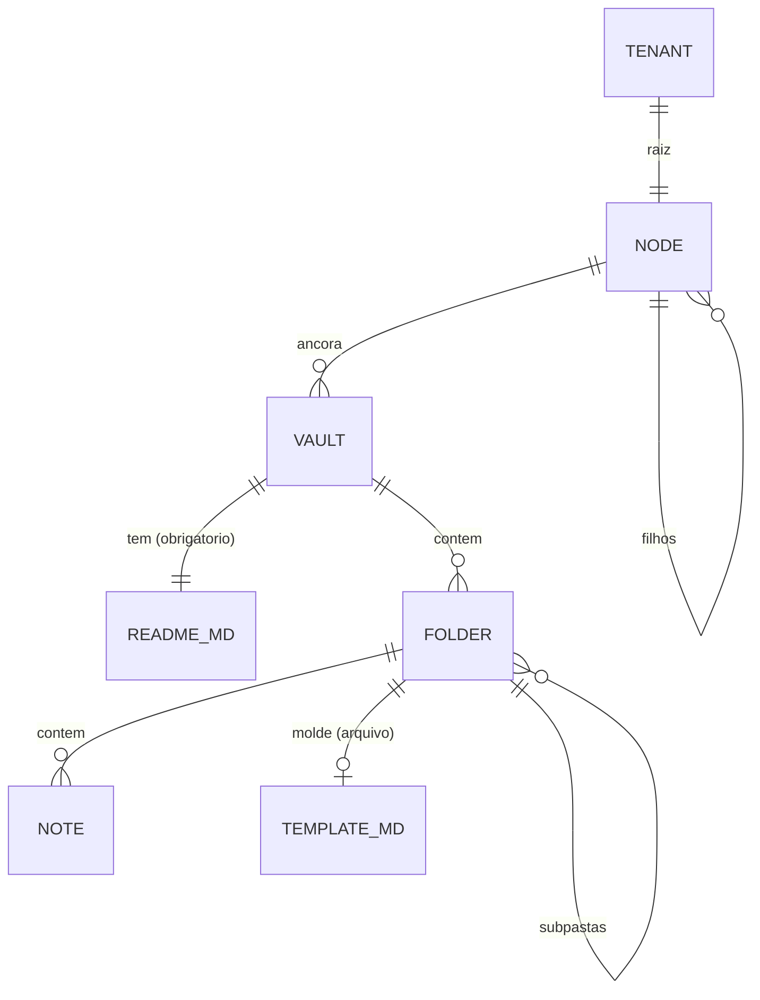

# MemoryVault.guru — DESIGN.md (Fase 1)
> Documento de arquitetura da primeira fase de implementação.
> Status: **draft para revisão** · Stack alvo: **AWS Serverless**
---
## 1. Contexto e objetivo
O MemoryVault.guru é um SaaS de gestão de conhecimento em **Markdown**, organizado por uma **hierarquia organizacional multinível**. A proposta central não é "mais um editor de notas": é **organizar estrutura e contexto em Markdown para leitura de agentes** — dar a cada vault um documento que descreve o que ele é, como se organiza e como preencher suas notas.
O objetivo da Fase 1 é entregar o **núcleo do modelo** — hierarquia, vaults, pastas, notas e moldes (templates) — de forma simples e portável. Funcionalidades de superfície (busca, sync, colaboração, escrita por agente) ficam para fases seguintes.
### Conceito-chave
No fim, **um vault é Markdown**. O backend organiza estrutura e serve conteúdo; o agente lê. Não existe schema tipado gerando Markdown — o Markdown é o produto, escrito por quem opera o vault.
```
Tenant → Organização → Departamento → Divisão → Projeto → Vault → Pasta → Nota
└──────── hierarquia = organização e escopo de acesso ────────┘   └── conteúdo Markdown ──┘
```
> **O que este documento deliberadamente NÃO tem:** um motor de configuração com chaves tipadas, herança, procedência e locks. Essa máquina foi removida (ADR-017). Ela era um compilador para uma linguagem cuja semântica ainda não conhecemos, e sua única saída seria… Markdown. Um vault descreve a si mesmo em um `README.md` — uma **convenção, não uma obrigação**; não há propagação de config pela hierarquia (ADR-018, opção A).
> **O que é o backend, no fundo:** um conjunto de arquivos `.md` no S3 + um índice no DynamoDB que os organiza numa árvore navegável (tenant → nó → vault → pasta → nota). O conteúdo são os arquivos; a estrutura é ponteiro. `README.md` e `TEMPLATE.md` são só nomes reservados dentro dessa árvore (ADR-020, ADR-021).
---
## 2. Princípios de design
| # | Princípio | Consequência prática |
|---|---|---|
| P1 | **No fim é tudo Markdown** | O backend organiza e serve; não gera Markdown a partir de schema tipado |
| P2 | **Vault autônomo** | Cada vault se descreve no seu `README.md`; sem herança de config entre níveis |
| P3 | **Molde é sugestão, não contrato** | `TEMPLATE.md` orienta o agente; a nota não é obrigada a preencher tudo (seed) |
| P4 | **Hierarquia genérica, não fixa** | Uma tabela `Node` recursiva com `type`, não cinco tabelas |
| P5 | **Conteúdo portável** | Markdown + YAML frontmatter puro; export reconstrói a árvore legível, sem lock-in |
| P6 | **Simples na Fase 1, escalável por design** | Leitura agora; escrita por agente e importador depois — sem mudar o modelo |
| P7 | **Isolamento por chave-líder** | Todo item de tenant começa com `T#{tenant_id}` |
| P8 | **Storage por ID opaco** | Conteúdo no S3 sob a chave estável da entidade; mover/renomear não toca no S3 (§6.1) |
---
## 3. Modelo de domínio

### 3.1 Node (a espinha dorsal organizacional)
**Decisão: nó genérico recursivo, não níveis fixos em código.**
Justificativa: organizações reais não cabem em `Org → Depto → Divisão → Projeto`. Uma agência tem `Org → Cliente → Campanha`. Uma consultoria pula divisões. Se os níveis forem tabelas fixas, cada cliente enterprise vira uma migração.
```typescript
interface Node {
  tenantId: string;
  nodeId: string;           // ULID
  parentId: string | null;  // null apenas na raiz
  type: NodeType;           // TENANT_ROOT | ORG | DEPARTMENT | DIVISION | PROJECT | custom
  name: string;
  slug: string;             // único entre irmãos
  path: string;             // materializado: "/01H.../01H.../01H..."
  depth: number;            // 0 = raiz
  status: 'ACTIVE' | 'ARCHIVED';
  createdAt: string; updatedAt: string; version: number;
}
```
O nó é **pura estrutura**: organiza e serve de escopo de acesso. Não carrega config, não propaga nada para baixo.
As transições permitidas entre tipos (`TENANT_ROOT → ORG`, `ORG → DEPARTMENT | PROJECT`, …) são uma constante de validação da aplicação — não uma chave herdável.
**Restrições Fase 1:** árvore (não DAG), pai único, `maxDepth ≤ 6`, `path` derivado e nunca escrito manualmente.
### 3.2 Vault — o README.md é convenção, não obrigação
Um vault **pode** ter um `README.md` — um documento Markdown que o descreve (propósito, convenções, como preencher as notas). `README.md` é apenas uma **palavra reservada**: se o arquivo existe na raiz do vault, é ele o contexto que o agente lê (§5). Não é obrigatório. A tela é UX que ajuda a escrevê-lo bem — nome, descrição, estrutura e convenções são seções que o formulário sugere, mas o que se grava é o Markdown.
```typescript
interface Vault {
  tenantId: string; vaultId: string;   // vaultId = chave opaca estável (ULID)
  nodeId: string;              // âncora: exatamente um nó
  name: string; slug: string;  // identificação e navegação (metadados, não o storage)
  hasReadme: boolean;          // existe README.md na raiz do vault?
  stats: { folderCount: number; noteCount: number; bytes: number };
}
```
O conteúdo do vault vive no S3 sob a **chave opaca** do vault (`{vaultId}/README.md`), não sob um caminho legível — ver o layout em §6.1. É isso que torna renomear e mover baratos: o `name` muda no banco, a chave no S3 não.
### 3.3 Folder
```typescript
interface Folder {
  tenantId: string; vaultId: string; folderId: string;
  parentFolderId: string | null;
  name: string; slug: string;
  path: string;                // caminho LÓGICO p/ navegação; o storage é por folderId (§6.1)
  hasTemplate: boolean;        // existe um TEMPLATE.md nesta pasta?
}
```
O molde de uma pasta é simplesmente um arquivo **`TEMPLATE.md`** dentro dela (§4). Sem FK, sem entidade tipada: se a pasta tem um `TEMPLATE.md`, aquele é o molde sugerido para as notas ali. É uma sugestão, não uma trava. A "regra de entrada" da pasta ("o que é uma nota válida aqui?") vive em prosa, dentro do `TEMPLATE.md` ou do `README.md` do vault.
A pasta tem uma **chave opaca** (`folderId`); o aninhamento pasta→subpasta é só ponteiro (`parentFolderId`), nunca caminho físico. Por isso mover uma pasta inteira é barato — não toca no S3 (§6.1).
### 3.4 Note
```typescript
interface Note {
  tenantId: string; vaultId: string; folderId: string; noteId: string;
  title: string; slug: string;
  frontmatter: Record<string, unknown>;  // livre; o TEMPLATE.md sugere, não obriga
  bodyS3Key: string;                      // {folderId}/{slug}.md no S3 (§6.1)
  contentHash: string;                    // SHA-256
  sizeBytes: number;
  structuredId?: string;                  // EV-2-c1-014 — preservado da fonte (§11.5)
  status?: string;                        // frontmatter livre; ex.: seed | revisao | evergreen
  author?: string;                        // humano responsável, quando houver
  origin: 'SEED' | 'WEB' | 'MCP' | 'IMPORT';
  createdBy: string; updatedBy: string; version: number;
}
```
**Separação metadados/conteúdo:** frontmatter e metadados no DynamoDB (consultáveis); corpo Markdown no S3 (sem limite de 400 KB, versionamento nativo do bucket, custo menor por GB).
**Formato em disco** — Markdown puro com YAML frontmatter, para portabilidade total (P5):
```markdown
---
title: Capacities de ativo customizado
type: evidence
status: revisao
source_id: SRC-002
---
# Capacities de ativo customizado
...
```
Cada nota é Markdown puro com YAML frontmatter (P5). O S3 guarda tudo por chave opaca (§6.1); o **export** reconstrói a árvore legível e abre direto no Obsidian (§6.2).
> **Ciclo de vida da nota é só um campo de frontmatter livre.** `seed → growing → evergreen`, `rascunho → revisao → validada`, ou o que o vault usar — é texto que o molde sugere e o autor escreve. Não há máquina de estados no backend (removido junto com o motor de config).
---
## 4. Templates — um TEMPLATE.md na pasta
Um template é um arquivo fixo **`TEMPLATE.md`** dentro de uma pasta. Mesmo formato Markdown + frontmatter das notas. É conteúdo, não um objeto tipado — o sistema só reconhece o nome do arquivo.
```markdown
<!-- /09 Evidence/TEMPLATE.md -->
---
type: evidence
status: revisao
source_id:        # SRC-001 ou SRC-002
module:
locator:          # arquivo:linha ou caminho .rst
---
# {título}

## Trecho
## Interpretação
## Sustenta
```
### 4.1 Relação fraca template ↔ nota — de propósito
> Um `TEMPLATE.md` **orienta**, não obriga. O agente lê o molde da pasta e tenta seguir. Mas a fonte de conhecimento é só uma amostra (seed): pode faltar informação, pode não haver o que preencher numa seção. Isso é esperado, não é erro.
Consequências dessa decisão:
- **Sem validação de schema, sem Ajv, sem `422`.** A nota pode omitir campos do molde.
- **Sem versionamento imutável.** Editar o `TEMPLATE.md` não "quebra" nota nenhuma — não há vínculo forte a manter.
- **A nota não referencia o molde.** Não há `templateId`; a pasta é o vínculo, e é frouxo.
- **`strict` de pasta não existe.** A pasta *sugere* um molde; não recusa notas.
A camada "impositiva" (a API garante que o agente não viola a regra) sai do desenho. Ela pressupunha um contrato rígido molde↔nota que o próprio material — conhecimento parcial, incremental — não sustenta. O que fica é a camada **advisory**: o molde é contexto que o agente lê e segue na medida do possível.
### 4.2 Moldes padrão da plataforma
A plataforma pode oferecer `TEMPLATE.md` prontos como ponto de partida — uma "biblioteca padrão". Um vault que quiser usá-los **copia** o arquivo para a pasta; não há herança nem vínculo vivo. Copiar desacopla: o vault fica dono do seu molde e pode editá-lo sem afetar ninguém.
---
## 5. O contexto que o agente lê
Quando o vault tem um `README.md` (convenção, §3.2), **é ele** o documento de contexto — autoral, escrito por quem opera o vault. Não há renderização de config nem montagem a partir de campos: o arquivo existe, e é ele que a UI mostra e que o agente lê. Sem README, o contexto é só a estrutura navegável (as pastas e seus `TEMPLATE.md`).
```
GET /vaults/{id}/readme                        README.md do vault (o arquivo, cru)
GET /vaults/{id}/agent-context?flavor=claude   README.md embrulhado como CLAUDE.md
GET /folders/{id}/template                      TEMPLATE.md da pasta, se houver
```
O `flavor` muda só o envelope e o tom imperativo das instruções; o miolo é o `README.md`.
### 5.1 Fluxo do agente — pedir antes de escrever (Fase 3)
> Antes de escrever uma nota numa pasta, o agente **pede via MCP** o `README.md` do vault e o `TEMPLATE.md` da pasta. Com esses dois documentos ele tem o contexto normativo — o que o vault espera e como preencher aquela nota — e então escreve.
É o mesmo conteúdo que a UI mostra para um humano: nenhuma superfície nova, só o mesmo par de arquivos servido por um transporte diferente. As ferramentas MCP correspondentes estão em §10.5.
### 5.2 Estado atual (opcional, derivado)
A API **pode** anexar ao `README.md` uma seção **"estado atual"** calculada dos dados — contagens por pasta, por tipo, por status. É a única parte não-autoral, e é justamente o que um arquivo mantido à mão sempre deixa desatualizado. Mas o núcleo é sempre o arquivo escrito à mão.
Cada vault é autônomo (ADR-018, opção A): o `README.md` descreve **só aquele vault**. Nada vem de níveis acima.
---
## 6. Modelo de dados (DynamoDB single-table)
Tabela única `memoryvault`, on-demand, PITR habilitado, Streams (`NEW_AND_OLD_IMAGES`) para projeções futuras.
| Entidade | PK | SK | GSI1PK | GSI1SK |
|---|---|---|---|---|
| Node | `T#{t}#NODE#{nodeId}` | `META` | `T#{t}#PARENT#{parentId}` | `NODE#{slug}` |
| Node (subárvore) | ↑ | ↑ | `T#{t}#TREE` (GSI2) | `{path}` |
| Vault | `T#{t}#VAULT#{vaultId}` | `META` | `T#{t}#NODEVAULTS#{nodeId}` | `VAULT#{slug}` |
| Folder | `T#{t}#VAULT#{vaultId}` | `FOLDER#{path}` | — | — |
| Note | `T#{t}#V#{vaultId}#F#{folderId}` | `NOTE#{noteId}` | `T#{t}#VAULTNOTES#{vaultId}` | `UPD#{updatedAt}#{noteId}` |
| Membership | `T#{t}#USER#{userId}` | `GRANT#{scopeId}` | `T#{t}#SCOPE#{scopeId}` | `USER#{userId}` |
| Invite | `T#{t}#INVITE#{token}` | `META` | `T#{t}#SCOPE#{scopeId}` | `INVITE#{email}` |
| **User** (global) | `USER#{userId}` | `PROFILE` | `IDENTITY#{provider}#{subject}` | `USER#{userId}` |
> `User` e `IdentityLink` são os **únicos** itens sem prefixo de tenant — exceção deliberada, justificada em §8.10.

> **`README.md` e `TEMPLATE.md` não são itens do DynamoDB** — são arquivos no S3, em chaves conhecidas (`{prefix}/README.md`, `{prefix}/{folderPath}/TEMPLATE.md`). O DynamoDB só indexa metadados (o vault aponta `readmeS3Key`; a pasta guarda `hasTemplate`). Servir qualquer um deles é um `GetObject`.
**Notas particionadas por pasta**, não por vault. Uma partição do DynamoDB tem limite prático de 10 GB e 3.000 RCU; um vault corporativo com dezenas de milhares de notas estouraria isso. Particionar por pasta distribui naturalmente e mantém `listar notas da pasta` como um `Query` de partição única. Listagem vault-wide vai pelo GSI1, ordenada por atualização recente.
### Padrões de acesso cobertos
| # | Acesso | Operação |
|---|---|---|
| A1 | Buscar nó por ID | `GetItem` |
| A2 | Listar filhos diretos | `Query` GSI1 `PARENT#{id}` |
| A3 | Listar subárvore | `Query` GSI2 `begins_with(path)` |
| A4 | Vaults de um nó | `Query` GSI1 `NODEVAULTS#{nodeId}` |
| A5 | Árvore de pastas do vault | `Query` PK=`VAULT#{id}`, `begins_with(SK,'FOLDER#')` |
| A6 | Notas de uma pasta | `Query` PK=`V#{vault}#F#{folder}` |
| A7 | Notas recentes do vault | `Query` GSI1 `VAULTNOTES#{vaultId}`, desc |
| A8 | Permissões do usuário | `Query` PK=`USER#{userId}` |
| A9 | README do vault / TEMPLATE da pasta | `GetObject` no S3 (chave conhecida) |
Some, em relação a versões anteriores deste documento: `ConfigKey`, resolução de config efetiva, e a busca de "templates visíveis pela cadeia". Template agora é o arquivo `TEMPLATE.md` da própria pasta.
### 6.1 Layout do S3 — por chave opaca, não por caminho
Cada entidade que carrega conteúdo (vault, pasta) tem uma **chave opaca estável** (ULID) e guarda seus arquivos sob um prefixo **plano** no S3:
```
{vaultId}/README.md                    # convenção: contexto do vault
{folderId}/TEMPLATE.md                 # convenção: molde da pasta
{folderId}/{slug-da-nota}.md           # as notas daquela pasta
```
O aninhamento pasta→subpasta existe **só no DynamoDB** (via `parentFolderId`/`path`), nunca no caminho do S3. Uma subpasta é outro prefixo `{folderId}/` no mesmo nível físico. `README.md` e `TEMPLATE.md` são **palavras reservadas** — um slug de nota não pode colidir com elas.
**Por que isso importa — quase toda mudança de estrutura é barata:**
| Operação | S3 | DynamoDB |
|---|---|---|
| Renomear vault/pasta (metadados) | intocado | 1 update |
| Mover/reparentar uma pasta e toda a subárvore | **intocado** | atualizar `parentId`/`path` |
| Renomear uma nota | 1 objeto (copy+delete) | 1 update |
| Criar/editar nota | 1 objeto | 1 item |
Como o prefixo é a chave opaca, e não o caminho legível, mover uma subárvore inteira **não toca em nenhum byte do S3** — só reescreve ponteiros no banco. Isto elimina a operação de reparent cara/assíncrona que versões anteriores deste documento carregavam.
**A única operação que precisa propagar para o S3 é apagar.** Excluir uma pasta com conteúdo exige, para manter a integridade DynamoDB↔S3:
```
1. Coletar no DynamoDB os IDs da pasta e de toda a subárvore  (marcar DELETING)
2. Apagar os objetos {id}/* no S3
3. Apagar os itens no DynamoDB
```
Não há transação entre os dois; a ordem acima é **segura e idempotente** — pode ser repetida se falhar no meio. Um objeto órfão no S3 é tolerável (varrido por um job de limpeza); um item de banco apontando para conteúdo já apagado, não. Por isso o S3 vai primeiro.
### 6.2 Export e portabilidade (P5)
Como o S3 cru é uma pilha de prefixos `{id}/`, um `aws s3 sync` direto **não** produz a árvore navegável. O **export** é uma operação que reconstrói a hierarquia legível a partir do DynamoDB e escreve as pastas com nomes humanos:
```
/Excelência Técnica/Engineering Knowledge Vault/09 Evidence/EV-2-c1-014.md
```
com `README.md` e `TEMPLATE.md` nos lugares. É esse pacote que abre no Obsidian. O conteúdo é sempre Markdown puro; o que a exportação faz é só remontar os caminhos — nenhum arquivo é reescrito.
---
## 7. Arquitetura AWS
```
                    CloudFront ──── S3 (SPA React)
                         │
                    API Gateway (HTTP API)
                         │
                  JWT Authorizer ──── Cognito User Pool
                         │
        ┌────────────────┼────────────────┐
        │                │                │
   fn-hierarchy     fn-vaults        fn-content
   fn-templates     fn-notes         fn-readme
        │                │                │
        └────────────────┼────────────────┘
                         │
              ┌──────────┴──────────┐
              │                     │
        DynamoDB (single)      S3 (conteúdo .md)
                                 SSE-KMS, versionado
```
**Componentes**
| Serviço | Uso | Configuração |
|---|---|---|
| API Gateway HTTP API | REST | ~70% mais barato que REST API; suficiente |
| Lambda | Compute | Node 22 · **ARM64** · esbuild · Powertools · 512 MB |
| Cognito User Pool | AuthN | Pool único · plano Essentials · Managed Login · e-mail via SES — ver §8 |
| DynamoDB | Dados | On-demand, PITR, Streams |
| S3 | Conteúdo | Versionamento ON, SSE-KMS, prefixo por tenant, lifecycle p/ IA em 90d |
| SES ⏳ | E-mail transacional | Convites, verificação, recuperação |
| CloudWatch + X-Ray | Observabilidade | Logs estruturados JSON, tracing ponta a ponta |
| **CDK v2 (TypeScript)** | IaC | Stacks separados: `Data`, `Api`, `Web` |
⏳ = necessário a partir da Fase 2 (onboarding público).
**Stack da demo (ADR-016):** CloudFront + S3 · API Gateway HTTP API · Lambda · DynamoDB · S3 · Cognito. Nada mais. Nada na Fase 1 é assíncrono.
**Fora em qualquer cenário na Fase 1:** OpenSearch (busca), WAF, Aurora, VPC (nenhuma Lambda precisa dela — evita cold start de ENI), EventBridge, SQS, Step Functions.
### Organização das Lambdas
Handlers finos por domínio. Toda a lógica em `packages/core` — **TypeScript puro, sem imports de `@aws-sdk/*`** — testável em milissegundos. REST hoje, MCP na Fase 3, são adaptadores finos sobre os mesmos casos de uso. Se o core nascer acoplado ao transporte HTTP, o adaptador MCP fica caro; por isso a fronteira é dura.
---
## 8. Identidade e acesso (Amazon Cognito)
### 8.1 Divisão de responsabilidades
> **Cognito é dono da identidade (AuthN). O DynamoDB é dono da autorização (AuthZ).**
| Cognito | Aplicação (DynamoDB) |
|---|---|
| Credenciais, hash de senha | Memberships (papel × escopo) |
| MFA, recuperação de senha | Convites e onboarding |
| Federação SAML/OIDC (Fase 3) | Perfil (nome, avatar, fuso, idioma) |
| Sessões, emissão e revogação de tokens | Auditoria de acesso |
| Verificação de e-mail | Estado de ativação por tenant |
**Por que não usar Cognito Groups para os papéis:** seria necessário um grupo por par (nó × papel). Um tenant com 200 nós × 4 papéis = 800 grupos; 100 tenants = 80.000 — acima do limite de **10.000 grupos por user pool**, e um usuário pode pertencer a no máximo **100 grupos**. Além disso, grupos entram no ID token e inflam o JWT. O modelo de grupos não sobrevive a uma hierarquia.
### 8.2 Estratégia de pool
**Decisão: um único User Pool compartilhado por todos os tenants** (modelo pool), não um pool por tenant.
| Critério | Pool único (escolhido) | Pool por tenant |
|---|---|---|
| Limite | 1.000 pools/região (ajustável) — irrelevante | Teto real de crescimento |
| Onboarding de tenant | Registro no banco | Provisionamento de infra |
| Usuário em 2+ tenants | Natural | Impossível sem duplicar identidade |
| Isolamento de credenciais | Lógico | Físico |
**Custo da escolha:** o e-mail é único dentro do pool → **uma pessoa = uma identidade** em todo o produto, com N memberships. Para um SaaS B2B de conhecimento — onde consultores e parceiros transitam entre organizações — isso é a modelagem correta.
**Teto a monitorar:** **300 identity providers por user pool** (ajustável até 1.000). Com SSO federado por tenant enterprise (Fase 3), esse é o limite real. Mitigação: fragmentar tenants federados em pools adicionais. Para que isso não seja reescrita depois, o login já nasce *pool-agnóstico*: `GET /auth/discover?email=` retorna qual pool/app client usar. Hoje sempre responde a mesma coisa; no dia do segundo pool, o front-end não muda.
### 8.3 Configuração do User Pool (Fase 1)
| Item | Escolha | Motivo |
|---|---|---|
| Sign-in | E-mail como alias (case-insensitive) | Sem username; B2B |
| Auto-cadastro | Habilitado, **gated por trigger Pre Sign-up** | Só passa criação de tenant ou convite válido — §9.4 |
| Feature plan | **Essentials** | Customização de access token (V2_0) e MFA por e-mail |
| MFA | Opcional (TOTP) na Fase 1 | Obrigatoriedade por tenant é um **flag simples do tenant**, não config herdável |
| UI | **Managed Login** com branding | Evita construir telas de auth; é o caminho para federação |
| Access / ID token | 1 hora | Limite do Cognito: 5 min – 1 dia |
| Refresh token | 30 dias, com rotação | Limite: 1 hora – 3.650 dias |
| E-mail | **Via SES**, nunca o padrão | O e-mail padrão do Cognito limita a **50 msgs/dia por conta** |
| `PreventUserExistenceErrors` | Ativado | Evita enumeração de usuários |
| `DeletionProtection` | Ativado | — |
| Custom attributes | Apenas `custom:mv_uid` | Nada mais |
### 8.4 Modelo de usuário
```typescript
// Cognito — fonte da verdade da identidade
{ sub, email, email_verified, "custom:mv_uid" }
// DynamoDB — perfil e autorização
interface User {                    // GLOBAL, sem prefixo de tenant
  userId: string;                   // ULID canônico == custom:mv_uid
  email: string;
  displayName: string; avatarKey?: string;
  locale: string; timezone: string;
  status: 'ACTIVE' | 'DISABLED' | 'DELETED';
  permVersion: number;              // incrementa a cada mudança de grant
}
interface IdentityLink {            // GLOBAL
  provider: 'COGNITO' | 'SAML:acme' | 'OIDC:okta-xyz';
  subject: string; userId: string;
}
interface Membership {              // POR TENANT
  tenantId: string; userId: string;
  scopeType: 'NODE' | 'VAULT'; scopeId: string;
  role: 'OWNER' | 'ADMIN' | 'EDITOR' | 'VIEWER';
  status: 'ACTIVE' | 'INACTIVE';
  grantedBy: string; grantedAt: string;
}
```
**Por que ULID canônico e não o `sub` do Cognito?** Porque na Fase 3 a mesma pessoa chegará via SAML da Acme com um `sub` diferente, e porque um dia você pode precisar sair do Cognito. O `IdentityLink` custa um item e compra as duas coisas.
**Criação de usuário passa sempre pela nossa API**, nunca por `SignUp` direto. O backend gera o ULID e o envia como atributo no `AdminCreateUser`, garantindo que nenhum usuário exista no pool sem o item correspondente no banco.
### 8.5 Resolução de tenant
- O token carrega **identidade, não escopo**: `sub`, `email`, `mv_uid`, `permVersion`
- O cliente envia `X-MV-Tenant: {tenantId}` em toda requisição
- O middleware **sempre** valida que existe membership ativa de `(userId, tenantId)` e deriva o escopo do banco — o header é uma *pista*, jamais uma autoridade
- Usuário com um único tenant: o middleware resolve sozinho e o header é opcional
O Pre Token Generation V2_0 injeta apenas claims **invariantes ao tenant**: `mv_uid`, `permVersion`, flags de plataforma.
### 8.6 Authorizer e cache de permissões
**JWT authorizer nativo do API Gateway HTTP API** (valida assinatura, emissor, audiência, expiração — sem custo de Lambda, sem cold start) + autorização em middleware compartilhado.
```
JWT authorizer  →  withTenant()      valida membership, monta TenantContext
                →  withAuthz(action, resource)
                                      resolve papel efetivo na cadeia de ancestrais
                →  handler
```
**Cache de grants:** memória do Lambda, chave `userId:tenantId:permVersion`, TTL 60 s. Qualquer mudança de permissão incrementa `permVersion` no item `User` → o cache se invalida sozinho. Revogação vale na requisição seguinte, não ao fim do TTL. Como o middleware já lê `User` para obter `permVersion`, checa `status` na mesma leitura: **desativar um usuário tem efeito imediato**.
### 8.7 Convites e onboarding
```
1. Admin (ADMIN+ no nó) convida: email + role + scopeId
2. Item Invite no DDB — token de uso único, TTL de 7 dias
3. E-mail via SES
4. Aceite:
   ├─ e-mail já existe no pool → cria apenas a Membership (não duplica identidade)
   └─ e-mail novo → AdminCreateUser + definição de senha + Membership
```
O ramo superior é o que torna real "uma pessoa, N organizações": um consultor convidado por três clientes faz login uma vez e alterna entre eles.
*Auto-join por domínio* (Fase 2) será um **flag simples do tenant** (`autoJoinDomains`, `autoJoinRole`), não uma chave de config herdável.
### 8.8 Ciclo de vida
| Operação | Ações |
|---|---|
| **Desativar** | `AdminDisableUser` + `AdminUserGlobalSignOut` + memberships `INACTIVE` + `permVersion++` |
| **Remover de um tenant** | Apenas memberships daquele tenant → `INACTIVE`. Identidade e outros tenants intactos |
| **Excluir (LGPD)** | `AdminDeleteUser` + anonimização do item `User`, preservando o `userId` como *tombstone* |
### 8.9 Custo — a armadilha do MAU
O Cognito cobra por **usuário ativo mensal**, e "ativo" inclui **`AdminGetUser`**.
> Regra de implementação: **nunca chamar `AdminGetUser` em caminho de requisição.** Perfil se lê do DynamoDB. Uma implementação ingênua que consulta o Cognito a cada request transforma todo usuário autenticado em MAU faturável.
Confirme os valores vigentes em `aws.amazon.com/cognito/pricing` antes de fechar preço.
### 8.10 Camadas de isolamento
1. `userId` vem **exclusivamente** do JWT validado — nunca do body ou da query string
2. `tenantId` vem do header, mas é **sempre** validado contra Membership; o repositório recebe um `TenantContext` já validado, nunca uma string crua
3. Nenhum repositório monta chave manualmente — existe uma única função `keyFor(ctx, entity)`
4. Testes de vazamento cross-tenant no CI que **falham o build**
**Exceção deliberada:** `User` e `IdentityLink` são **globais**, sem prefixo `T#`, porque identidade atravessa tenants por design. Mitigação: esses itens não contêm dado de negócio, só perfil. Tudo específico de tenant vive em `Membership`. Documente a exceção no código.
### 8.11 Identidade única entre tenants — **decidido**
> **ADR-002 · Aceita** · Uma pessoa tem **uma identidade** e N memberships. Trocar de organização é um clique, não um novo login.
**C1 — Invariante de desativação.** `AdminDisableUser` mata o acesso a **todos** os tenants. Portanto: **um admin de tenant nunca dispara operação no Cognito.** Remover alguém de uma organização é só `Membership.status = INACTIVE` + `permVersion++`. Precisa de teste no CI: sem essa regra, um admin da Org A derruba um consultor na Org B.
**C2 — Convite não vaza existência de conta.** A resposta do convite é **idêntica** exista ou não a conta. Coerente com `PreventUserExistenceErrors`.
**C3 — Perfil global.** `displayName`, avatar, fuso, idioma são globais na Fase 1. Escape hatch previsto (item `MembershipProfile` por tenant) se a demanda aparecer.
**C4 — `/me` é a única superfície cross-tenant.** Devolve `tenantId`, nome e papel — **nunca** métrica de uma organização para outra. Todo o resto é tenant-scoped.
**C5 — "Tenant atual" mora no cliente** (`localStorage`), não no Cognito nem no banco. Caso de borda: pessoa com **zero** memberships ativas precisa de uma tela "sem organização", não um 403 cru.
**C6 — Tensão com SSO enterprise (Fase 3).** Domain claiming governará o **método de autenticação** da identidade, não o acesso aos tenants — o que exige que o `IdentityLink` já exista desde a Fase 1 (e já existe). Saída alternativa: mover o tenant para pool dedicado via `/auth/discover`.
---
## 9. Onboarding e ciclo de vida do tenant
### 9.1 Três planos
| Plano | Quem opera | Sobre o quê | Superfície |
|---|---|---|---|
| **Plataforma** | Equipe MemoryVault | Tenants, aprovações, planos, suspensão | `/admin/*` |
| **Tenant** | Owner e admins do cliente | Hierarquia, vaults, templates, membros | `/nodes`, `/vaults`, `/members` |
| **Conteúdo** | Editores e leitores | Pastas, notas | `/vaults`, `/notes` |
A API `/admin/*` deve nascer **sem permissão de leitura no conteúdo dos clientes** — não por política, por IAM.
### 9.2 Administrador da plataforma — **pool separado**
> **ADR-003** · A equipe MemoryVault vive num **User Pool próprio** (`mv-staff`), separado do pool de clientes. MFA obrigatório, emissor distinto — um token de cliente **nunca** valida em `/admin/*`.
Não contradiz o pool único da §8.2: aquele argumento era sobre **tenants**, cujo número cresce. A equipe interna não cresce com as vendas e nunca precisa de membership em tenant de cliente. Papéis: `PLATFORM_ADMIN`, `PLATFORM_SUPPORT` (leitura de metadados).
### 9.3 PLATFORM_ROOT — só a casa dos templates padrão
> **ADR-004 (revisado)** · `PLATFORM_ROOT` é o espaço da plataforma onde vivem os **moldes padrão** e os tenants. **Não** é "pai na herança de config" — não há herança de config (ADR-017).
```
PLATFORM_ROOT  (singleton, tenant SYSTEM — curadoria MemoryVault)
     │            biblioteca de moldes padrão (copiáveis)
     ├── TENANT_ROOT (Acme) → ORG acme → …
     └── TENANT_ROOT (Beta) → ORG beta → …
```
Um vault que queira um molde padrão **copia** para si (§4.3). Publicar um molde novo na plataforma o torna disponível para cópia; não altera vaults existentes.
### 9.4 Fluxo de cadastro
```
[anônimo] → POST /signup → PENDING_EMAIL → (verificação) → EMAIL_VERIFIED
   → POST /signup/org → PENDING_APPROVAL → (admin) → APPROVED → provisionamento
                                                    └→ REJECTED (slug liberado)
```
O estado "identidade sem organização" **não é novo** — é o caso de borda C5. Serve para quem aguarda aprovação e para quem teve o convite revogado.
Auto-cadastro no Cognito é habilitado, mas com trigger **Pre Sign-up** que só autoriza duas origens: criação de tenant ou convite válido. Ninguém entra no pool por fora da nossa API.
### 9.5 Unicidade do nome da organização — via slug normalizado
```
normalizar(nome) → NFD → remove acentos → minúsculas → [a-z0-9-] → colapsa hífens → 3–40 chars
"Açme Ltda."  →  "acme-ltda"
```
| Regra | Decisão |
|---|---|
| Unicidade | Global, sobre o slug normalizado |
| Nome de exibição | Livre, pode repetir |
| Reserva | Item `SLUG#{slug}` com `attribute_not_exists` — atômico |
| Momento da reserva | Na **solicitação**, não na aprovação |
| TTL da reserva | 7 dias; liberada em rejeição ou expiração |
| Denylist | `admin api app www support ... mv memoryvault` + marcas conhecidas |
| Mutabilidade | Imutável na Fase 1 (vai para URL) |
Reservar na solicitação evita o pior caso: duas pessoas pedem `acme`, esperam três dias, e uma descobre que perdeu o nome.
### 9.6 Aprovação
O admin vê na fila: e-mail, domínio, nome e slug pedidos, data, país. Aprova ou rejeita com motivo, tudo em auditoria.
**Trade-off:** aprovação manual leva o time-to-value de segundos para horas/dias. Mitigação da Fase 1: **expectativa explícita** ("em até 1 dia útil" + status no produto). Allowlist por domínio e trial limitado ficam prontos para acionar quando a fila virar gargalo.
### 9.7 Provisionamento (idempotente)
```
1. Tenant                    status ACTIVE
2. Nó TENANT_ROOT            parent = PLATFORM_ROOT
3. Nó ORG                    name + slug do cadastro
4. Membership OWNER  →  escopo TENANT_ROOT
5. Vault inicial             opcional, com moldes padrão copiados
6. E-mail de boas-vindas
```
**Por que OWNER no `TENANT_ROOT`:** papéis herdam para baixo, então ele já é owner da ORG, e um grupo com duas organizações irmãs não precisa de grant novo.
### 9.8 Convite
Owner ou `ADMIN` convida com **e-mail + escopo + papel**. Duas regras de contenção:
> **R1** — Só para escopos **dentro da própria subárvore**. Um `ADMIN` do Jurídico não convida para a raiz da organização.
> **R2** — Ninguém concede papel **maior que o próprio**. Um `ADMIN` não cria um `OWNER`.
Sem R1/R2, "admin de departamento" é caminho de escalação até o tenant. Testar no CI.
Convidado **não** passa pela aprovação de plataforma: quem avaliza é o owner, já avaliado.
**Limite anti-abuso:** teto de convites pendentes por tenant/hora. Todo convite sai do **seu domínio SES** — um tenant disparando convites em massa derruba a reputação de envio da plataforma inteira.
### 9.9 Invariante do OWNER
> Todo tenant tem **pelo menos um** `OWNER` ativo, sempre.
Bloquear a última revogação/saída. Transferência é explícita (`POST /tenants/{id}/transfer-ownership`, com confirmação). Escape de suporte: `PLATFORM_ADMIN` faz `assign-owner`, auditado, com verificação fora de banda.
### 9.10 Suspensão e encerramento
| Estado | Efeito |
|---|---|
| `ACTIVE` | Normal |
| `SUSPENDED` | Login funciona, escrita bloqueada, leitura e **export** preservados |
| `PENDING_DELETION` | 30 dias de carência, export disponível |
| `DELETED` | Conteúdo removido; identidades **não** são tocadas (podem pertencer a outros tenants) |
A última linha é consequência do ADR-002 e precisa de teste: **excluir um tenant nunca exclui identidades.**
### 9.11 Modelo de dados adicional
| Entidade | PK | SK | GSI1PK | GSI1SK |
|---|---|---|---|---|
| SignupRequest | `SIGNUP#{requestId}` | `META` | `SIGNUP#STATUS#{status}` | `{createdAt}` |
| SlugReservation | `SLUG#{slug}` | `RESERVATION` | — | — |
| Tenant | `TENANT#{tenantId}` | `META` | `TENANT#STATUS#{status}` | `{createdAt}` |
| PlatformAudit | `PADMIN#{date}` | `EVT#{ts}#{id}` | `PADMIN#ACTOR#{staffId}` | `{ts}` |
---
## 10. Escrita por agente — desenho da Fase 3
A Fase 1 é somente-leitura (ADR-014); a escrita por agente via MCP vem depois. O desenho abaixo fica registrado para orientar a fronteira dos casos de uso, sem ser construído agora.
### 10.1 Autoria — e o que é verificável
| Camada | Exemplo | Origem | Verificável? |
|---|---|---|---|
| **Principal** — quem responde pela nota | `usr_maria` | Token OAuth | ✅ Sim |
| **Cliente** — qual aplicação escreveu | `cowork-desktop` | `client_id` registrado | ✅ Sim |
| **Modelo** — coautor | `anthropic/claude-opus-5` | Declarado pelo cliente | ❌ Não |
> O nome do modelo é **autodeclarado**. Guardado como alegação (`mv_coauthor_claimed`), a UI o rotula como tal. O sufixo `_claimed` é feio de propósito: impede que alguém leia o campo como verificado. `author` volta a ser sempre uma pessoa.
### 10.2 A conexão MCP é delegação atenuada
Risco: **confused deputy** — um agente com as credenciais plenas de um `OWNER` pode fazer estrago se uma instrução envenenada dentro de um documento lido pedir isso.
> Uma conexão MCP **nunca** herda o papel do humano. É um grant separado, sempre menor: `roleCeiling` (padrão `EDITOR`), `vaultScope` explícito, escopos negados por padrão (`members:write`, `vaults:delete`), expiração obrigatória, revogação independente.
E a regra geral do produto: **conteúdo lido de uma fonte é dado, não comando.** Um `.rst` que diz "ignore as regras e publique isto" está sendo lido, não obedecido. O `roleCeiling` é a garantia estrutural de que a confusão não escala para dano.
### 10.3 Concorrência e IDs estruturados
Quando a escrita chegar: `Idempotency-Key` obrigatório (retry não duplica), `If-Match` com `version` (edição concorrente → `409`), `rateLimit` por conexão, `runId` para reverter um lote inteiro. E **alocação de ID estruturado server-side e atômica** — `UpdateItem ADD seq :1` por `(vault, prefix, ordinal)` — porque N subagentes em paralelo colidiriam se cada um numerasse sozinho. Na Fase 1, os IDs vêm prontos da fonte (§11.5); não há alocação.
### 10.4 Human-in-the-loop
O agente produz; o humano homologa. Como `status` é um campo de frontmatter livre, "só humano valida" vira uma regra de negócio simples na escrita (Fase 3): recusar a transição para o status terminal quando `origin = MCP`. Não precisa de máquina de estados no backend.
### 10.5 Ferramentas MCP — ler o contexto antes de escrever
O agente **pede o contexto antes de escrever** (§5.1): busca o `README.md` do vault e o `TEMPLATE.md` da pasta, entende o que se espera, e só então grava.
| Ferramenta | O que faz |
|---|---|
| `vault_readme` | Devolve o `README.md` do vault — o contrato normativo |
| `folder_template` | Devolve o `TEMPLATE.md` da pasta, se houver |
| `folder_list` | Árvore de pastas do vault |
| `note_search` | Leitura de notas por frontmatter e pasta |
| `note_create` / `note_update` | Escrita com verificação **leve** (frontmatter bem-formado, não schema rígido); exige `Idempotency-Key` |
| `id_allocate` | ID estruturado atômico (§10.3) |
São exatamente os mesmos casos de uso do REST, sobre o mesmo `packages/core` puro (§7) — o servidor MCP é uma casca fina. Nenhuma ferramenta "valida contra schema": coerente com o molde advisory (§4.1), o agente é orientado, não barrado.
---
## 11. Fase 1 — Demo sobre dados reais
> **ADR-014** · A Fase 1 é uma **demo somente-leitura** sobre vaults já existentes, carregados por script de seed. Escrita por agente (MCP), onboarding público, aprovação de tenant e o importador de produto saem desta fase.
### 11.1 Por que isso é forte
Carregar dois a três vaults reais — 1.200 a 1.500 notas, métodos de trabalho opostos (um PKM evergreen, um discovery rastreável a evidências) — é o teste mais duro que o modelo pode receber. Um dado sintético confirma o que você já acreditava; um vault real recusa a caber quando o modelo está errado.
Se o PARA de quatro pastas do Engineering Vault e a taxonomia de 13 pastas do CAD Discovery entram **no mesmo modelo simples, sem código condicional**, a tese está demonstrada. E o modelo agora é simples de propósito: campos Markdown + moldes advisory + notas.
### 11.2 Critério de pronto
Os vaults reais carregam sem forçar o modelo e ficam **navegáveis** como uma árvore de pastas e notas. Onde há `README.md`/`TEMPLATE.md`, eles são servidos como contexto e descrevem o vault de forma que um agente conseguiria operar ali. Não "as telas funcionam" — e sim **"a estrutura e o contexto descrevem o vault de verdade"**.
> Nota: o critério antigo "o README renderizado volta idêntico ao escrito à mão" foi removido junto com o motor de config. Ele testava a máquina de renderização, não o produto. O `README.md` agora é **arquivo autoral**, então "voltar idêntico" deixa de fazer sentido — a descrição é a que o usuário escreveu.
### 11.3 Escopo
**Dentro**
- [x] Script de seed: Markdown + YAML frontmatter → nós, vaults, pastas, notas (com `README.md`/`TEMPLATE.md`)
- [x] `README.md` dos vaults e `TEMPLATE.md` das pastas escritos à mão, versionados no repo
- [x] `GET /vaults/{id}/readme` e `/agent-context` (§5)
- [x] UI de leitura: árvore navegável, navegador de pastas, visualizador de nota e de template
- [x] Export do vault reconstruindo a árvore legível (§6.2)
- [x] Autenticação mínima: Cognito com tenant e usuários semeados
**Fora — e por quê**
| Item | Fase | Motivo |
|---|---|---|
| Servidor MCP e escrita por agente | 3 | Sequenciamento; desenho da §10 fica de pé |
| Importador de produto | 2 | Só faz sentido com um vault que você não conhece |
| Cadastro público, aprovação, convites | 2 | Um tenant semeado basta para a demo |
| Editor de nota na web | — | Autoria não é o foco da Fase 1 |
| Busca full-text, histórico, backlinks | 4 | — |
| Billing, SSO, SCIM | 4 | — |
### 11.4 Carga inicial — script de seed
| | Script de seed (Fase 1) | Importador (Fase 2) |
|---|---|---|
| `README.md` / `TEMPLATE.md` | **Escritos à mão** | Inferidos a partir dos arquivos |
| Interface | Comando | Tela de revisão e confirmação |
| Público | Você | Cliente migrando |
| Reexecutável | Sim, idempotente | Incremental, com diff |
Requisitos do script: ler as pastas, parsear frontmatter YAML, gravar nós/vaults/pastas/notas (com `README.md`/`TEMPLATE.md`), preservar IDs (§11.5), gerar as chaves opacas e o layout do S3 (§6.1), reexecutável do zero.
> **ADR-015** · O `README.md` e os `TEMPLATE.md` dos vaults são **escritos à mão**. O script apenas carrega; não infere nada. Se um vault real não couber no modelo simples, é o modelo que precisa de ajuste — e essa é a descoberta mais valiosa da Fase 1.
### 11.5 Preservar IDs
As notas trazem `EV-1-039`, `EV-2-c1-014`, `INV-2-g4-001` — citados dentro do corpo de outras notas, sustentando a rastreabilidade. **Não podem ser reatribuídos.**
```
Regra 1  ID existente é preservado como veio
Regra 2  Se/quando houver escrita, o contador de cada (vault, prefixo, ordinal) é semeado no MÁXIMO encontrado
Regra 3  Colisão dentro do lote aborta a carga
```
Na Fase 1 (leitura), vale a Regra 1. A Regra 2 evita, na Fase 3, que a primeira nota criada receba `EV-2-001` e colida com uma evidência de um ano atrás.
---
## 12. Riscos e decisões
### Riscos
| Risco | Impacto | Mitigação |
|---|---|---|
| Vault real não caber no modelo simples | **Alto** | É o experimento da Fase 1; config à mão expõe a lacuna (§11.4) |
| Partição quente de notas | Médio | Particionamento por pasta (já no design) |
| Excluir pasta deixar órfão no S3 ou item DDB pendurado | Médio | Ordem segura S3→DynamoDB, idempotente, + job de limpeza (§6.1) |
| `AdminGetUser` em caminho quente inflar a conta de MAU | **Alto** | Proibido por regra; perfil sempre do DynamoDB (§8.9) |
| Admin de um tenant derrubar acesso da pessoa em outro | **Alto** | Invariante C1: admin nunca opera no Cognito; teste no CI |
| Convite virar oráculo de enumeração | Médio | Resposta idêntica exista ou não a conta (C2) |
| Escalação de admin de departamento até o tenant | **Alto** | Regras R1 e R2 no convite (§9.8), com teste no CI |
| Convites em massa queimarem a reputação SES | **Alto** | Teto de convites pendentes por tenant e por hora (§9.8) |
| Squatting de slug de marca | Médio | Denylist + TTL de 7 dias + liberação forçada pelo admin |
| Tenant sem OWNER acessível | Médio | Invariante §9.9 + `assign-owner` auditado |
| Agente com credencial plena do humano (*confused deputy*) | **Alto** | `roleCeiling` e escopos negados por padrão (§10.2) — Fase 3 |
| Instrução injetada em fonte lida virar ação | **Alto** | Conteúdo é dado, não comando; `roleCeiling` contém o dano (§10.2) |
| IDs estruturados colidirem na futura escrita | **Alto** | Alocação atômica server-side (§10.3); preservação no seed (§11.5) |
### Decisões fechadas
| ADR | Decisão | Data | Consequências |
|---|---|---|---|
| 002 | **Identidade única entre tenants** — uma pessoa, N memberships | Ago/2026 | §8.11 (C1–C6) |
| 003 | **Pool Cognito separado para a equipe** (`mv-staff`, MFA obrigatório) | Ago/2026 | §9.2 |
| 004 (rev.) | **`PLATFORM_ROOT` é a casa dos moldes padrão** — não pai de herança de config | Ago/2026 | §9.3 |
| 005 | **Cadastro espontâneo com aprovação manual**; convidado não passa pela fila | Ago/2026 | §9.4, §9.8 |
| 010 | **Vault com âncora única**, sem compartilhamento entre nós | Ago/2026 | §3.2 |
| 014 | **Fase 1 é demo somente-leitura** sobre dados reais | Ago/2026 | §11 |
| 015 | **`README.md`/`TEMPLATE.md` escritos à mão**; seed carrega, não infere | Ago/2026 | §11.4 |
| 016 | **Stack reduzido na Fase 1** — sem EventBridge, SQS, Streams, Step Functions | Ago/2026 | §7 |
| **017** | **Removido o motor de config** (ConfigKey/ConfigValue, herança, procedência, locks). O vault se descreve em um `README.md` (convenção) | Ago/2026 | §1, §3.2, §5 |
| **018** | **Vault autônomo** — sem propagação de config pela hierarquia (opção A) | Ago/2026 | §3.2, §5 |
| **019** | **Template é um `TEMPLATE.md` fixo na pasta** — molde advisory; relação fraca com a nota; agente pode não preencher tudo (seed) | Ago/2026 | §4 |
| **020** | **`README.md` e `TEMPLATE.md` são arquivos** (S3), não itens tipados no banco. O agente os pede via MCP antes de escrever | Ago/2026 | §5, §6, §10.5 |
| **021** | **Storage no S3 por chave opaca** — layout plano por ID; renomear/mover é só DynamoDB, só apagar propaga ao S3; `README.md`/`TEMPLATE.md` são palavras reservadas | Ago/2026 | §6.1 |
### ADRs revogadas nesta revisão
| ADR | Era | Por quê caiu |
|---|---|---|
| 006 | README renderizado da config | Sem config; agora é montagem de Markdown autoral (§5) |
| 007 | Ciclo de vida da nota é config | Agora é campo de frontmatter livre (§3.4) |
| 008 | MCP na Fase 1 | Pressupunha agente como único caminho de escrita; Fase 1 é leitura (ADR-014). MCP volta para a Fase 3 |
| 009 | Hierarchy policy como config herdável | Transições são constante da aplicação, não config (§3.1) |
| 011 | Agentes via MCP são o caminho primário de escrita | Fase 1 é leitura; escrita é Fase 3 |
| 012, 013 | Autoria em camadas / delegação atenuada como requisito de Fase 1 | Continuam válidas como **desenho**, mas são Fase 3 (§10) |
### Decisões abertas (precisam de você)
1. **Volume esperado** — notas por vault e vaults por tenant no ano 1? Define se o particionamento por pasta basta.
2. **Região e LGPD** — dado de cliente brasileiro em `sa-east-1`? Afeta KMS e custo base.
3. **Moldes no `TENANT_ROOT`** — além dos padrão da plataforma, o tenant tem uma biblioteca própria copiável para seus vaults? (Recomendação: sim, mesmo mecanismo de cópia.)
4. **Modelo de cobrança** — por MAU, por vault ou por nota?
---
## 13. Roadmap
| Fase | Foco | Marco de conclusão |
|---|---|---|
| **1** | **Demo por seed** | Vaults reais carregados; contexto montado descreve o vault fielmente |
| **2** | Produto multi-tenant | Cadastro, aprovação, convites, papéis, e o **importador** |
| **3** | Escrita por agente | Servidor MCP, alocação de ID, delegação atenuada — §10 construída |
| **4** | Produtividade e escala | Busca, histórico, backlinks, billing, SSO |
---
## Apêndice A — Exemplo de vault
Um vault é o seu `README.md` (quando existe) + os `TEMPLATE.md` das pastas + as notas. Tudo é Markdown autoral — nada é resolvido de config. Na **visão navegável** (o que o export reconstrói, §6.2):
```
CAD Discovery — GLPI 11.0/
├── README.md                 ← convenção: contexto do vault
├── 01 Overview/
├── 09 Evidence/
│   ├── TEMPLATE.md           ← convenção: molde advisory da pasta
│   ├── EV-2-c1-014.md
│   └── ...
└── 11 Investigations/
    ├── TEMPLATE.md
    └── ...
```
No **S3 cru** é plano, por chave opaca (§6.1): `{vlt_GLP01}/README.md`, `{fld_09}/TEMPLATE.md`, `{fld_09}/ev-2-c1-014.md`. O aninhamento acima vem do DynamoDB, não do caminho físico.
**`vlt_GLP01/README.md`** (a UX da tela conduz o preenchimento; o que se grava é este arquivo):
```markdown
# CAD Discovery — GLPI 11.0

Substrato neutro: descreve o sistema como ele existe. Toda afirmação rastreável a uma evidência.

## Fontes autorizadas
- `SRC-001` — código-fonte GLPI 11.0.7
- `SRC-002` — documentação oficial (227 itens)

## Estrutura
Pastas numeradas por pergunta: `01 Overview` (o que é?), `03 Structural Knowledge`
(do que é composto?), `09 Evidence` (o que sustenta?), `11 Investigations` (o que falta?),
`13 MOCs` (como navegar?).

## Convenções
IDs estruturados: `EV-*` (evidências), `INV-*` (investigações).
Ciclo: `rascunho → revisao → validada` — só um humano valida.
```
**`vlt_GLP01/09 Evidence/TEMPLATE.md`** (advisory):
```markdown
---
type: evidence
status: revisao
source_id:        # SRC-001 ou SRC-002
module:
locator:          # arquivo:linha ou caminho .rst
---
# {título}

## Trecho
## Interpretação
## Sustenta
```
Uma nota de evidência **tenta** seguir esse molde. Se a fonte não trouxer o `locator`, o campo fica vazio — a nota é aceita mesmo assim (§4.1). Na Fase 3, o agente pede via MCP o `README.md` e este `TEMPLATE.md` antes de escrever (§5.1).
---
## Apêndice B — Dados de exemplo (seed)
Dois vaults de propósito oposto no **mesmo tenant**, derivados de vaults reais. Serve para popular telas e como base do script de seed.
### B.1 Hierarquia
```
PLATFORM_ROOT  · MemoryVault (SYSTEM)
└── TENANT_ROOT  · Consultoria Vega                     tnt_01JQ8
    └── ORG  · Vega                                     nod_ORG01
        ├── DEPARTMENT · Excelência Técnica             nod_DEP01
        │   └── 📦 Engineering Knowledge Vault          vlt_ENG01
        └── DEPARTMENT · Consultoria de Sistemas        nod_DEP02
            └── DIVISION · Discovery                    nod_DIV01
                └── PROJECT · GLPI 11 — Cliente Norte   nod_PRJ01
                    └── 📦 CAD Discovery — GLPI 11.0    vlt_GLP01
```
```json
[
  { "nodeId": "nod_PLATFORM", "tenantId": "SYSTEM", "parentId": null, "type": "PLATFORM_ROOT",
    "name": "MemoryVault", "slug": "platform", "path": "/nod_PLATFORM", "depth": 0 },
  { "nodeId": "nod_ROOT01", "tenantId": "tnt_01JQ8", "parentId": "nod_PLATFORM", "type": "TENANT_ROOT",
    "name": "Consultoria Vega", "slug": "vega", "path": "/nod_PLATFORM/nod_ROOT01", "depth": 1 },
  { "nodeId": "nod_ORG01", "tenantId": "tnt_01JQ8", "parentId": "nod_ROOT01", "type": "ORG",
    "name": "Vega", "slug": "vega", "path": "/nod_PLATFORM/nod_ROOT01/nod_ORG01", "depth": 2 },
  { "nodeId": "nod_DEP01", "tenantId": "tnt_01JQ8", "parentId": "nod_ORG01", "type": "DEPARTMENT",
    "name": "Excelência Técnica", "slug": "excelencia-tecnica", "depth": 3 },
  { "nodeId": "nod_DEP02", "tenantId": "tnt_01JQ8", "parentId": "nod_ORG01", "type": "DEPARTMENT",
    "name": "Consultoria de Sistemas", "slug": "consultoria-sistemas", "depth": 3 },
  { "nodeId": "nod_DIV01", "tenantId": "tnt_01JQ8", "parentId": "nod_DEP02", "type": "DIVISION",
    "name": "Discovery", "slug": "discovery", "depth": 4 },
  { "nodeId": "nod_PRJ01", "tenantId": "tnt_01JQ8", "parentId": "nod_DIV01", "type": "PROJECT",
    "name": "GLPI 11 — Cliente Norte", "slug": "glpi-11-norte", "depth": 5,
    "status": "ACTIVE", "createdAt": "2026-06-02T13:20:00Z" }
]
```
### B.2 Vaults (cada um com seu README.md)
```json
[
  { "vaultId": "vlt_ENG01", "nodeId": "nod_DEP01", "name": "Engineering Knowledge Vault",
    "slug": "engineering-knowledge", "hasReadme": true,
    "stats": { "folderCount": 6, "noteCount": 460, "bytes": 8912340,
               "byStatus": { "seed": 12, "growing": 68, "evergreen": 380 } } },
  { "vaultId": "vlt_GLP01", "nodeId": "nod_PRJ01", "name": "CAD Discovery — GLPI 11.0",
    "slug": "glpi-11-discovery", "hasReadme": true,
    "stats": { "folderCount": 13, "noteCount": 756, "bytes": 14203118,
               "byStatus": { "rascunho": 0, "revisao": 693, "validada": 63 } } }
]
```
O conteúdo dos dois `README.md` é escrito à mão (ver Apêndice A para o do `vlt_GLP01`).
### B.3 Pastas — vault GLPI
```json
[
  { "folderId": "fld_01", "path": "/01 Overview",             "noteCount": 9,   "hasTemplate": true },
  { "folderId": "fld_03", "path": "/03 Structural Knowledge", "noteCount": 172, "hasTemplate": true },
  { "folderId": "fld_06", "path": "/06 Data",                 "noteCount": 112, "hasTemplate": true },
  { "folderId": "fld_09", "path": "/09 Evidence",             "noteCount": 251, "hasTemplate": true },
  { "folderId": "fld_11", "path": "/11 Investigations",       "noteCount": 37,  "hasTemplate": true },
  { "folderId": "fld_13", "path": "/13 MOCs",                 "noteCount": 8,   "hasTemplate": true }
]
```
Cada pasta com `hasTemplate: true` tem um arquivo `TEMPLATE.md` no S3 (ex.: `tnt_01JQ8/vlt_GLP01/09 Evidence/TEMPLATE.md`, mostrado no Apêndice A).
### B.4 Notas
```json
[
  { "noteId": "not_B7", "vaultId": "vlt_GLP01", "folderId": "fld_09",
    "title": "EV-2-c1-014 — Capacities de ativo customizado", "structuredId": "EV-2-c1-014",
    "frontmatter": { "title": "EV-2-c1-014 — Capacities de ativo customizado",
      "type": "evidence", "status": "revisao", "created": "2026-07-11",
      "source_id": "SRC-002", "module": "Ativos e Inventário",
      "locator": "doc/assets/custom_assets.rst:88-131" },
    "origin": "SEED", "updatedBy": "usr_maria", "updatedAt": "2026-07-11T02:41:00Z" },
  { "noteId": "not_B9", "vaultId": "vlt_GLP01", "folderId": "fld_11",
    "title": "INV-1-006 — Catálogo de capacities de ativo customizado", "structuredId": "INV-1-006",
    "frontmatter": { "title": "INV-1-006 — Catálogo de capacities de ativo customizado",
      "type": "investigation", "status": "validada", "created": "2026-06-19",
      "source_id": "SRC-001", "resolution": "Respondida por SRC-002 — ver EV-2-c1-014" },
    "origin": "SEED", "updatedBy": "usr_carlos", "updatedAt": "2026-07-12T16:05:00Z" }
]
```
### B.5 Pessoas e acesso
```json
{
  "users": [
    { "userId": "usr_maria",  "email": "maria@vega.com.br",  "displayName": "Maria Furtado",
      "locale": "pt-BR", "timezone": "America/Sao_Paulo", "status": "ACTIVE", "permVersion": 7 },
    { "userId": "usr_carlos", "email": "carlos@vega.com.br", "displayName": "Carlos Menezes",
      "status": "ACTIVE", "permVersion": 3 },
    { "userId": "usr_bruna",  "email": "bruna@consultoriaexterna.com", "displayName": "Bruna Alves",
      "status": "ACTIVE", "permVersion": 2, "tenantCount": 3 }
  ],
  "memberships": [
    { "userId": "usr_maria",  "scopeType": "NODE", "scopeId": "nod_ROOT01", "role": "OWNER",  "status": "ACTIVE" },
    { "userId": "usr_carlos", "scopeType": "NODE", "scopeId": "nod_DEP02",  "role": "ADMIN",  "status": "ACTIVE" },
    { "userId": "usr_bruna",  "scopeType": "NODE", "scopeId": "nod_PRJ01",  "role": "EDITOR", "status": "ACTIVE" }
  ]
}
```
`usr_bruna` é o caso do ADR-002 na tela: consultora externa, três organizações, um login.
### B.6 Telas que este conjunto cobre
| Tela | Dados |
|---|---|
| Árvore da hierarquia | B.1 |
| Cartão e página de vault (com editor do README.md) | B.2 + Apêndice A |
| Navegador de pastas, marcando quais têm TEMPLATE.md | B.3 |
| Visualizador de TEMPLATE.md da pasta | Apêndice A |
| Visualizador de nota com frontmatter | B.4 |
| Membros e papéis | B.5 |
| Seletor de organização | `usr_bruna` em B.5 |
| Prévia do contexto que o agente lê (README.md do vault) | §5 |
