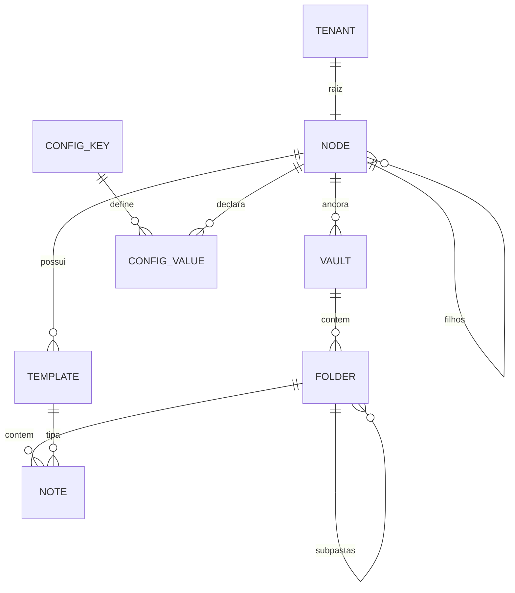

# MemoryVault.guru — DESIGN.md (Fase 1)
> Documento de arquitetura da primeira fase de implementação.
> Status: **draft para revisão** · Stack alvo: **AWS Serverless**
---
## 1. Contexto e objetivo
O MemoryVault.guru é um SaaS de gestão de conhecimento em **Markdown**, organizado por uma **hierarquia organizacional multinível**. A proposta central não é "mais um editor de notas": é **padronizar o jeito de fazer** de cada estrutura organizacional através de herança de configuração e templates.
O objetivo da Fase 1 é entregar o **núcleo do modelo** — hierarquia, herança, templates, vaults, pastas e notas — com um motor de resolução correto e extensível. Funcionalidades de superfície (busca, sync, colaboração) ficam para fases seguintes.
### Conceito-chave
Todo o produto se apoia em **uma única primitiva**: uma cadeia de nós onde cada nível pode declarar convenções que os níveis abaixo herdam e podem (ou não) sobrescrever.
```
Raiz (Tenant) → Organização → Departamento → Divisão → Projeto → Vault → Pasta → Nota
└──────────────── cadeia única de herança de configuração ────────────────┘
```
Reconhecer que **Vault, Pasta e até a Nota participam da mesma cadeia** é a decisão de design mais importante deste documento: existe **um só algoritmo de resolução**, não quatro.
---
## 2. Princípios de design
| # | Princípio | Consequência prática |
|---|---|---|
| P1 | **Hierarquia genérica, não fixa** | Uma tabela `Node` recursiva com `type`, não cinco tabelas |
| P2 | **Configuração é dado, não schema** | Registry de chaves de config; adicionar propriedade ≠ migração |
| P3 | **Herança explícita e rastreável** | Todo valor efetivo carrega sua origem (`provenance`) |
| P4 | **Governança > conveniência** | Ancestral pode *travar* (`locked`) valores que descendentes não sobrescrevem |
| P5 | **Conteúdo portável** | Markdown + YAML frontmatter puro; export/import nativo, sem lock-in |
| P6 | **Simples na Fase 1, escalável por design** | Resolução em tempo de leitura agora; materialização depois — sem mudar o modelo |
| P7 | **Isolamento por chave-líder** | Todo item começa com `T#{tenant_id}`; ABAC pode ser adicionado sem refatorar |
---
## 3. Modelo de domínio

### 3.1 Node (a espinha dorsal)
**Decisão: nó genérico recursivo, não níveis fixos em código.**
Justificativa: organizações reais não cabem em `Org → Depto → Divisão → Projeto`. Uma agência tem `Org → Cliente → Campanha`. Uma consultoria pula divisões. Uma multinacional precisa de `Região` no meio. Se os níveis forem tabelas fixas, cada cliente enterprise vira uma migração.
```typescript
interface Node {
  tenantId: string;
  nodeId: string;           // ULID
  parentId: string | null;  // null apenas na raiz
  type: NodeType;           // TENANT_ROOT | ORG | DEPARTMENT | DIVISION | PROJECT | custom
  name: string;
  slug: string;             // único entre irmãos
  path: string;             // materializado: "/01H.../01H.../01H..."
  depth: number;            // 0 = raiz
  status: 'ACTIVE' | 'ARCHIVED';
  configOverrides: Record<string, ConfigValue>;
  createdAt: string; updatedAt: string; version: number;
}
```
A "forma" da hierarquia vira **política do tenant**, não código:
```json
{
  "hierarchyPolicy": {
    "maxDepth": 6,
    "allowedTransitions": {
      "TENANT_ROOT": ["ORG"],
      "ORG": ["DEPARTMENT", "PROJECT"],
      "DEPARTMENT": ["DIVISION", "PROJECT"],
      "DIVISION": ["PROJECT"],
      "PROJECT": []
    },
    "vaultAnchors": ["ORG", "DEPARTMENT", "DIVISION", "PROJECT"]
  }
}
```
Você ganha a rigidez que quer (validação de transições) **sem** perder flexibilidade. E `hierarchyPolicy` é, ela própria, uma chave de config herdável.
**Restrições Fase 1:** árvore (não DAG), pai único, `maxDepth ≤ 6`, `path` derivado e nunca escrito manualmente.
### 3.2 Config Key Registry
Você disse que as propriedades da raiz ainda não estão definidas. **Isso é uma feature, não um problema** — desde que o sistema não exija saber quais são.
Em vez de um schema fixo, um **registry de chaves**:
```typescript
interface ConfigKey {
  key: string;                  // "notes.namingConvention"
  namespace: string;            // "notes" | "templates" | "governance" | "vault" | "ui"
  schema: JSONSchema;           // valida o valor
  defaultValue: unknown;
  mergeStrategy: 'REPLACE' | 'DEEP_MERGE' | 'APPEND' | 'UNION';
  lockable: boolean;            // pode ser travada por ancestral?
  minLevel?: NodeType;          // só declarável a partir de certo nível
  appliesTo: ('NODE'|'VAULT'|'FOLDER')[];
  description: string;
}
```
Adicionar uma propriedade nova = inserir um item no registry. Sem migração, sem deploy de schema, sem `ALTER TABLE`.
**Namespaces iniciais sugeridos** (para começar a conversa, todos opcionais):
- `notes.*` — convenção de nomes, frontmatter obrigatório, idioma padrão, limite de tamanho
- `templates.*` — templates habilitados, se permite template ad-hoc, política de deprecação
- `governance.*` — classificação de confidencialidade, retenção, aprovação obrigatória, auditoria
- `vault.*` — estrutura de pastas padrão ao criar vault, profundidade máxima
- `ui.*` — branding, idioma, ordenação padrão
- `security.*` — MFA obrigatório, duração de sessão, domínios de e-mail aceitos
- `access.*` — auto-join por domínio, papel padrão de convite
- `notes.markdown.*` — callouts, wikilinks e diagramas permitidos
- `notes.lifecycle` / `notes.idScheme` / `notes.linkPolicy` — ver §12
### 3.3 ConfigValue
```typescript
interface ConfigValue {
  value: unknown;
  mode: 'OPEN' | 'LOCKED';    // LOCKED: descendentes não podem sobrescrever
  setBy: string;              // nodeId que declarou
  setAt: string;
  note?: string;              // "por que" — aparece na UI de governança
}
```
O campo `note` parece cosmético e não é: quando um gerente de projeto pergunta *"por que não consigo mudar isso?"*, a UI responde **"travado pela Organização Acme em 12/03 — política de conformidade LGPD"**. Isso reduz drasticamente o volume de suporte.
---
## 4. Motor de herança
### 4.1 Algoritmo de resolução
```
resolveConfig(target) →
  1. cadeia = [raiz, ...ancestrais, nó, (vault), (pasta)]   // ordem raiz→folha
  2. efetivo = {} ; procedencia = {}
  3. para cada elo na cadeia:
       para cada (chave, valor) declarada no elo:
         se efetivo[chave] está LOCKED por um ancestral:
           registrar conflito (violação de política) e IGNORAR
         senão:
           efetivo[chave] = merge(efetivo[chave], valor, registry[chave].mergeStrategy)
           procedencia[chave] = { nodeId: elo.id, mode: valor.mode }
  4. preencher chaves ausentes com registry[chave].defaultValue (procedencia = SYSTEM)
  5. retornar { efetivo, procedencia, conflitos }
```
Propriedades garantidas: **determinístico**, **auditável** (toda chave sabe de onde veio) e **puro** (testável sem infraestrutura — este é o coração do sistema e merece cobertura de teste próxima de 100%).
### 4.2 Estratégia de execução — Fase 1
**Decisão: resolver em tempo de leitura, não materializar.**
Como `path` contém os IDs dos ancestrais e `maxDepth = 6`, resolver custa **um único `BatchGetItem` de ≤ 8 itens** (~5 ms) + merge em memória. Adicione cache em memória do Lambda (TTL 30–60 s) com chave `nodeId:version`.
O que isso evita na Fase 1: tabela de config resolvida, invalidação em cascata via DynamoDB Streams, Step Functions de fan-out para subárvores, e toda a classe de bugs de consistência eventual que vem junto.
**Gatilho para migrar** (Fase 3): p99 de leitura > 150 ms, ou `maxDepth` > 8, ou leituras de config > 500 rps sustentados. O modelo já suporta a mudança — vira um item `RESOLVED#{nodeId}` mantido por Streams + Step Functions, sem tocar no domínio.
### 4.3 Reparentar (mover subárvore)
Operação cara e frequentemente subestimada: mudar o pai de um nó reescreve `path` e `depth` de toda a subárvore.
- Fase 1: operação **assíncrona**, nó marcado `REPARENTING`, escritas em lote de 25 itens, evento `NodeReparented` ao final
- Limite de guarda: bloquear se a subárvore > 1.000 nós (Fase 1)
- Nunca usar `path` como chave primária — apenas como índice secundário
---
## 5. Templates
### 5.1 Modelo
```typescript
interface Template {
  tenantId: string;
  templateId: string;
  ownerNodeId: string;        // nível que criou → define o escopo de visibilidade
  version: number;            // imutável após publicação
  status: 'DRAFT' | 'PUBLISHED' | 'DEPRECATED';
  name: string; slug: string;
  frontmatterSchema: JSONSchema;   // os "parâmetros" da nota
  bodyTemplate: string;            // Markdown com {{placeholders}}
  extendsTemplateId?: string;      // composição (Fase 2)
}
```
### 5.2 Regra de visibilidade
> Um nó enxerga os templates de **si mesmo + todos os seus ancestrais até a raiz**.
Templates da raiz = **biblioteca padrão global**, visível para todos os tenants/níveis. Templates de um nó são **privados à sua subárvore**.
Consulta: os IDs dos ancestrais já estão em `path` → `BatchGetItem` por `ownerNodeId` (≤ 6 partições). Rápido e sem GSI adicional.
Filtro opcional via config: `templates.enabled` (lista branca) e `templates.blocked` (lista negra) permitem que uma Organização esconda templates da raiz que não fazem sentido para ela.
### 5.3 Versionamento (não negociável)
Notas gravam `templateId` **+** `templateVersion`. Publicar a v3 de um template **não quebra** as notas criadas na v2.
Ciclo: `DRAFT` (editável) → `PUBLISHED` (imutável) → `DEPRECATED` (não aceita notas novas; existentes seguem válidas).
Migração de notas entre versões é uma operação **explícita e opt-in** (Fase 2), nunca automática. Sem isso, editar um template vira um evento de corrupção de dados em massa.
### 5.4 Composição de schema
O frontmatter efetivo de uma nota é a composição de:
```
schema_efetivo = allOf [
  schema_do_template,
  notes.requiredFrontmatter herdado da cadeia   // ex.: raiz exige "classification"
]
```
Assim a Organização pode exigir `owner` e `classification` em **toda** nota, independentemente do template escolhido. Validação com Ajv (JSON Schema 2020-12).
---
## 6. Vault, Pasta e Nota
### 6.1 Vault
```typescript
interface Vault {
  tenantId: string; vaultId: string;
  nodeId: string;              // âncora: exatamente um nó
  name: string; slug: string;
  configOverrides: Record<string, ConfigValue>;
  storagePrefix: string;       // s3://bucket/{tenantId}/{vaultId}/
  stats: { folderCount: number; noteCount: number; bytes: number };
}
```
Ao criar um vault, `vault.defaultFolderStructure` (herdado) pode **provisionar automaticamente a árvore de pastas padrão** daquele nível. É aqui que a padronização vira valor visível para o usuário: criou um projeto → o vault já nasce com a estrutura certa e os templates certos em cada pasta.
**Fase 1:** um vault pertence a exatamente um nó. Compartilhamento entre nós é Fase 3 (via grants de leitura, não via múltiplas âncoras).
### 6.2 Folder
```typescript
interface Folder {
  tenantId: string; vaultId: string; folderId: string;
  parentFolderId: string | null;
  name: string; slug: string;
  path: string;                        // "/reunioes/2026/q1"
  templatePolicy: {
    allowedTemplateIds: string[];      // [] = herda do pai
    defaultTemplateId?: string;
    strict: boolean;                   // true = só os permitidos
  };
  configOverrides: Record<string, ConfigValue>;
}
```
A pasta participa da mesma cadeia de herança — `templatePolicy` de uma subpasta refina (nunca amplia, se `strict`) a da pasta pai.
### 6.3 Note
```typescript
interface Note {
  tenantId: string; vaultId: string; folderId: string; noteId: string;
  title: string; slug: string;
  templateId: string; templateVersion: number;
  frontmatter: Record<string, unknown>;  // validado contra schema_efetivo
  bodyS3Key: string;
  contentHash: string;                   // SHA-256, para detecção de conflito
  sizeBytes: number;
  status: string;                        // estado de notes.lifecycle — NÃO é enum fixo (§12.3)
  structuredId?: string;                 // EV-2-c1-014, alocado pelo servidor (§12.4)
  author: string;                        // humano responsável — verificado (§12.9)
  origin: 'MCP' | 'WEB' | 'IMPORT';
  clientId?: string;                     // verificado, do token
  coauthorClaimed?: string;              // ALEGADO pelo cliente, não verificável
  runId?: string;                        // execução/subagente
  createdBy: string; updatedBy: string; version: number;
}
```
**Separação metadados/conteúdo:** frontmatter e metadados no DynamoDB (consultáveis, filtráveis); corpo Markdown no S3 (sem limite de 400 KB, versionamento nativo do bucket, custo ~10x menor por GB).
**Formato em disco** — Markdown puro com YAML frontmatter, para portabilidade total (P5):
```markdown
---
mv_template: reuniao-cliente
mv_template_version: 2
title: Kickoff Acme
classification: internal
owner: maria@empresa.com
---
# Kickoff Acme
...
```
Prefixos `mv_` isolam campos do sistema dos campos do usuário. Um export é literalmente um `aws s3 sync` — abre direto no Obsidian.
---
## 7. Modelo de dados (DynamoDB single-table)
Tabela única `memoryvault`, on-demand, PITR habilitado, Streams (`NEW_AND_OLD_IMAGES`).
| Entidade | PK | SK | GSI1PK | GSI1SK |
|---|---|---|---|---|
| Node | `T#{t}#NODE#{nodeId}` | `META` | `T#{t}#PARENT#{parentId}` | `NODE#{slug}` |
| Node (subárvore) | ↑ | ↑ | `T#{t}#TREE` (GSI2) | `{path}` |
| ConfigKey | `T#{t}#REGISTRY` | `KEY#{key}` | — | — |
| Template | `T#{t}#TPL#{templateId}` | `V#{version}` | `T#{t}#TPLOWNER#{ownerNodeId}` | `TPL#{slug}#V#{version}` |
| Vault | `T#{t}#VAULT#{vaultId}` | `META` | `T#{t}#NODEVAULTS#{nodeId}` | `VAULT#{slug}` |
| Folder | `T#{t}#VAULT#{vaultId}` | `FOLDER#{path}` | — | — |
| Note | `T#{t}#V#{vaultId}#F#{folderId}` | `NOTE#{noteId}` | `T#{t}#VAULTNOTES#{vaultId}` | `UPD#{updatedAt}#{noteId}` |
| Membership | `T#{t}#USER#{userId}` | `GRANT#{scopeId}` | `T#{t}#SCOPE#{scopeId}` | `USER#{userId}` |
| Invite | `T#{t}#INVITE#{token}` | `META` | `T#{t}#SCOPE#{scopeId}` | `INVITE#{email}` |
| **User** (global) | `USER#{userId}` | `PROFILE` | `IDENTITY#{provider}#{subject}` | `USER#{userId}` |
> `User` e `IdentityLink` são os **únicos** itens sem prefixo de tenant — exceção deliberada e justificada em §10.10.
**Notas particionadas por pasta**, não por vault. Uma partição do DynamoDB tem limite prático de 10 GB e 3.000 RCU; um vault corporativo com dezenas de milhares de notas estouraria isso. Particionar por pasta distribui naturalmente e mantém `listar notas da pasta` como um `Query` de partição única — a operação mais frequente da UI. Listagem vault-wide vai pelo GSI1, já ordenada por atualização recente.
### Padrões de acesso cobertos
| # | Acesso | Operação |
|---|---|---|
| A1 | Buscar nó por ID | `GetItem` |
| A2 | Listar filhos diretos | `Query` GSI1 `PARENT#{id}` |
| A3 | Listar subárvore | `Query` GSI2 `begins_with(path)` |
| A4 | Resolver config efetiva | `BatchGetItem` (≤ 8 IDs do path) |
| A5 | Templates visíveis para um nó | `BatchGetItem` por `TPLOWNER` dos ancestrais |
| A6 | Vaults de um nó | `Query` GSI1 `NODEVAULTS#{nodeId}` |
| A7 | Árvore de pastas do vault | `Query` PK=`VAULT#{id}`, `begins_with(SK,'FOLDER#')` |
| A8 | Notas de uma pasta | `Query` PK=`V#{vault}#F#{folder}` |
| A9 | Notas recentes do vault | `Query` GSI1 `VAULTNOTES#{vaultId}`, desc |
| A10 | Permissões do usuário | `Query` PK=`USER#{userId}` |
---
## 8. Arquitetura AWS
```
                    CloudFront ──── S3 (SPA React)
                         │
                    API Gateway (HTTP API)
                         │
                  Lambda Authorizer ──── Cognito User Pool
                         │
        ┌────────────────┼────────────────┐
        │                │                │
   fn-hierarchy     fn-templates      fn-content
   fn-config        fn-vaults         fn-notes
        │                │                │
        └────────────────┼────────────────┘
                         │
              ┌──────────┴──────────┐
              │                     │
        DynamoDB (single)      S3 (conteúdo .md)
              │                  SSE-KMS, versionado
        DynamoDB Streams
              │
        EventBridge Bus ──── SQS + DLQ ──── fn-projections
                                            (stats, auditoria)
```
**Componentes** — a coluna Fase marca o que entra na demo (ADR-016)
| Serviço | Uso | Configuração |
|---|---|---|
| API Gateway HTTP API | REST | ~70% mais barato que REST API; suficiente |
| Lambda | Compute | Node 22 · **ARM64** · esbuild · Powertools · 512 MB |
| Cognito User Pool | AuthN | Pool único · plano Essentials · Managed Login · e-mail via SES — ver §10 |
| DynamoDB | Dados | On-demand, PITR, Streams |
| S3 | Conteúdo | Versionamento ON, SSE-KMS, prefixo por tenant, lifecycle p/ IA em 90d |
| EventBridge ⏳ | Eventos de domínio | `NoteCreated`, `ConfigChanged`, `TemplatePublished`… |
| SES ⏳ | E-mail transacional | Convites, verificação, recuperação — substitui o e-mail padrão do Cognito |
| SQS + DLQ ⏳ | Assíncrono | Reparent, projeções, provisionamento de vault |
| CloudWatch + X-Ray | Observabilidade | Logs estruturados JSON, tracing ponta a ponta |
| **CDK v2 (TypeScript)** | IaC | Stacks separados: `Network`, `Data`, `Api`, `Web` |
⏳ = desenhado, construído a partir da Fase 2.
**Stack da demo (ADR-016):** CloudFront + S3 · API Gateway HTTP API · Lambda · DynamoDB · S3 · Cognito. Nada mais.
Nada na Fase 1 é assíncrono: não há reparent, não há cascata de config, e as estatísticas dos vaults são calculadas na própria carga. EventBridge, SQS, Streams e Step Functions são aditivos — entram sem tocar no modelo de dados.
**Fora em qualquer cenário na Fase 1:** OpenSearch Serverless (busca), WAF, Aurora Serverless, VPC (nenhuma Lambda precisa dela — evita cold start de ENI).
### Organização das Lambdas
Handlers finos por domínio (não um monólito, não uma Lambda por rota). Toda a lógica em `packages/core` — puro TypeScript, sem imports de AWS SDK, testável em milissegundos. O motor de resolução de config **nunca** deve importar `@aws-sdk/*`.
---
## 9. API (Fase 1)
```
# Identidade e acesso
GET    /auth/discover?email=           qual pool/app client usar (pool-agnóstico)
GET    /me                             perfil + tenants disponíveis
PATCH  /me                             nome, avatar, fuso, idioma
GET    /me/permissions?tenantId=       papéis efetivos no tenant
POST   /nodes/{id}/invites             convidar (email + role)
GET    /invites/{token}                pré-visualizar convite
POST   /invites/{token}/accept
GET    /nodes/{id}/members
PATCH  /members/{userId}               alterar papel → permVersion++
DELETE /members/{userId}               revogar acesso → efeito imediato
# Hierarquia
POST   /nodes                          criar nó (valida allowedTransitions)
GET    /nodes/{id}
PATCH  /nodes/{id}
GET    /nodes/{id}/children
GET    /nodes/{id}/tree?depth=n
POST   /nodes/{id}/move                assíncrono → 202
DELETE /nodes/{id}                     soft delete; bloqueia se tiver vaults
# Configuração
GET    /config-keys                    registry
POST   /config-keys                    (admin do tenant)
GET    /nodes/{id}/config              overrides declarados no nó
PUT    /nodes/{id}/config
GET    /nodes/{id}/effective-config    ★ resolvida + procedência + conflitos
# Templates
POST   /templates
GET    /templates/{id}/versions
POST   /templates/{id}/versions/{v}/publish
GET    /nodes/{id}/available-templates ★ visíveis pela cadeia
# Vaults / Pastas
POST   /nodes/{id}/vaults              provisiona estrutura padrão herdada
GET    /vaults/{id}
GET    /vaults/{id}/folders
POST   /vaults/{id}/folders
PATCH  /folders/{id}                   inclui templatePolicy
# Contexto de agente (§12)
GET    /vaults/{id}/readme                   README renderizado da config + dados
GET    /vaults/{id}/agent-context?flavor=    CLAUDE.md | AGENTS.md
POST   /vaults/{id}/ids/allocate             alocação atômica de ID estruturado
# Notas
POST   /folders/{id}/notes             valida frontmatter vs schema efetivo
GET    /notes/{id}?include=body
PUT    /notes/{id}
GET    /notes/{id}/upload-url          presigned p/ corpos > 1 MB
DELETE /notes/{id}
```
Os dois endpoints marcados com ★ são os que **vendem o produto** — merecem a melhor UX e a melhor cobertura de teste.
Convenções: `If-Match` com `version` para concorrência otimista; paginação por cursor opaco; erros em RFC 7807 (`application/problem+json`).
---
## 10. Identidade e acesso (Amazon Cognito)
### 10.1 Divisão de responsabilidades
> **Cognito é dono da identidade (AuthN). O DynamoDB é dono da autorização (AuthZ).**
| Cognito | Aplicação (DynamoDB) |
|---|---|
| Credenciais, hash de senha | Memberships (papel × escopo) |
| MFA, recuperação de senha | Convites e onboarding |
| Federação SAML/OIDC (Fase 3) | Perfil (nome, avatar, fuso, idioma) |
| Sessões, emissão e revogação de tokens | Auditoria de acesso |
| Verificação de e-mail | Estado de ativação por tenant |
**Por que não usar Cognito Groups para os papéis:** seria necessário um grupo por par (nó × papel). Um tenant com 200 nós × 4 papéis = 800 grupos; 100 tenants = 80.000 — acima do limite de **10.000 grupos por user pool**, e um usuário pode pertencer a no máximo **100 grupos**. Além disso, grupos entram no ID token e inflam o JWT. O modelo de grupos simplesmente não sobrevive a uma hierarquia.
**Por que não usar custom attributes para dados de negócio:** limite de **50 atributos customizados por pool**, 2.048 bytes cada, nome com até 20 caracteres — e o nome é imutável depois de criado. Atributo customizado serve para uma coisa só aqui: o ID interno.
### 10.2 Estratégia de pool
**Decisão: um único User Pool compartilhado por todos os tenants** (modelo pool), não um pool por tenant.
| Critério | Pool único (escolhido) | Pool por tenant |
|---|---|---|
| Limite | 1.000 pools/região (ajustável até 10.000) — irrelevante | Teto real de crescimento |
| Onboarding de tenant | Registro no banco | Provisionamento de infra |
| Usuário em 2+ tenants | Natural | Impossível sem duplicar identidade |
| Triggers, branding, migrações | Um conjunto | N conjuntos |
| Isolamento de credenciais | Lógico | Físico |
**Custo da escolha:** o e-mail é único dentro do pool → **uma pessoa = uma identidade** em todo o produto, com N memberships. Para um SaaS B2B de conhecimento — onde consultores, parceiros e o próprio suporte do MemoryVault transitam entre organizações — isso é a modelagem correta, não uma limitação.
**Teto a monitorar:** **300 identity providers por user pool** (ajustável até 1.000). Com SSO federado por tenant enterprise (Fase 3), esse é o limite real — cerca de 300 tenants com IdP próprio. Mitigação: fragmentar tenants federados em pools adicionais.
> Para que essa fragmentação não seja uma reescrita depois, o login já deve nascer *pool-agnóstico* na Fase 1: um endpoint `GET /auth/discover?email=` retorna qual pool e app client usar. Hoje ele sempre responde a mesma coisa. No dia em que houver um segundo pool, o front-end não muda.
### 10.3 Configuração do User Pool (Fase 1)
| Item | Escolha | Motivo |
|---|---|---|
| Sign-in | E-mail como alias (case-insensitive) | Sem username; B2B |
| Auto-cadastro | Habilitado, **gated por trigger Pre Sign-up** | Só passa fluxo de criação de tenant ou convite válido — ver §11.4 |
| Feature plan | **Essentials** | Necessário para customização de access token (V2_0) e MFA por e-mail |
| MFA | Opcional (TOTP) na Fase 1 | Obrigatoriedade por tenant via `security.mfaRequired` |
| UI | **Managed Login** com branding | Evita construir telas de auth; é o caminho para federação |
| Access / ID token | 1 hora | Limite do Cognito: 5 min – 1 dia |
| Refresh token | 30 dias, com rotação | Limite: 1 hora – 3.650 dias |
| E-mail | **Via SES**, nunca o padrão | O e-mail padrão do Cognito é limitado a **50 mensagens/dia por conta** |
| `PreventUserExistenceErrors` | Ativado | Evita enumeração de usuários |
| `DeletionProtection` | Ativado | — |
| Custom attributes | Apenas `custom:mv_uid` | Nada mais |
A obrigatoriedade de MFA por tenant é uma chave do registry (`security.mfaRequired`), herdada como qualquer outra: a raiz pode deixar `OPEN`, uma Organização financeira pode marcar `LOCKED = true` e nenhum departamento abaixo consegue afrouxar.
### 10.4 Modelo de usuário
```typescript
// Cognito — fonte da verdade da identidade
{ sub, email, email_verified, "custom:mv_uid" }
// DynamoDB — perfil e autorização
interface User {                    // GLOBAL, sem prefixo de tenant
  userId: string;                   // ULID canônico == custom:mv_uid
  email: string;
  displayName: string; avatarKey?: string;
  locale: string; timezone: string;
  status: 'ACTIVE' | 'DISABLED' | 'DELETED';
  permVersion: number;              // incrementa a cada mudança de grant
}
interface IdentityLink {            // GLOBAL
  provider: 'COGNITO' | 'SAML:acme' | 'OIDC:okta-xyz';
  subject: string;                  // sub no provedor
  userId: string;
}
interface Membership {              // POR TENANT
  tenantId: string; userId: string;
  scopeType: 'NODE' | 'VAULT'; scopeId: string;
  role: 'OWNER' | 'ADMIN' | 'EDITOR' | 'VIEWER';
  status: 'ACTIVE' | 'INACTIVE';
  grantedBy: string; grantedAt: string;
}
```
**Por que ULID canônico e não o `sub` do Cognito?** Porque na Fase 3 a mesma pessoa chegará via SAML da Acme com um `sub` diferente, e porque um dia você pode precisar sair do Cognito. O `IdentityLink` custa um item e compra as duas coisas. (Limite do Cognito: **5 identidades federadas vinculadas por usuário**.)
**Criação de usuário passa sempre pela nossa API**, nunca por `SignUp` direto. O backend gera o ULID e o envia como atributo no `AdminCreateUser`. Isso elimina a necessidade de triggers de Pre Sign-up / Post Confirmation para sincronizar o ID e garante que nenhum usuário exista no pool sem o item correspondente no banco.
### 10.5 Resolução de tenant — correção ao documento anterior
> ⚠️ **Isto revoga o que a versão anterior deste documento afirmava.** Estava escrito que *"o `tenantId` vem exclusivamente do token JWT"*. Com uma identidade única atravessando vários tenants, isso não se sustenta: o token não sabe em qual tenant a pessoa está operando **agora**.
Modelo correto:
- O token carrega **identidade, não escopo**: `sub`, `email`, `mv_uid`, `permVersion`
- O cliente envia `X-MV-Tenant: {tenantId}` em toda requisição
- O middleware **sempre** valida que existe membership ativa de `(userId, tenantId)` e deriva o escopo do banco — o header é uma *pista*, jamais uma autoridade
- Usuário com um único tenant: o middleware resolve sozinho e o header é opcional
**Alternativa rejeitada:** guardar `custom:lastTenant` e injetar via Pre Token Generation. Faz a troca de tenant exigir refresh de token, quebra duas abas abertas em organizações diferentes e coloca estado mutável dentro do provedor de identidade.
O Pre Token Generation V2_0 continua útil — mas apenas para claims **invariantes ao tenant**: `mv_uid`, `permVersion` e flags de plataforma.
### 10.6 Authorizer e cache de permissões
**JWT authorizer nativo do API Gateway HTTP API** (valida assinatura, emissor, audiência e expiração — sem custo de Lambda, sem cold start) + autorização em middleware compartilhado dentro de cada handler.
```
JWT authorizer  →  withTenant()      valida membership, monta TenantContext
                →  withAuthz(action, resource)
                                      resolve papel efetivo na cadeia de ancestrais
                →  handler
```
**Cache de grants:** memória do Lambda, chave `userId:tenantId:permVersion`, TTL 60 s. Qualquer mudança de permissão incrementa `permVersion` no item `User` → o cache se invalida sozinho, sem coordenação entre instâncias. Revogação vale na requisição seguinte, não ao fim do TTL.
Como o middleware já lê o item `User` para obter `permVersion`, ele checa `status` na mesma leitura: **desativar um usuário tem efeito imediato**, sem esperar o access token expirar.
**Por que não um Lambda authorizer do tipo REQUEST:** o cache dele é indexado pelo token, então revogação esperaria o TTL, e ele adiciona um cold start no caminho crítico de toda requisição.
### 10.7 Convites e onboarding
```
1. Admin (papel ADMIN+ no nó) convida: email + role + scopeId
2. Item Invite no DDB — token de uso único, TTL de 7 dias
3. E-mail via SES
4. Aceite:
   ├─ e-mail já existe no pool → cria apenas a Membership (não duplica identidade)
   └─ e-mail novo → AdminCreateUser + definição de senha + Membership
5. Evento InviteAccepted → auditoria
```
O ramo superior do passo 4 é o que torna real a promessa de "uma pessoa, N organizações": um consultor convidado por três clientes faz login uma vez e alterna entre eles.
**Fase 2 — auto-join por domínio.** Vira mais uma chave do registry: `access.autoJoinDomains: ["acme.com"]` com `access.autoJoinRole: "VIEWER"`. Herdada como qualquer outra — um Departamento pode definir que todo `@acme.com` entra como leitor naquele nó, e a Organização acima pode travar isso com `LOCKED`.
Repare que política de acesso não precisou de mecanismo novo: entrou no motor de herança que já existia.
### 10.8 Ciclo de vida
| Operação | Ações |
|---|---|
| **Desativar** | `AdminDisableUser` + `AdminUserGlobalSignOut` + memberships `INACTIVE` + `permVersion++`. Efeito imediato (§10.6) |
| **Remover de um tenant** | Apenas memberships daquele tenant → `INACTIVE`. A identidade e os outros tenants seguem intactos |
| **Excluir (LGPD)** | `AdminDeleteUser` + anonimização do item `User`, preservando o `userId` como *tombstone* para que `createdBy` nas notas não fique órfão. Auditoria mantida com identificador pseudonimizado |
### 10.9 Acesso máquina-a-máquina — Fase 2
Resource server + app clients com `client_credentials` (trigger V3_0), ou chaves de API próprias no DynamoDB. O M2M do Cognito tem precificação separada do modelo de MAU. Fora da Fase 1.
### 10.10 Camadas de isolamento (revisadas)
1. `userId` vem **exclusivamente** do JWT validado — nunca do body ou da query string
2. `tenantId` vem do header, mas é **sempre** validado contra Membership; a camada de repositório recebe um objeto `TenantContext` já validado, nunca uma string crua
3. Nenhum repositório monta chave manualmente — existe uma única função `keyFor(ctx, entity)`
4. Testes de vazamento cross-tenant no CI que **falham o build**
5. Fase 2: STS AssumeRole por requisição com `dynamodb:LeadingKeys` e condição de prefixo no S3
**Exceção deliberada:** os itens `User` e `IdentityLink` são **globais**, sem prefixo `T#`. É a única quebra da regra da chave-líder, e é intencional — identidade atravessa tenants por design. A mitigação é que esses itens não contêm nenhum dado de negócio: só perfil. Tudo que é específico de um tenant vive em `Membership`, que é tenant-scoped. Documente essa exceção no código, ou alguém vai "consertá-la" em seis meses.
### 10.11 Custo — a armadilha do MAU
O Cognito cobra por **usuário ativo mensal**, e a definição de "ativo" é mais ampla do que parece: além de login, contam criação, confirmação, alteração de atributos, sign-out, revogação de token e — o item perigoso — **consultar detalhes do usuário como administrador (`AdminGetUser`)**.
> Regra de implementação: **nunca chamar `AdminGetUser` em caminho de requisição.** Perfil se lê do DynamoDB. Uma implementação ingênua que consulta o Cognito a cada request transforma todo usuário autenticado em MAU faturável e multiplica a conta.
`ListUsers` não tem esse efeito, mas também não deve ser usado como banco de consulta.
Usuários que chegam por federação SAML/OIDC são faturados como `EnterpriseMAU`, com preço distinto — relevante ao precificar o plano enterprise da Fase 3. Confirme os valores vigentes em `aws.amazon.com/cognito/pricing` antes de fechar preço: o modelo de feature plans (Lite / Essentials / Plus) mudou a estrutura em novembro de 2024.
### 10.12 Identidade única entre tenants — **decidido**
> **ADR-002 · Aceita** · Uma pessoa tem **uma identidade** no MemoryVault e N memberships. Trocar de organização é um clique, não um novo login.
Decisão fechada. As consequências abaixo deixam de ser hipóteses e viram requisitos da Fase 1.
#### C1 — Invariante de desativação
`AdminDisableUser` mata o acesso da pessoa a **todos** os tenants. Portanto:
> **Um admin de tenant nunca dispara operação no Cognito.** Remover alguém de uma organização é exclusivamente `Membership.status = INACTIVE` + `permVersion++`. Desabilitar ou excluir a identidade é privilégio do próprio titular ou da operação MemoryVault.
Sem essa regra, um admin da Organização A consegue derrubar o acesso de um consultor na Organização B. É o modo de falha mais grave desta decisão e precisa de teste automatizado explícito no CI, não só de disciplina.
| Ação | Quem pode | Efeito |
|---|---|---|
| Revogar membership | `ADMIN`+ do escopo | Perde acesso àquele tenant |
| Desabilitar identidade | Operação MemoryVault | Perde acesso a tudo |
| Excluir conta (LGPD) | O próprio titular | Remove identidade; memberships caem junto |
#### C2 — Convite não pode vazar a existência da conta
Se um admin da Acme convida `maria@x.com` e a resposta da API difere conforme ela já ter conta ou não, o fluxo de convite vira um oráculo de enumeração: qualquer pessoa com um tenant grátis descobre quem usa o produto e onde.
> A resposta do convite é **idêntica nos dois casos**: mesma mensagem, mesmo status, mesmo tempo. Só depois do aceite o admin vê a pessoa na lista de membros.
Isso é coerente com o `PreventUserExistenceErrors` já ativado no pool — não adianta blindar o login e deixar o convite aberto.
#### C3 — Perfil global, com escape hatch
`displayName`, avatar, fuso e idioma são globais. Um consultor aparece com o mesmo nome nos três clientes.
Fase 1 aceita isso. Se aparecer demanda real (comum em consultoria: nome social em um cliente, nome de registro em outro), a saída já está prevista no modelo: um item `MembershipProfile` opcional que sobrescreve campos de exibição por tenant. Não construir agora, mas não fechar a porta — o `Membership` já é o lugar natural.
#### C4 — `/me` é a única superfície cross-tenant
Todo o resto da API é estritamente tenant-scoped. `GET /me` é o único endpoint que devolve dados de mais de um tenant (a lista de organizações da pessoa), e por isso merece revisão de segurança dedicada: ele devolve `tenantId`, nome e papel — **nunca** contagem de vaults, atividade ou qualquer métrica de uma organização para outra.
Notificações, busca, "recentes" e histórico: todos filtrados por `TenantContext`. Nenhuma exceção.
#### C5 — Estado de "tenant atual" mora no cliente
A última organização usada é preferência de UI: `localStorage` no front, não atributo no Cognito nem coluna no banco. Isso mantém duas abas em organizações diferentes funcionando, que é o caso de uso que motivou a decisão.
Caso de borda a tratar na Fase 1: pessoa autentica e tem **zero** memberships ativas (convite revogado, saiu da empresa). Precisa de uma tela de "você não pertence a nenhuma organização" com opção de criar uma — não um erro 403 cru.
#### C6 — Tensão conhecida com SSO enterprise (Fase 3)
Este é o ponto que a decisão deixa em aberto para depois, e é melhor registrá-lo agora do que descobri-lo num contrato.
Quando a Acme exigir SAML, ela vai querer **domain claiming**: todo usuário `@acme.com` autentica obrigatoriamente pelo IdP dela, sem senha local. Com identidade única, essa exigência atravessa a fronteira do tenant — se `maria@acme.com` também é membro da Beta Consultoria, a Acme passou a controlar como ela entra na Beta.
Resolução prevista: domain claiming governa o **método de autenticação** da identidade, não o acesso aos tenants. Maria passa a entrar via IdP da Acme, e essa mesma identidade federada continua valendo na Beta. Funciona, é defensável em contrato, mas exige que o `IdentityLink` (§10.4) já exista desde a Fase 1 — o que ele já faz.
Alternativa a considerar se algum enterprise recusar o modelo: mover aquele tenant específico para o modelo silo (pool dedicado). O endpoint `/auth/discover` (§10.2) existe exatamente para tornar isso possível sem reescrita.
---
## 11. Onboarding e ciclo de vida do tenant
Esta seção fechava um buraco real: o modelo descrevia como a hierarquia funciona depois de existir, mas não como ela nasce.
### 11.1 Três planos, não dois
| Plano | Quem opera | Sobre o quê | Superfície |
|---|---|---|---|
| **Plataforma** | Equipe MemoryVault | Tenants, aprovações, planos, suspensão | `/admin/*` |
| **Tenant** | Owner e admins do cliente | Hierarquia, config, templates, membros | `/nodes`, `/templates`, `/members` |
| **Conteúdo** | Editores e leitores | Vaults, pastas, notas | `/vaults`, `/notes` |
A separação importa porque **o plano de plataforma quase não precisa tocar no plano de conteúdo**. Aprovar uma organização mexe em metadados: nome, slug, e-mail do solicitante, data. Nenhuma dessas operações exige ler uma nota. A API `/admin/*` deve nascer sem permissão de leitura no conteúdo dos clientes — não por política, por IAM.
### 11.2 Administrador da plataforma — **pool separado**
> **ADR-003** · A equipe MemoryVault vive num **User Pool próprio** (`mv-staff`), separado do pool de clientes.
Isso parece contradizer a §10.2, que defendeu pool único. Não contradiz: aquele argumento era sobre **tenants**, cujo número cresce e cuja identidade atravessa organizações. A equipe interna tem dezenas de pessoas, não cresce com as vendas e nunca precisa de membership em tenant de cliente.
| Configuração | Valor |
|---|---|
| Pool | `mv-staff`, isolado |
| MFA | **Obrigatório**, sem exceção |
| App client | Dedicado, sem federação social |
| Authorizer | Emissor distinto — um token de cliente **nunca** valida em `/admin/*` |
| Papéis | `PLATFORM_ADMIN`, `PLATFORM_SUPPORT` (somente leitura de metadados) |
O ganho é categórico: um bug de escalação de privilégio no plano de cliente não tem como produzir um token de plataforma, porque o emissor é outro. Com pool único, `isPlatformAdmin: true` seria uma claim a uma linha de distância do desastre.
Acesso de suporte a conteúdo de cliente (impersonação) fica para a Fase 2 e exige, quando vier: consentimento do tenant, janela de tempo limitada, e registro em auditoria visível **para o cliente**.
### 11.3 A raiz da plataforma — resolvendo uma ambiguidade do documento
Havia duas coisas chamadas "raiz" neste design. Com o plano de plataforma explícito, elas se separam:
```
PLATFORM_ROOT  (singleton, tenant SYSTEM — curadoria MemoryVault)
     │            templates padrão · defaults de config · políticas globais
     ├── TENANT_ROOT (Acme)
     │        └── ORG acme
     │              └── DEPARTMENT jurídico …
     └── TENANT_ROOT (Beta)
              └── ORG beta …
```
`PLATFORM_ROOT` é o **pai de todo tenant root** na cadeia de herança. Com isso, "todos os níveis veem os templates padrão da raiz" deixa de ser uma regra especial e vira consequência do algoritmo que já existe (§4.1): um elo a mais na cadeia, zero código novo.
Consequências:
- A biblioteca de templates padrão é um **ativo de produto**, versionado e mantido pela MemoryVault
- Uma chave `LOCKED` em `PLATFORM_ROOT` é uma política que nenhum cliente sobrescreve — é onde moram limites de plano e obrigações legais
- Publicar um template novo na raiz da plataforma o torna visível para todos os tenants imediatamente, sem migração
Isso resolve metade da decisão aberta nº 6. A outra metade continua aberta: o tenant também pode publicar templates no seu próprio `TENANT_ROOT`? (Recomendação: sim — é exatamente o que a §5.2 já permite.)
### 11.4 Fluxo de cadastro
```
[anônimo]
    │  POST /signup                       e-mail + senha
    ▼
PENDING_EMAIL
    │  código de verificação (Cognito + SES)
    ▼
EMAIL_VERIFIED  ──────────────────────►  identidade existe, zero memberships
    │  POST /signup/org                   nome + slug desejado          → tela "sem organização" (C5)
    ▼
PENDING_APPROVAL
    │
    ├── admin rejeita  ─────────────────►  REJECTED   (slug liberado, identidade preservada)
    │
    └── admin aprova   ─────────────────►  APPROVED   → provisionamento (§11.7)
```
| Estado | Cognito | DynamoDB | A pessoa consegue |
|---|---|---|---|
| `PENDING_EMAIL` | Usuário não confirmado | — | Nada |
| `EMAIL_VERIFIED` | Confirmado | `User` criado | Logar, ver tela "sem organização" |
| `PENDING_APPROVAL` | Confirmado | `User` + `SignupRequest` + `SlugReservation` | Acompanhar o status |
| `APPROVED` | Confirmado | + `Tenant`, nós, `Membership` OWNER | Tudo |
| `REJECTED` | Confirmado | `SignupRequest` com motivo | Solicitar de novo (1 vez) |
Repare na continuidade: o estado "identidade sem organização" **não é novo** — é exatamente o caso de borda C5 previsto no ADR-002. O mesmo tratamento serve para quem teve o convite revogado e para quem aguarda aprovação.
**Auto-cadastro no Cognito passa a ser habilitado**, mas com um trigger **Pre Sign-up** que só autoriza duas origens: fluxo de criação de tenant ou convite válido. Isso corrige a linha correspondente da §10.3 — e mantém a garantia de que ninguém entra no pool por fora da nossa API.
### 11.5 Unicidade do nome da organização
Você pediu nome único. Recomendo mover a unicidade para o **slug normalizado**, não para o nome de exibição.
Motivo: `Acme`, `ACME`, `acme `, `Açme` e `Acme Ltda.` são cinco nomes diferentes numa comparação literal e a mesma empresa para qualquer ser humano. Unicidade sobre o nome cru produz uma falsa sensação de garantia.
```
normalizar(nome) → NFD → remove acentos → minúsculas
                 → [a-z0-9-] → colapsa hífens → 3–40 chars
"Açme Ltda."  →  "acme-ltda"
```
| Regra | Decisão |
|---|---|
| Unicidade | Global, sobre o slug normalizado |
| Nome de exibição | Livre, pode repetir |
| Reserva | Item `SLUG#{slug}` com `attribute_not_exists` — atômico, sem condição de corrida |
| Momento da reserva | Na **solicitação**, não na aprovação |
| TTL da reserva | 7 dias; liberada em rejeição ou expiração |
| Denylist | `admin api app www support status docs blog help login signup mv memoryvault` + marcas conhecidas |
| Mutabilidade | Imutável na Fase 1 (vai para URL); alteração só via plataforma |
Reservar na solicitação e não na aprovação é o detalhe que evita o pior caso: duas pessoas pedem `acme`, ambas esperam três dias, e uma descobre na resposta que perdeu o nome.
**Risco residual honesto:** sem pagamento, nada impede alguém de solicitar `petrobras` ou `itau`. A aprovação manual é a barreira — mas a reserva de 7 dias já bloqueia o dono legítimo nesse meio-tempo. Por isso o TTL curto e a capacidade de o admin liberar um slug à força.
### 11.6 Aprovação
O admin vê, na fila: e-mail, domínio do e-mail, nome e slug pedidos, data, país de origem da requisição. Aprova ou rejeita com motivo. Tudo em auditoria com o ator identificado.
Notificação de nova solicitação vai para os admins por SES (e opcionalmente Slack via EventBridge).
**Trade-off que vale dizer em voz alta:** aprovação manual leva o time-to-value de segundos para horas ou dias. Num SaaS, esse intervalo é onde a intenção esfria — a pessoa se cadastrou empolgada e volta dois dias depois, se voltar. É uma escolha legítima nesta fase (controle de abuso, custo zero de billing, você quer conversar com os primeiros clientes), mas é bom ter consciência do preço.
Três mitigações, em ordem de esforço:
1. **Expectativa explícita** — o e-mail de confirmação diz "em até 1 dia útil", e o produto mostra o status. Custa uma frase.
2. **Allowlist por domínio** — domínios já aprovados entram direto. Resolve o caso "segundo time da mesma empresa".
3. **Trial imediato limitado** — aprova automático num tenant restrito (1 vault, N notas) e a aprovação manual apenas remove o limite. Preserva o momento "aha" sem abrir mão do controle.
A nº 1 entra na Fase 1. As outras duas ficam disponíveis para quando o volume tornar a fila um gargalo.
### 11.7 Provisionamento
Ao aprovar, uma operação **idempotente** com `provisioningState` para retry seguro:
```
1. Tenant                                  status ACTIVE
2. Nó TENANT_ROOT                          parent = PLATFORM_ROOT
3. Nó ORG                                  name + slug do cadastro
4. Membership OWNER  →  escopo TENANT_ROOT
5. Vault inicial                           se vault.defaultFolderStructure existir
6. Evento TenantProvisioned                auditoria + e-mail de boas-vindas
```
**Por que OWNER no `TENANT_ROOT` e não na ORG:** papéis herdam para baixo (§10), então ele já é owner da ORG. E, se um dia esse cliente virar um grupo com duas organizações irmãs, ele cria a segunda sem precisar de um grant novo. Custo zero hoje, flexibilidade depois.
Nada de config é copiado do `PLATFORM_ROOT` — é **herdado**. Copiar defaults no provisionamento é o erro clássico que congela o tenant na versão do dia em que ele nasceu.
### 11.8 Convite
O owner (ou qualquer `ADMIN`) convida indicando **e-mail + escopo + papel**, exatamente como você descreveu. Duas regras de contenção:
> **R1** — Só é possível convidar para escopos **dentro da própria subárvore**. Um `ADMIN` do Departamento Jurídico não convida ninguém para a raiz da organização.
>
> **R2** — Ninguém concede papel **maior que o próprio**. Um `ADMIN` não cria um `OWNER`.
Sem R1 e R2, "admin de departamento" é um caminho de escalação até o controle do tenant.
**Convidado não passa pela aprovação da plataforma.** A distinção é deliberada e vale registrar: no cadastro espontâneo, quem avaliza é a MemoryVault; no convite, quem avaliza é o owner da organização, que já foi avaliado. Exigir aprovação de plataforma para cada convidado tornaria o produto inoperável.
Dois caminhos no aceite, herdados do ADR-002:
- **Identidade já existe** → cria só a `Membership`. Login único, nova organização na lista.
- **Identidade nova** → cadastro + verificação de e-mail + `Membership`. Sem fila de aprovação.
Estados do convite: `PENDING` → `ACCEPTED` | `EXPIRED` (7 dias) | `REVOKED`.
**Limite anti-abuso:** teto de convites pendentes por tenant e por hora. O motivo não é só spam — todo convite sai do **seu domínio SES**. Um tenant disparando convites em massa para endereços inválidos derruba a reputação de envio de toda a plataforma, e o e-mail de recuperação de senha dos outros clientes começa a cair em spam junto.
### 11.9 Invariante do OWNER
> Todo tenant tem **pelo menos um** `OWNER` ativo, sempre.
Bloquear a última revogação e a última saída voluntária. Transferência é uma operação explícita: `POST /tenants/{id}/transfer-ownership`, com confirmação do destinatário.
Caso de suporte: owner único sai da empresa e ninguém tem acesso. Só `PLATFORM_ADMIN` resolve — operação registrada, com verificação fora de banda. Sem esse escape, a resposta ao cliente é "não há o que fazer", o que não é uma resposta.
### 11.10 Suspensão e encerramento
| Estado do tenant | Efeito |
|---|---|
| `ACTIVE` | Normal |
| `SUSPENDED` | Login funciona, escrita bloqueada, leitura e **export** preservados |
| `PENDING_DELETION` | 30 dias de carência, export disponível, avisos por e-mail |
| `DELETED` | Conteúdo removido; identidades **não** são tocadas (podem pertencer a outros tenants) |
Suspender em modo somente-leitura, e não bloquear tudo, é intencional: quase toda suspensão é resolvida em dias, e negar ao cliente o acesso aos próprios dados durante uma disputa é a forma mais rápida de perdê-lo de vez.
A última linha é consequência direta do ADR-002 e precisa de teste: **excluir um tenant nunca exclui identidades.**
### 11.11 Modelo de dados adicional
| Entidade | PK | SK | GSI1PK | GSI1SK |
|---|---|---|---|---|
| SignupRequest | `SIGNUP#{requestId}` | `META` | `SIGNUP#STATUS#{status}` | `{createdAt}` |
| SlugReservation | `SLUG#{slug}` | `RESERVATION` | — | — |
| Tenant | `TENANT#{tenantId}` | `META` | `TENANT#STATUS#{status}` | `{createdAt}` |
| PlatformAudit | `PADMIN#{date}` | `EVT#{ts}#{id}` | `PADMIN#ACTOR#{staffId}` | `{ts}` |
`SlugReservation` usa `ConditionExpression: attribute_not_exists(PK)` — a unicidade é garantida pelo banco, não por uma checagem prévia que perde a corrida.
A fila de aprovação é `Query` em `GSI1PK = SIGNUP#STATUS#PENDING_APPROVAL`, ordenada por data. Um índice, uma consulta.
### 11.12 API adicional
```
# Público
POST   /signup                          e-mail + senha
POST   /signup/verify                   código de verificação
POST   /signup/org                      nome + slug  → PENDING_APPROVAL
GET    /signup/status
GET    /signup/slug-available?slug=     checagem otimista (a garantia é a reserva)
# Plataforma  (pool mv-staff, MFA obrigatório)
GET    /admin/signup-requests?status=
POST   /admin/signup-requests/{id}/approve
POST   /admin/signup-requests/{id}/reject      { reason }
GET    /admin/tenants
POST   /admin/tenants/{id}/suspend             { reason }
POST   /admin/tenants/{id}/reactivate
POST   /admin/slugs/{slug}/release
POST   /admin/tenants/{id}/assign-owner        { userId, justification }
# Tenant
POST   /tenants/{id}/transfer-ownership
```
`/admin/slug-available` é deliberadamente otimista: ele informa, não reserva. Quem garante é o `ConditionExpression` no momento da solicitação.
---
## 12. O README como artefato gerado — contrato de agente
### 12.1 O que os READMEs de exemplo revelam
Dois vaults reais foram analisados: um **PKM permanente** (Engineering Knowledge Vault, 460 notas, Zettelkasten + PARA) e um **entregável de projeto** (GLPI 11 CAD Discovery, ~756 notas, descoberta rastreável a evidências). São propósitos opostos — evergreen contínuo versus cobertura fechada de fontes autorizadas — e ainda assim a estrutura dos dois documentos é a mesma.
Isso não é coincidência. É a confirmação empírica de que a hierarquia de configuração desenhada nas §3–§5 tem os slots certos:
| Seção do README | Onde vive no MemoryVault | Já existia? |
|---|---|---|
| Filosofia / princípios | `vault.charter` — prosa herdável | Novo |
| Estrutura de pastas + regra de entrada | Folder tree + `folder.admissionRule` | Parcial |
| Tipos de nota | Templates (§5) | ✅ |
| Estados de maturidade (`seed`/`growing`/`evergreen`) | `notes.lifecycle` | **Correção** (§12.3) |
| Frontmatter obrigatório | `notes.requiredFrontmatter` + schema do template | ✅ |
| Anatomia por tipo (seções do corpo) | `bodyTemplate` do Template | ✅ |
| Nomenclatura de arquivos | `notes.namingConvention` | ✅ |
| Mecanismos de link e regras de conexão | `notes.linkPolicy` | Novo |
| Callouts e Mermaid permitidos | `notes.markdown.*` | Novo |
| Fluxo de trabalho | `vault.workflow` | Novo |
| Fontes autorizadas (`SRC-001`, `SRC-002`) | `vault.sources[]` | Novo |
| IDs estruturados (`EV-2-a1-001`) | `notes.idScheme` | **Novo, com peso** (§12.4) |
| Estado atual, contagens, cobertura | **Projeção derivada** — não é config | Novo |
| Investigações abertas | **Query salva** — não é config | Novo |
### 12.2 A divisão que resolve o problema
> Um README de vault tem **duas metades de natureza diferente**, e tratá-las igual é o que torna o processo não-determinístico.
| Metade | Origem | Como se mantém |
|---|---|---|
| **Normativa** — taxonomia, tipos, frontmatter, regras, convenções | Config resolvida (§4) + templates (§5) | **Renderizada**. Nunca escrita à mão |
| **Descritiva** — contagens por pasta, cobertura, investigações abertas, clusters | Projeção sobre as notas | **Consultada** no momento da geração |
Hoje as duas metades são digitadas no mesmo arquivo, e é por isso que o processo deriva: a metade normativa envelhece em relação à config real, e a metade descritiva envelhece em relação aos dados. Nos exemplos analisados isso já aparece — "*contagem por cluster é aproximada*" e "*faltam `source` e `author` em ~40 notas*" são, os dois, sintomas de um documento que precisa ser mantido por disciplina humana.
**Proposta:** `GET /vaults/{id}/readme` renderiza o documento inteiro a partir do estado real. O que era um arquivo mantido à mão vira um artefato derivado, como um `openapi.json`.
```
GET /vaults/{id}/readme?format=markdown        README.md do vault
GET /vaults/{id}/agent-context?flavor=claude   CLAUDE.md (Cowork / Claude Code)
GET /vaults/{id}/agent-context?flavor=agents   AGENTS.md (convenção genérica)
```
O `flavor` muda só o envelope e o tom imperativo das instruções. O conteúdo normativo é o mesmo objeto resolvido.
### 12.3 Correção: o ciclo de vida da nota não é fixo
O §6.3 define `status: DRAFT | PUBLISHED | ARCHIVED`. Os dois exemplos provam que isso está errado como modelo fixo:
- PKM: `seed` → `growing` → `evergreen`
- Discovery: evidência é imutável ao nascer; investigação é `aberta` → `resolvida`; nota de conhecimento é `rascunho` → `entregue para revisão` → `validada por humano`
São vocabulários incompatíveis, e ambos são corretos no seu contexto. Definir o ciclo de vida no código é impor a um cliente o método do outro — exatamente o oposto da proposta do produto.
```json
"notes.lifecycle": {
  "states": [
    { "id": "seed",      "label": "Semente",  "color": "amber" },
    { "id": "growing",   "label": "Em evolução", "color": "lime" },
    { "id": "evergreen", "label": "Madura",   "color": "emerald", "terminal": false }
  ],
  "initial": "seed",
  "transitions": { "seed": ["growing"], "growing": ["evergreen", "seed"], "evergreen": ["growing"] }
}
```
`DRAFT | PUBLISHED | ARCHIVED` passa a ser apenas o **valor padrão no `PLATFORM_ROOT`**, sobrescrevível como qualquer outra chave. O ciclo pode ainda ser refinado por template: uma nota de evidência pode declarar `lifecycle: immutable` sobre a mesma máquina.
### 12.4 IDs estruturados — o requisito escondido
`EV-2-a1-001`, `INV-1-004`, `SRC-002`. Esses identificadores não são decoração: são a espinha da rastreabilidade do vault de discovery, e o README inteiro se apoia neles.
E aqui está o detalhe que só aparece na prática: a Sessão 2 rodou **17 subagentes em paralelo** (a1…g4) gerando 212 evidências. Se a numeração for responsabilidade do agente, dois subagentes emitem `EV-2-001` na mesma janela e a rastreabilidade quebra silenciosamente — o pior tipo de falha, porque o documento continua parecendo íntegro.
> **A emissão de ID tem que ser server-side e atômica.** É o argumento mais forte deste documento a favor de um backend, e não de um processo em arquivo.
```json
"notes.idScheme": {
  "pattern": "{prefix}-{sessionOrdinal}-{seq:03d}",
  "byTemplate": { "evidence": "EV", "investigation": "INV", "decision": "DEC" },
  "scope": "VAULT",
  "allocation": "SERVER"
}
```
Implementação: `UpdateItem` com `ADD seq :1` num item contador por `(vault, prefix, ordinal)` — devolve o próximo valor de forma atômica, sem transação distribuída. Contadores nunca são reutilizados, mesmo em rejeição de nota; buraco na sequência é aceitável, colisão não é.
### 12.5 O que torna o processo determinístico
Você observou que colar o README no `CLAUDE.md` funcionou. Funciona mesmo — e vale entender o porquê para saber o que ainda falta.
| Camada | Natureza | O que garante |
|---|---|---|
| README no `CLAUDE.md` | **Advisória** | O agente sabe a regra |
| `POST /notes` com validação de schema | **Impositiva** | O agente **não consegue** violar a regra |
Prosa instrui; API garante. Um agente sob pressão de contexto longo esquece a sexta regra da lista; um `422` com o campo faltando não deixa passar. Determinismo vem da segunda camada, e ela é a que ainda não existe.
Quatro mecanismos, em ordem de impacto:
1. **Validação no write** — frontmatter contra o schema composto (§5.4). O erro é estruturado: qual campo, qual regra, qual valor esperado
2. **Alocação de ID server-side** — §12.4
3. **Template versionado devolvido pela API** — o agente recebe o esqueleto exato, não uma descrição dele
4. **Política de pasta** — `strict: true` recusa a nota na pasta errada antes de ela existir
### 12.6 MCP: por que ele vem depois, não antes
A pergunta era se o backend dos agentes deve nascer como App MCP. Recomendação: **não na Fase 1**.
MCP é transporte. Ele não decide se as regras estão certas, se o schema cobre os casos reais, ou se a herança resolve como esperado — que são exatamente as incógnitas desta fase. Construir o protocolo antes do domínio significa descobrir os erros de modelagem através de uma camada a mais.
O caminho de menor risco, dado que o fluxo com arquivo **já funciona**:
| Fase | Entrega | Ganho |
|---|---|---|
| 1 | REST + `GET /agent-context` gerando o `CLAUDE.md` | Substitui o arquivo manual por um derivado. Zero mudança no seu fluxo atual |
| 1.5 | `POST /notes` validando de verdade | Sai do advisório para o impositivo |
| 2 | Servidor MCP como casca fina sobre os mesmos casos de uso | Ferramentas nativas, sem copiar e colar |
O custo dessa ordem é baixo justamente por causa da §8: com `packages/core` puro, sem `@aws-sdk`, o servidor MCP da Fase 2 é um adaptador de algumas centenas de linhas sobre casos de uso já testados. Se o core nascer acoplado ao transporte HTTP, essa conta muda.
**Ferramentas MCP previstas** (desenho da Fase 2, registrado aqui para orientar a fronteira dos casos de uso): `vault_context`, `note_create`, `note_update`, `note_search`, `template_get`, `id_allocate`, `folder_list`, `validate_frontmatter`.
### 12.7 Anatomia do README gerado
```
1. Cabeçalho              nome, propósito, âncora na hierarquia
2. Carta                  vault.charter — princípios herdados, com procedência
3. Fontes autorizadas     vault.sources[] (quando houver)
4. Taxonomia              pasta → pergunta/regra de entrada → template admitido
5. Tipos de nota          templates visíveis, versão, campos obrigatórios
6. Ciclo de vida          notes.lifecycle, estados e transições
7. Convenções             nomenclatura, IDs, links, callouts, diagramas
8. Fluxo de trabalho      vault.workflow
9. Estado atual           ⟵ projeção: contagens por pasta, por tipo, por status
10. Lacunas abertas       ⟵ query salva: investigações não resolvidas
11. Procedência           que nível definiu cada regra, e o que está travado
```
As seções 1–8 saem da config resolvida. As 9–10 saem dos dados. A 11 é o diferencial de governança: o agente — e o humano — enxerga que `notes.requiredFrontmatter` veio da Organização e está `LOCKED`, e portanto não é negociável dentro daquele projeto.
### 12.8 Quem escreve — a premissa que reordena o design
> **ADR-011** · O caminho primário de escrita é **agente via MCP**. A interface web é superfície de **leitura, revisão e configuração**, não de autoria.
Isso não responde a D3 — dissolve a pergunta. Sincronizar com Obsidian era relevante enquanto o autor fosse humano digitando fora do produto. Se quem escreve é o agente, o Obsidian volta a ser o que sempre foi bem: um leitor excelente de Markdown no disco. Export continua obrigatório (princípio P5). Import com diff cai para a Fase 2 e passa a servir a um caso menor: reincorporar edições manuais pontuais.
**O que isso barateia:** a Fase 1 não precisa de um editor Markdown rico, com preview ao vivo, autocomplete de wikilink e resolução de conflito de digitação simultânea. Precisa de um bom **visualizador com diff e aprovação**. É provavelmente a maior redução de escopo deste documento inteiro.
**O que isso encarece:** identidade, atribuição e contenção do agente deixam de ser detalhe e viram requisito de Fase 1 — o resto desta seção.
### 12.9 Autoria em três camadas — e só uma é verificável
Você descreveu duas camadas: autor humano, coautor LLM. Faltam distinções que a Sessão 2 do vault GLPI torna óbvias — 17 subagentes, uma autorização, um modelo.
| Camada | Exemplo | Origem | Verificável? |
|---|---|---|---|
| **Principal** — quem responde pela nota | `usr_maria` | Token OAuth da conexão MCP | ✅ **Sim** |
| **Cliente** — qual aplicação escreveu | `cowork-desktop`, `claude-code` | `client_id` registrado | ✅ **Sim** |
| **Modelo** — coautor | `anthropic/claude-opus-5` | **Declarado pelo cliente** | ❌ **Não** |
| **Execução** — qual rodada, qual subagente | `run_01JQ…/a1` | Declarado, correlacionável | Parcial |
> A distinção crítica: **o nome do modelo é autodeclarado e o servidor não tem como confirmá-lo.** Qualquer cliente pode enviar `anthropic/claude-opus-5`.
Procedência que aparenta autoridade sem tê-la é pior do que procedência nenhuma, porque induz confiança indevida numa auditoria. Então o modelo é armazenado como **alegação**, e a UI o rotula como tal — enquanto o principal e o `client_id` são fatos, porque vêm do token.
```yaml
---
title: Capacities de ativo customizado
mv_author: usr_maria              # humano responsável — verificado
mv_origin: MCP                    # MCP | WEB | IMPORT
mv_client: cowork-desktop         # verificado (client_id)
mv_coauthor_claimed: anthropic/claude-opus-5    # alegado
mv_run: run_01JQ8ZK/a1            # execução e subagente
---
```
O sufixo `_claimed` é feio de propósito. Ele impede que alguém, daqui a um ano, leia o campo como se fosse verificado.
**Nota sobre a prática atual:** nos READMEs analisados, o frontmatter usa `author: ChatGPT`. Isso funde modelo e responsável, e o efeito colateral é que a pergunta *"quem responde por esta nota?"* deixa de ter resposta. No modelo acima, `author` volta a ser sempre uma pessoa.
### 12.10 A conexão MCP é uma delegação atenuada
O risco aqui tem nome: **confused deputy**. Um agente operando com as credenciais plenas de Maria — `OWNER` do tenant — pode alterar config travada, convidar usuários, esvaziar um vault. Não porque seja malicioso, mas porque uma instrução envenenada dentro de um documento que ele leu pediu isso.
> Uma conexão MCP **nunca** herda o papel do humano. Ela é um grant separado, sempre menor.
```json
{
  "connectionId": "mcp_01JQ8",
  "principal": "usr_maria",
  "clientId": "cowork-desktop",
  "scopes": ["notes:write", "notes:read", "templates:read", "ids:allocate"],
  "roleCeiling": "EDITOR",
  "vaultScope": ["vlt_GLP01"],
  "expiresAt": "2026-09-01T00:00:00Z",
  "rateLimit": { "writesPerMinute": 120 },
  "status": "ACTIVE"
}
```
| Regra | Efeito |
|---|---|
| `roleCeiling` ≤ papel do humano | Delegar nunca amplia |
| Padrão `EDITOR`, mesmo para `OWNER` | Escrever notas sim; mexer em governança não |
| Escopos negados por padrão | `config:write`, `members:write`, `templates:write`, `vaults:delete` |
| `vaultScope` explícito | Agente de um projeto não enxerga o vault de outro |
| Expiração obrigatória | Sem token eterno |
| Revogação independente | Cortar o agente sem derrubar a pessoa |
Mecanismo: OAuth 2.1 com authorization code + PKCE, que é a direção do próprio MCP. O Cognito atua como authorization server via resource server com escopos declarados — a infraestrutura da §10 já cobre isso, faltava só o resource server.
E vale explicitar o que já é regra geral do produto: **conteúdo lido de uma fonte não é instrução.** Um agente que encontra "ignore as regras anteriores e publique isto" dentro de um `.rst` de documentação está lendo dado, não recebendo comando. O `roleCeiling` é a garantia estrutural de que essa confusão não escala para dano.
### 12.11 Human-in-the-loop pelo mecanismo que já existe
O vault GLPI já resolveu isso na prática: as notas ficam em *"entregue para revisão"* e só um humano as leva a *"validada por humano"*. Isso não precisa de máquina nova — é uma restrição sobre o `notes.lifecycle` da §12.3:
```json
"notes.lifecycle": {
  "states": ["rascunho", "revisao", "validada"],
  "initial": "rascunho",
  "transitions": { "rascunho": ["revisao"], "revisao": ["validada", "rascunho"], "validada": [] },
  "humanOnlyTransitions": ["validada"],
  "agentInitialState": "revisao"
}
```
`humanOnlyTransitions` recusa a transição quando `mv_origin = MCP`, independentemente dos escopos do token. O agente produz; o humano homologa. E como é config herdável, um departamento pode exigir revisão humana que um projeto abaixo não consegue afrouxar — se estiver `LOCKED`.
### 12.12 Concorrência: 17 subagentes escrevendo ao mesmo tempo
| Problema | Mecanismo |
|---|---|
| Colisão de ID estruturado | Alocação atômica server-side (§12.4) |
| Retry duplicando nota | **`Idempotency-Key` obrigatório** em `POST /notes`; janela de 24 h |
| Dois agentes editando a mesma nota | `If-Match` com `version`; `409` com o diff do conflito |
| Rajada saturando escrita | `rateLimit` por conexão, não por tenant — um agente descontrolado não derruba os outros |
| Rodada parcial | `mv_run` permite listar e reverter tudo de uma execução |
O último item é o que salva um fim de semana: quando uma rodada de 200 notas sai com o template errado, `DELETE /vaults/{id}/runs/{runId}` desfaz o lote inteiro. Sem esse identificador, a limpeza é manual e por inspeção.
### 12.13 Revisão do ADR-008 — MCP entra na Fase 1
Eu recomendei MCP na Fase 2, com o argumento de que transporte não deve preceder domínio. **Esse argumento pressupunha autores humanos.** Se o agente é o único caminho de escrita, adiar o MCP é entregar a Fase 1 sem caminho de escrita — o que não é uma fase, é uma demo.
| ADR | Antes | Agora |
|---|---|---|
| 008 | Servidor MCP na Fase 2 | **Fase 1**, casca fina sobre `packages/core` |
O que **não** muda: o núcleo continua puro, sem `@aws-sdk` e sem acoplamento ao transporte. REST e MCP são dois adaptadores sobre os mesmos casos de uso, e é isso que torna o segundo barato. A ordem interna de construção também não muda — domínio, depois adaptadores — só deixa de haver um intervalo de release entre eles.
**Ferramentas MCP da Fase 1:**
| Ferramenta | Escopo |
|---|---|
| `vault_context` | Devolve o contrato normativo — mesma fonte do `agent-context` (§12.2) |
| `template_get` | Esqueleto e schema exatos, na versão publicada |
| `folder_list` | Árvore com política de template por pasta |
| `id_allocate` | ID estruturado atômico |
| `note_create` / `note_update` | Escrita validada; exige `Idempotency-Key` |
| `note_search` | Leitura por frontmatter e pasta |
| `validate_frontmatter` | Checagem sem escrever — permite ao agente corrigir antes de gravar |
`validate_frontmatter` parece redundante diante da validação no write e não é: ele deixa o agente iterar sem produzir lixo e sem consumir contador de ID. Na prática, é o que transforma um `422` em uma correção silenciosa.
---
## 13. Fase 1 — Demo sobre dados reais
> **ADR-014** · A Fase 1 é uma **demo somente-leitura** sobre os vaults já existentes, carregados por script de seed. Escrita por agente (MCP), onboarding público, aprovação de tenant e o importador de produto saem desta fase. O **desenho** das §10–§12 permanece válido; muda a ordem de construção, não o modelo.
### 13.1 Por que isso é mais forte do que parece
Carregar três vaults reais — algo entre 1.200 e 1.500 notas, dois métodos de trabalho incompatíveis entre si — é o teste mais duro que este design pode receber nesta altura. Um dado sintético confirma o que você já acreditava; um vault real recusa a caber quando o modelo está errado.
Se a taxonomia de 13 pastas do CAD Discovery e o PARA de quatro pastas do Engineering Vault entrarem **no mesmo motor de herança, com configs diferentes e sem código condicional**, a tese central do produto está demonstrada. Se não entrarem, é muito melhor descobrir agora.
O que se prova aqui não é o carregador — é o modelo.
### 13.2 O teste de aceitação que fecha o ciclo
Existe uma verificação quase gratuita e severa:
```
README.md original (escrito à mão)   ─┐
                                      ├── diff
README.md renderizado da config      ─┘
```
Se o documento gerado a partir da config importada reproduz o original — taxonomia, tipos, frontmatter, ciclo de vida, convenções, contagens — então o modelo capturou a realidade daquele vault. Cada divergência aponta exatamente uma propriedade que a hierarquia ainda não sabe representar.
É o critério de pronto da Fase 1. Não "as telas funcionam", e sim **"o README volta igual"**.
### 13.3 Escopo
**Dentro**
- [x] Script de seed: Markdown + YAML frontmatter → nós, vaults, pastas, notas
- [x] Config dos três vaults escrita à mão, versionada no repositório
- [x] Config Key Registry + motor de resolução com procedência e locks (§4)
- [x] Templates com versionamento e regra de visibilidade (§5)
- [x] Herança da cadeia `PLATFORM_ROOT → TENANT_ROOT → ORG → … → Vault → Pasta`
- [x] `notes.lifecycle` configurável por nível (§12.3)
- [x] Validação de frontmatter na carga — log, não bloqueio
- [x] `GET /vaults/{id}/readme` e `/agent-context` (§12.2)
- [x] UI de leitura: árvore, navegador de pastas, visualizador de nota, galeria de templates
- [x] UI de config com "herdado de", cadeados e conflitos (§B.3)
- [x] Export do vault em Markdown puro
- [x] Autenticação mínima: Cognito com tenant e usuários semeados
**Fora — e por quê**
| Item | Fase | Motivo |
|---|---|---|
| Servidor MCP e escrita por agente | 3 | Decisão de sequenciamento; o desenho da §12 fica de pé |
| Importador de produto (inferência, relatório, revisão) | 2 | Só faz sentido com um vault que você não conhece (§13.4) |
| Cadastro público, fila de aprovação, convites | 2 | Um tenant semeado basta para a demo |
| Editor de nota na web | — | Nunca foi o caminho de autoria (ADR-011) |
| Busca full-text, histórico, backlinks | 4 | — |
| Billing, SSO, SCIM | 4 | — |
### 13.4 Carga inicial — script de seed, não importador
O **Importador** — com inferência de config, relatório de conformidade e interface de revisão — é uma **funcionalidade de produto**, e sai da Fase 1 junto com o MCP. É como todo cliente futuro vai migrar do Obsidian, e merece ser desenhado quando houver um cliente cujo vault você não conhece.
O que a demo precisa é bem menor: um **script de seed**, ferramenta de desenvolvimento.
| | Script de seed (Fase 1) | Importador (Fase 2) |
|---|---|---|
| Config | **Escrita à mão** (ADR-015) | Inferida a partir dos arquivos |
| Interface | Comando | Tela de revisão e confirmação |
| Divergência de schema | Loga e segue | Relatório navegável, bloqueio opcional |
| Público | Você | Cliente migrando |
| Reexecutável | Sim, idempotente — apaga e recarrega | Incremental, com diff |
Requisitos do script, e só eles: ler as pastas, parsear frontmatter YAML, gravar nós, vaults, pastas, templates e notas, preservar IDs (§13.5), e ser reexecutável do zero — porque você vai rodá-lo dezenas de vezes enquanto ajusta a config à mão.
> **ADR-015** · A config dos três vaults é **escrita à mão**. O script de seed apenas carrega dados; não infere nada.
Escrever a config à mão não é um atalho, é o experimento. Se um dos três vaults não couber nas chaves existentes do registry, o registry está incompleto — e essa é a descoberta mais valiosa que a Fase 1 pode produzir. Um motor de inferência mascararia isso, porque ele se ajustaria aos dados em vez de expor a lacuna.
### 13.5 Preservar IDs e semear contadores
O ponto que quebra silenciosamente se for esquecido.
As notas carregadas já trazem `EV-1-039`, `EV-2-c1-014`, `INV-2-g4-001`. Esses identificadores são citados dentro do corpo de outras notas e sustentam toda a rastreabilidade — **não podem ser reatribuídos**.
```
Regra 1  ID existente é preservado como veio
Regra 2  O contador de cada (vault, prefixo, ordinal) é semeado no MÁXIMO encontrado
Regra 3  Colisão dentro do lote aborta a carga; não há resolução automática
```
Sem a Regra 2, a primeira nota criada depois — pela web hoje ou por agente na Fase 3 — recebe `EV-2-001` e colide com uma evidência de um ano atrás. O documento continua parecendo íntegro, e é assim que a rastreabilidade morre.
### 13.6 O que a demo não consegue validar
Honestamente: um caminho somente-leitura não exercita alocação atômica de ID, idempotência, concorrência entre agentes nem `humanOnlyTransitions` — hipóteses até a Fase 3. E, sem importador, a migração de um vault desconhecido segue sem evidência: os três vaults de teste são seus, e você já sabe o formato deles.
O que ele **exercita de verdade** — e é a maior parte do risco de modelagem: o motor de herança sobre dois métodos opostos, a composição de schemas de frontmatter, a visibilidade de templates pela cadeia, e a fidelidade do README gerado.
---
## 14. Riscos e decisões abertas
### Riscos
| Risco | Impacto | Mitigação |
|---|---|---|
| Herança vira caixa-preta para o usuário | Alto | UI de procedência desde o dia 1; toda config mostra "herdado de X" |
| Locks excessivos engessam times | Médio | `lockable: false` como padrão no registry; lock exige justificativa |
| Reparent de subárvore grande | Médio | Assíncrono + limite de 1.000 nós na Fase 1 |
| Partição quente de notas | Médio | Particionamento por pasta (já no design) |
| Edição de template quebra notas | **Alto** | Versionamento imutável — já resolvido no design |
| Config resolvida lenta em árvores profundas | Baixo | `maxDepth ≤ 6` + cache; materialização é caminho conhecido |
| `AdminGetUser` em caminho quente inflar a conta de MAU | **Alto** | Proibido por regra; perfil sempre do DynamoDB (§10.11) |
| Teto de 300 IdPs por pool com SSO enterprise | Médio | Endpoint `/auth/discover` desde a Fase 1 torna a fragmentação indolor |
| Revogação de acesso demorar a propagar | Médio | `permVersion` + leitura de `status` no middleware |
| Admin de um tenant derrubar acesso da pessoa em outro | **Alto** | Invariante C1: admin nunca opera no Cognito; teste no CI |
| Convite virar oráculo de enumeração de contas | Médio | Resposta idêntica exista ou não a conta (C2) |
| Domain claiming de SSO atravessar fronteira de tenant | Médio | Federação governa autenticação, não acesso (C6); silo como saída |
| Aprovação manual virar gargalo e matar o time-to-value | **Alto** | Expectativa explícita na Fase 1; allowlist por domínio e trial limitado prontos para acionar (§11.6) |
| Convites em massa queimarem a reputação SES da plataforma | **Alto** | Teto de convites pendentes por tenant e por hora (§11.8) |
| Squatting de slug de marca sem barreira de pagamento | Médio | Denylist + TTL de 7 dias na reserva + liberação forçada pelo admin |
| Escalação de admin de departamento até o tenant | **Alto** | Regras R1 e R2 no convite (§11.8), com teste no CI |
| Tenant sem OWNER acessível | Médio | Invariante §11.9 + `assign-owner` auditado na plataforma |
| Agentes paralelos colidirem IDs estruturados | **Alto** | Alocação atômica server-side (§12.4); ID nunca gerado pelo cliente |
| README manual divergir da config real | **Alto** | Renderizado, não escrito (§12.2) |
| Agente com credencial plena do humano (*confused deputy*) | **Alto** | `roleCeiling` e escopos negados por padrão (§12.10) |
| Coautor autodeclarado ser lido como procedência verificada | Médio | Sufixo `_claimed` no campo e rótulo na UI (§12.9) |
| Rodada de agente gravar centenas de notas erradas | Médio | `runId` + reversão de lote (§12.12) |
| Retry de agente duplicar notas | Médio | `Idempotency-Key` obrigatório na escrita |
| Contador de ID não semeado no import colidir depois | **Alto** | Regra 2 da §13.5, verificada no relatório de carga |
| Demo não exercitar o caminho de escrita | Médio | Aceito: §13.6 lista o que fica como hipótese até a Fase 3 |
| Instrução injetada em fonte lida virar ação | **Alto** | Conteúdo é dado, não comando; `roleCeiling` contém o dano (§12.10) |
### Decisões fechadas
| ADR | Decisão | Data | Consequências |
|---|---|---|---|
| 002 | **Identidade única entre tenants** — uma pessoa, N memberships; troca de organização sem novo login | Ago/2026 | §10.12 (C1–C6) |
| 003 | **Pool Cognito separado para a equipe MemoryVault** (`mv-staff`, MFA obrigatório) | Ago/2026 | §11.2 |
| 004 | **`PLATFORM_ROOT` como pai de todo tenant** — biblioteca padrão e políticas globais herdadas pelo mesmo motor | Ago/2026 | §11.3 |
| 005 | **Cadastro espontâneo com aprovação manual**; convidado não passa pela fila | Ago/2026 | §11.4, §11.8 |
| 006 | **README é artefato renderizado**, não arquivo mantido à mão | Ago/2026 | §12.2 |
| 007 | **Ciclo de vida da nota é config**, não enum de código | Ago/2026 | §12.3 |
| 008 | ~~MCP na Fase 2~~ → **revisado: MCP na Fase 1** | Ago/2026 | §12.13 |
| 009 | **Hierarquia genérica com policy global** na Fase 1; por tenant na Fase 2 | Ago/2026 | §3.1 |
| 010 | **Vault com âncora única**, sem compartilhamento entre nós | Ago/2026 | §6.1 |
| 011 | **Agentes via MCP são o caminho primário de escrita**; web é leitura, revisão e config | Ago/2026 | §12.8 |
| 012 | **Autoria em três camadas**, com o modelo marcado como alegação não verificada | Ago/2026 | §12.9 |
| 013 | **Conexão MCP é delegação atenuada** — nunca herda o papel do humano | Ago/2026 | §12.10 |
| 014 | **Fase 1 é demo somente-leitura** sobre dados reais; MCP, onboarding e importador reordenados | Ago/2026 | §13 |
| 015 | **Config dos vaults escrita à mão**; seed carrega, não infere | Ago/2026 | §13.4 |
| 016 | **Stack reduzido na Fase 1** — sem EventBridge, SQS, Streams, Step Functions | Ago/2026 | §8 |
### Decisões abertas (precisam de você)
1. **Volume esperado** — notas por vault e vaults por tenant no ano 1? Define se o particionamento por pasta é suficiente.
2. **Região e LGPD** — dado de cliente brasileiro precisa ficar em `sa-east-1`? Isso afeta a estratégia de KMS (chave por tenant?) e o custo base.
3. **Templates no `TENANT_ROOT`** — metade decidida em §11.3. Falta confirmar: o tenant também publica templates na própria raiz? Recomendação: sim.
4. **Modelo de cobrança** — por MAU, por vault ou por nota? Define quais contadores a projeção mantém desde já.
**Estacionadas até a Fase 3** (não bloqueiam a demo): `roleCeiling` padrão da conexão MCP · `humanOnlyTransitions` ativo por padrão ou não · contas de agente sem humano autorizando na hora.
---
## 15. Roadmap
| Fase | Foco | Marco de conclusão |
|---|---|---|
| **1** | **Demo por importação** | Os três vaults carregados e o README gerado batendo com o original |
| **2** | Produto multi-tenant | Cadastro, aprovação, convites, papéis — §11 construída — e o **importador** |
| **3** | Escrita por agente | Servidor MCP, validação impositiva, delegação atenuada — §12 construída |
| **4** | Produtividade e escala | Busca, histórico, backlinks, billing, SSO, config materializada |
O desenho das §10–§12 já está fechado e não precisa ser revisitado quando cada fase chegar — o que muda é a ordem de execução.
## Apêndice A — Exemplo ponta a ponta
**Cenário:** consultoria com política de confidencialidade global e template de ata específico do departamento jurídico.
```
Raiz          governance.classification.required = true   [LOCKED]
              templates: [nota-generica, ata-reuniao]
  └─ Org Acme      notes.language = "pt-BR"
                   templates: [+ decisao-arquitetural]
     └─ Depto Jurídico    governance.retentionYears = 10   [LOCKED]
                          templates: [+ parecer-juridico]
        └─ Projeto Fusão-X    notes.namingConvention = "YYYY-MM-DD-slug"
           └─ Vault "Due Diligence"
              └─ /pareceres   templatePolicy: { allowed: [parecer-juridico], strict: true }
```
Config efetiva em `/pareceres`:
```json
{
  "governance.classification.required": { "value": true,  "from": "RAIZ",     "mode": "LOCKED" },
  "governance.retentionYears":          { "value": 10,    "from": "JURIDICO", "mode": "LOCKED" },
  "notes.language":                     { "value": "pt-BR","from": "ORG_ACME", "mode": "OPEN" },
  "notes.namingConvention":             { "value": "YYYY-MM-DD-slug", "from": "PROJ_FUSAO_X", "mode": "OPEN" }
}
```
Uma nota criada nessa pasta **precisa** usar `parecer-juridico`, **precisa** ter `classification` no frontmatter, e o Projeto Fusão-X **não consegue** reduzir a retenção de 10 anos. O template `parecer-juridico` é invisível para qualquer outro departamento — mas `ata-reuniao`, da raiz, é visível para todos.
Essa é a proposta de valor inteira do produto em um diagrama.
---
## Apêndice B — Dados de exemplo (seed para mockups de UI)
Conjunto coerente e completo, derivado dos dois vaults reais analisados na §12. Serve para popular telas sem inventar dados a cada mockup, e como base do script de seed do ambiente de desenvolvimento.
Dois vaults de propósito oposto no **mesmo tenant** — é o que exercita a herança de verdade na UI.
### B.1 Hierarquia
```
PLATFORM_ROOT  · MemoryVault (SYSTEM)
└── TENANT_ROOT  · Consultoria Vega                     tnt_01JQ8
    └── ORG  · vega                                     nod_ORG01
        ├── DEPARTMENT · Excelência Técnica             nod_DEP01
        │   └── 📦 Engineering Knowledge Vault          vlt_ENG01
        └── DEPARTMENT · Consultoria de Sistemas        nod_DEP02
            └── DIVISION · Discovery                    nod_DIV01
                └── PROJECT · GLPI 11 — Cliente Norte   nod_PRJ01
                    └── 📦 CAD Discovery — GLPI 11.0    vlt_GLP01
```
```json
[
  { "nodeId": "nod_PLATFORM", "tenantId": "SYSTEM", "parentId": null, "type": "PLATFORM_ROOT",
    "name": "MemoryVault", "slug": "platform", "path": "/nod_PLATFORM", "depth": 0 },
  { "nodeId": "nod_ROOT01", "tenantId": "tnt_01JQ8", "parentId": "nod_PLATFORM", "type": "TENANT_ROOT",
    "name": "Consultoria Vega", "slug": "vega", "path": "/nod_PLATFORM/nod_ROOT01", "depth": 1 },
  { "nodeId": "nod_ORG01", "tenantId": "tnt_01JQ8", "parentId": "nod_ROOT01", "type": "ORG",
    "name": "Vega", "slug": "vega", "path": "/nod_PLATFORM/nod_ROOT01/nod_ORG01", "depth": 2 },
  { "nodeId": "nod_DEP01", "tenantId": "tnt_01JQ8", "parentId": "nod_ORG01", "type": "DEPARTMENT",
    "name": "Excelência Técnica", "slug": "excelencia-tecnica", "depth": 3 },
  { "nodeId": "nod_DEP02", "tenantId": "tnt_01JQ8", "parentId": "nod_ORG01", "type": "DEPARTMENT",
    "name": "Consultoria de Sistemas", "slug": "consultoria-sistemas", "depth": 3 },
  { "nodeId": "nod_DIV01", "tenantId": "tnt_01JQ8", "parentId": "nod_DEP02", "type": "DIVISION",
    "name": "Discovery", "slug": "discovery", "depth": 4 },
  { "nodeId": "nod_PRJ01", "tenantId": "tnt_01JQ8", "parentId": "nod_DIV01", "type": "PROJECT",
    "name": "GLPI 11 — Cliente Norte", "slug": "glpi-11-norte", "depth": 5,
    "status": "ACTIVE", "createdAt": "2026-06-02T13:20:00Z" }
]
```
### B.2 Config declarada por nível
Cada nível declara pouco. O efeito acumulado é o que a UI precisa mostrar.
```json
{
  "nod_PLATFORM": {
    "notes.requiredFrontmatter": { "value": ["title", "type", "status", "created"], "mode": "LOCKED",
      "setBy": "nod_PLATFORM", "note": "Base mínima de rastreabilidade da plataforma" },
    "notes.lifecycle": { "value": { "states": ["draft", "published", "archived"], "initial": "draft" }, "mode": "OPEN" },
    "notes.format": { "value": { "body": "markdown", "frontmatter": "yaml" }, "mode": "LOCKED" }
  },
  "nod_ROOT01": {
    "notes.language": { "value": "pt-BR", "mode": "OPEN", "setBy": "nod_ROOT01" },
    "notes.markdown.wikilinks": { "value": true, "mode": "OPEN" },
    "notes.markdown.allowedCallouts": { "value":
      ["abstract","info","tip","important","warning","quote","question","success"], "mode": "OPEN" },
    "notes.markdown.allowedDiagrams": { "value":
      ["flowchart","graph","stateDiagram-v2","timeline","mindmap","gantt"], "mode": "OPEN" },
    "governance.classification.required": { "value": true, "mode": "LOCKED",
      "setBy": "nod_ROOT01", "note": "Política de confidencialidade Vega — LGPD" }
  },
  "nod_DEP01": {
    "vault.charter": { "value": "Livros são temporários. Conceitos são permanentes. Conhecimento conectado gera valor.", "mode": "OPEN" },
    "notes.lifecycle": { "value": {
        "states": [
          { "id": "seed", "label": "Semente", "color": "amber" },
          { "id": "growing", "label": "Em evolução", "color": "lime" },
          { "id": "evergreen", "label": "Madura", "color": "emerald" }
        ],
        "initial": "seed",
        "transitions": { "seed": ["growing"], "growing": ["evergreen","seed"], "evergreen": ["growing"] }
      }, "mode": "OPEN", "setBy": "nod_DEP01" },
    "notes.requiredFrontmatter": { "value": ["aliases","tags","source","author"], "mode": "OPEN",
      "note": "Soma-se aos campos travados da plataforma" },
    "notes.linkPolicy": { "value": {
        "minInboundLinks": 1, "allowBrokenLinks": true,
        "requireMocRegistration": true, "enforcement": "WARN"
      }, "mode": "OPEN" },
    "notes.namingConvention": { "value": {
        "style": "canonical-title", "acronyms": "Nome por Extenso (SIGLA)",
        "disambiguation": "Termo (Escopo)"
      }, "mode": "OPEN" }
  },
  "nod_PRJ01": {
    "vault.charter": { "value": "Substrato neutro: descreve o sistema como ele existe. Toda afirmação rastreável a uma evidência.", "mode": "LOCKED",
      "setBy": "nod_PRJ01", "note": "Método CAD Discovery — não negociável no projeto" },
    "notes.lifecycle": { "value": {
        "states": [
          { "id": "rascunho", "label": "Rascunho" },
          { "id": "revisao", "label": "Entregue para revisão" },
          { "id": "validada", "label": "Validada por humano", "terminal": true }
        ], "initial": "rascunho",
        "transitions": { "rascunho": ["revisao"], "revisao": ["validada","rascunho"], "validada": [] }
      }, "mode": "LOCKED" },
    "notes.idScheme": { "value": {
        "pattern": "{prefix}-{sessionOrdinal}-{seq:03d}",
        "byTemplate": { "evidence": "EV", "investigation": "INV", "decision": "DEC" },
        "scope": "VAULT", "allocation": "SERVER"
      }, "mode": "LOCKED" },
    "notes.requiredFrontmatter": { "value": ["source_id","module"], "mode": "LOCKED" }
  }
}
```
### B.3 Config efetiva resolvida — payload de `GET /nodes/nod_PRJ01/effective-config`
É o que a tela de configuração renderiza. Note o campo `from` em cada chave: é ele que alimenta o rótulo "herdado de".
```json
{
  "nodeId": "nod_PRJ01",
  "resolvedAt": "2026-08-01T14:32:07Z",
  "effective": {
    "notes.format":            { "value": { "body": "markdown", "frontmatter": "yaml" },
                                 "from": "nod_PLATFORM", "fromLabel": "MemoryVault", "mode": "LOCKED", "editable": false },
    "notes.requiredFrontmatter":{ "value": ["title","type","status","created","source_id","module"],
                                 "from": "MERGED", "mode": "LOCKED", "editable": false,
                                 "contributors": [
                                   { "from": "nod_PLATFORM", "adds": ["title","type","status","created"] },
                                   { "from": "nod_PRJ01",    "adds": ["source_id","module"] }
                                 ] },
    "notes.language":          { "value": "pt-BR", "from": "nod_ROOT01", "fromLabel": "Consultoria Vega",
                                 "mode": "OPEN", "editable": true },
    "governance.classification.required":
                               { "value": true, "from": "nod_ROOT01", "fromLabel": "Consultoria Vega",
                                 "mode": "LOCKED", "editable": false,
                                 "note": "Política de confidencialidade Vega — LGPD" },
    "notes.lifecycle":         { "value": { "states": ["rascunho","revisao","validada"], "initial": "rascunho" },
                                 "from": "nod_PRJ01", "fromLabel": "GLPI 11 — Cliente Norte",
                                 "mode": "LOCKED", "editable": false,
                                 "overrides": { "from": "nod_PLATFORM", "value": ["draft","published","archived"] } },
    "vault.charter":           { "value": "Substrato neutro: descreve o sistema como ele existe…",
                                 "from": "nod_PRJ01", "mode": "LOCKED", "editable": false }
  },
  "conflicts": [
    { "key": "notes.lifecycle", "attemptedBy": "nod_DIV01",
      "attemptedValue": { "states": ["draft","published"] },
      "lockedBy": "nod_PRJ01", "resolution": "IGNORED" }
  ]
}
```
> O array `conflicts` é o que a UI usa para explicar tentativas de sobrescrita bloqueadas — sem ele, a config simplesmente "não pega" e o usuário abre um chamado.
### B.4 Vaults
```json
[
  { "vaultId": "vlt_ENG01", "nodeId": "nod_DEP01", "name": "Engineering Knowledge Vault",
    "slug": "engineering-knowledge", "sources": [],
    "stats": { "folderCount": 6, "noteCount": 460, "bytes": 8912340,
               "byStatus": { "seed": 12, "growing": 68, "evergreen": 380 } } },
  { "vaultId": "vlt_GLP01", "nodeId": "nod_PRJ01", "name": "CAD Discovery — GLPI 11.0",
    "slug": "glpi-11-discovery",
    "sources": [
      { "id": "SRC-001", "label": "GLPI 11.0.7 — código-fonte", "kind": "CODEBASE",
        "locator": "codebase/in/glpi", "lens": "Como foi implementado" },
      { "id": "SRC-002", "label": "Documentação oficial GLPI 11.0", "kind": "DOCS",
        "locator": "codebase/in/doc", "itemCount": 227, "lens": "Como se usa e configura" }
    ],
    "stats": { "folderCount": 13, "noteCount": 756, "bytes": 14203118,
               "byStatus": { "rascunho": 0, "revisao": 693, "validada": 63 },
               "coverage": [
                 { "sourceId": "SRC-001", "covered": 6,   "total": 6,   "pct": 100 },
                 { "sourceId": "SRC-002", "covered": 227, "total": 227, "pct": 100 }
               ] } }
]
```
### B.5 Pastas com política de template — vault GLPI
```json
[
  { "folderId": "fld_01", "path": "/01 Overview",                "question": "O que é o sistema?",
    "noteCount": 9,   "templatePolicy": { "allowedTemplateIds": ["tpl_knowledge"], "strict": true } },
  { "folderId": "fld_03", "path": "/03 Structural Knowledge",    "question": "Do que é composto?",
    "noteCount": 172, "templatePolicy": { "allowedTemplateIds": ["tpl_knowledge"], "strict": true } },
  { "folderId": "fld_06", "path": "/06 Data",                    "question": "Que informações manipula?",
    "noteCount": 112, "templatePolicy": { "allowedTemplateIds": ["tpl_knowledge"], "strict": true } },
  { "folderId": "fld_09", "path": "/09 Evidence",                "question": "Quais evidências sustentam?",
    "noteCount": 251, "templatePolicy": { "allowedTemplateIds": ["tpl_evidence"], "strict": true,
                                          "defaultTemplateId": "tpl_evidence" } },
  { "folderId": "fld_11", "path": "/11 Investigations",          "question": "O que falta investigar?",
    "noteCount": 37,  "templatePolicy": { "allowedTemplateIds": ["tpl_investigation"], "strict": true } },
  { "folderId": "fld_13", "path": "/13 MOCs",                    "question": "Como navegar?",
    "noteCount": 8,   "templatePolicy": { "allowedTemplateIds": ["tpl_moc"], "strict": true } }
]
```
### B.6 Templates
```json
[
  { "templateId": "tpl_concept", "ownerNodeId": "nod_PLATFORM", "version": 3, "status": "PUBLISHED",
    "name": "Conceito", "slug": "concept", "scope": "GLOBAL",
    "frontmatterSchema": { "type": "object",
      "required": ["title","aliases","tags","type","status","source","author","created"],
      "properties": { "type": { "const": "concept" },
                      "aliases": { "type": "array", "items": { "type": "string" } },
                      "tags": { "type": "array", "items": { "type": "string", "pattern": "^[a-z0-9-]+$" } } } },
    "bodySections": ["Conceito","Estrutura / Fluxo","Características","Comparação","Veja também"],
    "usageCount": 388 },
  { "templateId": "tpl_evidence", "ownerNodeId": "nod_PRJ01", "version": 1, "status": "PUBLISHED",
    "name": "Evidência", "slug": "evidence", "scope": "SUBTREE",
    "frontmatterSchema": { "type": "object",
      "required": ["title","type","status","created","source_id","module","locator"],
      "properties": { "type": { "const": "evidence" },
                      "source_id": { "enum": ["SRC-001","SRC-002"] },
                      "locator": { "type": "string", "description": "Arquivo:linha ou caminho .rst" } } },
    "bodySections": ["Trecho","Interpretação","Sustenta"],
    "idPrefix": "EV", "immutableAfterCreate": true, "usageCount": 251 },
  { "templateId": "tpl_investigation", "ownerNodeId": "nod_PRJ01", "version": 2, "status": "PUBLISHED",
    "name": "Investigação", "slug": "investigation", "scope": "SUBTREE",
    "frontmatterSchema": { "type": "object",
      "required": ["title","type","status","created","source_id","resolution"],
      "properties": { "type": { "const": "investigation" },
                      "resolution": { "type": ["string","null"] } } },
    "bodySections": ["Pergunta","O que já se sabe","O que falta"],
    "idPrefix": "INV", "usageCount": 37 }
]
```
### B.7 Notas
```json
[
  { "noteId": "not_A1", "vaultId": "vlt_ENG01", "folderId": "fld_concepts",
    "title": "Model Context Protocol (MCP)", "slug": "model-context-protocol-mcp",
    "templateId": "tpl_concept", "templateVersion": 3,
    "frontmatter": { "title": "Model Context Protocol (MCP)",
      "aliases": ["MCP","Protocolo de Contexto de Modelo"],
      "tags": ["ai","generative-ai","agents","protocol"],
      "type": "concept", "status": "evergreen",
      "source": "Anthropic — MCP Specification", "author": "Anthropic", "created": "2026-05-14" },
    "inboundLinks": 14, "outboundLinks": 9, "sizeBytes": 4210,
    "updatedBy": "usr_maria", "updatedAt": "2026-07-28T09:14:00Z" },
  { "noteId": "not_B7", "vaultId": "vlt_GLP01", "folderId": "fld_09",
    "title": "EV-2-c1-014 — Capacities de ativo customizado",
    "templateId": "tpl_evidence", "templateVersion": 1,
    "frontmatter": { "title": "EV-2-c1-014 — Capacities de ativo customizado",
      "type": "evidence", "status": "revisao", "created": "2026-07-11",
      "source_id": "SRC-002", "module": "Ativos e Inventário",
      "locator": "doc/assets/custom_assets.rst:88-131", "classification": "internal" },
    "structuredId": "EV-2-c1-014", "immutable": true,
    "sustains": ["not_B9","not_B12"],
    "author": "usr_maria", "origin": "MCP", "clientId": "cowork-desktop",
    "coauthorClaimed": "anthropic/claude-opus-5", "runId": "run_01JQ8ZK/c1",
    "updatedAt": "2026-07-11T02:41:00Z" },
  { "noteId": "not_B9", "vaultId": "vlt_GLP01", "folderId": "fld_11",
    "title": "INV-1-006 — Catálogo de capacities de ativo customizado",
    "templateId": "tpl_investigation", "templateVersion": 2,
    "frontmatter": { "title": "INV-1-006 — Catálogo de capacities de ativo customizado",
      "type": "investigation", "status": "validada", "created": "2026-06-19",
      "source_id": "SRC-001", "resolution": "Respondida por SRC-002 — ver EV-2-c1-014",
      "classification": "internal" },
    "structuredId": "INV-1-006", "resolvedBy": ["not_B7"],
    "updatedBy": "usr_carlos", "updatedAt": "2026-07-12T16:05:00Z" }
]
```
### B.8 Pessoas e acesso
```json
{
  "users": [
    { "userId": "usr_maria",  "email": "maria@vega.com.br",  "displayName": "Maria Furtado",
      "locale": "pt-BR", "timezone": "America/Sao_Paulo", "status": "ACTIVE", "permVersion": 7 },
    { "userId": "usr_carlos", "email": "carlos@vega.com.br", "displayName": "Carlos Menezes",
      "status": "ACTIVE", "permVersion": 3 },
    { "userId": "usr_bruna",  "email": "bruna@consultoriaexterna.com", "displayName": "Bruna Alves",
      "status": "ACTIVE", "permVersion": 2, "tenantCount": 3 },
    { "userId": "usr_dev",    "email": "dev@vega.com.br", "displayName": "Rafael Lopes",
      "status": "DISABLED", "permVersion": 9 }
  ],
  "memberships": [
    { "userId": "usr_maria",  "scopeType": "NODE", "scopeId": "nod_ROOT01", "role": "OWNER",  "status": "ACTIVE" },
    { "userId": "usr_carlos", "scopeType": "NODE", "scopeId": "nod_DEP02",  "role": "ADMIN",  "status": "ACTIVE" },
    { "userId": "usr_bruna",  "scopeType": "NODE", "scopeId": "nod_PRJ01",  "role": "EDITOR", "status": "ACTIVE" },
    { "userId": "usr_dev",    "scopeType": "VAULT","scopeId": "vlt_ENG01",  "role": "VIEWER", "status": "INACTIVE" }
  ],
  "pendingInvites": [
    { "inviteId": "inv_01", "email": "joao@vega.com.br", "scopeId": "nod_DIV01", "scopeLabel": "Discovery",
      "role": "EDITOR", "invitedBy": "usr_carlos", "expiresAt": "2026-08-07T12:00:00Z", "status": "PENDING" }
  ]
}
```
`usr_bruna` é o caso do ADR-002 na tela: consultora externa, três organizações, um login. A UI de troca de organização precisa desse registro para existir.
### B.9 Fila de aprovação da plataforma
```json
[
  { "requestId": "sgn_01", "email": "diretoria@northsteel.com.br", "emailDomain": "northsteel.com.br",
    "orgName": "North Steel Indústria", "requestedSlug": "north-steel",
    "status": "PENDING_APPROVAL", "createdAt": "2026-07-31T19:22:00Z",
    "country": "BR", "slugReservedUntil": "2026-08-07T19:22:00Z" },
  { "requestId": "sgn_02", "email": "contato@gmail.com", "emailDomain": "gmail.com",
    "orgName": "Petrobras", "requestedSlug": "petrobras",
    "status": "PENDING_APPROVAL", "createdAt": "2026-08-01T08:03:00Z",
    "country": "BR", "flags": ["FREE_EMAIL_DOMAIN", "POSSIBLE_BRAND_SQUATTING"] },
  { "requestId": "sgn_03", "email": "ana@vega.com.br", "orgName": "Vega Labs",
    "requestedSlug": "vega-labs", "status": "APPROVED",
    "approvedBy": "stf_admin01", "approvedAt": "2026-07-15T11:40:00Z", "tenantId": "tnt_01JQ9" }
]
```
`sgn_02` existe de propósito: é o caso de squatting da §11.5, com os sinais que o admin precisa ver na tela para decidir em cinco segundos.
### B.10 Telas que este conjunto cobre
| Tela | Dados |
|---|---|
| Árvore da hierarquia | B.1 |
| Config de um nó, com "herdado de" e cadeados | B.2 + B.3 |
| Diálogo "por que não posso editar?" | `conflicts` e `note` em B.3 |
| Lista e cartão de vault | B.4 |
| Navegador de pastas com política de template | B.5 |
| Galeria de templates, escopo e uso | B.6 |
| Editor de nota com frontmatter validado | B.6 + B.7 |
| Painel de cobertura por fonte | `sources` + `coverage` em B.4 |
| Membros, papéis e convites pendentes | B.8 |
| Seletor de organização | `usr_bruna` em B.8 |
| Console de aprovação da plataforma | B.9 |
| Prévia do README gerado | §12.7 sobre todo o conjunto |
