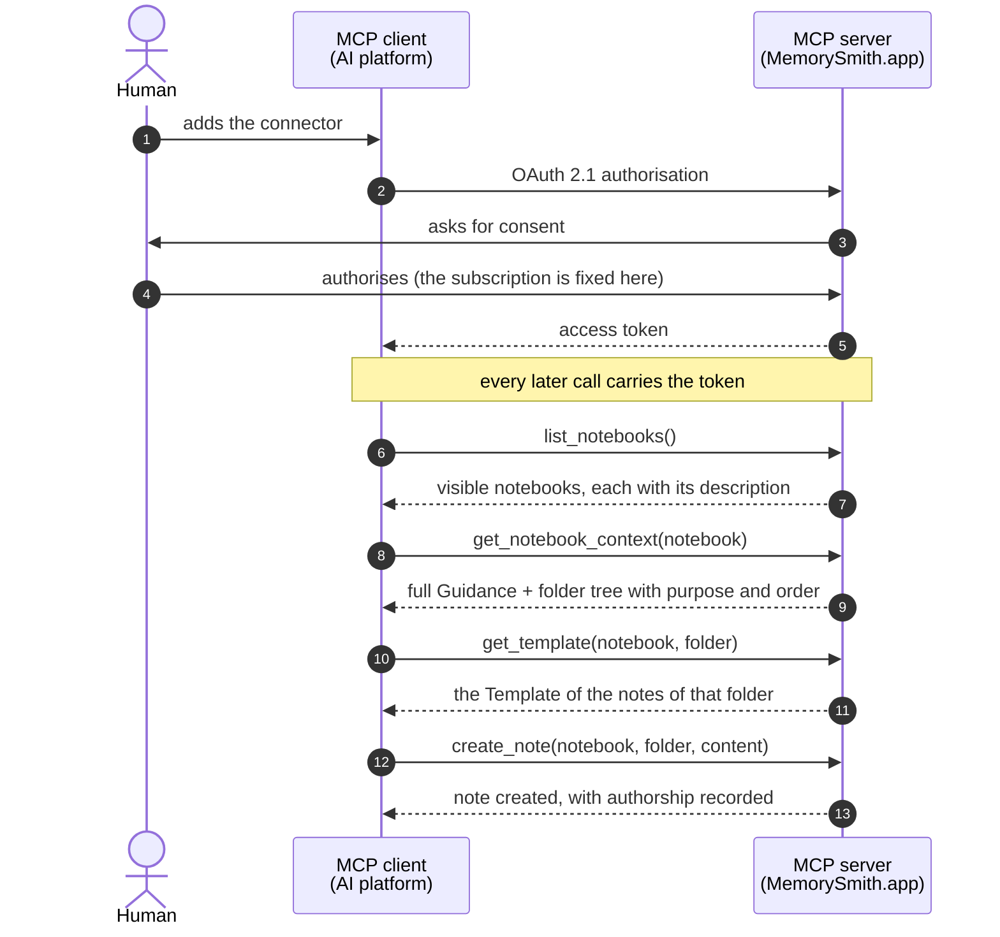

# MemorySmith.app

> **Structured knowledge, natively readable and writable by humans and agents.**

MemorySmith.app hosts knowledge notebooks in **self-describing Markdown** and serves them natively to AI tools through a **remote MCP server**. The agent does not merely read a notebook: it writes in it, obeying the Guidance of the notebook itself and the Template of each folder.

**Two ways to use it, and the same code in both.** The **hosted service** at [memorysmith.app](https://memorysmith.app), whose access is by invitation at this stage, and **installing it in your own AWS account**, documented here from the first command to the first notebook. The project is open under the [MIT](LICENSE) licence, and no capability is held back from the hosted version.

---

## The problem

A team runs a project: an audit, a regulatory process, a piece of research, a construction site, a product launch. Each person does their part alongside an agent, and it is not the same agent for everyone: one works in Claude, another in ChatGPT, a third in the assistant built into the tool they already use. The choice is personal, it changes over time, and there is no reason to make it uniform.

What does not exist is somewhere for that memory to live. It breaks in two directions at once:

- **By time.** The memory of the agent ends when the conversation ends. The next one starts from zero, and somebody describes everything again.
- **By vendor.** What a platform remembers about whoever uses it stays there, and no agent of anyone else reads it.

Added together, they produce as many partial and private memories as there are people multiplied by platforms, about work that is one single thing. The bill arrives as **rework**, because every task starts by redescribing to the agent what the team had already decided; as **divergence**, because two people tell the same fact in two ways and there is nowhere to check which one holds; and as **distrust**, because the answer comes back with no source, checking costs more than accepting, and what is accepted unchecked keeps eroding the value of everything that is stored.

What is missing is a memory shared by people and agents, one that outlives the session and belongs to no platform. The arrangement that comes closest today is a local folder of `.md` files, with a document at the root explaining to the agent how to write in it and a vault editor on top for navigating. It gets the essentials right, the format serves both sides and the structure is declared, but it belongs to one person: the content does not leave the machine, the editor is a poor client for a remote repository, and separating subjects becomes a handful of loose folders that nothing lists.

MemorySmith.app is the remote backend of that same flow. It keeps the format (plain Markdown), keeps the practice (a guidance at the root, a mould per folder) and adds what the local folder never had: authenticated remote access, roles, defensible history and discovery by graph and by search. Against the split by vendor it acts through the protocol, and not by asking everyone to use the same tool: the notebook is served over MCP, which clients from different makers already speak, so each person stays where they prefer to work and all of them reach the same notebook.

The thesis fits in one sentence: **the product is not storing `.md`, it is delivering structured context to the agent without friction.** If reading a hosted notebook takes more work than reading a local folder, the product has lost. That is why MCP here is not an accessory: it is the primary interface, and the internal API exists to serve the web interface.

## The concepts the product structures

```
Notebook
├── Guidance           ← what this notebook is for and how to structure the notes
└── Folders (ordered)  ← each with a description: what is kept here
    ├── Template       ← how the notes of this folder are structured
    ├── subfolders (ordered)
    └── .md notes
```

| Concept | What it is |
| --- | --- |
| **Notebook** | An autonomous notebook. It describes itself in its own content, inherits nothing from another notebook and therefore does not link to one either |
| **Guidance** | The document declaring what this notebook is and how one writes in it. One per notebook |
| **Folder** | A division with a **mandatory description** and a defined position. The description says what belongs there, and the order says where to start |
| **Template** | The mould of the notes of a folder. It guides the writing and does not validate: a note is not required to follow it |
| **Note** | Plain Markdown, with wikilinks. The backend never interprets what is written inside it |
| **Notebook Context** | The full Guidance plus the annotated tree, in a single read. It is what the agent receives before writing anything |
| **Subscription** | The boundary of everything. Every data key starts with it, and it comes from the token, never from the request |

The Guidance and the Template are not documentation: they are **executable instructions**. They are what makes the agent write the right note, in the right folder, in the right shape. A weak Guidance or a vague folder description degrades what comes in, and the effect only shows up later, at the moment of consuming it.

And they are not files. They are **roles**: the notebook points at a document as its Guidance, the folder points at another as its Template. Neither ever has a file name inside the product, and neither gets one on the way out: a notebook leaves as **one document**, where the Guidance is a field of the notebook and the Template a field of the folder that holds it.

## Day to day

The cycle has three moments, and the first is the one usually missing from knowledge tools.

**Ingestion.** You hand the agent a body of material, a published norm, a book, the documentation of a system, a batch of rulings, and ask it to study and record. The agent reads the Notebook Context and finds a folder whose description says, in so many words:

> **Permanent Notes / Concepts**: atomic concepts, independent of the norm that originated them, always with the normative basis cited by provision. "Free Consumer" is a concept; "article 12 says X" is literature.

That sentence is the triage rule, and the agent follows it: the summary of the article goes to the literature folder, the concept the article establishes becomes a note of its own in `Concepts`, in the shape of the Template of that folder, with the wikilinks pointing at what already exists. You typed none of those notes, and they are still exactly in the pattern you agreed on.

**Curation.** Captured material is not knowledge yet. Someone has to read what came in, fix what came out crooked, connect what was left loose and judge what is already mature. It is in the web interface that one reads: the note and the structure as the agent receives them, the `maturity` and the `reviewed` of each note saying which stage it is at, and the Overview and the graph showing how the notebook is distributed. That work is human, assisted by the agent, and it does not come free out of the ingestion.

**Consumption.** Weeks later, another piece of work starts: an opinion, an audit, a report, an incident runbook. The agent enters the same notebook, and instead of rereading five hundred pages of primary source it reads what has already been distilled, in the order the notebook says to read it, following the links between the notes.

What changes in practice:

- **The base grows while you work**, instead of growing only when you stop to organise it.
- **The structure is agreed once.** What guarantees the new note stays in the pattern is the notebook, not your memory nor the agent's.
- **What was written is defensible.** Every revision records who wrote it, when and with which agent, and an opinion issued in March can be demonstrated with the base as it stood in March.
- **Two people can work on it.** The base lives in a subscription with roles, and concurrent writing is detected instead of overwriting in silence. At this stage, whoever adds somebody to the subscription is platform operations.
- **Everyone stays in the tool they prefer.** The notebook is served over MCP, which is an open standard, so any client that speaks the protocol reaches the same notebook, with the same content and under the same role.
- **It comes out whole whenever you want, and it goes back in.** The export is one open, specified JSON document — every note body plain Markdown, byte for byte — zipped as a `.notebook` file, and the product **reads it back**: a backup that restores, a notebook that moves between installations, an account seeded from another. An import always creates a new notebook, so there is nothing to overwrite and nothing to confirm.

## Two interfaces over the same notebook

### The MCP connector, which is the public contract

A **remote MCP server** with OAuth 2.1, added as a native connector in the AI platforms. It is the surface external clients consume, and the one the versioning policy protects.

| Group | Tools |
| --- | --- |
| Who am I | `whoami`, which says who the connection represents, what it reaches and **how one writes here**: the reading order and the whole catalogue |
| Read the notebook | `list_notebooks`, **`get_notebook_context`**, `get_template`, `list_notes`, `read_note` |
| Write content | `create_note`, `update_note` (with conflict detection), `delete_note` |
| Write the structure | `create_notebook`, `delete_notebook`, `set_guidance`, `create_folder`, `delete_folder`, `set_template` |
| Discover | `search_notes`, `related_notes`, `backlinks`, `note_history` |

The central call is **`get_notebook_context`**, which returns the full Guidance plus the tree annotated with the identifier of each folder, its description, the order, the note count and which folders carry a Template. It is the exact equivalent of reading the guidance document and running `ls -R` on the local folder, in a single call. The tree part looks like this:

```
1. Plano `01J2Q4X8V6ZK9M3B7C5D1F0GHT`: Plano de trabalho e auditorias do grafo: o que
   falta ler, o que foi auditado e quando. Registros de curadoria, não de conhecimento
   normativo. (2 notes)
2. Literature/ `01J2Q4X8V6ZK9M3B7C5D1F0GHV`: Fonte normativa: o registro de leitura de
   cada norma, preso ao texto original daquela versão. Nunca é reescrito quando a norma
   muda: a alteração vira nota nova. (0 notes)
   2.1. Normas/ `01J2Q4X8V6ZK9M3B7C5D1F0GHW`: Uma subpasta por norma, com o índice e uma
        nota por título, capítulo ou anexo relevante. (0 notes)
        2.1.2. Lei 14.300-2022 `01J2Q4X8V6ZK9M3B7C5D1F0GHX`: Leitura de
               "Lei 14.300-2022". (8 notes, has TEMPLATE.md)
3. Permanent Notes/ `01J2Q4X8V6ZK9M3B7C5D1F0GHY`: O que a norma diz, decomposto em
   conhecimento permanente. (0 notes)
   3.1. Concepts `01J2Q4X8V6ZK9M3B7C5D1F0GHZ`: Conceitos atômicos, independentes da norma
        que os originou, sempre com a base normativa citada por dispositivo.
        (31 notes, has TEMPLATE.md)
```

The notebook content in that example is in Portuguese because it was written that way: the labels the product emits are always en-US, and the content is whatever language the notebook uses. Notice there is nothing in there the agent has to guess: each line says what the folder holds, in which order it comes, how many notes exist already, whether there is a Template to fetch before writing, and the identifier to pass back when writing there.

`search_notes` does a **literal** search over the text of the notebook, matching by substring and ignoring accents and case. The query accepts several terms, `"exact phrase"`, `-exclusion`, `OR`, parentheses and the fields `name:`, `folder:`, `content:` and `section:`. Any other prefix is read as a frontmatter attribute of the notebook, and that is what makes `maturity:evergreen`, `reviewed:false` or a `norma:federal` your notebook invented a valid filter, without a line of code about it. The vocabulary belongs to the Guidance, and the language of the notebook becomes the query language.

From consent to the first note written, the path is this:



The human authorises the connector once, and it is in that consent that the subscription is tied to the token: no tool takes it as an argument, so the agent has no way of writing in the wrong place. With the token in hand, the agent discovers the notebooks that user sees (`list_notebooks`), reads in a single call the Guidance and the folder structure with the purpose of each one (`get_notebook_context`) and, before writing, fetches the Template of the destination folder (`get_template`). Only then does it create the note (`create_note`): in the right folder, in the right shape, with the authorship of both the human who owns the authorisation and the agent that executed it.

### The web interface, which is where the human reads

The human reading surface, and that is what raises the bar for the note screen and the tree.

| Screen | What it does |
| --- | --- |
| Notebook catalogue | The notebooks of the subscription, with their description, note count and the Overview assembled from the facets each notebook actually declares |
| Notebook Context | The notebook as the agent receives it: the Guidance and the Templates as entry points, and the folder tree with the description of each one |
| Guidance and Templates | Reading of what governs the writing of the notebook and of each folder |
| Note | Reading, with the frontmatter properties and the wikilinks navigable |
| Graph | The link graph of the notebook, coloured by frontmatter attribute and with the tags drawn |
| Search | A single field over the text of the notebook, with the same query language as `search_notes` |
| Export | Downloads the whole notebook as a `.notebook` file: one open JSON document, every note body plain Markdown |
## Why there is a proxy in front of Cognito

This is the risk that nearly killed the thesis, and the reason it was attacked before anything else, back in 0.1.0.

For a remote connector to show up in claude.ai or chatgpt.com, the client has to **register itself** with the authorization server, because whoever clicks "add connector" is the end user and not an administrator of ours. The current MCP specification deprecated dynamic client registration and recommends **CIMD**, Client ID Metadata Documents, where the `client_id` **is** an HTTPS URL serving a JSON document describing the client. Amazon Cognito implements neither.

The way out was to implement CIMD in the agent service itself, which then acts as an **authorisation proxy in front of Cognito**. No new infrastructure component: it is code inside the same Lambda that is already the Resource Server. Cognito keeps issuing every token, and the proxy resolves only client registration.

The mechanism, end to end:

1. **Discovery.** An unauthenticated call to `/mcp` answers `401` with `WWW-Authenticate: Bearer resource_metadata="…/.well-known/oauth-protected-resource"`. In the protected resource document, `authorization_servers` points at the agent service itself, and not at Cognito.
2. **Metadata.** The service serves the RFC 8414 document announcing `client_id_metadata_document_supported: true`, `"none"` in `token_endpoint_auth_methods_supported` and `S256` for PKCE, with the authorisation and token endpoints pointing at the proxy.
3. **Client validation.** On receiving a `client_id` in URL form, the proxy fetches the document and validates it **before** any redirect: HTTPS required, private address blocking on resolution (anti-SSRF), a size and time ceiling on the fetch, an internal `client_id` identical to the URL, and the `redirect_uri` of the request present in the list of the document, with loopback compared without the port, as RFC 8252 requires.
4. **Authorisation.** Once validated, the proxy forwards the browser to Cognito using its single pre-registered app client, preserving the PKCE of the client and correlating the two legs by `state`.
5. **Token.** The proxy exchanges the code with Cognito and returns the JWT **unchanged**. It never issues or modifies a token, and the `subscription_id` and `subscription_status` claims keep entering through the token generation trigger of Cognito itself.

The 0.1.0 spike brought that proxy up in a real AWS environment, validated the connector end to end on a web and a desktop client, and was torn down afterwards. In 0.2.0 it came back as part of the `MemorysmithAgent` stack, and adding MemorySmith.app in claude.ai or chatgpt.com became pasting a URL.

The exit lever is worth recording: the proxy exists because Cognito does not speak CIMD. If one day it does, the protected resource document starts pointing at the Cognito issuer and the proxy leaves with no migration at all, because the CIMD `client_id` is a URL hosted by the client itself and there is no registration state on our side.

---

## Installing it in your AWS account

This is **one of the two paths** of using the product, and not the only one: whoever prefers not to operate infrastructure uses the hosted service, which runs exactly this code. What follows is for whoever wants the whole backend in their own account.

All the infrastructure lives in [`memorysmith-infra/`](memorysmith-infra/), in AWS CDK with TypeScript, and **an environment is delivered by a pipeline inside the account**, never by a sequence of commands typed from a workstation. One app describes two environments, production and staging, which live in one account and are told apart by the name of everything they create ([`docs/architecture-guide.md`](docs/architecture-guide.md) §17 and §20). Staging is optional: an installation that wants only production leaves its entry out.

### What goes up

`bin/app.ts` instantiates these stacks for the environment it is asked for, each named after it — `MemorysmithProductionData`, `MemorysmithStagingData` — and a delivery deploys them in the order of the table:

| Stack | What it creates |
| --- | --- |
| `Network` | A reference to the hosted zone of the environment, the ACM certificates of the site (with `www` as a SAN), `api.`, `mcp.` and `auth.`, all validated by DNS in the zone itself, and the `NS` record delegating the zone of staging, which replaces the one an installation writes by hand before production is first delivered |
| `Frontend` | A private bucket, a CloudFront distribution with Origin Access Control and the apex and `www` records |
| `Data` | The versioned content bucket, the event bus and the four tables, `mv-access`, `mv-knowledge`, `mv-discovery` and `mv-audit`, each named after its environment and all with PITR |
| `Identity` | The Cognito user pool, the pre-token-generation trigger (which injects `subscription_id` and `subscription_status` into the access token), the branded sign-in screen at `auth.<domain>`, the `platform-admin` group and two app clients: the one for the interface and the one for the CIMD proxy |
| `Api` | The main deployable at `api.<domain>` and the outbox relay, with a dead-letter queue and a depth alarm |
| `Projections` | The audit consumer, whose role carries the explicit `Deny` that makes the log immutable, and the Discovery projector behind a queue with a DLQ |
| `Agent` | The MCP server and the CIMD proxy at `mcp.<domain>` |
| `FrontendRelease` | The bundle of the interface and the `/config.json` it reads at runtime: the origin of the API, the sign-in domain, the app client, the environment and the version |
| `Pipeline` | The pipeline of the account, and in staging the project that tears the environment down |

The interface is built once and configured at runtime, so one bundle serves either environment. The order carries one constraint the CDK cannot infer: Cognito accepts the sign-in domain only once the site resolves an A record, so a delivery deploys the network and the hosting, waits for DNS, and only then deploys the rest.

### The domain and the account are yours

The product answers on four names under a domain of your own — `yourdomain.app` for the site, `api.yourdomain.app` for the API, `mcp.yourdomain.app` for the connector and `auth.yourdomain.app` for the sign-in screen — and all of them are born from a public hosted zone in Route 53. Staging answers on the same four names one level down, under `stg.yourdomain.app`, from a zone of its own in the same account.

What differs between the two environments is written once, in [`memorysmith-infra/cdk.json`](memorysmith-infra/cdk.json):

```json
"environments": {
  "production": {
    "account": "111111111111",
    "region": "us-east-1",
    "hostedZoneName": "yourdomain.app",
    "hostedZoneId": "Z0123456ABCDEFGHIJKL",
    "delegations": [
      {
        "recordName": "stg",
        "nameServers": ["ns-1.awsdns-01.org", "ns-2.awsdns-02.co.uk", "ns-3.awsdns-03.com", "ns-4.awsdns-04.net"]
      }
    ],
    "pipeline": {
      "connectionArn": "arn:aws:codeconnections:us-east-1:111111111111:connection/<id>",
      "repository": "your-organization/your-repository",
      "release": { "appId": "<id>", "installationId": "<id>", "privateKeySecret": "memorysmith/release-app" }
    }
  },
  "staging": {
    "account": "111111111111",
    "region": "us-east-1",
    "hostedZoneName": "stg.yourdomain.app",
    "hostedZoneId": "Z9876543ABCDEFGHIJKL",
    "delegations": [],
    "pipeline": {
      "connectionArn": "arn:aws:codeconnections:us-east-1:111111111111:connection/<id>",
      "repository": "your-organization/your-repository"
    }
  }
}
```

**The account is never taken from the credentials.** Named in the environment of every stack, it makes the CDK refuse to deploy into any account but the one written here. Production and staging name the same account, and then the environment named on each command is what tells them apart; [`docs/architecture-guide.md`](docs/architecture-guide.md) §20.1 says what one account costs.

### Prerequisites

1. **Node.js 22 or newer** (`node --version`).
2. **pnpm 11**. If `corepack enable pnpm` fails on a permission error on Windows, install it with:
   ```
   npm install -g pnpm@11.22.0
   ```
3. **An AWS account**, with your domain delegated to a public hosted zone in Route 53 (see [Delegating the domain to Route 53](#delegating-the-domain-to-route-53)). Production and staging both live in it.
4. **AWS CLI v2 and the credentials of the account**, as a named profile (`aws configure sso`, or `aws configure --profile <name>`). A workstation uses them a handful of times — to bring the account up, to start and tear down staging, and for the commands below — and no credential goes into a file of the repository.
5. **A GitHub repository holding this code**, which the account reads through a connection that can only read.

### Delegating the domain to Route 53

The registrar may stay whoever it already is, but whoever answers for DNS has to be a public Route 53 hosted zone. It is the one the `hostedZoneId` of `cdk.json` points at, it is where ACM creates the certificate validation records, and it is where the aliases of the site, the API and the MCP are born. Delegation is done once and involves no domain transfer.

While the name servers are those of the old registrar, the first delivery hangs on the network stack, waiting for a DNS validation that never arrives.

#### 1. Create the hosted zone in AWS

Console → **Route 53** → **Hosted zones** → **Create hosted zone**, with your domain and the type **Public hosted zone**.

Open the created zone and note two things: the **four name servers** of the apex `NS` record (in the form `ns-123.awsdns-45.com`, `ns-678.awsdns-90.net`, `ns-234.awsdns-56.org`, `ns-789.awsdns-01.co.uk`) and the **Hosted zone ID** (in the form `Z0123456ABCDEFGHIJKL`), which goes into `cdk.json`.

Each hosted zone costs US$ 0.50 per month.

#### 2. Point the name servers at the registrar

In the case of Squarespace, which is the registrar of `memorysmith.app`:

1. Sign in at `account.squarespace.com` and open **Domains**.
2. Click the domain.
3. In the domain menu, go to **DNS** and find the **Nameservers** section, which comes marked as Squarespace name servers.
4. Switch to the **custom name servers** option and paste the four from Route 53, one per field, **without the trailing dot**.
5. Save. The warning that the Squarespace DNS records stop applying is the expected effect, because from here on the whole DNS of the domain is served by Route 53.

> If the domain is serving a site or e-mail that has to stay up, recreate the corresponding records in the hosted zone **before** this step. While the switch propagates, both sets of name servers answer, and only the hosted zone knows the new records.

#### 3. Confirm the delegation

```
nslookup -type=NS yourdomain.app 8.8.8.8
```

The delegation is finished when the answer brings the `awsdns` names in place of the old ones. The TTL of the NS records in the `.app` TLD is up to 48 hours, but in practice the switch usually takes effect in minutes or a few hours. Only after that can the certificates be issued.

#### 4. The zone of staging

In the same account, create a public hosted zone for `stg.yourdomain.app`. Its Hosted zone ID goes into the staging entry of `cdk.json`, and its four name servers into the `delegations` of production, which declares the `NS` record in code. **Never delete that zone**: its name servers are drawn when it is created, and a new zone would break the delegation until production is delivered again.

Staging has to run before production is delivered for the first time, because it validates the release that delivers it, so **write that `NS` record by hand once**, in the zone of your domain, with the same four name servers: name `stg`, type `NS`, TTL `172800`. The first delivery of production replaces it with the record declared in code.

### Bringing the account up, once

What follows happens once. From then on the pipelines deliver the account, and update themselves.

1. **Bootstrap the account** for the CDK, with its credentials:
   ```
   pnpm install
   pnpm -C memorysmith-infra exec cdk bootstrap aws://<account>/us-east-1 --profile <profile>
   ```
2. **Connect the account to GitHub.** In the console, **Developer Tools** → **Settings** → **Connections**, create a GitHub connection, authorise it on the repository, and write its ARN in `pipeline.connectionArn` of both environments. Until that ARN is written, the app does not instantiate the pipeline at all.
3. **Create the release App**: a GitHub App of your organization with a single permission, `Contents: write`, installed on the repository. Its private key, in PEM, goes into Secrets Manager of the account under the name `privateKeySecret` gives, and its app id and installation id into `pipeline.release` of production. It is the only credential that writes to GitHub, and all it writes is the tag and the release of a version.
4. **In GitHub, create two rulesets.** On `main`: a pull request is required, and a force push and a deletion are refused, because with production delivering on merge a direct push would reach production. On tags: only the release App creates a `v*` tag, so a version tag means that version is in production.
5. **Deploy the two pipeline stacks**, the only stacks ever deployed by hand:
   ```
   pnpm -C memorysmith-infra exec cdk deploy MemorysmithProductionPipeline -c environment=production --profile <profile>
   pnpm -C memorysmith-infra exec cdk deploy MemorysmithStagingPipeline -c environment=staging --profile <profile>
   ```
   A pipeline runs once on `main` as soon as it is created. While `main` does not carry the pipeline stack yet, that run stops at `SelfUpdate` with `No stacks match`, and deploys nothing.
6. **Ask for room.** A new account usually comes with 10 concurrent Lambda executions, which the product exhausts on its first calls, and production and staging share them, so request the increase. A budget alert costs nothing and says when something runs that should not.

### Production delivers on merge

Every merge to `main` that touches `memorysmith-backend/`, `memorysmith-frontend/`, `memorysmith-infra/`, `pnpm-lock.yaml` or `pnpm-workspace.yaml` starts the production pipeline, and a merge of documentation starts nothing. The pipeline updates itself, checks that the version agrees across `CLAUDE.md`, the manifests and `CHANGELOG.md` and that its tag does not exist yet, runs the quality checks and the tests, delivers, proves with the smoke that every surface serves the version of the packages, and writes the tag and the GitHub Release. **There is no manual approval: the merge is the approval**, and CloudFormation still rolls back a stack whose update fails. The stages are in [`docs/architecture-guide.md`](docs/architecture-guide.md) §20.1.

The first delivery into an empty account is the one that waits: the certificates validate by DNS in the zone, and the sign-in domain is accepted only once the site resolves.

### Staging runs when you ask

```
pnpm staging:start      # with credentials of the account
pnpm staging:status
```

`staging:start` starts the staging pipeline on the pushed head of the current branch, which serves `X.Y.Z-rc.N+sha7` on a `release/vX.Y.Z` branch, and the last run wins. After the smoke, staging runs the adapter tests against its own tables and bucket. `staging:status` says whether the head of the branch ran there, an earlier commit of it did, or nothing of the branch ever did, and a pull request states it. Nothing blocks a merge on it.

Every surface of staging says where it is: the connector tells the agent the environment and the version, the interface shows a banner that cannot be dismissed, and the messages the pool sends start with `[staging]`.

### What a delivery does not do for you

- **Create any account.** The user pool comes up empty, on purpose: no e-mail of a real person stays in the repository and no deployment decides who operates the platform. The one that creates the first account is the onboarding command, just below.
- **The end-to-end OAuth flow**, which needs a browser:
  ```
  npx @modelcontextprotocol/inspector
  ```
  In the Inspector: transport **Streamable HTTP**, URL `https://mcp.<domain>/mcp`, and start the authentication. The flow discovers the authorization server, redirects to the Cognito sign-in, comes back with the token and lists the tools. Calling `whoami` should return who the connection is, what it reaches and how to write in the notebook.
- **Register the connector in the agent clients.** Claude Desktop, Claude Code, claude.ai and chatgpt.com all take the same URL as a remote connector.

## Letting the first users in

A freshly delivered environment has nobody inside: the pool is empty and there is no subscription, because a subscription is requested by a person and authorised by a platform administrator. The onboarding command closes that whole loop, with credentials of the account of the environment, always through the API of the product and never writing into the database by hand:

```
pnpm -C memorysmith-infra onboard --environment production --profile memorysmith
```

It asks what it needs to know and then creates the account in Cognito, requests the subscription with the chosen quota (the subscription has no name: what identifies it is its owner), puts the subscription in the chosen status and writes a whole notebook, with a Guidance, folders, Templates and notes, from one of the [example notebooks](#the-example-notebooks).

**The first account of an empty pool becomes a platform administrator, and only the first.** Somebody has to authorise the first subscription, and in a new environment there is nobody. Once the group has a member, a later run asks for the credentials of an existing administrator instead of handing the platform to whoever runs the command.

**The account is handed over with a temporary password.** Requesting the subscription and writing the notebook happen as the account, so the command has to sign in as it, and it does so with a password of its own that nobody ever sees. At the end it leaves the account waiting for its first password: Cognito sends an invitation by e-mail with a temporary password, and the sign-in screen asks for a password of their own on first access. **That message, and the code sent for a forgotten password, leave from `no-reply@` the domain of the environment, dressed in the brand and written in the language of the account**, which `--locale` sets when the account is created and the person changes by choosing a language in the interface. They go through SES, and **a new AWS account keeps SES in its sandbox**, where a message reaches only an address verified in SES: until the account is granted production access (step 6 of *Bringing the account up*), an invitation to anybody else is not delivered. Whoever runs the command never learns the password of somebody else's account. `--set-password` inverts that, setting a definitive password here and sending no e-mail at all, which is what the first account of a new environment wants: it is the only one that cannot depend on an e-mail arriving.

To look at what one of those notebooks would become, without creating anything and without even talking to AWS:

```
pnpm -C memorysmith-infra onboard --notebook engineering-knowledge --preview
```

| Option | What it is for |
| --- | --- |
| `--environment <name>` | `production` or `staging`; the default is `staging` |
| `--email <address>` | The account to create or reuse. Asked for when not passed |
| `--name <name>` | The display name of the account |
| `--quota 500MB\|1GB\|2GB` | The storage quota |
| `--status <status>` | The final status of the subscription, any of the six, including one the transition machine would refuse |
| `--notebook <slug>` | The notebook from `notebooks/trees` to write, or `none` for an account with no notebook |
| `--notebook-name <name>` | The name of the created notebook; the default is the title of the source notebook |
| `--structure-only` | Writes the Guidance, the folders and the Templates, and no notes |
| `--max-notes <n>` | Stops after `n` notes |
| `--preview` | Only prints what would be written, and creates nothing |
| `--set-password` | Sets a definitive password here instead of handing the account over with a temporary one by e-mail |
| `--locale pt_BR\|en_US` | The language of the account it creates, which every message the product sends it is written in; `pt_BR` when not passed |

Three things the command does that are worth understanding:

- **A status that grants no access is applied last.** Writing the notebook requires a subscription in `trial` or `active`, so the notebook is written with the subscription active and the requested status is applied in the final step, through the administrative route that sets the status without going through the transition machine.
- **A second run finishes what the first started.** An account that never set a password is one nobody holds, so a run interrupted halfway is taken over by the next; an account a person already holds asks for that person's password.
- **The claim is born with the token.** The interface only sees the subscription after a fresh sign-in, so sign out and back in on a browser that was already open.

## The example notebooks

The trees committed in [`notebooks/trees/`](notebooks/trees/) are what the onboarding command writes into the first notebook of a new account. They are a **tree of files, and no longer the export format**: a numeric prefix encodes the order of the folders, `GUIDANCE.md` carries the Guidance at the root, `STRUCTURE.md` next to it the annotated tree with the description of each folder, `TEMPLATE.md` the Template of a folder, and the notes their body byte for byte, wikilinks intact. It is the shape a notebook arrives in from an editor, which is what makes it the right shape for a command that writes one by replaying API calls.

Writing those trees **through the API**, and not straight into DynamoDB and S3, is what makes a freshly created environment have the same domain events and the same audit trail the product would have produced in normal use.

| Notebook | Content | Notes |
| --- | --- | --- |
| `engineering-knowledge` | A software engineering study base: literature, atomic concepts and practices, MOCs and projects | 573 |
| `glpi-discovery` | Discovery of GLPI 11 through reverse engineering and official documentation, with an evidence contract and investigations | 758 |
| `regulacao-energia` | Regulation of the Brazilian electricity sector: norms, concepts, open data sheets and the context graph (indicators, series, insights) | 166 |
| `runbooks-producao` | On-call runbooks: symptom, diagnosis and procedure | 4 |
| `onboarding-engenharia` | What somebody has to read in the first week on a team | 4 |
| `pesquisa-mercado` | Interview notes and research syntheses | 3 |
| `fermentacao` | Fermentation recipes and logs | 3 |
| `jurisprudencia-tributaria` | Rulings recorded with their thesis and grounding | 3 |
| `continuity-engineering` | **A demonstration of the Markdown Specification, in en-US**: recovery objectives, the runbooks that restore them and the exercises that measured them | 4 |
| `enologia` | **A demonstration of the Markdown Specification, in pt-BR**: grape varieties, vinification protocols and the record of each harvest | 4 |

The first three are real notebooks in use, and they show the product at the size where it becomes interesting. The five small ones exist to give the onboarding a few-seconds option, when what is wanted is a live environment and not six hundred notes.

**The last two exist for a different reason.** `continuity-engineering` and `enologia` are the only place the [MemorySmith Markdown Specification](docs/markdown-spec/SPEC.md) can be *read* rather than proved: a conformance suite shows that the notation is implemented, and these show it doing its work — a callout that is drawn, an alias that finds a note by its acronym, an embed that expands to a single identified block, a formula, a checklist that writes back.

They are **not translations of each other**. The same notations carried by different subject matter, so the pair reads as two notebooks and not as one typed twice — and so it can show the thing a single notebook cannot: the reserved keys (`name`, `aliases`, `tags`, `created`, `updated`) are written in en-US in **both**, while everything around them, `regiao` and `tipo` and `colhida_em`, is in the language of whoever keeps the notebook. That is the language decision of the profile shown instead of stated, and the same evidence that the backend does not interpret content (PP4).

They also carry the half of the specification no other notebook will ever show: **the rejections**, each one written where somebody would have reached for it, beside the sentence saying what happens instead. An inline `#tag` that files nothing, a summary in the frontmatter that is discarded, HTML that is not rendered, a subscript that has no notation here.

And, since 0.6.0, the cases that decide what a note is **called**: a `name:` that says one thing while the heading says another, a note that states no `name:` and that no link can reach, a name carrying a `#` that no link can name, two notes under one name where a single link becomes two edges, an alias catching a target no name matched beside the sentence saying a name always wins, and an attachment addressed by its name that appears in no graph.

A test guards them in both directions: every entry of the declared notation appears in each notebook, and neither notebook demonstrates a notation the profile does not declare. Without it they would be the first thing to age when the notation changes, and they would age while teaching the wrong version to precisely the person who is learning.

In the frontmatter, all of them apply the standard vocabulary of the product: `maturity` (`seed`, `growing`, `evergreen`), reassessed on every write, and `reviewed`, which marks whether the current revision has been through human review. It is that vocabulary the Overview and the search by attribute use on the screens.

### How they are generated

The material producing those trees lives in [`notebooks/sources/`](notebooks/sources/):

- `authoring/`: the authored texts per notebook, that is the `guidance.md` that becomes the `GUIDANCE.md` of the root and the `templates/*.md` that become the `TEMPLATE.md` of the folders.
- `fictional/`: the sources of the seven small notebooks, which live in the repository itself.
- `build-notebooks.mjs`: the translator. It reads the source notebooks, applies the folder mapping and generates the output in `notebooks/trees/`.

The three real vaults are **not** part of the repository: they live on the machine of the author, and what is committed is the output. The output is not edited by hand; changes are made in `authoring/` or at the source, followed by a regeneration:

```
node notebooks/sources/build-notebooks.mjs
```

The script validates the product limits (2,000 notes and 200 folders per notebook, depth 6, a folder description between 1 and 500 characters) and reports the warnings at the end. It also **writes the file name of a note into its frontmatter as `name:`** where the source states none, except for the notes a demonstration notebook leaves unnamed on purpose: a note is named by `name:` and by nothing else, and a tree exported from an editor keyed by file name carries that name nowhere inside the file. Two notes under one name are no longer a warning, because nothing in a notebook is a key. Running it without the three real vaults on the machine empties the three corresponding trees, because each output is recreated from zero. If you only want to regenerate the small ones, check `git status` before committing.

## Maintaining an environment

Every number and every graph the product derives owes an answer to how it remakes itself when it is wrong, and two of those answers are jobs an operator runs against the tables of an environment, with credentials of its account:

```
pnpm -C memorysmith-infra recount-storage --environment production
pnpm -C memorysmith-infra reproject-links --environment production
```

`recount-storage` adds up the content each subscription holds and rewrites its storage counter; run it with the accounts idle, because a write that lands during the scan can be counted by it and by the relay. `reproject-links` forgets the link graph of every notebook and resolves every link again, from the notes themselves. Both are the product's own code, both report first and write only with `--apply`, and `reproject-links` exits with `2` when an edge was lost.

## Tearing staging down

```
pnpm staging:destroy      # with credentials of the account
```

It asks for the domain of staging, typed, and starts the project that tears staging down inside the account, because deleting the sign-in domain alone takes over half an hour and a workstation should not have to stay awake for it. The project deletes every stack of staging, in the reverse of a delivery, and then what no removal policy deletes: the four tables, the audit trail included, the content bucket with every version, the user pool and the log groups of functions that are gone. Production lives in the same account, so it deletes only what the stacks of staging list, and its role may delete a user pool only when the pool is tagged `staging`. It leaves the hosted zone and the pipeline, so the next run raises staging from zero. To see what it would delete, and delete nothing:

```
pnpm -C memorysmith-infra destroy-staging --preview
```

**Production has no destroy path.** Its tables, its content bucket and its user pool retain by policy, and nothing in this repository deletes them.

---

## Running it on your machine

The whole monorepo runs locally.

**The full suite**, which is what says whether the implementation stands:

```
pnpm typecheck      # the three projects
pnpm lint
pnpm depcruise      # the dependency rule: it breaks if domain/ imports an AWS SDK
pnpm test           # the domain, use cases, contracts and the vertical slice
```

The adapter tests, including the concurrency criteria (20 simultaneous reorderings, 50 notes created in parallel), run against the real DynamoDB and S3 of staging, in its pipeline after the deploy, and never against an emulator. Every case writes under a subscription of its own. With credentials of the account they run from a workstation too:

```
KNOWLEDGE_TABLE=mv-knowledge-staging ACCESS_TABLE=mv-access-staging CONTENT_BUCKET=<the content bucket> \
  pnpm -r --if-present test:adapters
```

The functional suite runs in the staging pipeline too, after the adapter tests, against the deployed staging. From a workstation it runs only to debug a case, with credentials of the account:

```
pnpm -C memorysmith-infra exec playwright install chromium
FUNCTIONAL_ENVIRONMENT=staging pnpm -C memorysmith-infra functional
```

**The interface.** It reads and writes through the API of the product and has no offline mode, so it needs a live environment to run. It reads where that environment is at runtime, from `/config.json`, and the dev server answers that file from `memorysmith-frontend/config.local.json`, which is untracked. Copy `config.example.json` to it and point it at the environment:

```json
{
  "apiOrigin": "https://api.<domain>",
  "cognitoDomain": "https://auth.<domain>",
  "cognitoClientId": "<the app client of the interface>",
  "environment": "development",
  "version": "0.0.0-local"
}
```

```
pnpm install
pnpm -C memorysmith-frontend dev
```

Without that file the application refuses to start and says which field it is missing. It once had a bundled seed answering in place of the API, and it was removed: a second source answering silently with other data makes the screen look right while showing something else.

## Troubleshooting

| Symptom | Likely cause |
| --- | --- |
| No pipeline appears after deploying the pipeline stack | The environment has no `connectionArn` in `cdk.json`, and without one the app instantiates no pipeline |
| `Need to perform AWS calls for account …, but the current credentials are for …` | The credentials are those of the other account. The CDK refuses it by design: use the profile of the account the environment names |
| The network stack stuck in `CREATE_IN_PROGRESS` on a first delivery | Certificate issuance awaiting DNS validation. Past 30 minutes, check whether the hosted zone of `hostedZoneId` is the one that actually answers for the domain, and, for staging, whether production already delegates it |
| The Deliver stage fails on the sign-in domain | Cognito refuses a custom domain while the site does not resolve an A record. The stage waits for DNS before deploying identity; when propagation outlasts the wait, start the pipeline again |
| `ReleaseChecks` stops the production pipeline | The version disagrees between `CLAUDE.md`, a manifest and `CHANGELOG.md`, or its tag already exists. The stage names each reason |
| `staging:start` answers that the commit is not pushed | The pipeline builds the commit, not the checkout: push it first |
| An intermittent `503 Service Unavailable` on the first calls | A new account usually comes with 10 concurrent Lambda executions. Ask AWS for a quota increase |
| `This CDK CLI is not compatible...` | Some old global `cdk` on the PATH. Run the CLI pinned in the project, `pnpm -C memorysmith-infra exec cdk` |

## How to report a problem, or ask for something

If the table above did not solve it, or if you used the product and it fell short somewhere, open an issue. **You do not need to know what the solution is**, nor describe what should be built: the most useful thing you can tell is what you were trying to do, what happened, and what you expected to happen.

| Situation | Where |
| --- | --- |
| Something cost you dearly, confused you or was missing | [Open a feedback issue](https://github.com/memorysmithapp/memorysmithapp/issues/new?template=01-feedback.yml) |
| You saw data from another account, or something that looks like a security failure | [The private channel](https://github.com/memorysmithapp/memorysmithapp/security/advisories/new), never a public issue. See [`SECURITY.md`](SECURITY.md) |
| A question about installing or using it | [Open a feedback issue](https://github.com/memorysmithapp/memorysmithapp/issues/new?template=01-feedback.yml), marking it as a question |

**This repository is public.** When reporting, do not paste real content from your notes, customer names or business data. Describe the situation with invented examples, or send identifiers (`notebookId`, `noteId`) in place of the text; it works just as well for whoever reads it.

What happens to your issue after it is opened, including how it is triaged and why the answer is sometimes a recorded refusal instead of a delivery, is in [`docs/development-process.md`](docs/development-process.md).

## Where things are

```
core/
├── memorysmith-backend/     # the six bounded contexts, the shared kernel and the event contracts
├── memorysmith-frontend/    # the web interface in React
├── memorysmith-infra/       # all the CDK: stacks, constructs, IAM policies, the pipelines and the commands
├── notebooks/               # the example notebooks, and the sources they are generated from
└── docs/                    # the canonical documentation, and the Markdown specification
```

| Document | What it answers |
| --- | --- |
| [`docs/software-vision.md`](docs/software-vision.md) | What the product does and under which rule: the vision, the ubiquitous language, roles, entities, business rules, the MCP catalogue and the screens |
| [`docs/architecture-guide.md`](docs/architecture-guide.md) | How it is built: tactical DDD, hexagonal, single-table DynamoDB, the outbox, MCP and OAuth, infrastructure and tests |
| [`docs/knowledge-base.md`](docs/knowledge-base.md) | The domain it operates in: Markdown, knowledge management, MCP, retrieval, auditing and data protection law |
| [`docs/markdown-spec/SPEC.md`](docs/markdown-spec/SPEC.md) | The notation a note is written in: what each form means and produces, as prose, as data and as the conformance suite that proves it |
| [`docs/development-process.md`](docs/development-process.md) | How work flows: from the issue of whoever uses it to the merge, with triage, roadmap and what each commit has to touch |
| [`CLAUDE.md`](CLAUDE.md) | The working rules of the repository, including the thirteen non-negotiable design decisions |
| [`SECURITY.md`](SECURITY.md) | How to report an isolation failure or a vulnerability, in private |
| [`CHANGELOG.md`](CHANGELOG.md) | What changed in each version |
| [`LICENSE`](LICENSE) | The MIT licence, which holds for both modes of operation |

## Licence

MIT, in the [`LICENSE`](LICENSE) file. The code is open **as is**, and that is the whole sentence: running it in your own account is a first-class path in this documentation, and it comes with no promise of support, of compatibility between versions, or of upgrade notes. An issue about installing it is welcome. Promising a deadline a project this size cannot honour would be worse than not promising, which is the same criterion as [`SECURITY.md`](SECURITY.md).
