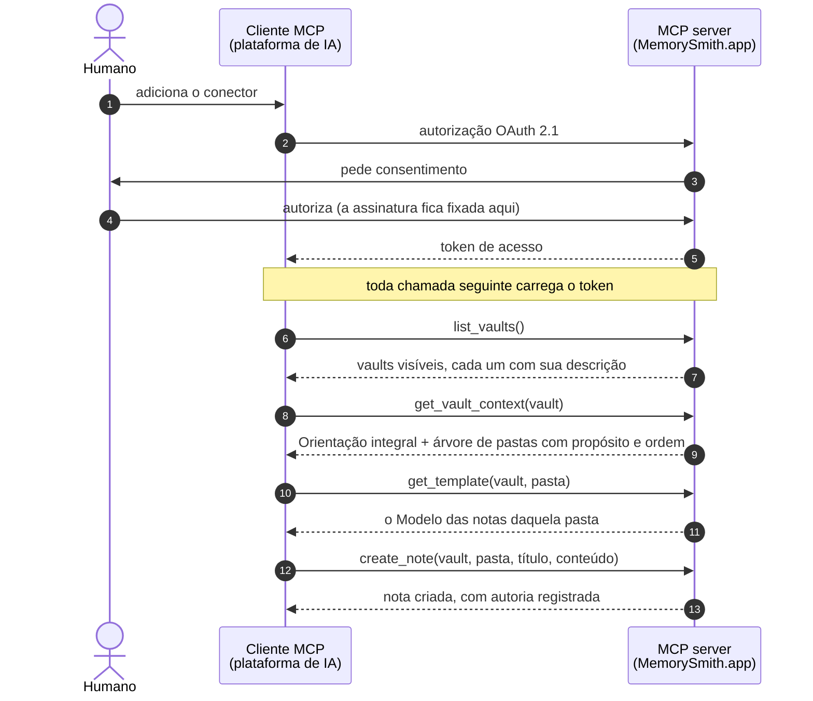

O **MemorySmith.app** auxilia com a manipulação de cofres de conhecimento em **Markdown**, com estrutura declarada, facilitando o acesso nativo pelas ferramentas de IA através de MCP.

O agente não só lê o vault, ele o **alimenta**. Através dele é possível realizar a leitura de uma fonte de informação (livro, norma, curso, etc) e estruturar o conhecimento como notas, obedecendo às orientações do próprio vault. Essa estrutura facilita a leitura do humano e do agente de IA durante a construção de novos trabalhos.

---

## Como um vault é organizado

```
Vault
├── README.md          ← Orientação: para que serve este vault e como estruturar as notas
└── Pastas (ordenadas) ← cada uma com uma descrição: o que se guarda aqui
    ├── TEMPLATE.md    ← Modelo: como as notas desta pasta se estruturam
    ├── subpastas (ordenadas)
    └── notas .md
```

`README.md` e `TEMPLATE.md` não são documentação: são **instruções executáveis**. São o que faz o agente escrever a nota certa, na pasta certa, no formato certo.

E não são nomes de arquivo. São **papéis**: o vault aponta um documento como sua Orientação, a pasta aponta outro como seu Modelo. Os nomes só aparecem na borda, no export e na UI.

## Interface

O contrato público é um **MCP server remoto** (OAuth 2.1), conector nativo para plataformas de IA. A chamada central é `get_vault_context`, que devolve a Orientação integral mais a árvore anotada com descrições e ordem. É o equivalente a ler o README e rodar `ls -R` na pasta local, em uma única chamada.

Sobre isso: grafo de links (árvore de dependências e backlinks), busca semântica, histórico por revisão e uma UI de autoria.

## O fluxo do agente

Do consentimento à primeira nota escrita, o caminho entre o cliente MCP da plataforma de IA e o MemorySmith.app é este:



O humano autoriza o conector uma única vez, e é nesse consentimento que a assinatura fica amarrada ao token: nenhuma tool a recebe como argumento, então o agente não tem como escrever no lugar errado. Com o token em mãos, o agente descobre os vaults que aquele usuário enxerga na assinatura (`list_vaults`), lê em uma única chamada a Orientação do vault e a estrutura de pastas com o propósito de cada uma (`get_vault_context`) e, antes de escrever, busca o Modelo da pasta de destino (`get_template`). Só então cria a nota (`create_note`): na pasta certa, no formato certo, com a autoria registrada, tanto o humano dono da autorização quanto o agente que executou.

---

## Rodando na sua máquina

O monorepo roda inteiro localmente, e há dois modos de olhar para ele.

**O protótipo, sem nada além do repositório.** A interface lê o seed empacotado e navega como se o produto estivesse cheio:

```
pnpm install
pnpm -C memorysmith-frontend dev
```

**A suíte inteira**, que é o que diz se a implementação está de pé:

```
pnpm typecheck      # os três projetos
pnpm lint
pnpm depcruise      # a regra de dependência: quebra se domain/ importar SDK da AWS
pnpm test           # domínio, casos de uso, contratos e a fatia vertical
```

Os testes de adaptador precisam de DynamoDB Local e MinIO, e são eles que verificam os critérios de concorrência (20 reordenações simultâneas, 50 notas criadas em paralelo):

```
docker compose up -d
pnpm -r --if-present test:adapters
docker compose down
```

**A interface contra o backend real.** Copie `memorysmith-frontend/.env.example` para `.env.local` e preencha as três variáveis com o que o deploy imprimiu:

```
VITE_API_ORIGIN=https://api.memorysmith.app
VITE_COGNITO_DOMAIN=https://<prefixo>.auth.us-east-1.amazoncognito.com
VITE_COGNITO_CLIENT_ID=<app client da SPA>
```

Sem `VITE_API_ORIGIN` a aplicação continua lendo o seed, o que é útil para trabalhar na interface sem depender de nuvem nenhuma.

---

## Subindo a infraestrutura na AWS

Toda a infraestrutura vive em [`memorysmith-infra/`](memorysmith-infra/) (AWS CDK em TypeScript); a arquitetura de referência está em [`docs/architecture-guide.md`](docs/architecture-guide.md). O passo a passo abaixo sobe o ambiente atual.

### O que existe hoje

O `bin/app.ts` instancia sete stacks, na dependência abaixo:

| Stack | O que cria |
|---|---|
| `MemorysmithNetwork` | Referência à hosted zone `memorysmith.app` e os certificados ACM de `mcp.`, `api.` e do site (com `www` como SAN), todos validados por DNS na própria zona |
| `MemorysmithIdentity` | User pool do Cognito, trigger de pre-token-generation (injeta `subscription_id` e `subscription_status` no access token), domínio hospedado e o app client único do proxy CIMD |
| `MemorysmithData` | Bucket de conteúdo versionado, o bus `mv-events` e as quatro tabelas: `mv-access`, `mv-knowledge`, `mv-discovery` e `mv-audit`, todas com PITR |
| `MemorysmithApi` | O deployable principal em `api.memorysmith.app` e o relay da outbox, com fila de mensagens mortas e alarme de profundidade |
| `MemorysmithProjections` | O consumidor da auditoria, cujo papel carrega o `Deny` explícito que torna o log imutável, e o projetor do Discovery atrás de fila com DLQ |
| `MemorysmithAgent` | O MCP server e o proxy CIMD em `mcp.memorysmith.app` |
| `MemorysmithFrontend` | Bucket privado, distribuição CloudFront com Origin Access Control e os registros de `memorysmith.app` e `www` |

A ordem de deploy é a da tabela: rede e identidade primeiro, dados em seguida, e o resto depois.

### Pré-requisitos

1. **Node.js 22 ou superior** (`node --version`).
2. **pnpm 11**. Se o `corepack enable pnpm` falhar por permissão no Windows, instale com:
   ```
   npm install -g pnpm@11.22.0
   ```
3. **Conta AWS** com o domínio `memorysmith.app` delegado a uma hosted zone pública no Route 53 (ver [Delegar o domínio do Squarespace para o Route 53](#delegar-o-domínio-do-squarespace-para-o-route-53)).
4. **AWS CLI** (recomendado, usado nos passos de credencial e de senha do usuário de teste):
   ```
   winget install -e --id Amazon.AWSCLI
   ```
5. **Credenciais AWS na máquina**, por um dos caminhos:
   - `aws configure` (access key + secret + região padrão), ou
   - `aws configure sso` para contas com IAM Identity Center, ou
   - arquivo `~/.aws/credentials` criado manualmente com o profile `default`.

   O CDK usa a cadeia padrão de credenciais; nenhuma credencial entra em arquivo do repositório.

A região padrão do app é **`us-east-1`** (definida em `bin/app.ts`). Para usar outra, exporte `CDK_DEFAULT_REGION` antes dos comandos.

### Delegar o domínio do Squarespace para o Route 53

O registro de `memorysmith.app` fica no Squarespace, mas quem responde pelo DNS precisa ser uma hosted zone pública do Route 53. É ela que o `hostedZoneId` do `cdk.json` aponta, é nela que o ACM cria o registro de validação do certificado de `mcp.memorysmith.app` e é nela que nasce o A record alias do HTTP API. A delegação é feita uma única vez, o registrador continua sendo o Squarespace e não há transferência de domínio envolvida.

Enquanto os nameservers forem os do Squarespace (`nsa1..nsa4.squarespacedns.com`), o deploy da `MemorysmithNetwork` fica travado esperando uma validação de DNS que nunca chega.

#### 1. Criar a hosted zone na AWS

Console → **Route 53** → **Hosted zones** → **Create hosted zone**:

| Campo | Valor |
|---|---|
| Domain name | `memorysmith.app` |
| Type | Public hosted zone |

Abra a zona criada e anote duas coisas: os **quatro nameservers** do registro `NS` do apex (no formato `ns-123.awsdns-45.com`, `ns-678.awsdns-90.net`, `ns-234.awsdns-56.org`, `ns-789.awsdns-01.co.uk`) e o **Hosted zone ID** (formato `Z0123456ABCDEFGHIJKL`), que vai para o `cdk.json` no passo 2 do roteiro de deploy.

Cada hosted zone custa US$ 0,50 por mês.

#### 2. Apontar os nameservers no Squarespace

1. Entre em `account.squarespace.com` e abra **Domains**.
2. Clique em `memorysmith.app`.
3. No menu do domínio, vá em **DNS** e localize a seção **Nameservers**, que vem marcada como nameservers do Squarespace.
4. Troque para a opção de **nameservers personalizados** e cole os quatro da Route 53, um por campo, **sem o ponto final**.
5. Salve. O Squarespace avisa que os registros DNS dele deixam de valer e que o site pode ficar inacessível: é o efeito esperado, porque a partir daqui o DNS inteiro do domínio passa a ser servido pela Route 53.

> Se o domínio estiver servindo um site ou e-mail que precisa continuar no ar, recrie os registros correspondentes na hosted zone **antes** deste passo. Enquanto a troca propaga, os dois conjuntos de nameservers respondem, e só a hosted zone conhece os registros novos.

#### 3. Confirmar a delegação

```
nslookup -type=NS memorysmith.app 8.8.8.8
```

A delegação terminou quando a resposta trouxer os nomes `awsdns` no lugar dos `squarespacedns`. O TTL dos registros NS no TLD `.app` é de até 48 horas, mas na prática a troca costuma valer em minutos ou poucas horas. Só depois disso o certificado do passo 5 do roteiro consegue ser emitido.

### Passo a passo

Todos os comandos abaixo rodam dentro de `memorysmith-infra/`.

#### 1. Instalar as dependências

Na raiz do monorepo:

```
pnpm install
```

#### 2. Preencher o contexto em `cdk.json`

Três valores de contexto governam o deploy:

| Chave | O que é | Como obter |
|---|---|---|
| `hostedZoneId` | O ID da hosted zone `memorysmith.app` (formato `Z...`), criada na [delegação do domínio](#delegar-o-domínio-do-squarespace-para-o-route-53) | Console do Route 53, ou `aws route53 list-hosted-zones-by-name --dns-name memorysmith.app --query "HostedZones[0].Id"` |
| `cognitoDomainPrefix` | Prefixo do domínio hospedado do Cognito, único globalmente na região | Manter `memorysmith-auth`; se o deploy acusar colisão, escolher outro |
| `testUserEmail` | E-mail do usuário de teste criado no user pool | O seu |

Edite os valores em `cdk.json` ou passe na linha de comando com `-c hostedZoneId=Z...` (o `-c` vence o arquivo).

**O `hostedZoneId` precisa ser o real antes de qualquer deploy.** O placeholder `Z_PLACEHOLDER_SET_ME` existe só para o `cdk synth` funcionar sem credenciais.

#### 3. Bootstrap do CDK (uma vez por conta e região)

```
pnpm exec cdk bootstrap
```

Cria o bucket de assets e as roles que o CloudFormation usa. Se a conta já tem bootstrap de outro projeto, o comando é idempotente.

#### 4. Validar a síntese

```
pnpm exec cdk synth --quiet
```

Precisa terminar sem erro. É o mesmo passo que o CI executará em todo PR.

#### 5. Deploy

As stacks declaram dependências entre si, então o `--all` resolve a ordem sozinho:

```
pnpm exec cdk deploy --all
```

Ou, uma a uma, na ordem:

```
pnpm exec cdk deploy MemorysmithNetwork
pnpm exec cdk deploy MemorysmithIdentity
pnpm exec cdk deploy MemorysmithData
pnpm exec cdk deploy MemorysmithApi
pnpm exec cdk deploy MemorysmithProjections
pnpm exec cdk deploy MemorysmithAgent
pnpm exec cdk deploy MemorysmithFrontend
```

Notas de primeira execução:

- O certificado ACM valida por DNS na própria hosted zone; a emissão costuma levar de 2 a 10 minutos e o deploy da `MemorysmithNetwork` espera por ela.
- Ao final, a `MemorysmithAgent` imprime os outputs `McpEndpoint` (a URL pública do MCP) e `ApiId`.

#### 6. Publicar a interface

A stack do frontend só copia arquivos quando eles existem, então o build vem antes do deploy dela. Com as três variáveis preenchidas em `memorysmith-frontend/.env.local` (ver [Rodando na sua máquina](#rodando-na-sua-máquina)):

```
pnpm -C memorysmith-frontend build
pnpm exec cdk deploy MemorysmithFrontend
```

Sem as variáveis o build sai apontando para o seed, e a aplicação publicada seria o protótipo em vez do produto.

#### 7. Definir a senha do usuário de teste

O usuário de teste nasce com senha temporária enviada por e-mail. Para fixar uma senha definitiva sem passar pelo fluxo de troca:

```
aws cognito-idp admin-set-user-password --user-pool-id <ID do user pool> --username <e-mail do usuário de teste> --password "<senha forte>" --permanent
```

O ID do user pool aparece no console do Cognito ou em `aws cognito-idp list-user-pools --max-results 10`.

#### 8. Verificar a subida

Checagens rápidas de descoberta (itens 1 e 2 do §13.3 do guia):

```
curl -i https://mcp.memorysmith.app/mcp
```

Deve responder `401` com o header `WWW-Authenticate: Bearer resource_metadata="https://mcp.memorysmith.app/.well-known/oauth-protected-resource"`.

```
curl https://mcp.memorysmith.app/.well-known/oauth-protected-resource
curl https://mcp.memorysmith.app/.well-known/oauth-authorization-server
```

O primeiro deve apontar `authorization_servers` para `https://mcp.memorysmith.app`; o segundo deve anunciar `client_id_metadata_document_supported: true`, PKCE `S256` e nenhum `registration_endpoint`.

#### 9. Testar o fluxo OAuth completo com o MCP Inspector

```
npx @modelcontextprotocol/inspector
```

No Inspector: transporte **Streamable HTTP**, URL `https://mcp.memorysmith.app/mcp`, e iniciar a autenticação. O fluxo deve descobrir o authorization server, redirecionar ao login do Cognito (usuário de teste do passo 6), voltar com o token e listar a tool `whoami`. Chamar `whoami` deve devolver `sub`, `client_id`, `subscription_id` e `subscription_status`.

Em seguida, os dois clientes do critério de pronto da entrega 1:

- **Claude Desktop / Claude Code:** adicionar um conector remoto apontando para `https://mcp.memorysmith.app/mcp`.
- **claude.ai:** Settings → Connectors → Add custom connector, com a mesma URL.

#### 10. Derrubar (quando necessário)

```
pnpm exec cdk destroy --all
```

O user pool e o secret têm política de remoção padrão; confira no console o que ficou retido antes de assumir que a conta está limpa.

### Solução de problemas

| Sintoma | Causa provável |
|---|---|
| `Unable to resolve AWS account to use` | Credenciais ausentes ou expiradas na cadeia padrão |
| `This CDK CLI is not compatible...` | Use o CLI fixado no projeto (`pnpm exec cdk`), não um `cdk` global antigo |
| Deploy da `MemorysmithNetwork` parado em `CREATE_IN_PROGRESS` | Emissão do certificado aguardando a validação DNS; se passar de 30 minutos, confira se a hosted zone do `hostedZoneId` é a que responde pelo domínio |
| `nslookup -type=NS memorysmith.app` ainda responde `squarespacedns.com` | Nameservers não trocados no Squarespace, ou troca ainda propagando (ver [Delegar o domínio do Squarespace para o Route 53](#delegar-o-domínio-do-squarespace-para-o-route-53)) |
| Colisão no domínio do Cognito | Troque `cognitoDomainPrefix` no contexto |
| `401` também nos endpoints `.well-known` | Rota errada ou domínio ainda propagando; os `.well-known` são públicos por desenho |
