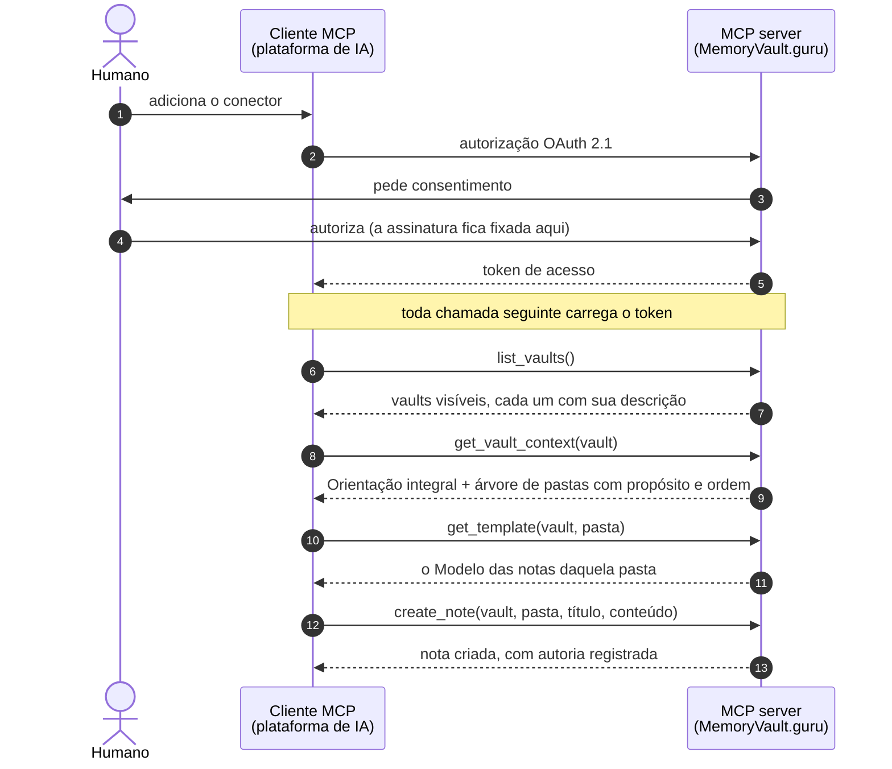

O **MemoryVault.guru** auxilia com a manipulação de cofres de conhecimento em **Markdown**, com estrutura declarada, facilitando o acesso nativo pelas ferramentas de IA através de MCP.

O agente não só lê o vault, ele o **alimenta**. Através dele é possível realizar a leitura de uma fonte de informação (livro, norma, curso, etc) e estruturar o conhecimento como notas, obedecendo às orientações do próprio vault. Essa estrutura facilita a leitura do humano e do agente de IA durante a construção de novos trabalhos.

---

## Como um vault é organizado

```
Vault
├── README.md          ← Orientação: para que serve este vault e como estruturar as notas
└── Pastas (ordenadas) ← cada uma com uma descrição: o que se guarda aqui
    ├── TEMPLATE.md    ← Modelo: como as notas desta pasta se estruturam
    ├── subpastas (ordenadas)
    └── notas .md
```

`README.md` e `TEMPLATE.md` não são documentação: são **instruções executáveis**. São o que faz o agente escrever a nota certa, na pasta certa, no formato certo.

E não são nomes de arquivo. São **papéis**: o vault aponta um documento como sua Orientação, a pasta aponta outro como seu Modelo. Os nomes só aparecem na borda, no export e na UI.

## Interface

O contrato público é um **MCP server remoto** (OAuth 2.1), conector nativo para plataformas de IA. A chamada central é `get_vault_context`, que devolve a Orientação integral mais a árvore anotada com descrições e ordem. É o equivalente a ler o README e rodar `ls -R` na pasta local, em uma única chamada.

Sobre isso: grafo de links (árvore de dependências e backlinks), busca semântica, histórico por revisão e uma UI de autoria.

## O fluxo do agente

Do consentimento à primeira nota escrita, o caminho entre o cliente MCP da plataforma de IA e o MemoryVault.guru é este:



O humano autoriza o conector uma única vez, e é nesse consentimento que a assinatura fica amarrada ao token: nenhuma tool a recebe como argumento, então o agente não tem como escrever no lugar errado. Com o token em mãos, o agente descobre os vaults que aquele usuário enxerga em seus Workspaces (`list_vaults`), lê em uma única chamada a Orientação do vault e a estrutura de pastas com o propósito de cada uma (`get_vault_context`) e, antes de escrever, busca o Modelo da pasta de destino (`get_template`). Só então cria a nota (`create_note`): na pasta certa, no formato certo, com a autoria registrada, tanto o humano dono da autorização quanto o agente que executou.
