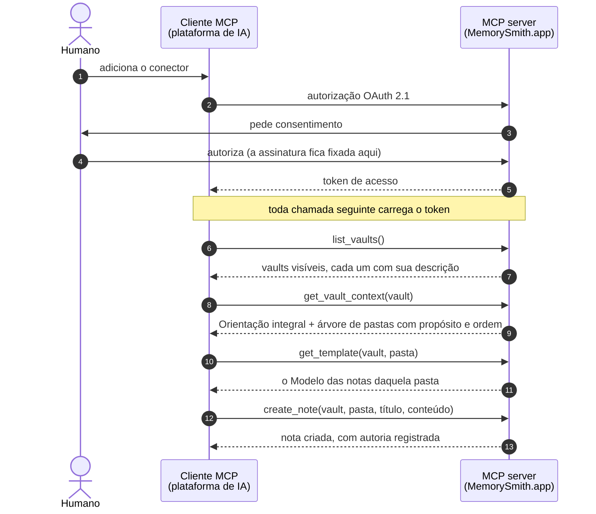

O **MemorySmith.app** auxilia com a manipulação de cofres de conhecimento em **Markdown**, com estrutura declarada, facilitando o acesso nativo pelas ferramentas de IA através de MCP.

O agente não só lê o vault, ele o **alimenta**. Através dele é possível realizar a leitura de uma fonte de informação (livro, norma, curso, etc) e estruturar o conhecimento como notas, obedecendo às orientações do próprio vault. Essa estrutura facilita a leitura do humano e do agente de IA durante a construção de novos trabalhos.

---

## Como um vault é organizado

```
Vault
├── README.md          ← Orientação: para que serve este vault e como estruturar as notas
└── Pastas (ordenadas) ← cada uma com uma descrição: o que se guarda aqui
    ├── TEMPLATE.md    ← Modelo: como as notas desta pasta se estruturam
    ├── subpastas (ordenadas)
    └── notas .md
```

`README.md` e `TEMPLATE.md` não são documentação: são **instruções executáveis**. São o que faz o agente escrever a nota certa, na pasta certa, no formato certo.

E não são nomes de arquivo. São **papéis**: o vault aponta um documento como sua Orientação, a pasta aponta outro como seu Modelo. Os nomes só aparecem na borda, no export e na UI.

## Interface

O contrato público é um **MCP server remoto** (OAuth 2.1), conector nativo para plataformas de IA. A chamada central é `get_vault_context`, que devolve a Orientação integral mais a árvore anotada com descrições e ordem. É o equivalente a ler o README e rodar `ls -R` na pasta local, em uma única chamada.

Sobre isso: grafo de links (árvore de dependências e backlinks), busca semântica, histórico por revisão e uma UI de autoria.

## O fluxo do agente

Do consentimento à primeira nota escrita, o caminho entre o cliente MCP da plataforma de IA e o MemorySmith.app é este:



O humano autoriza o conector uma única vez, e é nesse consentimento que a assinatura fica amarrada ao token: nenhuma tool a recebe como argumento, então o agente não tem como escrever no lugar errado. Com o token em mãos, o agente descobre os vaults que aquele usuário enxerga na assinatura (`list_vaults`), lê em uma única chamada a Orientação do vault e a estrutura de pastas com o propósito de cada uma (`get_vault_context`) e, antes de escrever, busca o Modelo da pasta de destino (`get_template`). Só então cria a nota (`create_note`): na pasta certa, no formato certo, com a autoria registrada, tanto o humano dono da autorização quanto o agente que executou.

---

## Rodando na sua máquina

O monorepo roda inteiro localmente, e há dois modos de olhar para ele.

**O protótipo, sem nada além do repositório.** A interface lê o seed empacotado e navega como se o produto estivesse cheio:

```
pnpm install
pnpm -C memorysmith-frontend dev
```

**A suíte inteira**, que é o que diz se a implementação está de pé:

```
pnpm typecheck      # os três projetos
pnpm lint
pnpm depcruise      # a regra de dependência: quebra se domain/ importar SDK da AWS
pnpm test           # domínio, casos de uso, contratos e a fatia vertical
```

Os testes de adaptador precisam de DynamoDB Local e MinIO, e são eles que verificam os critérios de concorrência (20 reordenações simultâneas, 50 notas criadas em paralelo):

```
docker compose up -d
pnpm -r --if-present test:adapters
docker compose down
```

**A interface contra o backend real.** O `deploy.ps1` escreve esse arquivo sozinho a partir dos outputs das stacks, então na prática ele já existe depois de um deploy. Para preenchê-lo à mão, copie `memorysmith-frontend/.env.example` para `.env.local` e preencha as três variáveis:

```
VITE_API_ORIGIN=https://api.memorysmith.app
VITE_COGNITO_DOMAIN=https://auth.<dominio>
VITE_COGNITO_CLIENT_ID=<app client da SPA>
```

Sem `VITE_API_ORIGIN` a aplicação continua lendo o seed, o que é útil para trabalhar na interface sem depender de nuvem nenhuma.

---

## Subindo a infraestrutura na AWS

Toda a infraestrutura vive em [`memorysmith-infra/`](memorysmith-infra/) (AWS CDK em TypeScript); a arquitetura de referência está em [`docs/architecture-guide.md`](docs/architecture-guide.md). O ambiente sobe e desce por script, em [`deploy-aws/`](deploy-aws/), e não por uma sequência de comandos digitados a partir daqui.

### O que existe hoje

O `bin/app.ts` instancia sete stacks, na dependência abaixo:

| Stack | O que cria |
|---|---|
| `MemorysmithNetwork` | Referência à hosted zone `memorysmith.app` e os certificados ACM de `mcp.`, `api.` e do site (com `www` como SAN), todos validados por DNS na própria zona |
| `MemorysmithIdentity` | User pool do Cognito, trigger de pre-token-generation (injeta `subscription_id` e `subscription_status` no access token), domínio hospedado e o app client único do proxy CIMD |
| `MemorysmithData` | Bucket de conteúdo versionado, o bus `mv-events` e as quatro tabelas: `mv-access`, `mv-knowledge`, `mv-discovery` e `mv-audit`, todas com PITR |
| `MemorysmithApi` | O deployable principal em `api.memorysmith.app` e o relay da outbox, com fila de mensagens mortas e alarme de profundidade |
| `MemorysmithProjections` | O consumidor da auditoria, cujo papel carrega o `Deny` explícito que torna o log imutável, e o projetor do Discovery atrás de fila com DLQ |
| `MemorysmithAgent` | O MCP server e o proxy CIMD em `mcp.memorysmith.app` |
| `MemorysmithFrontend` | Bucket privado, distribuição CloudFront com Origin Access Control e os registros de `memorysmith.app` e `www` |

A ordem de deploy é a da tabela: rede e identidade primeiro, dados em seguida, e o resto depois.

### Pré-requisitos

Você não precisa decorar esta lista: `./deploy-aws/deploy.ps1 -PreflightOnly` confere tudo o que está abaixo e diz o que falta, com o comando que resolve cada caso.

1. **PowerShell 7 ou superior** (`$PSVersionTable.PSVersion`). Os scripts de deploy são escritos para ele, e o Windows PowerShell 5.1 não serve.
2. **Node.js 22 ou superior** (`node --version`).
3. **pnpm 11**. Se o `corepack enable pnpm` falhar por permissão no Windows, instale com:
   ```
   npm install -g pnpm@11.22.0
   ```
4. **Conta AWS** com o domínio `memorysmith.app` delegado a uma hosted zone pública no Route 53 (ver [Delegar o domínio do Squarespace para o Route 53](#delegar-o-domínio-do-squarespace-para-o-route-53)).
5. **AWS CLI v2**, usada pelos scripts para ler outputs, checar recursos e verificar o ambiente:
   ```
   winget install -e --id Amazon.AWSCLI
   ```
6. **Credenciais AWS na máquina**, por um dos caminhos:
   - `aws configure` (access key + secret + região padrão), ou
   - `aws configure sso` para contas com IAM Identity Center, ou
   - arquivo `~/.aws/credentials` criado manualmente.

   O CDK usa a cadeia padrão de credenciais e nenhuma credencial entra em arquivo do repositório. Se as suas estiverem sob um profile nomeado em vez do `default`, passe `-Profile <nome>` aos scripts.

A região padrão do app é **`us-east-1`** (definida em `bin/app.ts`). Para usar outra, passe `-Region <região>` aos scripts.

### Delegar o domínio do Squarespace para o Route 53

O registro de `memorysmith.app` fica no Squarespace, mas quem responde pelo DNS precisa ser uma hosted zone pública do Route 53. É ela que o `hostedZoneId` do `cdk.json` aponta, é nela que o ACM cria o registro de validação do certificado de `mcp.memorysmith.app` e é nela que nasce o A record alias do HTTP API. A delegação é feita uma única vez, o registrador continua sendo o Squarespace e não há transferência de domínio envolvida.

Enquanto os nameservers forem os do Squarespace (`nsa1..nsa4.squarespacedns.com`), o deploy da `MemorysmithNetwork` fica travado esperando uma validação de DNS que nunca chega.

#### 1. Criar a hosted zone na AWS

Console → **Route 53** → **Hosted zones** → **Create hosted zone**:

| Campo | Valor |
|---|---|
| Domain name | `memorysmith.app` |
| Type | Public hosted zone |

Abra a zona criada e anote duas coisas: os **quatro nameservers** do registro `NS` do apex (no formato `ns-123.awsdns-45.com`, `ns-678.awsdns-90.net`, `ns-234.awsdns-56.org`, `ns-789.awsdns-01.co.uk`) e o **Hosted zone ID** (formato `Z0123456ABCDEFGHIJKL`), que vai para o `cdk.json` no passo 2 do roteiro de deploy.

Cada hosted zone custa US$ 0,50 por mês.

#### 2. Apontar os nameservers no Squarespace

1. Entre em `account.squarespace.com` e abra **Domains**.
2. Clique em `memorysmith.app`.
3. No menu do domínio, vá em **DNS** e localize a seção **Nameservers**, que vem marcada como nameservers do Squarespace.
4. Troque para a opção de **nameservers personalizados** e cole os quatro da Route 53, um por campo, **sem o ponto final**.
5. Salve. O Squarespace avisa que os registros DNS dele deixam de valer e que o site pode ficar inacessível: é o efeito esperado, porque a partir daqui o DNS inteiro do domínio passa a ser servido pela Route 53.

> Se o domínio estiver servindo um site ou e-mail que precisa continuar no ar, recrie os registros correspondentes na hosted zone **antes** deste passo. Enquanto a troca propaga, os dois conjuntos de nameservers respondem, e só a hosted zone conhece os registros novos.

#### 3. Confirmar a delegação

```
nslookup -type=NS memorysmith.app 8.8.8.8
```

A delegação terminou quando a resposta trouxer os nomes `awsdns` no lugar dos `squarespacedns`. O TTL dos registros NS no TLD `.app` é de até 48 horas, mas na prática a troca costuma valer em minutos ou poucas horas. Só depois disso o certificado do site consegue ser emitido.

### O deploy é um script

Nada aqui se faz na mão. A pasta [`deploy-aws/`](deploy-aws/) tem dois scripts em PowerShell que executam o ciclo inteiro, e são eles a forma suportada de subir e derrubar o ambiente:

| Script | O que faz |
|---|---|
| `deploy-aws/deploy.ps1` | Confere o ambiente, instala o workspace, faz o bootstrap da região quando falta, sintetiza, sobe as seis stacks de backend, escreve o `.env.local` do frontend a partir dos outputs reais, compila a interface, sobe a stack de hospedagem e verifica por HTTP o que ficou no ar |
| `deploy-aws/destroy.ps1` | Confere o ambiente, lista o que existe de fato na conta, diz o que sobrevive à remoção, pede confirmação digitada, derruba as stacks e termina com o relatório do que ficou para trás |

Os dois começam pelo mesmo preflight, e ele **aponta os gaps antes de qualquer coisa ser tocada na conta**: versão do Node e do pnpm, dependências instaladas, AWS CLI, credencial resolvida (com os profiles disponíveis na máquina quando nenhuma resolve), contexto do `cdk.json`, existência da hosted zone, delegação de NS já apontando para a Route 53, bootstrap do CDK, tabelas órfãs de um destroy anterior, colisão no prefixo do domínio Cognito e stack presa em estado que o CloudFormation não atualiza. Cada gap vem acompanhado da linha de comando que o resolve.

Um gap interrompe a execução; um aviso apenas informa e o script segue.

#### Olhar o ambiente sem mudar nada

```
./deploy-aws/deploy.ps1 -PreflightOnly
```

É o primeiro comando a rodar em uma máquina nova. Ele não toca em recurso nenhum e responde exatamente o que falta para o deploy funcionar.

#### Subir tudo

```
./deploy-aws/deploy.ps1
```

Com um profile nomeado em vez da credencial padrão:

```
./deploy-aws/deploy.ps1 -Profile memorysmith
```

O script é idempotente: quando algo falha no meio, corrija o que o relatório apontou e rode de novo. Notas de primeira execução:

- Os certificados ACM validam por DNS na própria hosted zone. A emissão costuma levar de 2 a 10 minutos, e a `MemorysmithNetwork` espera por ela.
- A interface é compilada **depois** do backend e **antes** da stack de hospedagem, porque ela precisa embutir a origem da API e o app client reais. É a ordem que o CDK não teria como inferir sozinho, e é a razão de o frontend não entrar num `--all`.
- O `.env.local` do frontend é escrito a partir dos outputs do CloudFormation, não da sua memória. Para preservar um arquivo editado à mão, use `-KeepFrontendEnv`.

Ao final, o script imprime conta, região, endereços do site, da API e do MCP, o user pool, o app client da interface e o domínio do Cognito.

#### Opções de `deploy.ps1`

| Opção | Para que serve |
|---|---|
| `-Profile <nome>` | Profile da AWS a usar, em vez da cadeia padrão de credenciais |
| `-Region <região>` | Região de destino; o padrão vem de `CDK_DEFAULT_REGION`, depois do profile, depois `us-east-1` |
| `-Stacks <lista>` | Sobe apenas as stacks indicadas, por exemplo `-Stacks MemorysmithApi,MemorysmithAgent` |
| `-PreflightOnly` | Só o relatório de ambiente |
| `-SkipInstall` | Não roda `pnpm install`, útil em redeploys seguidos |
| `-SkipFrontend` | Sobe só o backend |
| `-SkipSynth`, `-SkipBootstrap`, `-SkipVerify` | Pulam a síntese, o bootstrap e a verificação final |
| `-KeepFrontendEnv` | Não sobrescreve `memorysmith-frontend/.env.local` |
| `-SetTestUserPassword` | Pede uma senha e a define como definitiva para o usuário de teste do pool |
| `-EphemeralData` | Cria os recursos de dado com política de remoção destrutiva, para um ambiente descartável |
| `-IgnoreGaps` | Segue mesmo com gaps abertos, para quando uma checagem está errada sobre a sua máquina |
| `-HostedZoneId`, `-CognitoDomainPrefix`, `-TestUserEmail` | Sobrescrevem o contexto do `cdk.json` só naquela execução |

#### O que o script verifica no fim

Com o ambiente no ar, ele confere quatro coisas, que são as mesmas do §13.3 do guia de arquitetura: o `/health` da API responde, o `/mcp` devolve `401` com o header `WWW-Authenticate` apontando para o documento de metadados, os dois `.well-known` do MCP respondem com o conteúdo esperado, e o site responde `200`. Qualquer uma falhando, o script termina com código de saída diferente de zero e diz qual.

#### O que o deploy não faz por você

- **Senha do usuário de teste.** O usuário nasce com senha temporária. Rode uma vez `./deploy-aws/deploy.ps1 -SetTestUserPassword -Stacks MemorysmithIdentity -SkipInstall`, ou use o `aws cognito-idp admin-set-user-password` na mão.
- **O fluxo OAuth ponta a ponta**, que precisa de navegador:
  ```
  npx @modelcontextprotocol/inspector
  ```
  No Inspector: transporte **Streamable HTTP**, URL `https://mcp.memorysmith.app/mcp`, e iniciar a autenticação. O fluxo descobre o authorization server, redireciona ao login do Cognito, volta com o token e lista as tools. Chamar `whoami` deve devolver `sub`, `client_id`, `subscription_id` e `subscription_status`.
- **Registrar o conector nos clientes de agente**: Claude Desktop, Claude Code e claude.ai recebem a mesma URL como conector remoto.

### Derrubar

```
./deploy-aws/destroy.ps1
```

Antes de apagar qualquer coisa, o script lista as stacks que existem de fato, avisa o que sobrevive e pede que você digite o nome do domínio para confirmar. Para inspecionar sem risco nenhum:

```
./deploy-aws/destroy.ps1 -PreflightOnly
```

**O tear down não destrói dado, por desenho.** As quatro tabelas e o bucket de conteúdo nascem com política de retenção, então sobrevivem à stack, e o user pool também. Isso tem uma consequência prática que o relatório final do script repete: os nomes de tabela são fixos, então uma tabela retida faz o próximo deploy falhar com `AlreadyExists`. Ou você apaga a tabela, ou o preflight do `deploy.ps1` vai barrar a subida.

Para um ambiente descartável, `-PurgeData` primeiro reimplanta a stack de dados com a política destrutiva e só então apaga, porque a política que vale é a do template já implantado. A trilha de auditoria (`mv-audit`) retém em qualquer ambiente: ela é a única coisa que não se reconstrói a partir de nada.

| Opção | Para que serve |
|---|---|
| `-Profile <nome>`, `-Region <região>` | Iguais às do deploy |
| `-Stacks <lista>` | Derruba apenas as stacks indicadas |
| `-PreflightOnly` | Só o relatório: o que existe e o que sobreviveria |
| `-PurgeData` | Apaga também tabelas e bucket de conteúdo, exceto a auditoria. Irreversível |
| `-Force` | Pula a confirmação digitada, para execução não assistida |

### Solução de problemas

| Sintoma | Causa provável |
|---|---|
| Preflight acusa `AWS credentials` mesmo com `~/.aws/credentials` preenchido | As credenciais estão sob um profile nomeado e não sob o `default`. O próprio gap lista os profiles da máquina; rode com `-Profile <nome>` |
| Preflight acusa `DNS delegation` | Os nameservers do registrador ainda não são os da Route 53, ou a troca ainda está propagando (ver [Delegar o domínio do Squarespace para o Route 53](#delegar-o-domínio-do-squarespace-para-o-route-53)). O certificado ACM não é emitido enquanto isso |
| Preflight acusa `Orphan tables` | Um destroy anterior deixou as tabelas retidas. Apague as citadas com `aws dynamodb delete-table --table-name <nome>` antes de subir de novo |
| Preflight acusa `Stack states` | Uma stack ficou em `ROLLBACK_COMPLETE`, estado que o CloudFormation não atualiza. Rode `./deploy-aws/destroy.ps1 -Stacks <nome>` e suba outra vez |
| Deploy da `MemorysmithNetwork` parado em `CREATE_IN_PROGRESS` | Emissão do certificado aguardando a validação DNS. Passando de 30 minutos, confira se a hosted zone do `hostedZoneId` é a que de fato responde pelo domínio |
| Colisão no domínio do Cognito | O prefixo é único por região. Suba com `-CognitoDomainPrefix <outro>` |
| Verificação final falha com `401` também nos `.well-known` | Rota errada ou domínio ainda propagando; os `.well-known` são públicos por desenho |
| `503 Service Unavailable` intermitente nas primeiras chamadas | Conta nova costuma vir com 10 execuções simultâneas de Lambda. Peça aumento de quota à AWS |
| `This CDK CLI is not compatible...` | Algum `cdk` global antigo no PATH. Os scripts sempre usam o CLI fixado no projeto |
