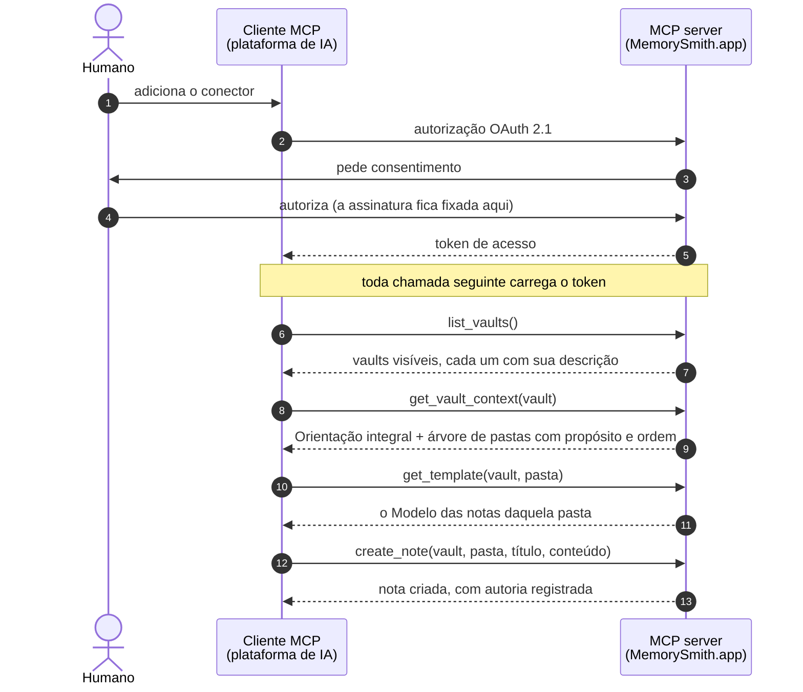

# MemorySmith.app

> **Structured knowledge, natively readable and writable by agents.**

O MemorySmith.app hospeda cofres de conhecimento em **Markdown que se autodescrevem** e os serve nativamente às ferramentas de IA por um **MCP server remoto**. O agente não apenas lê um vault: ele escreve nele, obedecendo à Orientação do próprio vault e ao Modelo de cada pasta.

---

## O problema

Um time toca um projeto: uma auditoria, um processo regulatório, uma pesquisa, uma obra, o lançamento de um produto. Cada pessoa faz a parte dela acompanhada de um agente, e não é o mesmo agente para todo mundo: uma trabalha no Claude, outra no ChatGPT, uma terceira no assistente que já vem embutido na ferramenta que ela usa. A escolha é pessoal, muda com o tempo e não há por que uniformizá-la.

O que não existe é onde essa memória fique. Ela se parte em duas direções ao mesmo tempo:

- **Pelo tempo.** A memória do agente termina quando a conversa termina. A próxima começa do zero, e alguém redescreve tudo de novo.
- **Pelo fornecedor.** O que uma plataforma lembra de quem a usa fica nela, e nenhum agente de mais ninguém lê.

Somadas, elas produzem tantas memórias parciais e privadas quantas forem as pessoas multiplicadas pelas plataformas, sobre um trabalho que é um só. A conta chega como **retrabalho**, porque cada tarefa começa redescrevendo ao agente o que o time já tinha decidido; como **divergência**, porque duas pessoas contam o mesmo fato de dois jeitos e não há onde conferir qual vale; e como **desconfiança**, porque a resposta volta sem a fonte, conferir custa mais do que aceitar, e o que se aceita sem conferir vai corroendo o valor de tudo que está guardado.

Falta uma memória comum às pessoas e aos agentes, que dure além da sessão e não pertença a nenhuma plataforma. O arranjo que mais se aproxima disso hoje é uma pasta local de `.md`, com um documento na raiz explicando ao agente como escrever nela e um editor de vault por cima para navegar. Ele acerta o essencial, o formato serve aos dois lados e a estrutura está declarada, mas é de uma pessoa só: o conteúdo não sai da máquina, o editor é um cliente ruim para um repositório remoto, e separar assuntos vira um punhado de pastas soltas que nada lista.

O MemorySmith.app é o backend remoto desse mesmo fluxo. Mantém o formato (Markdown puro), mantém a prática (uma orientação na raiz, um molde por pasta) e acrescenta o que a pasta local nunca teve: acesso remoto autenticado, papéis, histórico defensável e descoberta por grafo e por busca. Contra a divisão por fornecedor ele age pelo protocolo, e não pedindo que todos usem a mesma ferramenta: o vault é servido por MCP, que clientes de fabricantes diferentes já falam, então cada pessoa continua onde prefere trabalhar e todas alcançam o mesmo vault.

A tese cabe em uma frase: **o produto não é guardar `.md`, é entregar contexto estruturado ao agente sem atrito.** Se ler um vault hospedado der mais trabalho que ler uma pasta local, o produto perdeu. É por isso que o MCP aqui não é acessório: ele é a interface principal, e a API interna existe para servir a interface web.

## Os conceitos que o produto estrutura

```
Vault
├── Orientação         ← para que serve este vault e como estruturar as notas
└── Pastas (ordenadas) ← cada uma com uma descrição: o que se guarda aqui
    ├── Modelo         ← como as notas desta pasta se estruturam
    ├── subpastas (ordenadas)
    └── notas .md
```

| Conceito | O que é |
| --- | --- |
| **Vault** | Um cofre autônomo. Ele se descreve no próprio conteúdo, não herda nada de outro vault e, por isso, também não se liga a outro |
| **Orientação** | O documento que declara o que este vault é e como se escreve nele. Um por vault |
| **Pasta** | Uma divisão com **descrição obrigatória** e posição definida. A descrição diz o que pertence ali, e a ordem diz por onde começar |
| **Modelo** | O molde das notas de uma pasta. Orienta a escrita e não valida: a nota não é obrigada a segui-lo |
| **Nota** | Markdown puro, com wikilinks. O backend nunca interpreta o que está escrito dentro dela |
| **Vault Context** | A Orientação integral mais a árvore anotada, em uma única leitura. É o que o agente recebe antes de escrever qualquer coisa |
| **Assinatura** | A fronteira de tudo. Toda chave de dado começa por ela, e ela vem do token, nunca da requisição |

A Orientação e o Modelo não são documentação: são **instruções executáveis**. São o que faz o agente escrever a nota certa, na pasta certa, no formato certo. Uma Orientação fraca ou uma descrição de pasta vaga degrada o que entra, e o efeito só aparece depois, na hora de consumir.

E não são arquivos. São **papéis**: o vault aponta um documento como sua Orientação, a pasta aponta outro como seu Modelo. Nomes de arquivo só aparecem na borda, quando o vault é exportado: aí a Orientação sai como `GUIDANCE.md`, a árvore de pastas com suas descrições sai como `STRUCTURE.md` ao lado dela, e o Modelo sai como `TEMPLATE.md` dentro da pasta.

## O dia a dia

O ciclo tem três momentos, e o primeiro é o que costuma faltar nas ferramentas de conhecimento.

**Ingestão.** Você entrega ao agente um corpo de material, uma norma publicada, um livro, a documentação de um sistema, um lote de acórdãos, e pede que ele estude e registre. O agente lê o Vault Context e encontra uma pasta cuja descrição diz, com todas as letras:

> **Permanent Notes / Concepts**: conceitos atômicos, independentes da norma que os originou, sempre com a base normativa citada por dispositivo. "Consumidor Livre" é conceito; "o art. 12 diz X" é literatura.

Essa frase é a regra de triagem, e o agente a segue: o resumo do artigo vai para a pasta de literatura, o conceito que o artigo institui vira nota própria em `Concepts`, no formato do Modelo daquela pasta, com os wikilinks apontando para o que já existe. Você não digitou nenhuma dessas notas, e ainda assim elas estão exatamente no padrão que você combinou.

**Curadoria.** Material capturado ainda não é conhecimento. Alguém precisa ler o que entrou, corrigir o que ficou torto, ligar o que ficou solto e julgar o que já está maduro. É na interface web que isso acontece: a nota e a estrutura são editáveis, o `maturity` e o `reviewed` de cada nota dizem em que estágio ela está, e a Visão geral e o grafo mostram como o vault está distribuído. Esse trabalho é humano, assistido pelo agente, e não sai de graça da ingestão.

**Consumo.** Semanas depois, outro trabalho começa: um parecer, uma auditoria, um relatório, um runbook de incidente. O agente entra no mesmo vault, e em vez de reler quinhentas páginas de fonte primária ele lê o que já foi destilado, na ordem em que o vault manda ler, seguindo os links entre as notas.

O que muda na prática:

- **A base cresce enquanto você trabalha**, em vez de crescer só quando você para para organizá-la.
- **A estrutura é combinada uma vez.** Quem garante que a nota nova continua no padrão é o vault, não a sua memória nem a do agente.
- **O que foi escrito é defensável.** Cada revisão registra quem escreveu, quando e com qual agente, e um parecer emitido em março pode ser demonstrado com a base como ela estava em março.
- **Dá para trabalhar em dois.** A base vive em uma assinatura com papéis, e a escrita concorrente é detectada em vez de sobrescrever em silêncio.
- **Cada um continua na ferramenta que prefere.** O vault é servido por MCP, que é padrão aberto, então qualquer cliente que fale o protocolo alcança o mesmo vault, com o mesmo conteúdo e sob o mesmo papel.
- **Sai inteira quando você quiser.** O export devolve `.md` puros em uma árvore legível, sem formato proprietário.

## Duas interfaces sobre o mesmo vault

### O conector MCP, que é o contrato público

Um **MCP server remoto** com OAuth 2.1, adicionado como conector nativo nas plataformas de IA. É a superfície que os clientes externos consomem, e a que a política de versionamento protege.

| Grupo | Tools |
| --- | --- |
| Quem sou eu | `whoami`, que diz quem a conexão representa, o que ela alcança e **como se escreve aqui**: a ordem de leitura e o catálogo inteiro |
| Ler o vault | `list_vaults`, **`get_vault_context`**, `get_template`, `list_notes`, `read_note` |
| Escrever conteúdo | `create_note`, `update_note` (com detecção de conflito), `delete_note` |
| Escrever a estrutura | `create_vault`, `delete_vault`, `set_guidance`, `create_folder`, `delete_folder`, `set_template` |
| Descobrir | `search_notes`, `related_notes`, `backlinks`, `note_history` |

A chamada central é **`get_vault_context`**, que devolve a Orientação integral mais a árvore anotada com descrição, ordem, contagem de notas e quais pastas têm Modelo. É o equivalente exato a ler o documento de orientação e rodar `ls -R` na pasta local, em uma única chamada. A parte da árvore se parece com isto:

```
1. Plano: Plano de trabalho e auditorias do grafo: o que falta ler, o que foi
   auditado e quando. Registros de curadoria, não de conhecimento normativo. (2 notes)
2. Literature/: Fonte normativa: o registro de leitura de cada norma, preso ao texto
   original daquela versão. Nunca é reescrito quando a norma muda: a alteração vira
   nota nova. (0 notes)
   2.1. Normas/: Uma subpasta por norma, com o índice e uma nota por título, capítulo
        ou anexo relevante. (0 notes)
        2.1.2. Lei 14.300-2022: Leitura de "Lei 14.300-2022". (8 notes, has TEMPLATE.md)
3. Permanent Notes/: O que a norma diz, decomposto em conhecimento permanente. (0 notes)
   3.1. Concepts: Conceitos atômicos, independentes da norma que os originou, sempre com
        a base normativa citada por dispositivo. (31 notes, has TEMPLATE.md)
```

Repare que não há nada aí que o agente precise adivinhar: cada linha diz o que a pasta guarda, em que ordem ela vem, quantas notas já existem e se há um Modelo a buscar antes de escrever.

`search_notes` faz busca **literal** no texto do vault, casando por trecho e ignorando acento e caixa. A consulta aceita vários termos, `"frase exata"`, `-exclusão`, `OR`, parênteses e os campos `title:`, `folder:`, `content:` e `section:`. Qualquer outro prefixo é lido como atributo do frontmatter do vault, e é isso que torna `maturity:evergreen`, `reviewed:false` ou um `norma:federal` que o seu vault inventou um filtro válido, sem uma linha de código a respeito. O vocabulário pertence à Orientação, e a linguagem do vault vira a linguagem de consulta.

Do consentimento à primeira nota escrita, o caminho é este:



O humano autoriza o conector uma única vez, e é nesse consentimento que a assinatura fica amarrada ao token: nenhuma tool a recebe como argumento, então o agente não tem como escrever no lugar errado. Com o token em mãos, o agente descobre os vaults que aquele usuário enxerga (`list_vaults`), lê em uma única chamada a Orientação e a estrutura de pastas com o propósito de cada uma (`get_vault_context`) e, antes de escrever, busca o Modelo da pasta de destino (`get_template`). Só então cria a nota (`create_note`): na pasta certa, no formato certo, com a autoria registrada tanto do humano dono da autorização quanto do agente que executou.

### A interface web, que é onde o humano lê

A superfície de leitura humana. Ela é uma ferramenta de leitura antes de ser uma ferramenta de edição, e é isso que levanta a régua da tela de nota e da árvore.

| Tela | O que faz |
| --- | --- |
| Catálogo de vaults | Os vaults da assinatura, com descrição, contagem de notas e a Visão geral montada a partir das facetas que cada vault de fato declara |
| Contexto do Vault | O vault como o agente o recebe: a Orientação e os Modelos como pontos de entrada, e a árvore de pastas com a descrição de cada uma |
| Orientação e Modelos | Edição do que governa a escrita do vault e de cada pasta |
| Nota | Leitura e edição, com o histórico por revisão |
| Grafo | O grafo de links do vault, colorido por atributo do frontmatter e com as tags desenhadas |
| Busca | Campo único sobre o texto do vault, com a mesma linguagem de consulta do `search_notes` |
| Exportar | Baixa o vault inteiro como `.zip`, na árvore de arquivos legível |

## Por que existe um proxy na frente do Cognito

Este é o risco que quase matou a tese, e a razão de ele ter sido atacado antes de qualquer outra coisa, ainda na 0.1.0.

Para um conector remoto aparecer no claude.ai ou no chatgpt.com, o cliente precisa **se registrar sozinho** no authorization server, porque quem clica em "adicionar conector" é o usuário final e não um administrador nosso. A especificação atual do MCP depreciou o registro dinâmico de cliente e recomenda **CIMD**, Client ID Metadata Documents, em que o `client_id` **é** uma URL HTTPS que serve um JSON descrevendo o cliente. O Amazon Cognito não implementa nenhum dos dois.

A saída foi implementar CIMD no próprio serviço de agente, que passa a atuar como **proxy de autorização na frente do Cognito**. Nenhum componente novo de infraestrutura: é código dentro do mesmo Lambda que já é o Resource Server. O Cognito continua emitindo todos os tokens, e o proxy resolve apenas o registro do cliente.

O mecanismo, ponta a ponta:

1. **Descoberta.** Uma chamada não autenticada ao `/mcp` devolve `401` com `WWW-Authenticate: Bearer resource_metadata="…/.well-known/oauth-protected-resource"`. No documento de recurso protegido, `authorization_servers` aponta para o próprio serviço de agente, e não para o Cognito.
2. **Metadados.** O serviço serve o documento RFC 8414 anunciando `client_id_metadata_document_supported: true`, `"none"` em `token_endpoint_auth_methods_supported` e `S256` em PKCE, com os endpoints de autorização e de token apontando para o proxy.
3. **Validação do cliente.** Ao receber um `client_id` em forma de URL, o proxy busca o documento e o valida **antes** de qualquer redirecionamento: HTTPS obrigatório, bloqueio de endereço privado na resolução (anti-SSRF), teto de tamanho e de tempo na busca, `client_id` interno idêntico à URL, e `redirect_uri` da requisição presente na lista do documento, com loopback comparado sem a porta, como manda a RFC 8252.
4. **Autorização.** Validado, o proxy encaminha o navegador ao Cognito usando o único app client pré-registrado dele, preservando o PKCE do cliente e correlacionando as duas pernas por `state`.
5. **Token.** O proxy troca o código com o Cognito e devolve o JWT **inalterado**. Ele jamais emite ou modifica token, e as claims `subscription_id` e `subscription_status` continuam entrando pelo trigger de geração de token do próprio Cognito.

O spike da 0.1.0 subiu esse proxy em ambiente real na AWS, validou o conector ponta a ponta em cliente web e desktop e foi desmontado em seguida. Na 0.2.0 ele voltou como parte da stack `MemorysmithAgent`, e adicionar o MemorySmith.app no claude.ai ou no chatgpt.com passou a ser colar uma URL.

Vale registrar a alavanca de saída: o proxy existe porque o Cognito não fala CIMD. Se um dia falar, o documento de recurso protegido passa a apontar para o issuer do Cognito e o proxy sai sem migração nenhuma, porque o `client_id` CIMD é uma URL hospedada pelo próprio cliente e não existe estado de registro do nosso lado.

---

## Instalar na sua conta AWS

Toda a infraestrutura vive em [`memorysmith-infra/`](memorysmith-infra/), em AWS CDK com TypeScript, e o ambiente **sobe e desce por script**, em [`deploy-aws/`](deploy-aws/), nunca por uma sequência de comandos digitados a partir daqui.

### O que sobe

O `bin/app.ts` instancia sete stacks, nesta dependência:

| Stack | O que cria |
| --- | --- |
| `MemorysmithNetwork` | Referência à hosted zone do seu domínio e os certificados ACM de `mcp.`, `api.` e do site (com `www` como SAN), todos validados por DNS na própria zona |
| `MemorysmithIdentity` | User pool do Cognito, trigger de pre-token-generation (injeta `subscription_id` e `subscription_status` no access token), a tela de entrada com a marca em `auth.<domínio>`, o grupo `platform-admin` e dois app clients: o da interface e o do proxy CIMD |
| `MemorysmithData` | Bucket de conteúdo versionado, o bus `mv-events` e as quatro tabelas: `mv-access`, `mv-knowledge`, `mv-discovery` e `mv-audit`, todas com PITR |
| `MemorysmithApi` | O deployable principal em `api.<domínio>` e o relay da outbox, com fila de mensagens mortas e alarme de profundidade |
| `MemorysmithProjections` | O consumidor da auditoria, cujo papel carrega o `Deny` explícito que torna o log imutável, e o projetor do Discovery atrás de fila com DLQ |
| `MemorysmithAgent` | O MCP server e o proxy CIMD em `mcp.<domínio>` |
| `MemorysmithFrontend` | Bucket privado, distribuição CloudFront com Origin Access Control e os registros do apex e de `www` |

A ordem de deploy é a da tabela: rede e identidade primeiro, dados em seguida, e o resto depois.

### O domínio é seu

O produto atende em quatro nomes sob um domínio próprio, e todos nascem de uma hosted zone pública no Route 53. Antes do primeiro deploy, ajuste o contexto em [`memorysmith-infra/cdk.json`](memorysmith-infra/cdk.json):

```json
"hostedZoneName": "seudominio.app",
"hostedZoneId": "Z0123456ABCDEFGHIJKL",
"cognitoDomainPrefix": "algum-prefixo-unico"
```

Daí saem `seudominio.app` para o site, `api.seudominio.app` para a API, `mcp.seudominio.app` para o conector e `auth.seudominio.app` para a tela de entrada. O prefixo do Cognito é único por região, então escolha um que ninguém tenha usado.

### Pré-requisitos

Você não precisa decorar esta lista: `./deploy-aws/deploy.ps1 -PreflightOnly` confere tudo o que está abaixo e diz o que falta, com o comando que resolve cada caso.

1. **PowerShell 7 ou superior** (`$PSVersionTable.PSVersion`). Os scripts são escritos para ele, e o Windows PowerShell 5.1 não serve.
2. **Node.js 22 ou superior** (`node --version`).
3. **pnpm 11**. Se o `corepack enable pnpm` falhar por permissão no Windows, instale com:
   ```
   npm install -g pnpm@11.22.0
   ```
4. **Conta AWS** com o seu domínio delegado a uma hosted zone pública no Route 53 (ver [Delegar o domínio para o Route 53](#delegar-o-domínio-para-o-route-53)).
5. **AWS CLI v2**, usada pelos scripts para ler outputs, checar recursos e verificar o ambiente:
   ```
   winget install -e --id Amazon.AWSCLI
   ```
6. **Credenciais AWS na máquina**, por um dos caminhos:
   - `aws configure` (access key, secret e região padrão), ou
   - `aws configure sso` para contas com IAM Identity Center, ou
   - arquivo `~/.aws/credentials` criado manualmente.

   O CDK usa a cadeia padrão de credenciais e nenhuma credencial entra em arquivo do repositório. Se as suas estiverem sob um profile nomeado em vez do `default`, passe `-Profile <nome>` aos scripts.

A região padrão do app é **`us-east-1`** (definida em `bin/app.ts`). Para usar outra, passe `-Region <região>` aos scripts.

### Delegar o domínio para o Route 53

O registrador pode continuar sendo quem já é, mas quem responde pelo DNS precisa ser uma hosted zone pública do Route 53. É ela que o `hostedZoneId` do `cdk.json` aponta, é nela que o ACM cria os registros de validação dos certificados e é nela que nascem os aliases do site, da API e do MCP. A delegação é feita uma única vez e não envolve transferência de domínio.

Enquanto os nameservers forem os do registrador antigo, o deploy da `MemorysmithNetwork` fica travado esperando uma validação de DNS que nunca chega.

#### 1. Criar a hosted zone na AWS

Console → **Route 53** → **Hosted zones** → **Create hosted zone**, com o seu domínio e o tipo **Public hosted zone**.

Abra a zona criada e anote duas coisas: os **quatro nameservers** do registro `NS` do apex (no formato `ns-123.awsdns-45.com`, `ns-678.awsdns-90.net`, `ns-234.awsdns-56.org`, `ns-789.awsdns-01.co.uk`) e o **Hosted zone ID** (formato `Z0123456ABCDEFGHIJKL`), que vai para o `cdk.json`.

Cada hosted zone custa US$ 0,50 por mês.

#### 2. Apontar os nameservers no registrador

No caso do Squarespace, que é o registrador de `memorysmith.app`:

1. Entre em `account.squarespace.com` e abra **Domains**.
2. Clique no domínio.
3. No menu do domínio, vá em **DNS** e localize a seção **Nameservers**, que vem marcada como nameservers do Squarespace.
4. Troque para a opção de **nameservers personalizados** e cole os quatro da Route 53, um por campo, **sem o ponto final**.
5. Salve. O aviso de que os registros DNS do Squarespace deixam de valer é o efeito esperado, porque a partir daqui o DNS inteiro do domínio passa a ser servido pela Route 53.

> Se o domínio estiver servindo um site ou e-mail que precisa continuar no ar, recrie os registros correspondentes na hosted zone **antes** deste passo. Enquanto a troca propaga, os dois conjuntos de nameservers respondem, e só a hosted zone conhece os registros novos.

#### 3. Confirmar a delegação

```
nslookup -type=NS seudominio.app 8.8.8.8
```

A delegação terminou quando a resposta trouxer os nomes `awsdns` no lugar dos antigos. O TTL dos registros NS no TLD `.app` é de até 48 horas, mas na prática a troca costuma valer em minutos ou poucas horas. Só depois disso os certificados conseguem ser emitidos.

### O deploy é um script

Nada aqui se faz na mão. A pasta [`deploy-aws/`](deploy-aws/) tem dois scripts em PowerShell que executam o ciclo inteiro, e são eles a forma suportada de subir e derrubar o ambiente:

| Script | O que faz |
| --- | --- |
| `deploy-aws/deploy.ps1` | Confere o ambiente, instala o workspace, faz o bootstrap da região quando falta, sintetiza, sobe as seis stacks de backend, escreve o `.env.local` do frontend a partir dos outputs reais, compila a interface, sobe a stack de hospedagem e verifica por HTTP o que ficou no ar |
| `deploy-aws/destroy.ps1` | Confere o ambiente, lista o que existe de fato na conta, diz o que sobrevive à remoção, pede confirmação digitada, derruba as stacks e termina com o relatório do que ficou para trás |

Os dois começam pelo mesmo preflight, e ele **aponta os gaps antes de qualquer coisa ser tocada na conta**: versão do Node e do pnpm, dependências instaladas, AWS CLI, credencial resolvida (com os profiles disponíveis na máquina quando nenhuma resolve), contexto do `cdk.json`, existência da hosted zone, delegação de NS já apontando para a Route 53, bootstrap do CDK, tabelas órfãs de um destroy anterior, colisão no prefixo do domínio Cognito e stack presa em estado que o CloudFormation não atualiza. Cada gap vem acompanhado da linha de comando que o resolve.

Um gap interrompe a execução; um aviso apenas informa e o script segue.

#### Olhar o ambiente sem mudar nada

```
./deploy-aws/deploy.ps1 -PreflightOnly
```

É o primeiro comando a rodar em uma máquina nova. Ele não toca em recurso nenhum e responde exatamente o que falta para o deploy funcionar.

#### Subir tudo

```
./deploy-aws/deploy.ps1
```

Com um profile nomeado em vez da credencial padrão:

```
./deploy-aws/deploy.ps1 -Profile memorysmith
```

O script é idempotente: quando algo falha no meio, corrija o que o relatório apontou e rode de novo. Notas de primeira execução:

- Os certificados ACM validam por DNS na própria hosted zone. A emissão costuma levar de 2 a 10 minutos, e a `MemorysmithNetwork` espera por ela.
- Em uma conta onde nada existe, a hospedagem sobe **antes** da identidade. O Cognito recusa um domínio próprio enquanto o apex não responde um registro A, e é a stack de frontend que cria esse registro. Um ambiente que já está no ar não muda de ordem.
- A interface é compilada **depois** do backend e **antes** da stack de hospedagem, porque ela precisa embutir a origem da API e o app client reais. É a ordem que o CDK não teria como inferir sozinho, e é a razão de o frontend não entrar num `--all`.
- O `.env.local` do frontend é escrito a partir dos outputs do CloudFormation, não da sua memória. Para preservar um arquivo editado à mão, use `-KeepFrontendEnv`.

Ao final, o script imprime conta, região, endereços do site, da API e do MCP, o user pool, o app client da interface e o domínio do Cognito.

#### Opções de `deploy.ps1`

| Opção | Para que serve |
| --- | --- |
| `-Profile <nome>` | Profile da AWS a usar, em vez da cadeia padrão de credenciais |
| `-Region <região>` | Região de destino; o padrão vem de `CDK_DEFAULT_REGION`, depois do profile, depois `us-east-1` |
| `-Stacks <lista>` | Sobe apenas as stacks indicadas, por exemplo `-Stacks MemorysmithApi,MemorysmithAgent` |
| `-PreflightOnly` | Só o relatório de ambiente |
| `-SkipInstall` | Não roda `pnpm install`, útil em redeploys seguidos |
| `-SkipFrontend` | Sobe só o backend |
| `-SkipSynth`, `-SkipBootstrap`, `-SkipVerify` | Pulam a síntese, o bootstrap e a verificação final |
| `-KeepFrontendEnv` | Não sobrescreve `memorysmith-frontend/.env.local` |
| `-EphemeralData` | Cria os recursos de dado com política de remoção destrutiva, para um ambiente descartável |
| `-IgnoreGaps` | Segue mesmo com gaps abertos, para quando uma checagem está errada sobre a sua máquina |
| `-HostedZoneId`, `-CognitoDomainPrefix` | Sobrescrevem o contexto do `cdk.json` só naquela execução |

#### O que o script verifica no fim

Com o ambiente no ar, ele confere quatro coisas: o `/health` da API responde, o `/mcp` devolve `401` com o header `WWW-Authenticate` apontando para o documento de metadados, os dois `.well-known` do MCP respondem com o conteúdo esperado, e o site responde `200`. Qualquer uma falhando, o script termina com código de saída diferente de zero e diz qual.

#### O que o deploy não faz por você

- **Criar conta nenhuma.** O user pool sobe vazio, de propósito: nenhum e-mail de pessoa real fica no repositório e nenhum deploy decide quem opera a plataforma. Quem cria a primeira conta é o `onboard.ps1` logo abaixo.
- **O fluxo OAuth ponta a ponta**, que precisa de navegador:
  ```
  npx @modelcontextprotocol/inspector
  ```
  No Inspector: transporte **Streamable HTTP**, URL `https://mcp.<domínio>/mcp`, e iniciar a autenticação. O fluxo descobre o authorization server, redireciona ao login do Cognito, volta com o token e lista as tools. Chamar `whoami` deve devolver quem é a conexão, o que ela alcança e como escrever no vault.
- **Registrar o conector nos clientes de agente.** Claude Desktop, Claude Code, claude.ai e chatgpt.com recebem a mesma URL como conector remoto.

## Liberar os primeiros usuários

Um ambiente recém-subido não tem ninguém dentro: o pool é vazio e não existe assinatura, porque assinatura é solicitada por uma pessoa e autorizada por um administrador de plataforma. O `onboard.ps1` fecha esse laço inteiro, sempre pela API do produto e nunca escrevendo no banco à mão:

```
./deploy-aws/onboard.ps1 -Profile memorysmith
```

Ele pergunta o que precisa saber e então cria a conta no Cognito, solicita a assinatura com o tipo e a quota escolhidos (a assinatura não tem nome: quem a identifica é o titular), coloca a assinatura no status escolhido e escreve um vault inteiro, com Orientação, pastas, Modelos e notas, a partir de um dos [vaults de exemplo](#os-vaults-de-exemplo).

**A primeira conta de um pool vazio vira administradora de plataforma, e só a primeira.** Alguém precisa autorizar a primeira assinatura, e em um ambiente novo não há ninguém. Depois que o grupo tem um membro, uma execução seguinte pede as credenciais de um administrador existente em vez de entregar a plataforma a quem rodar o script.

**A conta é entregue com senha provisória.** Solicitar a assinatura e escrever o vault acontecem como a conta, então o script precisa entrar como ela, e entra com uma senha própria que ninguém chega a ver. No fim ele deixa a conta esperando a primeira senha: o Cognito envia por e-mail um convite com uma senha provisória, e a tela de entrada pede uma senha própria no primeiro acesso. Quem roda o script nunca fica sabendo a senha da conta de outra pessoa. `-SetPassword` inverte isso, definindo aqui uma senha definitiva e não enviando e-mail nenhum, que é o que a primeira conta de um ambiente novo quer: ela é a única que não pode depender de um e-mail chegar.

Para olhar o que um desses vaults viraria, sem criar nada e sem sequer falar com a AWS:

```
./deploy-aws/onboard.ps1 -VaultTemplate engineering-knowledge -PreviewVault
```

| Opção | Para que serve |
| --- | --- |
| `-Email <endereço>` | A conta a criar ou reusar. Perguntado quando não é passado |
| `-Name <nome>` | Nome de exibição da conta |
| `-Type individual` | Tipo da assinatura; `individual` é o único desta fase |
| `-Quota 500MB\|1GB\|2GB` | Quota de armazenamento, declarada e ainda não aplicada |
| `-Status <status>` | Status final da assinatura, qualquer um dos seis, inclusive um que a máquina de transição recusaria |
| `-VaultTemplate <slug>` | Vault de `deploy-aws/vaults` a escrever, ou `none` para uma conta sem vault |
| `-VaultName <nome>` | Nome do vault criado; o padrão é o título do vault de origem |
| `-StructureOnly` | Escreve Orientação, pastas e Modelos, e nenhuma nota |
| `-MaxNotes <n>` | Para depois de `n` notas |
| `-PreviewVault` | Só imprime o que seria escrito, e não cria nada |
| `-SetPassword` | Define aqui uma senha definitiva em vez de entregar a conta com senha provisória por e-mail |

Duas coisas que o script faz e vale entender:

- **Um status que não concede acesso é aplicado no fim.** Escrever o vault exige uma assinatura em `trial` ou `active`, então o vault é escrito com a assinatura ativa e o status pedido é aplicado no último passo, pela rota administrativa que define status sem passar pela máquina de transição.
- **A claim nasce junto com o token.** A interface só enxerga a assinatura depois de um login novo, então saia e entre de novo em um navegador que já estava aberto.

## Os vaults de exemplo

As árvores commitadas em [`deploy-aws/vaults/`](deploy-aws/vaults/) são o que o `onboard.ps1` escreve no primeiro vault de uma conta nova. Elas estão no **formato de export do produto**: prefixo numérico codifica a ordem das pastas, `GUIDANCE.md` faz o papel de Orientação na raiz, `STRUCTURE.md` ao lado dele carrega a árvore anotada com a descrição de cada pasta, `TEMPLATE.md` faz o papel de Modelo da pasta, e as notas trazem o corpo byte a byte, com os wikilinks intactos.

Escrever essas árvores **pela API**, e não direto no DynamoDB e no S3, é o que faz um ambiente recém-criado ter os mesmos eventos de domínio e a mesma trilha de auditoria que o produto teria produzido no uso normal.

| Vault | Conteúdo | Notas |
| --- | --- | --- |
| `engineering-knowledge` | Base de estudo de engenharia de software: literatura, conceitos e práticas atômicas, MOCs e projetos | 573 |
| `glpi-discovery` | Descoberta do GLPI 11 por engenharia reversa e documentação oficial, com contrato de evidência e investigações | 758 |
| `regulacao-energia` | Regulação do setor elétrico brasileiro: normas, conceitos, fichas de dados abertos e o grafo de contexto (indicadores, séries, insights) | 166 |
| `runbooks-producao` | Runbooks de plantão: sintoma, diagnóstico e procedimento | 4 |
| `onboarding-engenharia` | O que alguém precisa ler na primeira semana de um time | 4 |
| `pesquisa-mercado` | Notas de entrevista e sínteses de pesquisa | 3 |
| `fermentacao` | Receitas e registros de fermentação | 3 |
| `jurisprudencia-tributaria` | Acórdãos fichados com tese e fundamento | 3 |

Os três primeiros são vaults reais em uso, e mostram o produto no tamanho em que ele fica interessante. Os cinco pequenos existem para dar ao onboard uma opção de poucos segundos, quando o que se quer é um ambiente de pé e não seiscentas notas.

No frontmatter, todos aplicam o vocabulário padrão do produto: `maturity` (`seed`, `growing`, `evergreen`), reavaliado a cada escrita, e `reviewed`, que marca se a revisão vigente passou por revisão humana. É esse vocabulário que a Visão geral e a busca por atributo usam nas telas.

### Como eles são gerados

O material que produz essas árvores fica em [`deploy-aws/vault-sources/`](deploy-aws/vault-sources/):

- `authoring/`: os textos autorais por vault, ou seja o `guidance.md` que vira o `GUIDANCE.md` da raiz e os `templates/*.md` que viram os `TEMPLATE.md` das pastas.
- `fictional/`: as fontes dos cinco vaults pequenos, que vivem no próprio repositório.
- `build-vaults.mjs`: o tradutor. Lê os vaults de origem, aplica o mapeamento de pastas e gera a saída em `deploy-aws/vaults/`.

Os três vaults reais **não** fazem parte do repositório: eles vivem na máquina do autor, e o que está commitado é a saída. A saída não se edita à mão; alterações se fazem em `authoring/` ou na origem, seguidas de regeração:

```
node deploy-aws/vault-sources/build-vaults.mjs
```

O script valida os limites do produto (2.000 notas e 200 pastas por vault, profundidade 6, descrição de pasta entre 1 e 500 caracteres), detecta colisão de slug de nota dentro do vault e reporta os avisos ao final. Rodar sem os três vaults reais na máquina esvazia as três árvores correspondentes, porque cada saída é recriada do zero. Se você só quer regerar os pequenos, confira o `git status` antes de commitar.

## Derrubar o ambiente

```
./deploy-aws/destroy.ps1
```

Antes de apagar qualquer coisa, o script lista as stacks que existem de fato, avisa o que sobrevive e pede que você digite o nome do domínio para confirmar. Para inspecionar sem risco nenhum:

```
./deploy-aws/destroy.ps1 -PreflightOnly
```

**O tear down não destrói dado, por desenho.** As quatro tabelas e o bucket de conteúdo nascem com política de retenção, então sobrevivem à stack, e o user pool também. Isso tem uma consequência prática que o relatório final do script repete: os nomes de tabela são fixos, então uma tabela retida faz o próximo deploy falhar com `AlreadyExists`. Ou você apaga a tabela, ou o preflight do `deploy.ps1` vai barrar a subida.

**`-PurgeData` não deixa nada.** Ele reimplanta a stack de dados com a política destrutiva antes de apagar, porque a política que vale é a do template já implantado, e depois remove à mão o que política de remoção nenhuma removeria: a trilha de auditoria (`mv-audit`), o user pool com seu prefixo de domínio e qualquer bucket que uma exclusão malsucedida tenha deixado para trás. Essa segunda parte fica no script, e não na infraestrutura, de propósito: apagar a trilha é ato administrativo explícito, pedido na linha de comando, e nunca efeito colateral de um deploy com a flag errada.

**Derrubar leva tempo, e o script pode ser interrompido sem prejuízo.** Apagar o domínio do Cognito desprovisiona uma distribuição do CloudFront por baixo dos panos, e essa única exclusão passa da meia hora com facilidade. Matar o script não cancela nada: o CloudFormation continua sozinho. Rodar o script de novo entra na operação já em andamento em vez de disparar outra, e segue de onde parou. Por isso o `cdk destroy` reaproveita a síntese que já está em `cdk.out`: uma exclusão é por nome de stack, e recompilar as seis funções para apagá-las seria só espera.

| Opção | Para que serve |
| --- | --- |
| `-Profile <nome>`, `-Region <região>` | Iguais às do deploy |
| `-Stacks <lista>` | Derruba apenas as stacks indicadas |
| `-PreflightOnly` | Só o relatório: o que existe e o que sobreviveria |
| `-PurgeData` | Não deixa nada: tabelas (auditoria inclusive), bucket de conteúdo e user pool com o prefixo de domínio. Irreversível |
| `-Force` | Pula a confirmação digitada, para execução não assistida |

---

## Rodando na sua máquina

O monorepo roda inteiro localmente.

**A suíte inteira**, que é o que diz se a implementação está de pé:

```
pnpm typecheck      # os três projetos
pnpm lint
pnpm depcruise      # a regra de dependência: quebra se domain/ importar SDK da AWS
pnpm test           # domínio, casos de uso, contratos e a fatia vertical
```

Os testes de adaptador precisam de DynamoDB Local e MinIO, e são eles que verificam os critérios de concorrência (20 reordenações simultâneas, 50 notas criadas em paralelo):

```
docker compose up -d --wait
pnpm -r --if-present test:adapters
docker compose down
```

A integração contínua sobe esses dois containers a partir deste mesmo `docker-compose.yml`, com as imagens fixadas em uma versão exata. Uma suíte verde aqui quer dizer uma suíte verde lá.

**A interface.** Ela lê e escreve pela API do produto e não tem modo offline, então precisa de um ambiente de pé para rodar. O `deploy.ps1` escreve o `.env.local` sozinho a partir dos outputs das stacks, então na prática ele já existe depois de um deploy. Para preenchê-lo à mão, copie `memorysmith-frontend/.env.example` para `.env.local` e preencha as três variáveis:

```
VITE_API_ORIGIN=https://api.<domínio>
VITE_COGNITO_DOMAIN=https://auth.<domínio>
VITE_COGNITO_CLIENT_ID=<app client da interface>
```

```
pnpm install
pnpm -C memorysmith-frontend dev
```

Sem `VITE_API_ORIGIN` a aplicação recusa subir e diz o porquê. Ela já teve um seed empacotado que respondia no lugar da API, e ele foi removido: uma segunda fonte que responde em silêncio com outros dados faz a tela parecer certa enquanto mostra outra coisa.

## Solução de problemas

| Sintoma | Causa provável |
| --- | --- |
| Preflight acusa `AWS credentials` mesmo com `~/.aws/credentials` preenchido | As credenciais estão sob um profile nomeado e não sob o `default`. O próprio gap lista os profiles da máquina; rode com `-Profile <nome>` |
| Preflight acusa `DNS delegation` | Os nameservers do registrador ainda não são os da Route 53, ou a troca ainda está propagando (ver [Delegar o domínio para o Route 53](#delegar-o-domínio-para-o-route-53)). O certificado ACM não é emitido enquanto isso |
| Preflight acusa `Orphan tables` | Um destroy anterior deixou as tabelas retidas. Apague as citadas com `aws dynamodb delete-table --table-name <nome>` antes de subir de novo |
| Preflight acusa `Stack states` | Ou uma stack ficou em `ROLLBACK_COMPLETE`, estado que o CloudFormation não atualiza, e aí `./deploy-aws/destroy.ps1 -Stacks <nome>` resolve; ou há uma operação em andamento, e aí é esperar. Um destroy que apaga o domínio do Cognito passa da meia hora |
| Deploy da `MemorysmithNetwork` parado em `CREATE_IN_PROGRESS` | Emissão do certificado aguardando a validação DNS. Passando de 30 minutos, confira se a hosted zone do `hostedZoneId` é a que de fato responde pelo domínio |
| Colisão no domínio do Cognito | O prefixo é único por região. Suba com `-CognitoDomainPrefix <outro>` |
| Verificação final falha com `401` também nos `.well-known` | Rota errada ou domínio ainda propagando; os `.well-known` são públicos por desenho |
| `503 Service Unavailable` intermitente nas primeiras chamadas | Conta nova costuma vir com 10 execuções simultâneas de Lambda. Peça aumento de quota à AWS |
| `This CDK CLI is not compatible...` | Algum `cdk` global antigo no PATH. Os scripts sempre usam o CLI fixado no projeto |

## Como reportar um problema, ou pedir alguma coisa

Se a tabela acima não resolveu, ou se você usou o produto e ele deixou a desejar em algum ponto, abra uma issue. **Não é preciso saber qual é a solução**, e nem descrever o que deveria ser construído: o mais útil que você pode contar é o que estava tentando fazer, o que aconteceu, e o que esperava que acontecesse.

| Situação | Onde |
| --- | --- |
| Alguma coisa custou caro, confundiu ou faltou | [Abrir uma issue de feedback](https://github.com/memorysmithapp/memorysmithapp/issues/new?template=01-feedback.yml) |
| Você viu dado de outra conta, ou algo que pareça falha de segurança | [Canal privado](https://github.com/memorysmithapp/memorysmithapp/security/advisories/new), nunca uma issue pública. Ver [`SECURITY.md`](SECURITY.md) |
| Dúvida sobre instalação ou uso | [Abrir uma issue de feedback](https://github.com/memorysmithapp/memorysmithapp/issues/new?template=01-feedback.yml), marcando que é dúvida |

**Este repositório é público.** Ao reportar, não cole conteúdo real das suas notas, nomes de cliente ou dados de negócio. Descreva a situação com exemplos inventados, ou mande identificadores (`vaultId`, `noteId`) no lugar do texto; funciona igual para quem vai ler.

O que acontece com a sua issue depois de aberta, incluindo como ela é triada e por que às vezes a resposta é uma recusa registrada em vez de uma entrega, está em [`docs/development-process.md`](docs/development-process.md).

## Onde está o quê

```
core/
├── memorysmith-backend/     # os seis bounded contexts, o shared kernel e os contratos de evento
├── memorysmith-frontend/    # a interface web em React
├── memorysmith-infra/       # todo o CDK: stacks, constructs, políticas de IAM
├── deploy-aws/              # os scripts de deploy, destroy e onboard, e os vaults de exemplo
└── docs/                    # a documentação canônica
```

| Documento | O que responde |
| --- | --- |
| [`docs/software-vision.md`](docs/software-vision.md) | O que o produto faz e sob qual regra: visão, linguagem ubíqua, papéis, entidades, regras de negócio, catálogo MCP e telas |
| [`docs/architecture-guide.md`](docs/architecture-guide.md) | Como ele é construído: DDD tático, hexagonal, single-table no DynamoDB, outbox, MCP e OAuth, infraestrutura e testes |
| [`docs/knowledge-base.md`](docs/knowledge-base.md) | O domínio em que ele opera: Markdown, gestão de conhecimento, MCP, recuperação, auditoria e LGPD |
| [`docs/development-process.md`](docs/development-process.md) | Como o trabalho flui: da issue de quem usa até o merge, com triagem, roadmap e o que cada commit precisa tocar |
| [`CLAUDE.md`](CLAUDE.md) | As regras de trabalho do repositório, incluindo as treze decisões de desenho inegociáveis |
| [`SECURITY.md`](SECURITY.md) | Como reportar uma falha de isolamento ou vulnerabilidade, em privado |
| [`CHANGELOG.md`](CHANGELOG.md) | O que mudou em cada versão |
