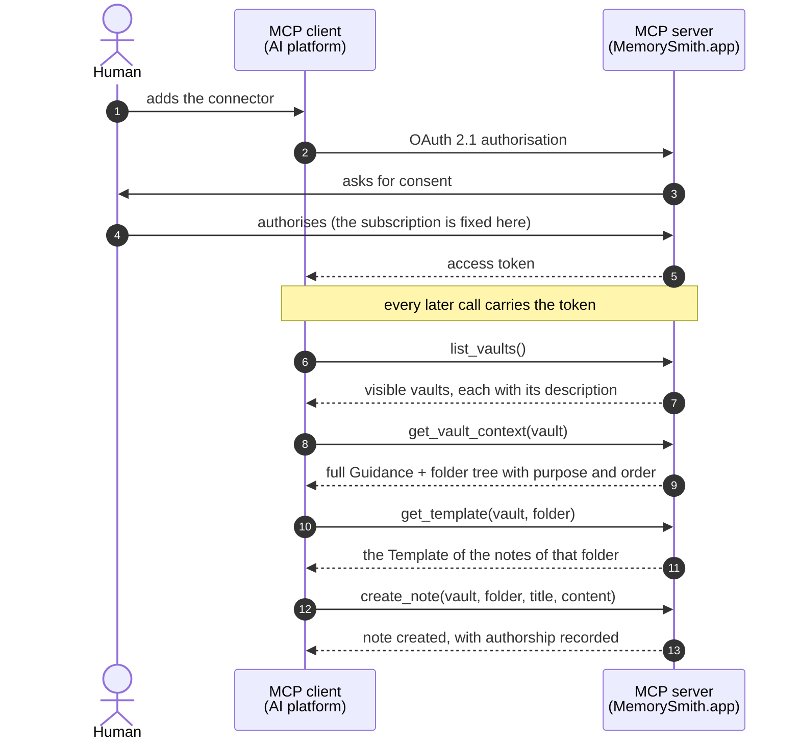

# MemorySmith.app

> **Structured knowledge, natively readable and writable by humans and agents.**

MemorySmith.app hosts knowledge vaults in **self-describing Markdown** and serves them natively to AI tools through a **remote MCP server**. The agent does not merely read a vault: it writes in it, obeying the Guidance of the vault itself and the Template of each folder.

**Two ways to use it, and the same code in both.** The **hosted service** at [memorysmith.app](https://memorysmith.app), whose access is by invitation at this stage, and **installing it in your own AWS account**, documented here from the first command to the first vault. The project is open under the [MIT](LICENSE) licence, and no capability is held back from the hosted version.

---

## The problem

A team runs a project: an audit, a regulatory process, a piece of research, a construction site, a product launch. Each person does their part alongside an agent, and it is not the same agent for everyone: one works in Claude, another in ChatGPT, a third in the assistant built into the tool they already use. The choice is personal, it changes over time, and there is no reason to make it uniform.

What does not exist is somewhere for that memory to live. It breaks in two directions at once:

- **By time.** The memory of the agent ends when the conversation ends. The next one starts from zero, and somebody describes everything again.
- **By vendor.** What a platform remembers about whoever uses it stays there, and no agent of anyone else reads it.

Added together, they produce as many partial and private memories as there are people multiplied by platforms, about work that is one single thing. The bill arrives as **rework**, because every task starts by redescribing to the agent what the team had already decided; as **divergence**, because two people tell the same fact in two ways and there is nowhere to check which one holds; and as **distrust**, because the answer comes back with no source, checking costs more than accepting, and what is accepted unchecked keeps eroding the value of everything that is stored.

What is missing is a memory shared by people and agents, one that outlives the session and belongs to no platform. The arrangement that comes closest today is a local folder of `.md` files, with a document at the root explaining to the agent how to write in it and a vault editor on top for navigating. It gets the essentials right, the format serves both sides and the structure is declared, but it belongs to one person: the content does not leave the machine, the editor is a poor client for a remote repository, and separating subjects becomes a handful of loose folders that nothing lists.

MemorySmith.app is the remote backend of that same flow. It keeps the format (plain Markdown), keeps the practice (a guidance at the root, a mould per folder) and adds what the local folder never had: authenticated remote access, roles, defensible history and discovery by graph and by search. Against the split by vendor it acts through the protocol, and not by asking everyone to use the same tool: the vault is served over MCP, which clients from different makers already speak, so each person stays where they prefer to work and all of them reach the same vault.

The thesis fits in one sentence: **the product is not storing `.md`, it is delivering structured context to the agent without friction.** If reading a hosted vault takes more work than reading a local folder, the product has lost. That is why MCP here is not an accessory: it is the primary interface, and the internal API exists to serve the web interface.

## The concepts the product structures

```
Vault
├── Guidance           ← what this vault is for and how to structure the notes
└── Folders (ordered)  ← each with a description: what is kept here
    ├── Template       ← how the notes of this folder are structured
    ├── subfolders (ordered)
    └── .md notes
```

| Concept | What it is |
| --- | --- |
| **Vault** | An autonomous vault. It describes itself in its own content, inherits nothing from another vault and therefore does not link to one either |
| **Guidance** | The document declaring what this vault is and how one writes in it. One per vault |
| **Folder** | A division with a **mandatory description** and a defined position. The description says what belongs there, and the order says where to start |
| **Template** | The mould of the notes of a folder. It guides the writing and does not validate: a note is not required to follow it |
| **Note** | Plain Markdown, with wikilinks. The backend never interprets what is written inside it |
| **Vault Context** | The full Guidance plus the annotated tree, in a single read. It is what the agent receives before writing anything |
| **Subscription** | The boundary of everything. Every data key starts with it, and it comes from the token, never from the request |

The Guidance and the Template are not documentation: they are **executable instructions**. They are what makes the agent write the right note, in the right folder, in the right shape. A weak Guidance or a vague folder description degrades what comes in, and the effect only shows up later, at the moment of consuming it.

And they are not files. They are **roles**: the vault points at a document as its Guidance, the folder points at another as its Template. File names only appear at the edge, when the vault is exported: there the Guidance comes out as `GUIDANCE.md`, the folder tree with its descriptions comes out as `STRUCTURE.md` next to it, and the Template comes out as `TEMPLATE.md` inside the folder.

## Day to day

The cycle has three moments, and the first is the one usually missing from knowledge tools.

**Ingestion.** You hand the agent a body of material, a published norm, a book, the documentation of a system, a batch of rulings, and ask it to study and record. The agent reads the Vault Context and finds a folder whose description says, in so many words:

> **Permanent Notes / Concepts**: atomic concepts, independent of the norm that originated them, always with the normative basis cited by provision. "Free Consumer" is a concept; "article 12 says X" is literature.

That sentence is the triage rule, and the agent follows it: the summary of the article goes to the literature folder, the concept the article establishes becomes a note of its own in `Concepts`, in the shape of the Template of that folder, with the wikilinks pointing at what already exists. You typed none of those notes, and they are still exactly in the pattern you agreed on.

**Curation.** Captured material is not knowledge yet. Someone has to read what came in, fix what came out crooked, connect what was left loose and judge what is already mature. It is in the web interface that one reads: the note and the structure as the agent receives them, the `maturity` and the `reviewed` of each note saying which stage it is at, and the Overview and the graph showing how the vault is distributed. That work is human, assisted by the agent, and it does not come free out of the ingestion.

**Consumption.** Weeks later, another piece of work starts: an opinion, an audit, a report, an incident runbook. The agent enters the same vault, and instead of rereading five hundred pages of primary source it reads what has already been distilled, in the order the vault says to read it, following the links between the notes.

What changes in practice:

- **The base grows while you work**, instead of growing only when you stop to organise it.
- **The structure is agreed once.** What guarantees the new note stays in the pattern is the vault, not your memory nor the agent's.
- **What was written is defensible.** Every revision records who wrote it, when and with which agent, and an opinion issued in March can be demonstrated with the base as it stood in March.
- **Two people can work on it.** The base lives in a subscription with roles, and concurrent writing is detected instead of overwriting in silence. At this stage, whoever adds somebody to the subscription is platform operations.
- **Everyone stays in the tool they prefer.** The vault is served over MCP, which is an open standard, so any client that speaks the protocol reaches the same vault, with the same content and under the same role.
- **It comes out whole whenever you want.** The export returns plain `.md` in a readable tree, with no proprietary format.

## Two interfaces over the same vault

### The MCP connector, which is the public contract

A **remote MCP server** with OAuth 2.1, added as a native connector in the AI platforms. It is the surface external clients consume, and the one the versioning policy protects.

| Group | Tools |
| --- | --- |
| Who am I | `whoami`, which says who the connection represents, what it reaches and **how one writes here**: the reading order and the whole catalogue |
| Read the vault | `list_vaults`, **`get_vault_context`**, `get_template`, `list_notes`, `read_note` |
| Write content | `create_note`, `update_note` (with conflict detection), `delete_note` |
| Write the structure | `create_vault`, `delete_vault`, `set_guidance`, `create_folder`, `delete_folder`, `set_template` |
| Discover | `search_notes`, `related_notes`, `backlinks`, `note_history` |

The central call is **`get_vault_context`**, which returns the full Guidance plus the tree annotated with the identifier of each folder, its description, the order, the note count and which folders carry a Template. It is the exact equivalent of reading the guidance document and running `ls -R` on the local folder, in a single call. The tree part looks like this:

```
1. Plano `01J2Q4X8V6ZK9M3B7C5D1F0GHT`: Plano de trabalho e auditorias do grafo: o que
   falta ler, o que foi auditado e quando. Registros de curadoria, não de conhecimento
   normativo. (2 notes)
2. Literature/ `01J2Q4X8V6ZK9M3B7C5D1F0GHV`: Fonte normativa: o registro de leitura de
   cada norma, preso ao texto original daquela versão. Nunca é reescrito quando a norma
   muda: a alteração vira nota nova. (0 notes)
   2.1. Normas/ `01J2Q4X8V6ZK9M3B7C5D1F0GHW`: Uma subpasta por norma, com o índice e uma
        nota por título, capítulo ou anexo relevante. (0 notes)
        2.1.2. Lei 14.300-2022 `01J2Q4X8V6ZK9M3B7C5D1F0GHX`: Leitura de
               "Lei 14.300-2022". (8 notes, has TEMPLATE.md)
3. Permanent Notes/ `01J2Q4X8V6ZK9M3B7C5D1F0GHY`: O que a norma diz, decomposto em
   conhecimento permanente. (0 notes)
   3.1. Concepts `01J2Q4X8V6ZK9M3B7C5D1F0GHZ`: Conceitos atômicos, independentes da norma
        que os originou, sempre com a base normativa citada por dispositivo.
        (31 notes, has TEMPLATE.md)
```

The vault content in that example is in Portuguese because it was written that way: the labels the product emits are always en-US, and the content is whatever language the vault uses. Notice there is nothing in there the agent has to guess: each line says what the folder holds, in which order it comes, how many notes exist already, whether there is a Template to fetch before writing, and the identifier to pass back when writing there.

`search_notes` does a **literal** search over the text of the vault, matching by substring and ignoring accents and case. The query accepts several terms, `"exact phrase"`, `-exclusion`, `OR`, parentheses and the fields `title:`, `folder:`, `content:` and `section:`. Any other prefix is read as a frontmatter attribute of the vault, and that is what makes `maturity:evergreen`, `reviewed:false` or a `norma:federal` your vault invented a valid filter, without a line of code about it. The vocabulary belongs to the Guidance, and the language of the vault becomes the query language.

From consent to the first note written, the path is this:



The human authorises the connector once, and it is in that consent that the subscription is tied to the token: no tool takes it as an argument, so the agent has no way of writing in the wrong place. With the token in hand, the agent discovers the vaults that user sees (`list_vaults`), reads in a single call the Guidance and the folder structure with the purpose of each one (`get_vault_context`) and, before writing, fetches the Template of the destination folder (`get_template`). Only then does it create the note (`create_note`): in the right folder, in the right shape, with the authorship of both the human who owns the authorisation and the agent that executed it.

### The web interface, which is where the human reads

The human reading surface, and that is what raises the bar for the note screen and the tree.

| Screen | What it does |
| --- | --- |
| Vault catalogue | The vaults of the subscription, with their description, note count and the Overview assembled from the facets each vault actually declares |
| Vault Context | The vault as the agent receives it: the Guidance and the Templates as entry points, and the folder tree with the description of each one |
| Guidance and Templates | Reading of what governs the writing of the vault and of each folder |
| Note | Reading, with the frontmatter properties and the wikilinks navigable |
| Graph | The link graph of the vault, coloured by frontmatter attribute and with the tags drawn |
| Search | A single field over the text of the vault, with the same query language as `search_notes` |
| Export | Downloads the whole vault as a `.zip`, in the readable file tree |
## Why there is a proxy in front of Cognito

This is the risk that nearly killed the thesis, and the reason it was attacked before anything else, back in 0.1.0.

For a remote connector to show up in claude.ai or chatgpt.com, the client has to **register itself** with the authorization server, because whoever clicks "add connector" is the end user and not an administrator of ours. The current MCP specification deprecated dynamic client registration and recommends **CIMD**, Client ID Metadata Documents, where the `client_id` **is** an HTTPS URL serving a JSON document describing the client. Amazon Cognito implements neither.

The way out was to implement CIMD in the agent service itself, which then acts as an **authorisation proxy in front of Cognito**. No new infrastructure component: it is code inside the same Lambda that is already the Resource Server. Cognito keeps issuing every token, and the proxy resolves only client registration.

The mechanism, end to end:

1. **Discovery.** An unauthenticated call to `/mcp` answers `401` with `WWW-Authenticate: Bearer resource_metadata="…/.well-known/oauth-protected-resource"`. In the protected resource document, `authorization_servers` points at the agent service itself, and not at Cognito.
2. **Metadata.** The service serves the RFC 8414 document announcing `client_id_metadata_document_supported: true`, `"none"` in `token_endpoint_auth_methods_supported` and `S256` for PKCE, with the authorisation and token endpoints pointing at the proxy.
3. **Client validation.** On receiving a `client_id` in URL form, the proxy fetches the document and validates it **before** any redirect: HTTPS required, private address blocking on resolution (anti-SSRF), a size and time ceiling on the fetch, an internal `client_id` identical to the URL, and the `redirect_uri` of the request present in the list of the document, with loopback compared without the port, as RFC 8252 requires.
4. **Authorisation.** Once validated, the proxy forwards the browser to Cognito using its single pre-registered app client, preserving the PKCE of the client and correlating the two legs by `state`.
5. **Token.** The proxy exchanges the code with Cognito and returns the JWT **unchanged**. It never issues or modifies a token, and the `subscription_id` and `subscription_status` claims keep entering through the token generation trigger of Cognito itself.

The 0.1.0 spike brought that proxy up in a real AWS environment, validated the connector end to end on a web and a desktop client, and was torn down afterwards. In 0.2.0 it came back as part of the `MemorysmithAgent` stack, and adding MemorySmith.app in claude.ai or chatgpt.com became pasting a URL.

The exit lever is worth recording: the proxy exists because Cognito does not speak CIMD. If one day it does, the protected resource document starts pointing at the Cognito issuer and the proxy leaves with no migration at all, because the CIMD `client_id` is a URL hosted by the client itself and there is no registration state on our side.

---

## Installing it in your AWS account

This is **one of the two paths** of using the product, and not the only one: whoever prefers not to operate infrastructure uses the hosted service, which runs exactly this code. What follows is for whoever wants the whole backend in their own account.

All the infrastructure lives in [`memorysmith-infra/`](memorysmith-infra/), in AWS CDK with TypeScript, and the environment **goes up and comes down through a script**, in [`deploy-aws/`](deploy-aws/), never through a sequence of commands typed from here.

### What goes up

`bin/app.ts` instantiates seven stacks, in this dependency order:

| Stack | What it creates |
| --- | --- |
| `MemorysmithNetwork` | A reference to the hosted zone of your domain and the ACM certificates of `mcp.`, `api.` and the site (with `www` as a SAN), all validated by DNS in the zone itself |
| `MemorysmithIdentity` | The Cognito user pool, the pre-token-generation trigger (which injects `subscription_id` and `subscription_status` into the access token), the branded sign-in screen at `auth.<domain>`, the `platform-admin` group and two app clients: the one for the interface and the one for the CIMD proxy |
| `MemorysmithData` | The versioned content bucket, the `mv-events` bus and the four tables: `mv-access`, `mv-knowledge`, `mv-discovery` and `mv-audit`, all with PITR |
| `MemorysmithApi` | The main deployable at `api.<domain>` and the outbox relay, with a dead-letter queue and a depth alarm |
| `MemorysmithProjections` | The audit consumer, whose role carries the explicit `Deny` that makes the log immutable, and the Discovery projector behind a queue with a DLQ |
| `MemorysmithAgent` | The MCP server and the CIMD proxy at `mcp.<domain>` |
| `MemorysmithFrontend` | A private bucket, a CloudFront distribution with Origin Access Control and the apex and `www` records |

The deployment order is the order of the table: network and identity first, data next, and the rest afterwards.

### The domain is yours

The product answers on four names under a domain of your own, and all of them are born from a public hosted zone in Route 53. Before the first deployment, adjust the context in [`memorysmith-infra/cdk.json`](memorysmith-infra/cdk.json):

```json
"hostedZoneName": "yourdomain.app",
"hostedZoneId": "Z0123456ABCDEFGHIJKL",
"cognitoDomainPrefix": "some-unique-prefix"
```

From that come `yourdomain.app` for the site, `api.yourdomain.app` for the API, `mcp.yourdomain.app` for the connector and `auth.yourdomain.app` for the sign-in screen. The Cognito prefix is unique per region, so pick one nobody has used.

### Prerequisites

You do not have to memorise this list: `./deploy-aws/deploy.ps1 -PreflightOnly` checks everything below and says what is missing, with the command that resolves each case.

1. **PowerShell 7 or newer** (`$PSVersionTable.PSVersion`). The scripts are written for it, and Windows PowerShell 5.1 will not do.
2. **Node.js 22 or newer** (`node --version`).
3. **pnpm 11**. If `corepack enable pnpm` fails on a permission error on Windows, install it with:
   ```
   npm install -g pnpm@11.22.0
   ```
4. **An AWS account** with your domain delegated to a public hosted zone in Route 53 (see [Delegating the domain to Route 53](#delegating-the-domain-to-route-53)).
5. **AWS CLI v2**, used by the scripts to read outputs, check resources and verify the environment:
   ```
   winget install -e --id Amazon.AWSCLI
   ```
6. **AWS credentials on the machine**, through one of these paths:
   - `aws configure` (access key, secret and default region), or
   - `aws configure sso` for accounts with IAM Identity Center, or
   - a `~/.aws/credentials` file created manually.

   The CDK uses the default credential chain and no credential goes into a file of the repository. If yours are under a named profile instead of `default`, pass `-Profile <name>` to the scripts.

The default region of the app is **`us-east-1`** (set in `bin/app.ts`). To use another one, pass `-Region <region>` to the scripts.

### Delegating the domain to Route 53

The registrar may stay whoever it already is, but whoever answers for DNS has to be a public Route 53 hosted zone. It is the one the `hostedZoneId` of `cdk.json` points at, it is where ACM creates the certificate validation records, and it is where the aliases of the site, the API and the MCP are born. Delegation is done once and involves no domain transfer.

While the name servers are those of the old registrar, the deployment of `MemorysmithNetwork` hangs waiting for a DNS validation that never arrives.

#### 1. Create the hosted zone in AWS

Console → **Route 53** → **Hosted zones** → **Create hosted zone**, with your domain and the type **Public hosted zone**.

Open the created zone and note two things: the **four name servers** of the apex `NS` record (in the form `ns-123.awsdns-45.com`, `ns-678.awsdns-90.net`, `ns-234.awsdns-56.org`, `ns-789.awsdns-01.co.uk`) and the **Hosted zone ID** (in the form `Z0123456ABCDEFGHIJKL`), which goes into `cdk.json`.

Each hosted zone costs US$ 0.50 per month.

#### 2. Point the name servers at the registrar

In the case of Squarespace, which is the registrar of `memorysmith.app`:

1. Sign in at `account.squarespace.com` and open **Domains**.
2. Click the domain.
3. In the domain menu, go to **DNS** and find the **Nameservers** section, which comes marked as Squarespace name servers.
4. Switch to the **custom name servers** option and paste the four from Route 53, one per field, **without the trailing dot**.
5. Save. The warning that the Squarespace DNS records stop applying is the expected effect, because from here on the whole DNS of the domain is served by Route 53.

> If the domain is serving a site or e-mail that has to stay up, recreate the corresponding records in the hosted zone **before** this step. While the switch propagates, both sets of name servers answer, and only the hosted zone knows the new records.

#### 3. Confirm the delegation

```
nslookup -type=NS yourdomain.app 8.8.8.8
```

The delegation is finished when the answer brings the `awsdns` names in place of the old ones. The TTL of the NS records in the `.app` TLD is up to 48 hours, but in practice the switch usually takes effect in minutes or a few hours. Only after that can the certificates be issued.

### The deployment is a script

Nothing here is done by hand. The [`deploy-aws/`](deploy-aws/) folder has two PowerShell scripts that run the whole cycle, and they are the supported way to bring the environment up and down:

| Script | What it does |
| --- | --- |
| `deploy-aws/deploy.ps1` | Checks the environment, installs the workspace, bootstraps the region when it is missing, synthesises, brings up the six backend stacks, writes the `.env.local` of the frontend from the real outputs, builds the interface, brings up the hosting stack and verifies over HTTP what ended up live |
| `deploy-aws/destroy.ps1` | Checks the environment, lists what actually exists in the account, says what survives removal, asks for a typed confirmation, tears the stacks down and finishes with a report of what was left behind |

Both start from the same preflight, and it **points out the gaps before anything is touched in the account**: the Node and pnpm versions, installed dependencies, the AWS CLI, a resolved credential (with the profiles available on the machine when none resolves), the `cdk.json` context, the existence of the hosted zone, NS delegation already pointing at Route 53, the CDK bootstrap, orphan tables from a previous destroy, a collision on the Cognito domain prefix and a stack stuck in a state CloudFormation will not update. Each gap comes with the command line that resolves it.

A gap stops the run; a warning only informs and the script continues.

#### Looking at the environment without changing anything

```
./deploy-aws/deploy.ps1 -PreflightOnly
```

It is the first command to run on a new machine. It touches no resource and answers exactly what is missing for the deployment to work.

#### Bringing everything up

```
./deploy-aws/deploy.ps1
```

With a named profile instead of the default credential:

```
./deploy-aws/deploy.ps1 -Profile memorysmith
```

The script is idempotent: when something fails midway, fix what the report pointed at and run it again. Notes for the first run:

- The ACM certificates validate by DNS in the hosted zone itself. Issuance usually takes 2 to 10 minutes, and `MemorysmithNetwork` waits for it.
- In an account where nothing exists, the hosting goes up **before** identity. Cognito refuses a custom domain while the apex does not answer an A record, and it is the frontend stack that creates that record. An environment already live does not change order.
- The interface is built **after** the backend and **before** the hosting stack, because it has to embed the real API origin and app client. It is the order the CDK would have no way of inferring on its own, and it is the reason the frontend does not go into an `--all`.
- The `.env.local` of the frontend is written from the CloudFormation outputs, not from your memory. To preserve a hand-edited file, use `-KeepFrontendEnv`.

At the end, the script prints the account, the region, the addresses of the site, the API and the MCP, the user pool, the app client of the interface and the Cognito domain.

#### Options of `deploy.ps1`

| Option | What it is for |
| --- | --- |
| `-Profile <name>` | The AWS profile to use, instead of the default credential chain |
| `-Region <region>` | The target region; the default comes from `CDK_DEFAULT_REGION`, then the profile, then `us-east-1` |
| `-Stacks <list>` | Brings up only the given stacks, for example `-Stacks MemorysmithApi,MemorysmithAgent` |
| `-PreflightOnly` | The environment report only |
| `-SkipInstall` | Does not run `pnpm install`, useful in successive redeploys |
| `-SkipFrontend` | Brings up the backend only |
| `-SkipSynth`, `-SkipBootstrap`, `-SkipVerify` | Skip the synthesis, the bootstrap and the final verification |
| `-KeepFrontendEnv` | Does not overwrite `memorysmith-frontend/.env.local` |
| `-EphemeralData` | Creates the data resources with a destructive removal policy, for a disposable environment |
| `-IgnoreGaps` | Continues even with open gaps, for when a check is wrong about your machine |
| `-HostedZoneId`, `-CognitoDomainPrefix` | Override the `cdk.json` context for that run only |

#### What the script verifies at the end

With the environment live, it checks four things: the `/health` of the API answers, `/mcp` returns `401` with the `WWW-Authenticate` header pointing at the metadata document, the two `.well-known` documents of MCP answer with the expected content, and the site answers `200`. If any of them fails, the script exits with a non-zero code and says which one.

#### What the deployment does not do for you

- **Create any account.** The user pool comes up empty, on purpose: no e-mail of a real person stays in the repository and no deployment decides who operates the platform. The one that creates the first account is `onboard.ps1`, just below.
- **The end-to-end OAuth flow**, which needs a browser:
  ```
  npx @modelcontextprotocol/inspector
  ```
  In the Inspector: transport **Streamable HTTP**, URL `https://mcp.<domain>/mcp`, and start the authentication. The flow discovers the authorization server, redirects to the Cognito sign-in, comes back with the token and lists the tools. Calling `whoami` should return who the connection is, what it reaches and how to write in the vault.
- **Register the connector in the agent clients.** Claude Desktop, Claude Code, claude.ai and chatgpt.com all take the same URL as a remote connector.

## Letting the first users in

A freshly deployed environment has nobody inside: the pool is empty and there is no subscription, because a subscription is requested by a person and authorised by a platform administrator. `onboard.ps1` closes that whole loop, always through the API of the product and never writing into the database by hand:

```
./deploy-aws/onboard.ps1 -Profile memorysmith
```

It asks what it needs to know and then creates the account in Cognito, requests the subscription with the chosen type and quota (the subscription has no name: what identifies it is its owner), puts the subscription in the chosen status and writes a whole vault, with a Guidance, folders, Templates and notes, from one of the [example vaults](#the-example-vaults).

**The first account of an empty pool becomes a platform administrator, and only the first.** Somebody has to authorise the first subscription, and in a new environment there is nobody. Once the group has a member, a later run asks for the credentials of an existing administrator instead of handing the platform to whoever runs the script.

**The account is handed over with a temporary password.** Requesting the subscription and writing the vault happen as the account, so the script has to sign in as it, and it does so with a password of its own that nobody ever sees. At the end it leaves the account waiting for its first password: Cognito sends an invitation by e-mail with a temporary password, and the sign-in screen asks for a password of their own on first access. Whoever runs the script never learns the password of somebody else's account. `-SetPassword` inverts that, setting a definitive password here and sending no e-mail at all, which is what the first account of a new environment wants: it is the only one that cannot depend on an e-mail arriving.

To look at what one of those vaults would become, without creating anything and without even talking to AWS:

```
./deploy-aws/onboard.ps1 -VaultTemplate engineering-knowledge -PreviewVault
```

| Option | What it is for |
| --- | --- |
| `-Email <address>` | The account to create or reuse. Asked for when not passed |
| `-Name <name>` | The display name of the account |
| `-Type individual` | The subscription type; `individual` is the only one at this stage |
| `-Quota 500MB\|1GB\|2GB` | The storage quota |
| `-Status <status>` | The final status of the subscription, any of the six, including one the transition machine would refuse |
| `-VaultTemplate <slug>` | The vault from `deploy-aws/vaults` to write, or `none` for an account with no vault |
| `-VaultName <name>` | The name of the created vault; the default is the title of the source vault |
| `-StructureOnly` | Writes the Guidance, the folders and the Templates, and no notes |
| `-MaxNotes <n>` | Stops after `n` notes |
| `-PreviewVault` | Only prints what would be written, and creates nothing |
| `-SetPassword` | Sets a definitive password here instead of handing the account over with a temporary one by e-mail |

Two things the script does that are worth understanding:

- **A status that grants no access is applied last.** Writing the vault requires a subscription in `trial` or `active`, so the vault is written with the subscription active and the requested status is applied in the final step, through the administrative route that sets the status without going through the transition machine.
- **The claim is born with the token.** The interface only sees the subscription after a fresh sign-in, so sign out and back in on a browser that was already open.

## The example vaults

The trees committed in [`deploy-aws/vaults/`](deploy-aws/vaults/) are what `onboard.ps1` writes into the first vault of a new account. They are in the **export format of the product**: a numeric prefix encodes the order of the folders, `GUIDANCE.md` plays the Guidance role at the root, `STRUCTURE.md` next to it carries the annotated tree with the description of each folder, `TEMPLATE.md` plays the Template role of the folder, and the notes carry the body byte for byte, with the wikilinks intact.

Writing those trees **through the API**, and not straight into DynamoDB and S3, is what makes a freshly created environment have the same domain events and the same audit trail the product would have produced in normal use.

| Vault | Content | Notes |
| --- | --- | --- |
| `engineering-knowledge` | A software engineering study base: literature, atomic concepts and practices, MOCs and projects | 573 |
| `glpi-discovery` | Discovery of GLPI 11 through reverse engineering and official documentation, with an evidence contract and investigations | 758 |
| `regulacao-energia` | Regulation of the Brazilian electricity sector: norms, concepts, open data sheets and the context graph (indicators, series, insights) | 166 |
| `runbooks-producao` | On-call runbooks: symptom, diagnosis and procedure | 4 |
| `onboarding-engenharia` | What somebody has to read in the first week on a team | 4 |
| `pesquisa-mercado` | Interview notes and research syntheses | 3 |
| `fermentacao` | Fermentation recipes and logs | 3 |
| `jurisprudencia-tributaria` | Rulings recorded with their thesis and grounding | 3 |

The first three are real vaults in use, and they show the product at the size where it becomes interesting. The five small ones exist to give the onboarding a few-seconds option, when what is wanted is a live environment and not six hundred notes.

In the frontmatter, all of them apply the standard vocabulary of the product: `maturity` (`seed`, `growing`, `evergreen`), reassessed on every write, and `reviewed`, which marks whether the current revision has been through human review. It is that vocabulary the Overview and the search by attribute use on the screens.

### How they are generated

The material producing those trees lives in [`deploy-aws/vault-sources/`](deploy-aws/vault-sources/):

- `authoring/`: the authored texts per vault, that is the `guidance.md` that becomes the `GUIDANCE.md` of the root and the `templates/*.md` that become the `TEMPLATE.md` of the folders.
- `fictional/`: the sources of the five small vaults, which live in the repository itself.
- `build-vaults.mjs`: the translator. It reads the source vaults, applies the folder mapping and generates the output in `deploy-aws/vaults/`.

The three real vaults are **not** part of the repository: they live on the machine of the author, and what is committed is the output. The output is not edited by hand; changes are made in `authoring/` or at the source, followed by a regeneration:

```
node deploy-aws/vault-sources/build-vaults.mjs
```

The script validates the product limits (2,000 notes and 200 folders per vault, depth 6, a folder description between 1 and 500 characters), detects a note slug collision within the vault and reports the warnings at the end. Running it without the three real vaults on the machine empties the three corresponding trees, because each output is recreated from zero. If you only want to regenerate the small ones, check `git status` before committing.

## Tearing the environment down

```
./deploy-aws/destroy.ps1
```

Before deleting anything, the script lists the stacks that actually exist, warns what survives and asks you to type the name of the domain to confirm. To inspect with no risk at all:

```
./deploy-aws/destroy.ps1 -PreflightOnly
```

**The tear down does not destroy data, by design.** The four tables and the content bucket are born with a retention policy, so they survive the stack, and so does the user pool. That has a practical consequence the final report of the script repeats: the table names are fixed, so a retained table makes the next deployment fail with `AlreadyExists`. Either you delete the table, or the preflight of `deploy.ps1` will block the deployment.

**`-PurgeData` leaves nothing.** It redeploys the data stack with the destructive policy before deleting, because the policy that counts is the one of the already deployed template, and then removes by hand what no removal policy would remove: the audit trail (`mv-audit`), the user pool with its domain prefix and any bucket a failed deletion left behind. That second part lives in the script, and not in the infrastructure, on purpose: deleting the trail is an explicit administrative act, asked for on the command line, and never the side effect of a deployment with the wrong flag.

**Tearing down takes time, and the script can be interrupted with no harm.** Deleting the Cognito domain deprovisions a CloudFront distribution under the hood, and that single deletion passes half an hour easily. Killing the script cancels nothing: CloudFormation carries on by itself. Running the script again joins the operation already in progress instead of starting another, and continues from where it stopped. That is why `cdk destroy` reuses the synthesis already in `cdk.out`: a deletion is by stack name, and recompiling the six functions in order to delete them would be pure waiting.

| Option | What it is for |
| --- | --- |
| `-Profile <name>`, `-Region <region>` | The same as for the deployment |
| `-Stacks <list>` | Tears down only the given stacks |
| `-PreflightOnly` | The report only: what exists and what would survive |
| `-PurgeData` | Leaves nothing: the tables (the audit one included), the content bucket and the user pool with its domain prefix. Irreversible |
| `-Force` | Skips the typed confirmation, for an unattended run |

---

## Running it on your machine

The whole monorepo runs locally.

**The full suite**, which is what says whether the implementation stands:

```
pnpm typecheck      # the three projects
pnpm lint
pnpm depcruise      # the dependency rule: it breaks if domain/ imports an AWS SDK
pnpm test           # the domain, use cases, contracts and the vertical slice
```

The adapter tests need DynamoDB Local and MinIO, and they are the ones verifying the concurrency criteria (20 simultaneous reorderings, 50 notes created in parallel):

```
docker compose up -d --wait
pnpm -r --if-present test:adapters
docker compose down
```

Continuous integration brings those two containers up from this same `docker-compose.yml`, with the images pinned to an exact version. A green suite here means a green suite there.

**The interface.** It reads and writes through the API of the product and has no offline mode, so it needs a live environment to run. `deploy.ps1` writes the `.env.local` on its own from the stack outputs, so in practice it already exists after a deployment. To fill it in by hand, copy `memorysmith-frontend/.env.example` to `.env.local` and fill in the three variables:

```
VITE_API_ORIGIN=https://api.<domain>
VITE_COGNITO_DOMAIN=https://auth.<domain>
VITE_COGNITO_CLIENT_ID=<the app client of the interface>
```

```
pnpm install
pnpm -C memorysmith-frontend dev
```

Without `VITE_API_ORIGIN` the application refuses to start and says why. It once had a bundled seed answering in place of the API, and it was removed: a second source answering silently with other data makes the screen look right while showing something else.

## Troubleshooting

| Symptom | Likely cause |
| --- | --- |
| The preflight reports `AWS credentials` even with `~/.aws/credentials` filled in | The credentials are under a named profile and not under `default`. The gap itself lists the profiles on the machine; run with `-Profile <name>` |
| The preflight reports `DNS delegation` | The registrar name servers are not the Route 53 ones yet, or the switch is still propagating (see [Delegating the domain to Route 53](#delegating-the-domain-to-route-53)). The ACM certificate is not issued meanwhile |
| The preflight reports `Orphan tables` | A previous destroy left the tables retained. Delete the ones it names with `aws dynamodb delete-table --table-name <name>` before deploying again |
| The preflight reports `Stack states` | Either a stack ended up in `ROLLBACK_COMPLETE`, a state CloudFormation will not update, and then `./deploy-aws/destroy.ps1 -Stacks <name>` resolves it; or there is an operation in progress, and then it is a matter of waiting. A destroy that deletes the Cognito domain passes half an hour |
| The `MemorysmithNetwork` deployment stuck in `CREATE_IN_PROGRESS` | Certificate issuance awaiting DNS validation. Past 30 minutes, check whether the hosted zone of `hostedZoneId` is the one that actually answers for the domain |
| A collision on the Cognito domain | The prefix is unique per region. Deploy with `-CognitoDomainPrefix <another>` |
| The final verification fails with `401` on the `.well-known` documents too | The wrong route, or the domain still propagating; the `.well-known` documents are public by design |
| An intermittent `503 Service Unavailable` on the first calls | A new account usually comes with 10 concurrent Lambda executions. Ask AWS for a quota increase |
| `This CDK CLI is not compatible...` | Some old global `cdk` on the PATH. The scripts always use the CLI pinned in the project |

## How to report a problem, or ask for something

If the table above did not solve it, or if you used the product and it fell short somewhere, open an issue. **You do not need to know what the solution is**, nor describe what should be built: the most useful thing you can tell is what you were trying to do, what happened, and what you expected to happen.

| Situation | Where |
| --- | --- |
| Something cost you dearly, confused you or was missing | [Open a feedback issue](https://github.com/memorysmithapp/memorysmithapp/issues/new?template=01-feedback.yml) |
| You saw data from another account, or something that looks like a security failure | [The private channel](https://github.com/memorysmithapp/memorysmithapp/security/advisories/new), never a public issue. See [`SECURITY.md`](SECURITY.md) |
| A question about installing or using it | [Open a feedback issue](https://github.com/memorysmithapp/memorysmithapp/issues/new?template=01-feedback.yml), marking it as a question |

**This repository is public.** When reporting, do not paste real content from your notes, customer names or business data. Describe the situation with invented examples, or send identifiers (`vaultId`, `noteId`) in place of the text; it works just as well for whoever reads it.

What happens to your issue after it is opened, including how it is triaged and why the answer is sometimes a recorded refusal instead of a delivery, is in [`docs/development-process.md`](docs/development-process.md).

## Where things are

```
core/
├── memorysmith-backend/     # the six bounded contexts, the shared kernel and the event contracts
├── memorysmith-frontend/    # the web interface in React
├── memorysmith-infra/       # all the CDK: stacks, constructs, IAM policies
├── deploy-aws/              # the deploy, destroy and onboard scripts, and the example vaults
└── docs/                    # the canonical documentation
```

| Document | What it answers |
| --- | --- |
| [`docs/software-vision.md`](docs/software-vision.md) | What the product does and under which rule: the vision, the ubiquitous language, roles, entities, business rules, the MCP catalogue and the screens |
| [`docs/architecture-guide.md`](docs/architecture-guide.md) | How it is built: tactical DDD, hexagonal, single-table DynamoDB, the outbox, MCP and OAuth, infrastructure and tests |
| [`docs/knowledge-base.md`](docs/knowledge-base.md) | The domain it operates in: Markdown, knowledge management, MCP, retrieval, auditing and data protection law |
| [`docs/development-process.md`](docs/development-process.md) | How work flows: from the issue of whoever uses it to the merge, with triage, roadmap and what each commit has to touch |
| [`CLAUDE.md`](CLAUDE.md) | The working rules of the repository, including the thirteen non-negotiable design decisions |
| [`SECURITY.md`](SECURITY.md) | How to report an isolation failure or a vulnerability, in private |
| [`CHANGELOG.md`](CHANGELOG.md) | What changed in each version |
| [`LICENSE`](LICENSE) | The MIT licence, which holds for both modes of operation |

## Licence

MIT, in the [`LICENSE`](LICENSE) file. The code is open **as is**, and that is the whole sentence: running it in your own account is a first-class path in this documentation, and it comes with no promise of support, of compatibility between versions, or of upgrade notes. An issue about installing it is welcome. Promising a deadline a project this size cannot honour would be worse than not promising, which is the same criterion as [`SECURITY.md`](SECURITY.md).
