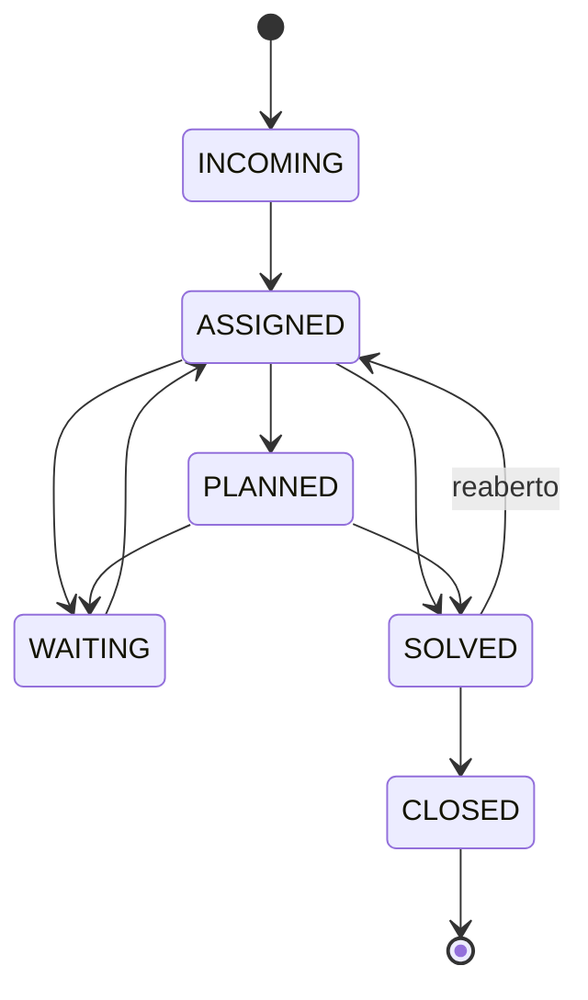

# Ciclo de vida de um Ticket (máquina de estados)

Os estados de um [[Ticket]] são os do [[CommonITILObject (base de service desk)]]. **O
conjunto de transições permitidas não é hard-coded**: é uma **matriz por perfil**
(`glpiactiveprofile['ticket_status'][old][new]`), resolvida por `isAllowedStatus()`
([[EV-1-008 · CommonITILObject define statuses e matriz de prioridade|EV-1-008]]). Ou seja, cada organização/perfil pode restringir quem move o quê.

## Estados
`INCOMING(1)` novo · `ASSIGNED(2)` atribuído · `PLANNED(3)` planejado ·
`WAITING(4)` pendente · `SOLVED(5)` solucionado · `CLOSED(6)` fechado.
(APPROVAL/ACCEPTED/OBSERVED aparecem conforme configuração.)

> [!warning] Transições configuráveis
> O diagrama acima é o fluxo **típico**; a instância pode permitir/proibir arestas por perfil.
> Ver [[INV-1-005 · Regras exatas de transição de status por perfil]]. Diagrama em
> [[Máquina de estados do Ticket (view)]].
