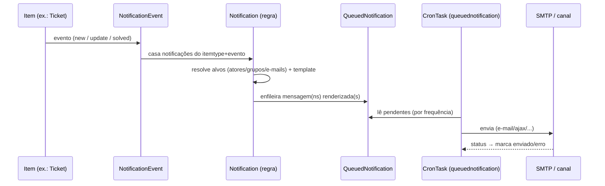

# Fluxo de notificação (event → fila → envio)

Deriva de [[Notificações (e-mail e canais)]] e [[Ações Automáticas (CronTask)]].

O desacoplamento por **fila** garante que picos de eventos não bloqueiem a UI e permite
reentrega em falhas.
