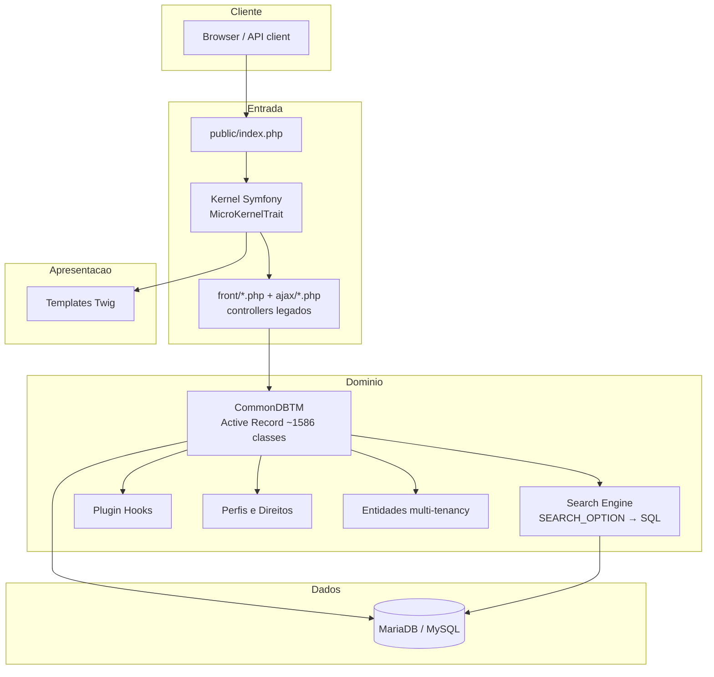

# Camadas da arquitetura (view)

Visão em camadas do GLPI 11 (deriva de [[Kernel e Bootstrap]], [[CommonDBTM (Active Record)]],
[[Motor de Busca (Search Engine)]], [[Organização do código-fonte]]).

> [!note]
> Fronteira exata Kernel↔`front/` em aberto: ver
> [[INV-1-001 · Roteamento Symfony vs entrypoints legados]].
