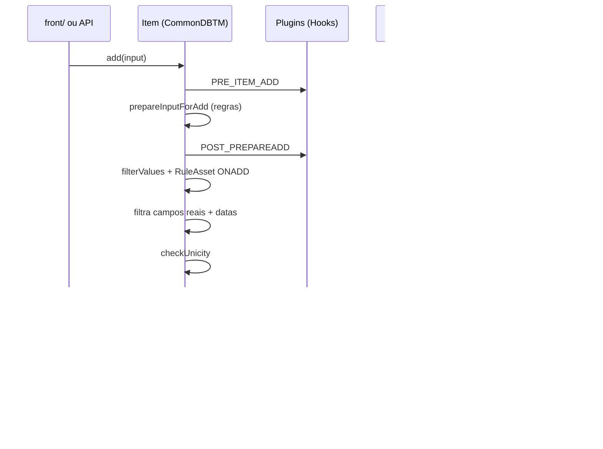

# Ciclo de vida CommonDBTM (view)

Sequência detalhada do `add()`/`update()`/`delete()` — deriva de
[[Ciclo de vida de um item (add-update-delete)]].

```mermaid
sequenceDiagram
    participant C as front/ ou API
    participant O as Item (CommonDBTM)
    participant P as Plugins (Hooks)
    participant DB as MariaDB
    participant L as Log

    C->>O: add(input)
    O->>P: PRE_ITEM_ADD
    O->>O: prepareInputForAdd (regras)
    O->>P: POST_PREPAREADD
    O->>O: filterValues + RuleAsset ONADD
    O->>O: filtra campos reais + datas
    O->>O: checkUnicity
    O->>DB: addToDB (INSERT)
    O->>L: Log::history (CREATE)
    O->>O: post_addItem (efeitos colaterais)
    O-->>C: id do novo item
```
