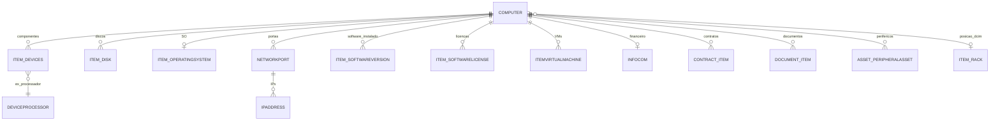

# Composição do ativo Computer (view)

Agregado típico de um [[Ticket|ativo]] Computer (deriva de
[[Composição de um Ativo (componentes)]]).

```mermaid
erDiagram
    COMPUTER ||--o{ ITEM_DEVICES : componentes
    COMPUTER ||--o{ ITEM_DISK : discos
    COMPUTER ||--o| ITEM_OPERATINGSYSTEM : SO
    COMPUTER ||--o{ NETWORKPORT : portas
    NETWORKPORT ||--o{ IPADDRESS : IPs
    COMPUTER ||--o{ ITEM_SOFTWAREVERSION : software_instalado
    COMPUTER ||--o{ ITEM_SOFTWARELICENSE : licencas
    COMPUTER ||--o{ ITEMVIRTUALMACHINE : VMs
    COMPUTER ||--o| INFOCOM : financeiro
    COMPUTER ||--o{ CONTRACT_ITEM : contratos
    COMPUTER ||--o{ DOCUMENT_ITEM : documentos
    COMPUTER ||--o{ ASSET_PERIPHERALASSET : perifericos
    COMPUTER }o--o| ITEM_RACK : posicao_dcim
    ITEM_DEVICES }o--|| DEVICEPROCESSOR : ex_processador
```
