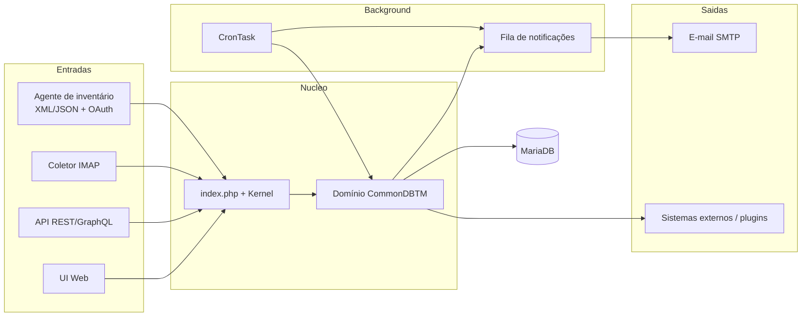

# Integrações e operação (view)

Canais de entrada/saída e execução em segundo plano em torno do núcleo.

```mermaid
flowchart LR
    subgraph Entradas
      UI[UI Web]
      API[API REST/GraphQL]
      MAIL[Coletor IMAP]
      AG[Agente de inventário\nXML/JSON + OAuth]
    end
    subgraph Nucleo
      IDX[index.php + Kernel]
      DOM[Domínio CommonDBTM]
    end
    subgraph Background
      CRON[CronTask]
      Q[Fila de notificações]
    end
    subgraph Saidas
      SMTP[E-mail SMTP]
      EXT[Sistemas externos / plugins]
    end
    DB[(MariaDB)]

    UI --> IDX
    API --> IDX
    MAIL --> IDX
    AG --> IDX
    IDX --> DOM --> DB
    DOM --> Q
    CRON --> Q --> SMTP
    CRON --> DOM
    DOM --> EXT
```
