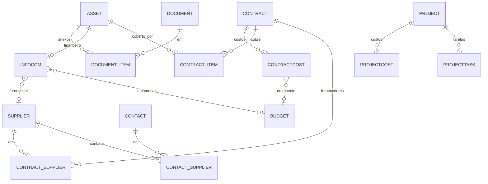

# Modelo de dados de Gestão (view)

Relações centrais de contratos, financeiro, fornecedores e documentos em torno de um ativo.

```mermaid
erDiagram
    SUPPLIER ||--o{ CONTACT_SUPPLIER : contatos
    CONTACT ||--o{ CONTACT_SUPPLIER : de
    CONTRACT ||--o{ CONTRACT_SUPPLIER : fornecedores
    SUPPLIER ||--o{ CONTRACT_SUPPLIER : em
    CONTRACT ||--o{ CONTRACT_ITEM : cobre
    CONTRACT ||--o{ CONTRACTCOST : custos
    ASSET ||--o{ CONTRACT_ITEM : coberto_por
    ASSET ||--o| INFOCOM : financeiro
    INFOCOM }o--o| BUDGET : orcamento
    INFOCOM }o--o| SUPPLIER : fornecedor
    CONTRACTCOST }o--o| BUDGET : orcamento
    ASSET ||--o{ DOCUMENT_ITEM : anexos
    DOCUMENT ||--o{ DOCUMENT_ITEM : em
    PROJECT ||--o{ PROJECTTASK : tarefas
    PROJECT ||--o{ PROJECTCOST : custos
```
