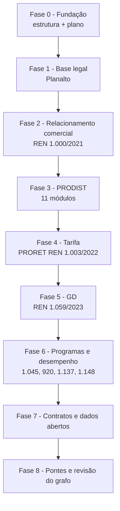

> [!abstract]
> Plano de coleta, leitura e extração de conhecimento do recorte **Distribuição de Energia Elétrica**, derivado do briefing anexo. Define o inventário de fontes, as fases de trabalho, os artefatos esperados no vault e o estado de execução de cada item.

## Escopo

Somente o que é citado no briefing: o marco contratual das concessões de distribuição, as resoluções normativas da ANEEL aplicadas às distribuidoras, e os portais de dados abertos da agência. Normas referenciadas apenas como alteradas/revogadas ficam fora desta rodada e entram no roadmap geral do [[README]].

## Inventário de fontes

### Camada 1 — Base legal (Planalto)

| # | Documento | Papel no recorte | URL oficial | Estado |
|---|---|---|---|---|
| 1 | Decreto nº 12.068/2024 | Regulamenta prorrogação e licitação das concessões de distribuição | `planalto.gov.br/ccivil_03/_ato2023-2026/2024/decreto/d12068.htm` | ✅ coletado |
| 2 | Lei nº 14.300/2022 | Marco legal da micro e minigeração distribuída, SCEE e PERS | `planalto.gov.br/ccivil_03/_ato2019-2022/2022/lei/L14300.htm` | ✅ coletado |

### Camada 2 — Resoluções Normativas ANEEL

| # | Norma | Pilar operacional | Fonte oficial | Estado |
|---|---|---|---|---|
| 3 | REN 1.000/2021 | Relacionamento comercial e direitos do consumidor | `www2.aneel.gov.br/cedoc/ren20211000.pdf` | ✅ coletado — 329 p. |
| 4 | REN 956/2021 — PRODIST | Operação técnica e qualidade (11 módulos) | `www2.aneel.gov.br/cedoc/ren2021956.pdf` + `git.aneel.gov.br/.../procreg/prodist/` | ✅ coletado — 6 p. + 11 anexos |
| 5 | REN 1.003/2022 — PRORET | Tarifas e regulação econômica | `www2.aneel.gov.br/cedoc/ren20221003.pdf` + `git.aneel.gov.br/.../procreg/proret/` | ✅ coletado — 59 p. + 72 submódulos |
| 6 | REN 1.137/2025 | Resiliência de redes a eventos climáticos severos | `www2.aneel.gov.br/cedoc/ren20251137.pdf` | ✅ coletado — 31 p. |
| 7 | REN 1.059/2023 | Regulamentação da Lei 14.300 (MMGD) | `www2.aneel.gov.br/cedoc/ren20231059.pdf` | ✅ coletado — 45 p. |
| 8 | REN 1.045/2022 — PROPDI | P&D e Inovação (0,50% da ROL) | `www2.aneel.gov.br/cedoc/ren20221045.pdf` | ✅ coletado — 3 p. |
| 9 | REN 920/2021 — PROPEE | Eficiência Energética (0,50% da ROL) | `www2.aneel.gov.br/cedoc/ren2021920.pdf` | ✅ coletado — 5 p. |
| 10 | REN 1.148/2026 | Satisfação do consumidor, IASC e IS gov | `www2.aneel.gov.br/cedoc/ren20261148.pdf` | ✅ coletado — 12 p. |

### Camada 3 — PRODIST, módulo a módulo (REN 956/2021)

| Módulo | Título | Densidade conceitual esperada | Versão coletada | Nota |
|---|---|---|---|---|
| 1 | Glossário de Termos Técnicos | Alta — alimenta o glossário do vault inteiro | v12 | [[PRODIST Modulo 01]] |
| 2 | Planejamento da Expansão do Sistema de Distribuição | Média | v8 | [[PRODIST Modulo 02]] |
| 3 | Conexão ao Sistema de Distribuição | **Alta** — ritos de acesso, ponte com Lei 14.300 | v9 | [[PRODIST Modulo 03]] |
| 4 | Procedimentos Operativos do Sistema de Distribuição | Média — **subiu** com as Seções 4.7 a 4.11 (resiliência) | v3 | [[PRODIST Modulo 04]] |
| 5 | Sistemas de Medição e Procedimentos de Leitura | Média | v7 | [[PRODIST Modulo 05]] |
| 6 | Informações Requeridas e Obrigações | **Alta** — obrigações de envio de dados à ANEEL | v17 | [[PRODIST Modulo 06]] |
| 7 | Cálculo de Perdas na Distribuição | Média | v6 | [[PRODIST Modulo 07]] |
| 8 | Qualidade do Fornecimento de Energia Elétrica | **Alta** — DEC, FEC, DIC, FIC, DMIC, DICRI **e DISE** | v14 | [[PRODIST Modulo 08]] |
| 9 | Ressarcimento de Danos Elétricos | Alta — quase inteiramente prazos, gera notas de prática | v2 | [[PRODIST Modulo 09]] |
| 10 | Sistema de Informação Geográfica Regulatório | Média — **fundacional** para o `context-vault/` (BDGD) | v4 | [[PRODIST Modulo 10]] |
| 11 | Fatura de Energia Elétrica e Informações Suplementares | Alta — Seção 11.3 revogada pela REN 1.147/2025 | v2 | [[PRODIST Modulo 11]] |

Nota-mãe da norma: [[REN 956-2021]]. O corpo resolutivo tem 6 páginas; o conteúdo regulatório está inteiro nos 11 anexos.

### Camada 4 — Contratos e dados abertos

| # | Fonte | Natureza | URL |
|---|---|---|---|
| 11 | Contratos de concessão de distribuição (16 distribuidoras renovadas) | Contratual | `antigo.aneel.gov.br/contratos-de-distribuicao` |
| 12 | PARA — Portal ANEEL de Relatórios Abertos | Dados | `portalrelatorios.aneel.gov.br` |
| 13 | Central de conteúdo — Distribuição | Dados | `gov.br/aneel/pt-br/centrais-de-conteudos/relatorios-e-indicadores/distribuicao` |
| 14 | Central de conteúdo — MMGD | Dados | `.../micro-e-minigeracao-distribuida` |
| 15 | Central de conteúdo — P&D e EE | Dados | `.../ped-e-ee` |
| 16 | Central de conteúdo — Tarifas e econômico-financeiras | Dados | `.../tarifas-e-informacoes-economico-financeiras` |

> [!success] Bloqueio de coleta resolvido em 2026-07-26
> A releitura do bloqueio mostrou que o diagnóstico original estava **errado em uma das duas frentes**. Eram dois problemas distintos, com causas distintas:
>
> **1. `git.aneel.gov.br` — não era host inalcançável, era cadeia de certificado incompleta.**
> O servidor apresenta apenas o certificado folha (`*.aneel.gov.br`, emitido pela *Sectigo Public Server Authentication CA OV R36*) e **não envia o intermediário**. Sem ele, a validação TLS falha com `unable to get local issuer certificate` e o cliente aborta antes de qualquer HTTP — o que se manifesta como "host inalcançável". A rede sempre esteve aberta.
> **Correção:** buscar o intermediário na URI de *CA Issuers* declarada no próprio certificado (`crt.sectigo.com/SectigoPublicServerAuthenticationCAOVR36.crt`), anexá-lo ao *bundle* de CAs e refazer a requisição com validação completa. Nada de `--insecure`.
> **Resultado:** 11 módulos do PRODIST + 72 submódulos do PRORET baixados direto, com verificação de assinatura íntegra.
>
> **2. `www2.aneel.gov.br/cedoc` — é um desafio gerenciado da Cloudflare, não um 403 comum.**
> A resposta traz `cf-mitigated: challenge` e o interstício *"Just a moment…"*. Não se contorna nem se deve contornar por script. O navegador do consultor resolve o desafio normalmente.
> **Correção:** com a extensão Claude in Chrome, `fetch` na origem já autenticada → `Blob` → âncora `download` com o nome da convenção → arquivo na pasta Downloads → movido para `docs/ANEEL/`.
> **Resultado:** as 8 REN coletadas com o **tamanho em bytes conferido contra o que o navegador leu**, uma a uma.
>
> **Lição para as próximas rodadas:** `http=000` no cliente de linha de comando não é sinônimo de host bloqueado. Verificar a cadeia TLS antes de declarar bloqueio de rede.

### Rotas de coleta que funcionam

| Fonte | Rota | Observação |
|---|---|---|
| `git.aneel.gov.br` | Download direto, com o intermediário Sectigo no *bundle* de CAs | Vale para PRODIST, PRORET e Procedimentos de Transmissão |
| `www2.aneel.gov.br/cedoc` | Navegador do consultor (Cloudflare challenge) | Conferir o tamanho em bytes após mover o arquivo |
| `www.gov.br/aneel` | Download direto | É onde estão as **páginas de índice** com as URLs canônicas de cada módulo |
| API GitLab `git.aneel.gov.br/api/v4/projects/publico%2Fcentralconteudo/repository/tree` | Download direto | Permite varrer a árvore do repositório sem raspar HTML |

> [!warning] Fontes que continuam indisponíveis
> - `atosoficiais.com.br` e `legisweb.com.br` — irrelevantes agora: tudo que se buscava neles está no `cedoc`.
> - `biblioteca.aneel.gov.br` — também sob desafio Cloudflare. Só pelo navegador.
> - `www.in.gov.br` (DOU) — inalcançável desta sessão (`PROTOCOL_ERROR` em HTTP/2). Alternativa para redação consolidada ainda em aberto.

## Fases de trabalho

### Fase 0 — Fundação ✅ concluída
Criar `docs/` e `knowledge-vault/` conforme o README; escrever este plano; arquivar o briefing em `docs/Briefings/`; abrir a nota de literatura do briefing.

### Fase 1 — Base legal ✅ concluída
Decreto 12.068/2024 e Lei 14.300/2022 coletados, notas de literatura por capítulo, conceitos e práticas extraídos, MOCs abertos.

### Fase 2 — Relacionamento comercial (REN 1.000/2021) ⏳ coletada, leitura pendente
Documento em `docs/ANEEL/REN-1000-2021.pdf` (329 p.); nota de identificação e estrutura aberta em [[REN 1000-2021]] com status `seed`. Notas de literatura por título; conceitos esperados: prazos de ligação e religação, suspensão por inadimplência, faturamento, ressarcimento de danos, procedimento irregular, veículos elétricos, tarifa social. Práticas esperadas: solicitação de ligação nova, contestação de fatura, pedido de ressarcimento de dano elétrico.

### Fase 3 — PRODIST (REN 956/2021) 🟡 notas de literatura concluídas
Os 11 módulos estão em `docs/ANEEL/PRODIST/` e cada um tem nota de literatura: [[PRODIST Modulo 01]] a [[PRODIST Modulo 11]], sob a nota-mãe [[REN 956-2021]]. **Falta a extração de conceitos e práticas** — as notas listam os candidatos por módulo. Prioridade de extração: **1 → 3 → 8 → 6 → 9 → 11 → 5 → 2 → 4 → 7 → 10**. O módulo 1 alimenta o glossário do vault inteiro; o 3 é a ponte com a Lei 14.300; o 8 origina os indicadores de continuidade que o Decreto 12.068 usa como condição de prorrogação.

### Fase 4 — Tarifa (PRORET, REN 1.003/2022) ⏳ coletada, leitura pendente
**72 submódulos** em `docs/ANEEL/PRORET/` (24 MB), mais o corpo da REN em `docs/ANEEL/REN-1003-2022.pdf`. Volume muito acima do estimado — esta fase precisa ser subdividida por módulo do PRORET. Nota de literatura por submódulo. Conceitos esperados: reajuste tarifário anual, revisão tarifária periódica, Parcela A e Parcela B, base de remuneração regulatória, WACC regulatório, perdas regulatórias, receitas irrecuperáveis.

### Fase 5 — Geração distribuída (REN 1.059/2023) ⏳ coletada, leitura pendente
Enriquece — não recria — as notas de conceito já criadas a partir da Lei 14.300. Cada conceito ganha uma linha nova na tabela *Base normativa*.

### Fase 6 — Programas setoriais e desempenho ⏳ coletada, leitura pendente
REN 1.045/2022 (PROPDI), 920/2021 (PROPEE), 1.137/2025 (resiliência, indicador DISE, manejo de vegetação, ajuda mútua), 1.148/2026 (IASC, IS gov, ranking anual, relatórios mensais de prazos).

### Fase 7 — Contratos e dados abertos ⏳ pendente
Registrar as 16 distribuidoras renovadas, mapear o termo aditivo contra o art. 4º do Decreto 12.068, e catalogar os workspaces do PARA como fontes de dados (não de norma).

### Fase 8 — Pontes e revisão do grafo ⏳ pendente
Construir explicitamente as travessias: continuidade do fornecimento (PRODIST 8) ↔ prorrogação da concessão (Decreto 12.068 art. 2º); acesso à rede (PRODIST 3) ↔ solicitação de acesso da GD (Lei 14.300 art. 2º); componentes tarifárias (PRORET) ↔ transição do Fio B (Lei 14.300 art. 27).

## Critérios de aceitação por nota

- [ ] Frontmatter com os oito campos obrigatórios preenchidos
- [ ] `source` aponta para norma **existente em `docs/`**
- [ ] Toda afirmação normativa cita artigo/inciso/anexo
- [ ] Pelo menos um link de entrada e um de saída
- [ ] Conceito registrado no MOC do seu eixo no mesmo commit
- [ ] Dúvida de interpretação registrada como `> [!question]`, nunca resolvida por suposição

## Estado de execução

| Fase                          | Documentos coletados     | Notas de literatura | Concepts | Practices | MOCs  |
| ----------------------------- | ------------------------ | ------------------- | -------- | --------- | ----- |
| 0 — Fundação                  | 1 briefing               | 1                   | 0        | 0         | 4     |
| 1 — Base legal                | 2                        | 14                  | 29       | 4         | —     |
| 2 — REN 1.000/2021            | 1                        | 1 (`seed`)          | 0        | 0         | —     |
| 3 — PRODIST                   | 12 (REN + 11 anexos)     | 12                  | 0        | 0         | —     |
| 4 — PRORET                    | 73 (REN + 72 submódulos) | 0                   | 0        | 0         | —     |
| 6 — Programas e desempenho    | 5                        | 0                   | 0        | 0         | —     |
| 7 — Contratos e dados abertos | 0                        | 0                   | 0        | 0         | —     |
| **Total**                     | **94**                   | **28**              | **29**   | **4**     | **4** |

**Verificação do grafo em 2026-07-26 (2ª rodada, pós-desbloqueio):** 66 notas, **0 links quebrados** entre notas do vault — o único remanescente é `[[README]]`, que aponta para fora do vault e é o efeito colateral dos dois vaults do Obsidian já registrado na auditoria. O link quebrado `[[Aporte de Capital na Concessão]]` (barra invertida residual) foi corrigido nesta rodada em duas notas.

### Volume coletado por pasta

| Pasta | Arquivos | Tamanho |
|---|---|---|
| `docs/ANEEL/*.pdf` | 8 REN | 5,7 MB |
| `docs/ANEEL/PRODIST/` | 11 módulos | 8,6 MB |
| `docs/ANEEL/PRORET/` | 72 submódulos | 24 MB |
| `docs/Legislacao/` | 2 | — |
| `docs/Briefings/` | 1 | — |

> [!important] O PRORET é maior do que o plano previa
> A Fase 4 estava dimensionada como "nota de literatura por submódulo". São **72 submódulos** distribuídos em 11 módulos do PRORET. Manter a fase como bloco único a torna inexecutável — ela precisa ser refatorada em subfases por módulo, no mesmo espírito do faseamento por valor já adotado.

> [!warning] Retificação da verificação — ver [[Auditoria do Grafo - 2026-07-26]]
> A varredura completa encontrou o que a checagem inicial não viu: **1 link quebrado** (`[[README]]`, efeito de haver dois vaults do Obsidian configurados), **21 de 33 notas permanentes sem link para a nota de literatura** que as originou (regra 3 do README rompida), **1 única ponte** entre os eixos GD e Concessões, e a **corrupção irrecuperável de `docs/Legislacao/Lei-14300-2022.txt`** (1.911 caracteres perdidos), que é a fonte de 20 conceitos.
>
> A auditoria também **desbloqueia a Camada 2**: `git.aneel.gov.br` é acessível pelo navegador, com PRODIST, PRORET e Procedimentos de Rede versionados. O bloqueio era da rota de download, não do host.
>
> **Atualização 2026-07-26:** confirmado e resolvido — a causa raiz era a cadeia TLS incompleta do servidor, não a rota. Ver o callout *Bloqueio de coleta resolvido* acima. Das quatro pendências da auditoria, esta é a única fechada; as três restantes (link `[[README]]`, notas permanentes sem elo com a literatura, e a corrupção de `Lei-14300-2022.txt`) seguem abertas.

## Perguntas de Pesquisa

> [!question]
> - A REN 1.148/2026 alterou a REN 1.000/2021, os módulos do PRODIST e do PRORET. Qual a redação consolidada vigente de cada dispositivo alterado?
> - O briefing afirma investimentos de R$ 130 bilhões até 2030 para as 16 distribuidoras renovadas. Qual o documento oficial que consolida esse número — termo aditivo, nota técnica da ANEEL ou comunicado do MME?
> - A Enel SP ficou fora do pacote de renovação antecipada. Qual o ato administrativo que formaliza essa exclusão?
> - A MP 1.300/2025 e a Lei 15.269/2025 alteram dispositivos da Lei 14.300 (arts. 22 e 25). Qual a redação vigente em 2026 e qual o efeito sobre o custeio pela CDE?

---
Ref: [[Auditoria do Grafo - 2026-07-26]], [[Obrigações das Concessões e Acesso a Informações]], [[Decreto 12.068-2024]], [[Lei 14.300-2022]], [[MOC - Concessões de Distribuição]], [[MOC - Geração Distribuída]]
