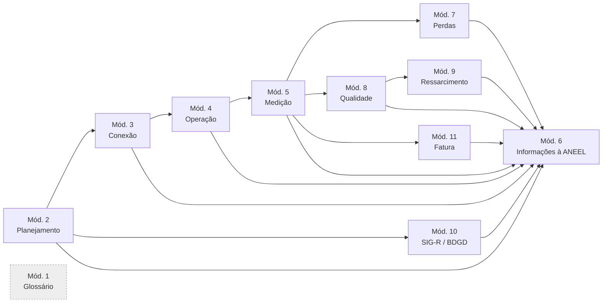

## Identificação

| Campo | Conteúdo |
|---|---|
| Órgão | ANEEL — Agência Nacional de Energia Elétrica |
| Número | Resolução Normativa nº 956 |
| Data | 7 de dezembro de 2021 |
| Ementa | Estabelece os Procedimentos de Distribuição de Energia Elétrica no Sistema Elétrico Nacional — PRODIST |
| Situação | Vigente, **alterada** (notadamente pelas REN 1.059/2023, 1.137/2025 e 1.147/2025) |
| Arquivo original | `docs/ANEEL/REN-956-2021.pdf` (6 p. — o corpo resolutivo) |
| Anexos | `docs/ANEEL/PRODIST/PRODIST-Modulo-01.pdf` a `PRODIST-Modulo-11.pdf` |

> [!important] A norma são os anexos
> O corpo da REN 956/2021 tem 6 páginas. O conteúdo regulatório inteiro está nos **11 anexos**, cada um um módulo do PRODIST, somando 270 páginas. Cada módulo é o Anexo de mesmo número da Resolução — o Módulo 1 é o Anexo I, o Módulo 3 é o Anexo III, e assim por diante. É por isso que cada módulo tem nota de literatura própria.

## Resumo executivo

O PRODIST é o regulamento técnico da distribuição: normatiza como a distribuidora planeja a rede, conecta usuários a ela, opera, mede, calcula perdas, mede qualidade, ressarce danos, georreferencia ativos, fatura e presta contas à ANEEL. É a contraparte técnica das **Regras de Prestação do Serviço Público de Distribuição** ([[REN 1000-2021|REN 1.000/2021]]), que cuidam do relacionamento comercial.

A REN 956/2021 não criou o PRODIST — reeditou-o, reorganizando módulos que vinham desde 2008 e migrando o texto para a estrutura de anexos versionados publicados no repositório aberto da Agência.

## Estrutura da norma — os 11 módulos

| Módulo | Anexo | Objeto | Versão coletada | Nota |
|---|---|---|---|---|
| 1 | I | Glossário de termos técnicos | v12 (REN 1.137/2025) | [[PRODIST Modulo 01]] |
| 2 | II | Planejamento da expansão | v8 | [[PRODIST Modulo 02]] |
| 3 | III | Conexão ao sistema de distribuição | v9 | [[PRODIST Modulo 03]] |
| 4 | IV | Procedimentos operativos | v3 (REN 1.137/2025) | [[PRODIST Modulo 04]] |
| 5 | V | Sistemas de medição e leitura | v7 | [[PRODIST Modulo 05]] |
| 6 | VI | Informações requeridas e obrigações | v17 (REN 1.137/2025) | [[PRODIST Modulo 06]] |
| 7 | VII | Cálculo de perdas na distribuição | v6 | [[PRODIST Modulo 07]] |
| 8 | VIII | Qualidade do fornecimento | v14 (REN 1.137/2025) | [[PRODIST Modulo 08]] |
| 9 | IX | Ressarcimento de danos elétricos | v2 | [[PRODIST Modulo 09]] |
| 10 | X | Sistema de Informação Geográfica Regulatório | v4 | [[PRODIST Modulo 10]] |
| 11 | XI | Fatura de energia e informações suplementares | v2 | [[PRODIST Modulo 11]] |

> [!info] Versionamento por sobre-norma
> Quatro módulos (1, 4, 6 e 8) circulam hoje em versão cujo arquivo já leva o número da **REN 1.137/2025** — a resolução de resiliência de redes. Ou seja: a alteração de 2025 foi incorporada ao texto consolidado do anexo, não publicada como norma apartada. Ao citar um dispositivo desses módulos, a versão do anexo importa tanto quanto o número da REN.

## Como o PRODIST se articula

O Módulo 1 é transversal (define o vocabulário de todos) e o Módulo 6 é terminal (recolhe as obrigações de envio geradas por todos os demais).

## Pontes com o resto do vault

| Travessia | Onde nasce | Onde chega |
|---|---|---|
| Continuidade do fornecimento → condição de prorrogação da concessão | [[PRODIST Modulo 08]] (DEC/FEC) | [[Prorrogação da Concessão de Distribuição]] |
| Rito técnico de conexão da GD | [[PRODIST Modulo 03]], Seção 3.1 | [[Solicitação de Acesso para Micro e Minigeração Distribuída]] |
| Perdas técnicas regulatórias → Parcela A da tarifa | [[PRODIST Modulo 07]] | PRORET (Fase 4) |

## Alterações e revogações

| Norma | Efeito sobre o PRODIST |
|---|---|
| REN 1.059/2023 | Nova redação a dispositivos do Módulo 3 (Seção 3.1), alinhando-o à Lei 14.300/2022 |
| REN 1.137/2025 | Altera os Módulos 1, 4, 6 e 8 — resiliência, manejo vegetal, comunicação em emergência, indicador DISE |
| REN 1.147/2025 | Revoga a Seção 11.3 do Módulo 11 |

> [!question] Redação consolidada
> A REN 1.148/2026 também alcança dispositivos do PRODIST. Confirmar quais módulos e se as versões coletadas em 2026-07-26 já a incorporam.

---
Ref: [[Plano de Trabalho - Distribuição de Energia Elétrica]], [[Lei 14.300-2022]], [[Decreto 12.068-2024]], [[MOC - Concessões de Distribuição]]
