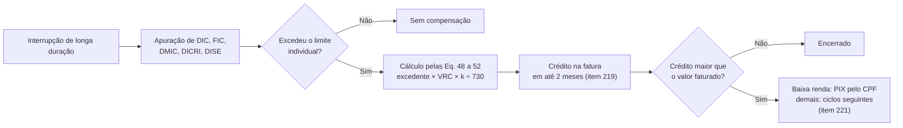

> [!abstract]
> Crédito que a distribuidora deve lançar na fatura do consumidor, por cálculo próprio e sem provocação, sempre que violar o limite de um indicador **individual** de continuidade — DIC, FIC, DMIC, DICRI ou DISE.

## Conceito

É a única consequência **automática** do descumprimento do padrão de continuidade na distribuição brasileira. Não depende de reclamação do consumidor, de fiscalização, de processo administrativo ou de decisão de diretoria: violado o limite, a distribuidora calcula o valor e credita na fatura em até dois meses.

Isso a torna qualitativamente diferente da multa. A multa é sanção — pressupõe apuração, contraditório e juízo de conveniência do regulador. A compensação é **reparação**, e opera dentro do próprio ciclo de faturamento. Por isso as duas se comportam de forma tão distinta na série: a compensação é estável e crescente, a multa oscila em fator de sete entre anos vizinhos.

> [!important] Não há compensação por DEC ou FEC
> O item 219 lista apenas os indicadores **individuais**. Violar o limite anual de DEC ou FEC de um conjunto — o padrão de qualidade que a ANEEL fixa conjunto a conjunto na revisão tarifária — não gera compensação a ninguém. Ver [[Indicadores Coletivos de Continuidade (DEC e FEC)]] e o achado [[A transgressão do limite coletivo não tem consequência financeira direta]].

## Base normativa

| Norma | Dispositivo | O que estabelece |
|---|---|---|
| PRODIST Módulo 8 | item 219 | Violado o limite de DIC, FIC, DMIC, DICRI ou DISE, a distribuidora **deve** calcular a compensação e creditar na fatura em até **2 meses** após o período de apuração |
| PRODIST Módulo 8 | item 220 | Compensação para **cada** interrupção em Dia Crítico que supere o limite de DICRI |
| PRODIST Módulo 8 | item 220-A | Compensação para cada interrupção em Situação de Emergência que supere o limite de DISE |
| PRODIST Módulo 8 | item 221 (red. REN 1.147/2025) | Crédito remanescente: **PIX pelo CPF** para a subclasse residencial baixa renda; senão, ciclos subsequentes; no encerramento contratual, depósito, cheque ou ordem de pagamento |
| PRODIST Módulo 8 | item 222 | Em caso de inadimplência, débitos vencidos não contestados podem ser deduzidos da compensação |
| PRODIST Módulo 8 | itens 223 e 224 | A compensação é do titular no período da violação; havendo troca de titularidade, credita-se ao **novo** titular |
| PRODIST Módulo 8 | item 225, Eq. 48 a 52 | Fórmulas: valor proporcional ao excedente sobre o limite, ao Valor de Referência da Compensação (VRC) e ao fator k*, dividido por 730 horas |

Arquivo original: `docs/ANEEL/PRODIST/PRODIST-Modulo-08.pdf`

## Dinâmica

## Características

- **Automática.** Obrigação de fazer da distribuidora, não direito a ser pleiteado.
- **Proporcional ao excedente.** O valor cresce com o quanto se ultrapassou o limite, não com a ocorrência em si.
- **Indexada ao VRC.** O Valor de Referência da Compensação, atualizado pela ANEEL, é o que converte horas em reais — parte do crescimento nominal da série vem daí.
- **Compensável com débito.** Consumidor inadimplente pode ter a compensação abatida de débitos vencidos não contestados (item 222).
- **Segmentada por apuração.** Há compensação por violação do limite mensal, trimestral e anual, além das de Dia Crítico (DICRI) e Situação de Emergência (DISE) — segmentação que os dados abertos preservam nos sufixos das rubricas `PGUC*`.

## Comparação

| | Compensação (item 219) | Multa por auto de infração |
|---|---|---|
| Natureza | Reparação ao consumidor | Sanção administrativa |
| Gatilho | Violação de limite individual, apurada pela própria distribuidora | Decisão de fiscalização |
| Quem recebe | O consumidor, na fatura | O Estado |
| Previsibilidade | Alta — decorre do cálculo | Baixa — depende do ciclo de fiscalização |
| Ordem de grandeza (2020–2025) | R$ 5,33 bilhões | R$ 199,1 milhões por continuidade |

## Dados de contexto

- [[Compensação por Violação dos Limites Individuais de Continuidade]] — quanto foi pago, por ano e por distribuidora
- [[Evolução da Compensação por Continuidade e das Multas (2020–2025)]] — a compensação e a multa lado a lado
- [[A qualidade média melhora enquanto a compensação individual cresce]] — por que as duas curvas divergem

## Veja também

- [[Indicadores Coletivos de Continuidade (DEC e FEC)]]
- [[Serviço Adequado (Distribuição)]]

---
Ref: [[PRODIST Modulo 08]], [[Indicadores Coletivos de Continuidade (DEC e FEC)]]
