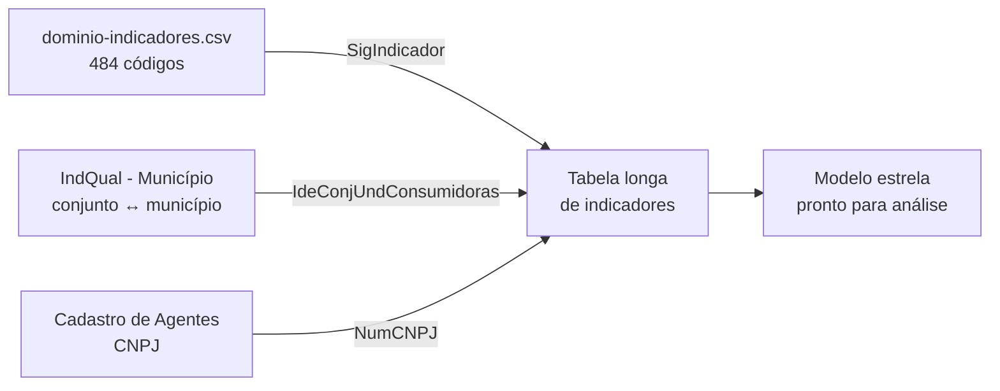

> [!abstract]
> Oito conjuntos de dados da ANEEL — todo o eixo de qualidade do serviço de distribuição — compartilham **o mesmo schema de seis colunas em formato longo**. O que muda entre eles não é a estrutura, é o valor de uma única coluna: `SigIndicador`. Entender isso reduz oito problemas de ingestão a um.

## Conceito

Em vez de uma coluna por métrica, a ANEEL publica uma linha por (agente, conjunto, indicador, período). O schema é sempre:

| Campo | Papel |
|---|---|
| `DatGeracaoConjuntoDados` | Data da carga — versão da extração, não do fato |
| `SigAgente`, `NumCNPJ` | Quem — a distribuidora |
| `IdeConjUndConsumidoras`, `DscConjUndConsumidoras` | Onde — o conjunto de unidades consumidoras |
| `SigIndicador` | **O quê** — o código do indicador |
| `AnoIndice`, `NumPeriodoIndice` | Quando — ano e período (mês ou trimestre) |
| `VlrIndiceEnviado` | Quanto — o valor, sempre como `text` |

Alguns conjuntos omitem o conjunto de UC e ficam no nível da distribuidora (atendimento comercial, inadimplência, segurança do trabalho); a lógica é a mesma.

> [!important] A tabela de domínio é a chave de leitura, não um anexo
> `dominio-indicadores.csv` (`resource_id` `17fc99b7-e707-4ec4-9553-a43d7a41f7a6`, **484 códigos**) traduz `SigIndicador` em descrição. Sem ela, a tabela de fatos é ilegível. Ela aparece replicada como recurso em vários conjuntos — DEC/FEC, nível de tensão, atendimento comercial, inadimplência, segurança do trabalho. Nem todas as cópias estão no DataStore; a do conjunto de DEC/FEC está.

## As famílias de indicador

Os 484 códigos se organizam em famílias reconhecíveis por prefixo e sufixo:

| Família | Padrão | Exemplos | Onde aparece |
|---|---|---|---|
| Continuidade coletiva | `DEC`/`FEC` + sufixo de origem | `DEC`, `FEC`, `DECi` (rede própria), `DECx` (fatores externos), `DECIP` (interna programada), `DECXN` (externa não programada) | DEC e FEC |
| Continuidade individual | `DIC`/`FIC`/`DMIC` + `VLD` | `DICVLD`, `FICVLD`, `DMICVLD` | DEC e FEC |
| Nível de tensão | `DRP`/`DRC` | `DRP`, `DRC`, `DRPt`, `DRCt`, `ICC` | Conformidade de tensão |
| Atributos do conjunto | descritivos | `AREA` (km²), `NumCon` (consumidores), `ERP` (extensão de rede primária), `PNIT` (potência de trafos), `NUCTRU` (UCs rurais), `k3` | DEC e FEC (atributos) |
| Emergência | `TM*`, `N*`, `P*` | `TMP`, `TMD`, `TME`, `TMAE`, `Nie`, `Pnie` | Ocorrências emergenciais |
| Compensação | `COMP*`, `QTUC*`, `PGUC*` | `COMPCONT` (DIC/FIC/DMIC), `COMPCONF` (DRP/DRC), `QTUCAT`/`PGUCAT` por nível de tensão | DEC e FEC, nível de tensão |
| Prazos comerciais | trio `QS*`/`PM*`/`CR*` | `QSLigBUb` quantidade, `PMLigBUb` prazo médio, `CRLigBUb` crédito por violação | Atendimento comercial |
| Inadimplência | `I<classe><janela>` | `ITot12`, `IResBR12`, `IRur3`, `IComCrt` | Inadimplência |
| Segurança do trabalho | `NAC*`, `NMO*`, `FQAC*`, `GRVAC*`, `HHRISAC*`, `DIADEB*` | `NACPTP`, `NMOPTP`, `FQACPTP`, `GRVACPTP` | Segurança do trabalho |

> [!tip] O trio dos prazos comerciais
> Em Qualidade do Atendimento Comercial, cada serviço da REN 1.000/2021 gera **três** códigos com o mesmo sufixo: `QS` (quantos), `PM` (em quanto tempo) e `CR` (quanto foi pago de crédito por violação). Ex.: `QSLigBUb`, `PMLigBUb`, `CRLigBUb` para ligação de consumidor do grupo B em área urbana, art. 31. Cruzar os três é o que revela transgressão sistemática de prazo.

## Amostra do domínio

| Código | Descrição |
|---|---|
| `DEC` | Duração Equivalente de Interrupção por Unidade Consumidora — 3 min |
| `FEC` | Frequência Equivalente de Interrupção por Unidade Consumidora — 3 min |
| `DECi` | DEC decorrente de rede própria |
| `DECx` | DEC decorrente de fatores externos |
| `DRP` | Duração Relativa da Transgressão Máxima de Tensão Precária Mensal |
| `DRC` | Duração Relativa da Transgressão Máxima de Tensão Crítica Mensal |
| `NumCon` | Número de consumidores do conjunto no período |
| `AREA` | Área do conjunto em km² (área geográfica, não elétrica) |
| `ERP` | Extensão de rede primária abaixo de 69 kV, em km |
| `Pnie` | Percentual de ocorrências emergenciais com interrupção |
| `COMPCONT` | Compensação pela violação de DIC, FIC ou DMIC |
| `IResBR12` | % da receita faturada no 12º mês anterior não recebida — residencial baixa renda |
| `NDIACRI` | Número de dias críticos verificados no ano |

_Lista completa: consultar `dominio-indicadores.csv`._

## Receita de ingestão

1. Carregar `dominio-indicadores.csv` como **dimensão de indicador** (484 linhas).
2. Carregar [[IndQual - Município (ANEEL)]] como **dimensão geográfica** (42.699 linhas, conjunto ↔ município).
3. Carregar [[Cadastro de Agentes do Setor Elétrico (ANEEL)]] como **dimensão de agente** (9.927 linhas).
4. Empilhar as tabelas longas dos oito conjuntos como **fato único**, acrescentando uma coluna de origem.
5. Cast de `VlrIndiceEnviado` para decimal e composição da data a partir de `AnoIndice` + `NumPeriodoIndice`.
6. Pivotar só no fim, sob demanda da análise — não na ingestão.

> [!warning] `NumPeriodoIndice` nem sempre é mês
> Em conformidade de nível de tensão a apuração é **trimestral**, e o campo carrega o trimestre. Em DEC/FEC é mensal. O significado depende do conjunto — e, em alguns casos, do próprio `SigIndicador`. Conferir antes de compor a data.

> [!question] Lacunas a confirmar na primeira coleta
> - Existe código de indicador presente nas tabelas de fato que **não** consta no domínio de 484?
> - As cópias de `dominio-indicadores.csv` nos diferentes conjuntos são idênticas ou divergem?
> - Indicadores descontinuados continuam no domínio sem marcação de vigência?

## Veja também

- [[Convenção de Nomenclatura dos Dados Abertos ANEEL]]
- [[Indicadores Coletivos de Continuidade DEC e FEC (ANEEL)]]
- [[Serviço Adequado (Distribuição)]]
