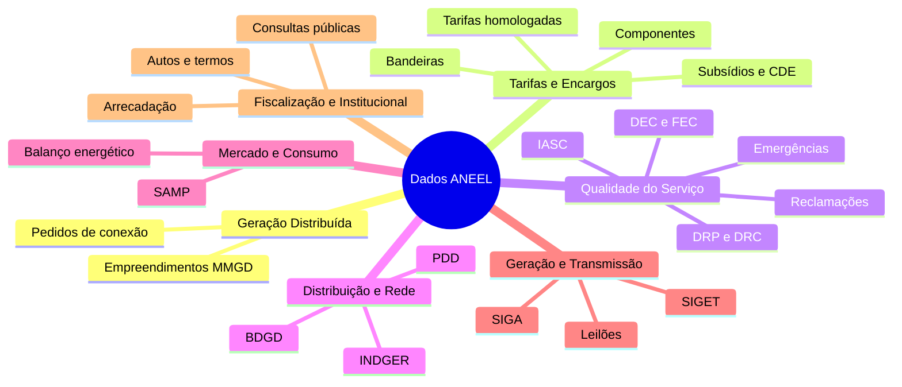
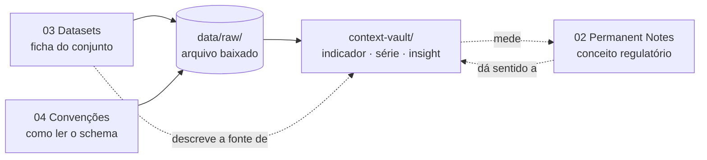

> [!abstract]
> Porta de entrada do **eixo de dados** do vault. Organiza os fatos sobre os repositórios de dados abertos do setor elétrico — que conjuntos existem, o que contêm, como são obtidos — e aponta, de cada eixo, para os conceitos que esses dados medem.

> [!info] Atualizado em 2026-07-27 · Cobertura: 3 repositórios ANEEL, 71 conjuntos · Cadência: ad hoc

> [!important] Por que isto é `knowledge-vault/`, e não `context-vault/`
> "O conjunto SAMP existe, é publicado pela ANEEL sob a REN 1.003/2022, tem 18 campos e cadência mensal" é um **fato**. Muda quando a ANEEL muda o conjunto — não a cada publicação. O que é volátil não é a ficha, é o número que sai dela.
> A ficha, a convenção e este mapa ficam no grafo de conhecimento. O indicador, a série e o insight extraídos dos dados ficam no `context-vault/`, com `updated` e `refresh_frequency` valendo de verdade.

# Visão Geral

# Os três repositórios da ANEEL

| Repositório                              | Natureza           | Conteúdo                                                                  | Ficha                                           |
| ---------------------------------------- | ------------------ | ------------------------------------------------------------------------- | ----------------------------------------------- |
| `dadosabertos.aneel.gov.br`              | Catálogo CKAN 2.11 | **71 conjuntos** tabulares, API pública, DataStore com SQL                | [[Portal de Dados Abertos ANEEL (CKAN)]]        |
| `git.aneel.gov.br/publico`               | GitLab, 3 projetos | PRODIST e PRORET **versionados**, relatórios, planilhas, manuais de envio | [[Repositório Público GitLab ANEEL]]            |
| `dadosabertos-aneel.opendata.arcgis.com` | ArcGIS Hub         | BDGD e camadas georreferenciadas                                          | [[Portal Geoespacial ANEEL (ArcGIS Open Data)]] |

> [!important] O CKAN é dado; o GitLab é documento
> Confundir os dois desperdiça esforço nos dois sentidos. O CKAN entrega tabela pronta para análise. O GitLab entrega o **acervo normativo e os manuais que explicam o schema** dessas tabelas — inclusive o histórico de revisões do PRODIST e do PRORET, versão a versão.

# Navegação por eixo

| MOC | Conjuntos | O que responde |
|---|---|---|
| [[Dados - Geração Distribuída]] | 2 | Quem conectou GD, onde, com que fonte e potência |
| [[Dados - Tarifas e Encargos]] | 8 | Quanto custa a energia e quem paga pelos descontos |
| [[Dados - Qualidade do Serviço]] | 13 | Quanto tempo falta luz, quanto se reclama, quanto se compensa |
| [[Dados - Distribuição e Rede]] | 4 | Que ativos existem, onde estão e o que foi investido |
| [[Dados - Mercado e Consumo]] | 3 | Quanta energia circula, para quem, sob que contrato |
| [[Dados - Geração e Transmissão]] | 17 | O parque gerador, a rede básica e sua expansão |
| [[Dados - Fiscalização e Institucional]] | 13 | O que a agência fiscaliza, arrecada e delibera |
| [[Catálogo de Dados Abertos ANEEL]] | +11 descontinuados | Os 71 conjuntos numa tabela só, com volumetria |

Os 60 conjuntos vivos estão distribuídos pelos sete eixos acima; os 11 descontinuados ficam só no catálogo, porque servem a série histórica e não sustentam conclusão sobre o presente.

# Convenções de leitura

| Nota | Para quê |
|---|---|
| [[Convenção de Nomenclatura dos Dados Abertos ANEEL]] | Ler um schema da ANEEL sem dicionário; evitar as armadilhas de tipagem e de junção |
| [[Formato Longo dos Indicadores de Qualidade]] | Ingerir de uma vez os oito conjuntos que compartilham o mesmo schema de seis colunas |

# Onde este eixo encosta no `context-vault/`

A ficha diz **o que existe**. O indicador diz **quanto é**. Uma não substitui a outra, e só a segunda vence.

| Camada | Onde vive | O que muda nela |
|---|---|---|
| Ficha do conjunto | `knowledge-vault/03 Datasets/` | Quando a ANEEL altera o conjunto: novo campo, nova cadência, descontinuação |
| Convenção de leitura | `knowledge-vault/04 Convenções/` | Quando a fonte muda a gramática dos seus dados |
| Este mapa | `knowledge-vault/06 Maps of Content (MOCs)/` | Quando entra ou sai conjunto do catálogo |
| Indicador, série, insight | `context-vault/` | **A cada `refresh_frequency`** |

# Estado da coleta

| Etapa | Situação |
|---|---|
| Catálogo mapeado | ✅ 71 conjuntos + 3 repositórios |
| Fichas de conjunto | ✅ 74 notas |
| Schema campo a campo | 🟡 26 de 71 conjuntos |
| Download para `data/raw/` | 🟡 5 conjuntos (qualidade e fiscalização) |
| Indicadores no `context-vault/` | 🟡 4 |
| Séries no `context-vault/` | 🟡 3 |
| Insights no `context-vault/` | 🟡 4 |

> [!success] Primeira medição — 2026-07-27
> O eixo **Qualidade do Serviço × Fiscalização × Sustentabilidade da Concessão** saiu do papel. Coletados: DEC/FEC coletivos (apurado, limite e compensação), Auto de Infração, Termo de Notificação, INDGER comercial e IndQual inadimplência. Rotinas reexecutáveis em `data/scripts/coleta_qualidade_fiscalizacao.py` e `processa_qualidade_fiscalizacao.py`; recortes em `data/processed/`.
> Porta de entrada dos derivados: [[Dados - Qualidade do Serviço]] e [[Dados - Fiscalização e Institucional]].

> [!warning] Os outros 66 conjuntos continuam fichados, não medidos
> As demais fichas descrevem **o que existe**, não o que o dado diz. Nenhum arquivo foi baixado e nenhum valor foi extraído — coerente com a regra 6 de *Trabalhando com Agentes de IA*: a IA não estima número.

> [!warning] A coleta revelou duas divergências entre catálogo e arquivo
> O recurso `atributos` dos indicadores de continuidade declara cadência mensal e **termina em 2014**; o recurso de compensação é declarado `ZIP` e entrega CSV. Cadência e formato declarados no CKAN não substituem a leitura do arquivo — ver [[Indicadores Coletivos de Continuidade DEC e FEC (ANEEL)]].

# Conceitos que estes dados medem

Construído por eixo, dentro de cada MOC. Panorama:

| Conceito | Conjunto que o mede |
|---|---|
| [[Geração Distribuída (GD)]] | [[Relação de Empreendimentos de MMGD (ANEEL)]] |
| [[Sistema de Compensação de Energia Elétrica (SCEE)]] | [[Relação de Empreendimentos de MMGD (ANEEL)]] |
| [[Solicitação de Acesso para Micro e Minigeração Distribuída]] | [[Atendimento a Pedidos de Conexão MMGD pós-Lei 14.300 (ANEEL)]] |
| [[Conta de Desenvolvimento Energético (CDE)]] | [[Beneficiários da CDE (ANEEL)]], [[Custeio dos Benefícios Tarifários pela CDE (ANEEL)]], [[Subsídios Tarifários (ANEEL)]] |
| [[Serviço Adequado (Distribuição)]] | [[Indicadores Coletivos de Continuidade DEC e FEC (ANEEL)]] e mais sete conjuntos de qualidade |
| [[Área de Elevada Complexidade ao Combate às Perdas]] | [[SAMP - Balanço Energético (ANEEL)]], [[INDGER - Indicadores Gerenciais da Distribuição (ANEEL)]] |
| [[Plano de Resultados]] | [[PDD - Plano de Desenvolvimento da Distribuição (ANEEL)]] |
| [[Caducidade da Concessão de Distribuição]] | [[Termo de Intimação - TI (ANEEL)]] |

# Perguntas de Pesquisa

> [!question] Conceitos sem dado
> [[Autoconsumo Local]], [[Autoconsumo Remoto]], [[Geração Compartilhada]] e [[Empreendimento com Múltiplas Unidades Consumidoras]] são modalidades distintas na Lei 14.300, e o campo `DscModalidadeHabilitado` da base de MMGD as distingue. A ponte existe no dado mas ainda não foi construída como indicador — é a extração de maior retorno imediato.

> [!question] Dado sem conceito
> Os conjuntos de transmissão, leilões, P&D e eficiência energética não têm conceito correspondente no `knowledge-vault/02 Permanent Notes/`, cujo recorte atual é Distribuição. Ou o recorte se amplia, ou esses eixos ficam declaradamente fora do escopo.

> [!question] Divergência a investigar
> A base de MMGD tem cadência diária e cobertura desde 2008; o conjunto de pedidos de conexão pós-Lei 14.300 cobre só a janela 2022–2023. Confrontar os dois deve mostrar quantos pedidos daquela janela viraram conexão — e quantos não viraram.

> [!question] Prioridade de coleta
> Qual conjunto abre mais perguntas por unidade de esforço? Candidatos: MMGD (liga aos conceitos de GD já existentes), DEC/FEC (2,8 milhões de linhas, eixo inteiro) e Tarifas de Aplicação (322 mil linhas, base de todo estudo tarifário).

---

Fonte: [[Portal de Dados Abertos ANEEL (CKAN)]], [[Repositório Público GitLab ANEEL]] · Inventário: [[Catálogo de Dados Abertos ANEEL]]
