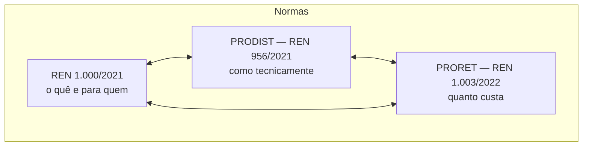

> [!abstract]
> Mapa do eixo **técnico da distribuição**: como a rede é planejada, conectada, operada, medida, avaliada e prestada contas. Serve a quem precisa responder *o que a distribuidora é tecnicamente obrigada a fazer e a informar*.

# Visão Geral

As três normas se complementam por determinação expressa do art. 1º, § 2º da [[REN 1000-2021|REN 1.000/2021]]. Nenhuma se lê sozinha.

# Ciclo de vida da rede

| Etapa | Módulo | Nota |
|---|---|---|
| Planejar a rede que não existe | 2 | [[PRODIST Modulo 02]] |
| Conectar o usuário | 3 | [[PRODIST Modulo 03]] |
| Operar e responder a contingência | 4 | [[PRODIST Modulo 04]] |
| Medir | 5 | [[PRODIST Modulo 05]] |
| Calcular o que se perde | 7 | [[PRODIST Modulo 07]] |
| Aferir qualidade | 8 | [[PRODIST Modulo 08]] |
| Ressarcir dano | 9 | [[PRODIST Modulo 09]] |
| Georreferenciar o ativo | 10 | [[PRODIST Modulo 10]] |
| Faturar | 11 | [[PRODIST Modulo 11]] |

# Transversais

- **Vocabulário** — [[PRODIST Modulo 01]], o glossário que vincula todos os demais módulos
- **Prestação de contas** — [[PRODIST Modulo 06]], que recolhe toda obrigação de envio à ANEEL gerada pelos outros
- **Norma-mãe** — [[REN 956-2021]]

# Travessias com os outros eixos

| De | Para | Como |
|---|---|---|
| [[PRODIST Modulo 08]] — DEC e FEC | [[Prorrogação da Concessão de Distribuição]] | Continuidade é condição de prorrogação no [[Decreto 12.068-2024]], art. 2º |
| [[PRODIST Modulo 03]] — Seção 3.1 | [[Solicitação de Acesso para Micro e Minigeração Distribuída]] | Requisitos técnicos do rito de acesso da GD, alinhados pela REN 1.059/2023 à [[Lei 14.300-2022]] |
| [[PRODIST Modulo 07]] — perdas técnicas | PRORET, Parcela A | O percentual reconhecido entra na tarifa |
| [[PRODIST Modulo 10]] — BDGD | `context-vault/` | Fonte dos dados geoespaciais abertos da rede |
| [[PRODIST Modulo 06]] | [[MOC - Acesso a Dados e Transparência]] | Define o que existe para ser publicado |

# Fontes

- [[REN 956-2021]] — norma-mãe e índice dos 11 módulos
- [[REN 1000-2021]] — Regras de Prestação (`seed`)
- [[Plano de Trabalho - Distribuição de Energia Elétrica]]

# Perguntas de Pesquisa

> [!question]
> - **Limites de DEC e FEC** por conjunto de unidades consumidoras não estão no Módulo 8 — são fixados em ato próprio da ANEEL. Qual ato, e vigente desde quando?
> - **Manual de Instruções da BDGD** e **Dicionário de Dados ANEEL (DDA)** são remetidos pelo Módulo 10 mas não integram a REN 956/2021. Onde estão e qual a versão vigente?
> - **Procedimentos de Rede** do ONS definem a classificação de central geradora "Tipo III" usada na Seção 5.3. Documento externo, não coletado.
> - A **REN 1.148/2026** alcança dispositivos do PRODIST? O arquivo está em `docs/ANEEL/REN-1148-2026.pdf` — falta o cotejo.
> - O Módulo 4, Seção 4.8, fixa *critérios* de comunicação em interrupção de longa duração. Qual o **gatilho quantitativo** que ativa a obrigação?
> - As versões dos anexos 1, 4, 6 e 8 já levam o número da REN 1.137/2025 no arquivo. Existe versão anterior arquivada, para reconstituir a redação pré-2025?
