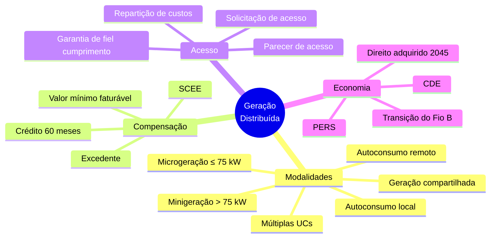

> [!abstract]
> Mapa do eixo **geração distribuída**: modalidades, compensação, acesso à rede e a transição instituída pela Lei 14.300/2022. Serve a quem precisa responder *quem pode gerar, como a energia é compensada e quanto isso custa*.

# Visão Geral

# Modalidades

- [[Microgeração Distribuída]]
- [[Minigeração Distribuída]]
- [[Autoconsumo Local]]
- [[Autoconsumo Remoto]]
- [[Geração Compartilhada]]
- [[Empreendimento com Múltiplas Unidades Consumidoras]]
- [[Fontes Despacháveis]]
- [[Microrrede]]

# Agentes

- [[Consumidor-Gerador]]

# Compensação

- [[Sistema de Compensação de Energia Elétrica (SCEE)]]
- [[Excedente de Energia Elétrica]]
- [[Crédito de Energia Elétrica]]
- [[Alocação e Uso de Créditos de Energia no SCEE]] *(prática)*

# Acesso à rede

- [[Parecer de Acesso]]
- [[Garantia de Fiel Cumprimento]]
- [[Solicitação de Acesso para Micro e Minigeração Distribuída]] *(prática)*

# Economia da transição

- [[Regra de Transição do Fio B]]
- [[Conta de Desenvolvimento Energético (CDE)]]
- [[Exposição Contratual Involuntária]]
- [[Programa de Energia Renovável Social (PERS)]]

# Fontes

- [[Lei 14.300-2022]] — índice
  - [[Lei 14.300-2022 01]] · [[Lei 14.300-2022 02]] · [[Lei 14.300-2022 03]] · [[Lei 14.300-2022 04]] · [[Lei 14.300-2022 05]] · [[Lei 14.300-2022 06]] · [[Lei 14.300-2022 07]]

# Perguntas de Pesquisa

> [!question]
> - **REN 1.059/2023 não coletada.** Todo o detalhamento operacional da GD — prazos de análise da distribuidora, troca do medidor bidirecional, fluxo de aprovação — está fora do vault. É o maior buraco deste eixo.
> - **PRODIST Módulo 3 não coletado.** É a norma que efetivamente disciplina o rito de conexão que a Lei 14.300 pressupõe.
> - O CNPE editou as diretrizes de valoração de custos e benefícios da GD no prazo de 6 meses do art. 17, § 2º? A ANEEL calculou em 18 meses?
> - Qual a redação vigente dos arts. 22 e 25 após a Lei 15.269/2025, e o efeito sobre o custeio pela CDE?
> - Qual o regime regulatório da [[Microrrede]] em operação ilhada?
