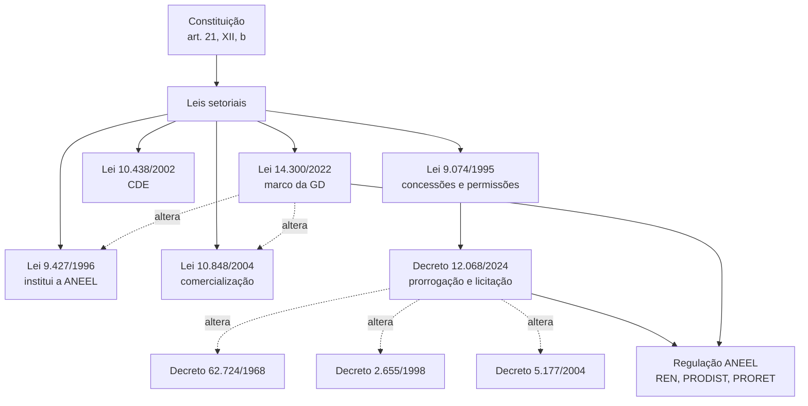

> [!abstract]
> Mapa da **hierarquia normativa** do setor elétrico e da cadeia de alterações entre normas. Ainda em estágio inicial: cobre apenas as duas normas coletadas e as referências que elas fazem.

# Visão Geral

# Normas coletadas

- [[Lei 14.300-2022]] — marco legal da micro e minigeração distribuída
- [[Decreto 12.068-2024]] — prorrogação e licitação das concessões de distribuição

# Cadeia de alterações registrada

| Norma alteradora | Norma alterada | Onde está documentado |
|---|---|---|
| Lei 14.300/2022, art. 33 | Lei 10.848/2004 | [[Lei 14.300-2022 07]] |
| Lei 14.300/2022, art. 34 | Lei 9.427/1996 | [[Lei 14.300-2022 07]] |
| Lei 14.620/2023 | Lei 14.300/2022, arts. 16 e 36-A | [[Lei 14.300-2022]] |
| Lei 15.269/2025 | Lei 14.300/2022, arts. 22 e 25 | [[Lei 14.300-2022 06]] |
| Decreto 12.068/2024, arts. 19 a 22 | Decretos 62.724/1968, 2.655/1998, 5.177/2004, 11.835/2023 | [[Decreto 12.068-2024 05]] |

# Perguntas de Pesquisa

> [!question]
> - As leis-base do setor — **9.427/1996, 9.074/1995, 9.478/1997, 10.438/2002, 10.848/2004** — ainda não foram coletadas. Sem elas, a hierarquia acima é inferida das referências, não verificada.
> - Qual o efeito da **MP 1.300/2025** sobre a Lei 14.300?
> - Como se articula a competência normativa da ANEEL com o conteúdo dos decretos: onde termina a regulamentação e começa a regulação?
