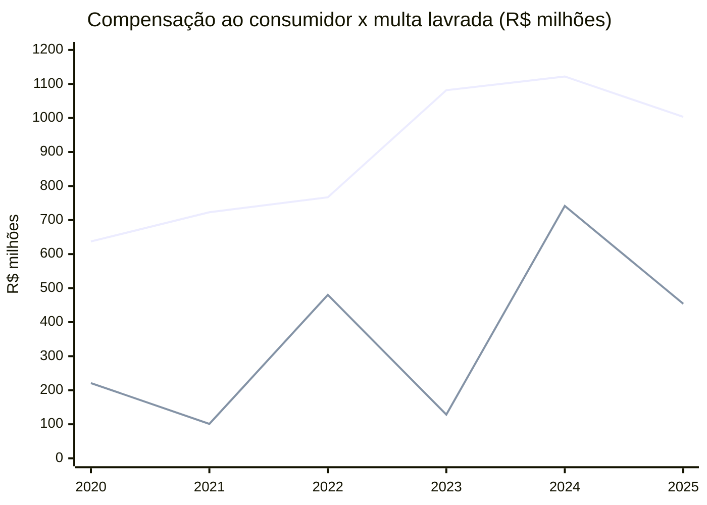

> [!abstract]
> As duas consequências financeiras do descumprimento do padrão de continuidade, lado a lado e no mesmo passo anual: a compensação automática creditada ao consumidor e a multa discricionária aplicada pela fiscalização.

> [!info] Última atualização: 2026-07-27 · Cobertura: 2020-01 a 2025-12 · Cadência: mensal (série anual)

## Série

| Ano | Compensação paga (R$ mi) | Multa lavrada contra distribuidoras (R$ mi) | Autos contra distribuidoras | Autos por continuidade | Multa por continuidade (R$ mi) | Razão compensação/multa |
|---|---:|---:|---:|---:|---:|---:|
| 2020 | 637,1 | 221,1 | 24 | 13 | 128,5 | 2,9 |
| 2021 | 723,1 | 101,0 | 13 | **0** | 0,0 | 7,2 |
| 2022 | 766,9 | 480,2 | 24 | 2 | 29,9 | 1,6 |
| 2023 | 1.081,6 | 128,4 | 16 | **0** | 0,0 | 8,4 |
| 2024 | 1.121,9 | 741,5 | 35 | 3 | 40,6 | 1,5 |
| 2025 | 1.003,4 | 454,2 | 29 | 5 | **0,0** | 2,2 |
| **Total** | **5.334,0** | **2.126,3** | **141** | **23** | **199,1** | **2,5** |

> [!important] Duas colunas que merecem leitura separada
> Em **2021 e 2023 não houve um único auto de infração** por indicadores de continuidade contra distribuidora — anos em que, respectivamente, 1.293 e 1.129 conjuntos encerraram acima do limite. E os **cinco autos de 2025 foram lavrados com multa zero**: penalidade de advertência, sem valor pecuniário. Treze dos 23 autos do período — e 65% do valor — estão concentrados em 2020.

## Marcos regulatórios na série

| Data | Marco | Efeito visível |
|---|---|---|
| 2021-12 | REN 956/2021 revisa o PRODIST | As rubricas de compensação por apuração **anual** desaparecem em 2022 e a trimestral cai 90%; a mensal absorve o movimento e salta de R$ 518 mi para R$ 734 mi |
| 2022–2024 | Limites coletivos endurecidos na revisão tarifária | Limites individuais são vinculados aos coletivos (PRODIST M8, item 216) — régua mais curta gera mais violação individual a igual desempenho |
| 2024-06 | [[Decreto 12.068-2024]] | Nenhum efeito visível na curva de multas: 2024 é o ano de maior valor lavrado, mas por naturezas Técnica e Comercial, não continuidade |

## Leitura da tendência

As duas curvas contam histórias opostas. A compensação sobe de forma quase monotônica — R$ 637 mi em 2020, R$ 1.122 mi no pico de 2024, +76% — e é estável ano a ano, como convém a uma consequência **automática**: ela não depende de decisão de ninguém, decorre do cálculo do indicador. A multa oscila em fator de 7 entre anos vizinhos (R$ 101 mi em 2021, R$ 741 mi em 2024), o que é a assinatura de uma consequência **discricionária**, guiada por ciclo de fiscalização e não por desempenho.

Em seis anos, o consumidor recebeu 2,5 vezes mais em crédito de fatura do que o Estado lavrou em multa. E dos R$ 2,13 bi lavrados, apenas R$ 199 mi (9,4%) tiveram como natureza os indicadores de continuidade.

**Ressalvas de comparabilidade:**

- A quebra de 2022 nas rubricas anual e trimestral está descrita em [[Compensação por Violação dos Limites Individuais de Continuidade]]. O total em R$ é comparável; a decomposição por apuração não é.
- Multa é **valor lavrado**, não arrecadado. Recursos acatados reduzem o valor final e não estão refletidos aqui.
- Autos são atribuídos ao ano de lavratura, que pode estar anos à frente do fato fiscalizado. A série de multas não é uma série de desempenho — é uma série de atividade fiscalizatória.
- Valores **nominais**, sem deflacionamento. Parte do crescimento da compensação é inflação e crescimento do mercado: as unidades consumidoras ativas passaram de 95,1 mi (2023) para 100,3 mi (2025).

---

Fonte: [[Indicadores Coletivos de Continuidade DEC e FEC (ANEEL)]], [[Auto de Infração (ANEEL)]] · Ref: [[Compensação por Violação dos Limites de Continuidade]], [[Serviço Adequado (Distribuição)]]
