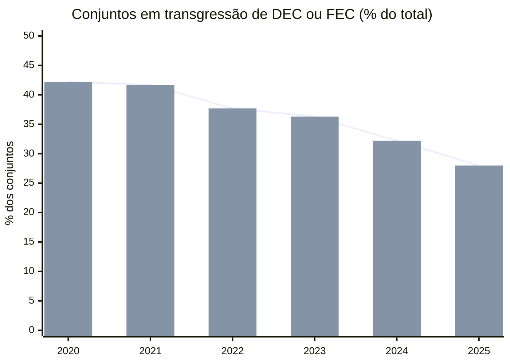

> [!abstract]
> A trajetória anual da conformidade dos conjuntos de unidades consumidoras aos limites de continuidade, entre 2020 e 2025, em passo anual — a curva que mostra se o descumprimento do padrão de qualidade está crescendo ou recuando.

> [!info] Última atualização: 2026-07-27 · Cobertura: 2020-01 a 2025-12 · Cadência: mensal (série anual)

## Série

Todos os conjuntos com doze meses enviados e limite vigente no ano:

| Ano | Conjuntos | Transgrediram | % | DEC apurado (mediana) | Limite de DEC (mediana) | Razão apurado/limite (mediana) | Excedente de DEC (h) |
|---|---:|---:|---:|---:|---:|---:|---:|
| 2020 | 3.120 | 1.318 | 42,2 | 10,69 | 11,00 | 0,887 | 9.889 |
| 2021 | 3.103 | 1.293 | 41,7 | 10,19 | 11,00 | 0,895 | 11.235 |
| 2022 | 3.100 | 1.167 | 37,7 | 9,72 | 11,00 | 0,870 | 10.692 |
| 2023 | 3.112 | 1.129 | 36,3 | 9,51 | 11,00 | 0,866 | 8.586 |
| 2024 | 3.131 | 1.009 | 32,2 | 9,30 | 10,00 | 0,858 | 6.419 |
| 2025 | 3.146 | 881 | 28,0 | 8,65 | 10,00 | 0,826 | 3.821 |

### Painel equilibrado — os mesmos 2.417 conjuntos nos seis anos

Controla a entrada e saída de conjuntos do universo, que muda quando a ANEEL subdivide ou reagrupa conjuntos (PRODIST M8, item 213):

| Ano | DEC apurado (mediana) | Limite (mediana) | % em transgressão |
|---|---:|---:|---:|
| 2020 | 10,19 | 11,00 | 41,8 |
| 2021 | 9,83 | 11,00 | 42,1 |
| 2022 | 9,31 | 10,00 | 37,5 |
| 2023 | 9,06 | 10,00 | 36,1 |
| 2024 | 8,95 | 10,00 | 31,7 |
| 2025 | 8,31 | 10,00 | 28,1 |

## Marcos regulatórios na série

| Data | Marco | Efeito visível |
|---|---|---|
| 2021-12 | REN ANEEL 956/2021 aprova a revisão do PRODIST (Módulo 8 = Anexo VIII) | Inflexão da curva a partir de 2022: queda de 4,0 p.p. de uma vez, a maior do período |
| 2022–2024 | Ciclo de revisões tarifárias fixa novos limites anuais (PRODIST M8, item 212) | Mediana do limite de DEC cai de 11 h para 10 h — **o denominador endurece enquanto o numerador cai** |
| 2024-06 | [[Decreto 12.068-2024]] condiciona a prorrogação da concessão ao critério de continuidade | Queda acelera: −4,1 p.p. em 2024 e −4,2 p.p. em 2025, contra −0,6 p.p. em 2021 |

## Leitura da tendência

A conformidade melhorou de forma consistente e a melhora é **real, não artefato de limite frouxo**: a mediana do limite anual de DEC caiu de 11 h para 10 h no período — a régua ficou mais curta — e ainda assim a proporção de conjuntos acima dela caiu de 42,2% para 28,0%. O painel equilibrado reproduz o mesmo movimento (41,8% → 28,1%), o que afasta a hipótese de que a queda venha da entrada de conjuntos novos e melhores.

O excedente agregado, que mede o **tamanho** da falha e não só a sua ocorrência, caiu mais rápido do que a contagem: de 9.889 para 3.821 horas (−61%), contra −33% na taxa de transgressão. Ou seja, quem ainda transgride transgride por menos. Essa é a evidência mais forte da série.

**Ressalvas de comparabilidade:**

- 2021 é o único ano em que o excedente **sobe** (11.235 h) sem que a taxa suba na mesma proporção. Concentração de eventos climáticos severos é a hipótese natural, mas não foi testada — exigiria o conjunto de ocorrências emergenciais e a marcação de Dia Crítico.
- O universo de conjuntos oscila entre 3.100 e 3.146 por subdivisão e reagrupamento. O painel equilibrado existe justamente para isolar esse efeito.
- Ver a ressalva sobre agregação temporal ponderada em [[Transgressão dos Limites Coletivos de Continuidade]].

---

Fonte: [[Indicadores Coletivos de Continuidade DEC e FEC (ANEEL)]] · Ref: [[Indicadores Coletivos de Continuidade (DEC e FEC)]], [[Serviço Adequado (Distribuição)]]
