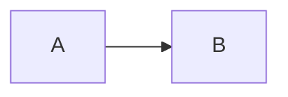

> [!abstract]
> Definição em uma frase. Deve responder "o que é" sem depender de nada.

## Conceito

Explicação em prosa curta. Por que existe, que problema resolve, como se distingue de conceitos vizinhos.

## Estrutura / Fluxo

## Características

- Atributo que define o conceito
- Atributo que define o conceito

## Comparação

| | <Este conceito> | <Conceito confundível> |
|---|---|---|
| Critério | | |

## Veja também

- [[Conceito Relacionado]]
