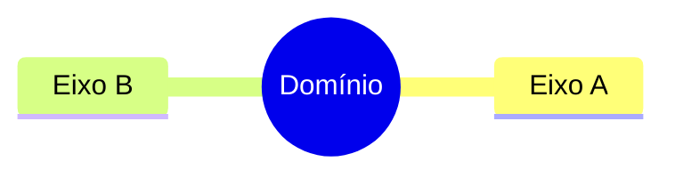

> [!abstract]
> O que este mapa organiza e para quem serve.

# Visão Geral

```mermaid
mindmap
  root((Domínio))
    Eixo A
    Eixo B
```

# <Camada / Eixo>

- [[Nota]]
- [[Nota]]

# Perguntas de Pesquisa

> [!question]
> As lacunas conhecidas do domínio.
