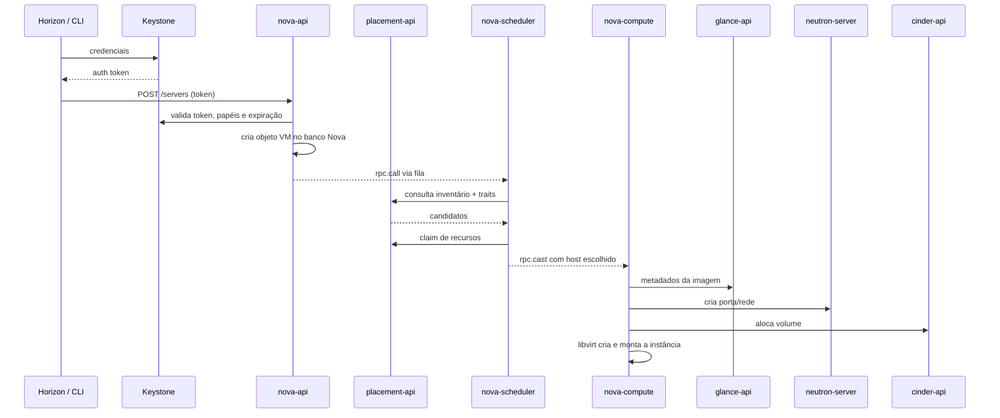

## Resumo executivo

O capítulo reapresenta o ecossistema OpenStack a partir do release **Antelope**, separando o que é **núcleo estável** do que é **extensão incubada**, e conduz a primeira iteração de arquitetura de uma nuvem privada: desenho **conceitual → lógico → físico**, encerrando com um exercício numérico de **planejamento de capacidade**.

A tese central é que OpenStack não se escolhe por curiosidade técnica — se escolhe por um caso de negócio. O autor lista sete motivações recorrentes e argumenta que empresas que adotaram OpenStack sem definir a sua desistiram no meio do caminho.

## Principais ideias

- **O design modular e a API são o segredo do projeto.** Escrito majoritariamente em Python, cada serviço expõe uma API REST própria; toda comunicação entre serviços passa por API. É isso que permite automação, extensão por terceiros e — via API compatível com EC2 — a ponte com o mundo AWS.
- **Control plane × data plane.** API endpoints, agendamento, imagem, identidade e os serviços compartilhados (banco de dados e fila de mensagens) formam o [[Control Plane]]. O tráfego de instância, o overlay de rede e o armazenamento formam o data plane.
- **Serviços core são poucos; o resto é catálogo.** Nova, Neutron, Keystone, Glance, Cinder, Swift, Placement, Manila, Ceilometer, Aodh e Horizon compõem o núcleo. Heat, Trove, Sahara, Ironic, Murano, Designate, Barbican, Magnum e Octavia entram como XaaS opcional.
- **O fluxo de criação de instância é o mapa vivo da arquitetura.** Trinta passos que atravessam Keystone → Nova API → Placement → Nova Scheduler → Nova Conductor → Nova Compute → Glance → Neutron → Cinder → Ceilometer, sempre com token de autenticação e sempre pela fila de mensagens quando a comunicação é interna.
- **Segmentação de rede é decisão de segurança, não de performance.** Quatro redes distintas — external, management, tenant e storage — com o trade-off explícito: mais complexidade em troca de isolamento.
- **Capacidade se planeja a partir do flavor, não do hardware.** O raciocínio é reverso: define-se o catálogo de flavors que o negócio precisa oferecer e daí se deriva CPU, RAM, disco e rede do nó de computação.

## Conceitos apresentados

### Núcleo do control plane

| Serviço | Code name | Papel |
|---|---|---|
| Identidade | [[Keystone]] | Autenticação, autorização e o **catálogo de serviços** (mapa de endpoints) |
| Computação | [[Nova]] | Ciclo de vida da instância; subcomponentes `nova-api`, `nova-scheduler`, `nova-conductor`, `nova-compute` |
| Agendamento | [[Placement]] | Inventário de resource providers e **pré-filtragem** antes do scheduler |
| Imagem | [[Glance]] | Ciclo de vida de imagens e snapshots; 11+ formatos (RAW, QCOW2, VDI, VHD, ISO, OVA, AMI…) |
| Object storage | [[Swift]] | Armazenamento de objetos sem SPOF, REST, consistência eventual |
| Block storage | [[Cinder]] | Volumes e snapshots de instância; `cinder-api`, `cinder-scheduler`, `cinder-volume` |
| File share | [[Manila]] | Sistemas de arquivos compartilhados (CephFS, LVM, HDFS…) |
| Rede | [[Neutron]] | Rede como serviço autônoma, sucessora do `nova-network` |
| Telemetria | [[Ceilometer]] | Coleta de métricas por polling ou notificação |
| Alarme | [[Aodh]] | Dispara alarmes sobre as métricas coletadas |
| Dashboard | [[Horizon]] | GUI em Django sobre as APIs |

### Serviços não-OpenStack do control plane

- **AMQP** — RabbitMQ (mais comum), Qpid ou ZeroMQ. Todo request assíncrono entre subcomponentes passa por `rpc.call` (síncrono, espera resposta) ou `rpc.cast` (fire-and-forget) publicados no barramento.
- **Banco de dados** — MySQL/MariaDB. Cada serviço tem seu **schema lógico dedicado**. O `nova-conductor` existe justamente para impedir que o `nova-compute`, rodando em host potencialmente comprometido, toque o banco diretamente — redução de raio de explosão.

### Serviços estendidos (XaaS)

| Serviço | Release | Categoria |
|---|---|---|
| Heat | Havana | Orquestração (PaaS) via HOT em YAML/JSON |
| Trove | Icehouse | DBaaS |
| Sahara | Juno | EDPaaS (Hadoop, Spark) |
| [[Ironic]] | Kilo | BMaaS — provisiona metal puro, sem hypervisor |
| Murano | Kilo | AaaS — catálogo de aplicações |
| Designate | Liberty | DNSaaS |
| Barbican | Liberty | SMaaS — segredos, chaves e certificados |
| [[Magnum]] | Liberty | CaaS — orquestra COEs (Kubernetes, Swarm, Mesos) |
| [[Octavia]] | Liberty | LBaaS de classe enterprise |

### Motivações de negócio para uma nuvem privada

Sete casos que justificam o investimento: acelerador de desenvolvimento (CI/CD multi-tenant), habilitador de aplicações cloud, suporte a [[HPC]], moderador de [[Network Functions Virtualization (NFV)]], facilitador de big data, provedor de nuvem privada e provedor de nuvem pública.

> [!important] OpenStack é investimento de longo prazo
> Economia operacional e de custo só aparece em estágios tardios. Sem caso de negócio definido no dia um, o "paradoxo da escolha" entre dezenas de serviços trava o projeto antes dele começar.

### As quatro redes do desenho lógico

| Rede | Plano | Função |
|---|---|---|
| External | Data | Conecta ao mundo externo; IPs roteáveis; expõe as APIs atrás de load balancer |
| Management | Control | Interconecta os nós; banco e fila vivem aqui; nunca exposta |
| Tenant (overlay/guest) | Data | Tráfego das instâncias; onde entra o [[Software-Defined Networking (SDN)]] |
| Storage | Data | Liga nós de computação aos nós de armazenamento |

> [!info] Provider network
> Alternativa em que a instância usa rede física direta em vez do overlay do Neutron, recebendo floating IP para alcançar o exterior.

## Exemplos

### Fluxo de criação de instância (visão condensada)



### Planejamento de capacidade — 200 VMs de flavor Small

Catálogo de flavors da referência:

| Flavor | vCPU | RAM (MB) | Disco (GB) |
|---|---:|---:|---:|
| Tiny | 1 | 512 | 10 |
| Small | 1 | 1024 | 20 |
| Medium | 2 | 2048 | 40 |
| Large | 4 | 4096 | 80 |

**CPU** — premissas: 2,6 GHz por core físico, 2 GHz por VM, overcommit 16:1, overhead de SO 20%.

```
(200 VMs × 2 GHz) / 2,6 GHz  = 154 vCPU
154 + 20% de overhead        = 185 vCPU
185 / 16 (overcommit)        = 12 cores físicos
```

**RAM** — 1024 MB por instância, overcommit 1:1, overhead 20%.

```
200 × 1024 MB = 200 GB
200 + 20%     = 240 GB
240 / 1       = 240 GB de RAM no nó
```

**Disco** — 200 × 40 GB ≈ 800 GB, arredondado para 900 GB–1 TB por causa de swap e cache.

**Rede** — 50 Mbit/s por interface virtual, 1 link de 10 GB servindo 200 VMs, e um pool de floating IPs: 200 (instâncias) + 200 (10 routers × 20 tenants) + 200 (10 LBs × 20 tenants) + 10% de reserva = **660 floating IPs**.

> [!warning] Overcommit de memória não é como o de CPU
> O padrão do Nova é 1:1,5 para RAM. Diferente da CPU, o overcommit de memória degrada a performance da instância se não houver swap planejado — a recomendação é o dobro do provisionado.

> [!tip] Três princípios da capacidade em nuvem
> **Operar com elasticidade** (puxar recursos por automação), **esperar falhar** (recurso substituível sem reconfiguração) e **rastrear o crescimento** (o consumo on-demand não é linear). O autor recomenda ancorar isso na gestão de capacidade do [[ITIL 5|ITIL]].

---
Ref: [[Mastering OpenStack]], [[OpenStack]], [[Control Plane]], [[Infrastructure as a Service (IaaS)]], [[Capacity Planning]], [[Flavor]], [[Overcommitment]]
