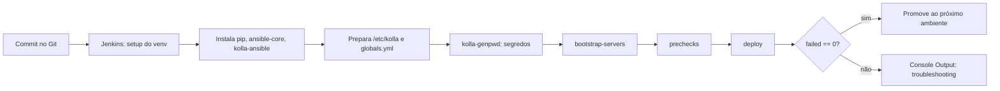

## Resumo executivo

O capítulo defende que **o destino não é ter OpenStack rodando — é o processo de implantação**. Um ecossistema com dezenas de serviços interdependentes só é sustentável se for tratado como código, implantado por pipeline e verificado por segurança automatizada em cada estágio.

A progressão é: [[DevOps]] → [[DevSecOps]] → [[Infrastructure as Code]] → containers ([[Kolla-Ansible]]) → pipeline CI/CD (Jenkins) → varredura de vulnerabilidade em imagem (Anchore).

## Principais ideias

- **DevOps é removedor de silos, não ferramenta.** Os princípios citados: compartilhar conhecimento e responsabilidade, respeito, automatizar tudo, monitorar continuamente, abraçar a falha e projetar para reuso.
- **Shift left de segurança.** O estudo *2021 State of DevSecOps* apontou que 75% dos profissionais de TI acham que segurança atrasa o release — exatamente a crença que o DevSecOps ataca. Segurança reativa custa mais em orçamento e tempo do que preventiva.
- **Gado, não bicho de estimação.** A analogia [[Pets vs Cattle]] é o que torna a segurança automatizável: se o servidor é imutável e substituível, existe uma única fonte da verdade (o código) para varrer.
- **Container resolve o inferno de dependências do OpenStack.** Upgrade de release sempre foi bloqueador porque não há rollback barato em bare metal ou VM. Com Docker, o artefato é a imagem: versionada, portátil e descartável.
- **O deploy tem que ser incremental.** Começa all-in-one no laptop (Vagrant + VirtualBox), vira multi-node em staging, e só então produção — com os papéis separados progressivamente, nunca de uma vez.

> [!warning] Não coloque workload de usuário antes da redundância
> O autor é explícito: nenhum workload de produção deve entrar antes de haver um mínimo de redundância no control plane e no data plane.

## Conceitos apresentados

### As quatro métricas de IaC a monitorar

| Métrica | O que mede |
|---|---|
| Deployment frequency | Com que frequência o IaC é implantado |
| Change lead time | Do commit até o deploy bem-sucedido |
| Change failure rate | % de mudanças que causaram degradação ou outage |
| [[Mean Time to Restore (MTTR)]] | Tempo para restaurar o serviço a partir da degradação |

Acompanhadas da recomendação de **trunk-based development**: merges frequentes no tronco comum, releases menores e mais frequentes, mais visibilidade de segurança.

### Ansible como ferramenta de gestão

Escolhido por ser **sem agente**, declarativo e escrito em YAML. Vocabulário:

| Termo | Definição |
|---|---|
| Playbook | Série de ações em YAML, executadas de cima para baixo, sobre um host ou grupo |
| Role | Estrutura organizacional do playbook: tarefas, variáveis e módulos que instalam um serviço |
| Module | Unidade abstrata de funcionalidade; a biblioteca core já vem embarcada |
| Variable | Valor dinâmico que propaga estados diferentes entre ambientes com o mesmo código |
| Inventory | Lista dos hosts gerenciados, agrupada por papel |

### Kolla-Ansible

Subprojeto oficial do OpenStack desde o release **Liberty**. A missão declarada: *"prover containers production-ready e ferramentas de implantação para operar nuvens OpenStack"*.

- Um container Docker **por serviço** OpenStack.
- **Jinja2** parametriza os Dockerfiles, permitindo construir a mesma imagem sobre CentOS, Debian, Fedora, Ubuntu ou RHEL.
- Suporta topologia **all-in-one** e **multi-node** com o mesmo código.
- Alternativa citada: **OSA (OpenStack-Ansible)**, que usa LXC em vez de Docker.

> [!important] Por que Docker e não LXC neste desenho
> A natureza em camadas da imagem, o versionamento e a portabilidade fazem do container um **artefato de pipeline** — construído uma vez, promovido entre ambientes. É isso que o LXC não entrega com a mesma naturalidade.

### Arquivos de configuração do Kolla-Ansible

| Arquivo | Papel |
|---|---|
| `globals.yml` | Distro base, interfaces de rede, VIP interna, registry Docker, HAProxy on/off |
| `passwords.yml` | Centraliza todos os segredos; populado por `kolla-genpwd` |
| `inventory` (all-in-one / multinode) | Grupos de host Ansible: `[control]`, `[network]`, `[compute]`, `[storage]` |

## Exemplos

### Pipeline de implantação como código



Estágios do `Jenkinsfile` (SCM, sintaxe Groovy, versionado junto do IaC): *Setup Local Environment → Installing pip → Installing Ansible → Installing Kolla Ansible → Preparing Infrastructure → Secrets Setup → Bootstrap Servers → Infrastructure Pre-Checks → Deploy Infrastructure*.

### Sequência mínima de um all-in-one local

```bash
# ambiente local: Vagrant + VirtualBox, Ubuntu 22.04, 8 GB RAM, 4 vCPU, 55 GB
vagrant init && vagrant up --provider virtualbox

# runtime
pip install 'ansible-core>=2.16,<2.17.99'
pip install git+https://opendev.org/openstack/kolla-ansible@master
kolla-ansible install-deps

# configuração
kolla-genpwd -p /etc/kolla/passwords.yml

# implantação
kolla-ansible -i /etc/kolla/all-in-one bootstrap-servers
kolla-ansible -i /etc/kolla/all-in-one prechecks
kolla-ansible -i /etc/kolla/all-in-one deploy
kolla-ansible post-deploy      # gera cloud.yaml com as credenciais admin

# validação
export OS_CLIENT_CONFIG_FILE=/etc/kolla/cloud.yaml
openstack hypervisor list
```

Operação dos serviços passa a ser operação de container: `docker ps`, `docker logs keystone`, `docker inspect keystone`, `docker exec -it nova /bin/bash`.

### Pipeline de imagem com portão de segurança

Três estágios, com **falha do build como controle**:

1. `kolla-build -b ubuntu` — constrói as imagens dos serviços.
2. `anchore-cli image add` — varre vulnerabilidades na imagem construída.
3. `kolla-build --registry <host>:4000 --push` — só empurra ao registry privado se a política do Anchore passar.

> [!info] Sobre o Anchore
> A versão open source do Anchore Engine não é mais mantida (substituída por edição enterprise). Os sucessores citados pelo próprio projeto são **syft** (SBOM) e **grype** (varredura de vulnerabilidade).

---
Ref: [[Mastering OpenStack]], [[Mastering OpenStack 01]], [[DevSecOps]], [[Infrastructure as Code]], [[Kolla-Ansible]], [[Pets vs Cattle]], [[Pipeline de CI-CD]], [[Kolla-Ansible]]
