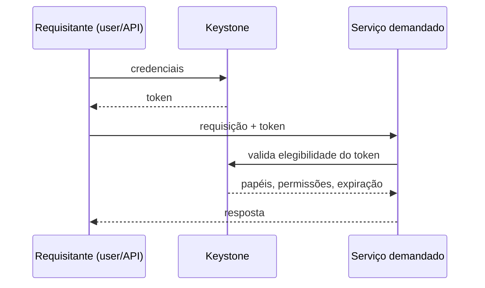

## Resumo executivo

O capítulo delimita o **perímetro do control plane** do OpenStack e mostra que continuidade de negócio na nuvem privada é, na prática, uma propriedade desse plano. Divide-o em duas categorias — **serviços OpenStack** (APIs, schedulers, endpoints) e **serviços de infraestrutura compartilhados** (fila, banco, cache) — e argumenta que os segundos precisam do mesmo rigor de projeto para falha que os primeiros.

Termina traduzindo o desenho em papéis físicos (`cloud controller`, `compute`, `network`, `storage`, `deployer`), segmentação de rede em VLANs e um inventário Ansible que é a **fonte da verdade** de qual serviço roda onde.

## Principais ideias

- **Control plane é um conceito de rede, emprestado.** Descreve *como um pedido é processado e atendido*. No OpenStack, o **cloud controller** é o nó que carrega a maior parte dele.
- **Keystone é o hub de segurança, e o default não serve.** A configuração padrão deixa lacunas; governança e compliance exigem decidir explicitamente domínio, projeto, papel e backend de identidade.
- **O Placement transformou agendamento em contabilidade de inventário.** Antes do Newton só se rastreava CPU e RAM. Hoje rede e storage também publicam inventários, e o scheduler consulta um modelo unificado.
- **Prepare-se para falhar antes de escalar.** Active/active (com load balancer, clustering assimétrico) ou active/passive (com resource manager, clustering simétrico) são decisões da primeira iteração, não da última.
- **Adicionar um controller não pode perturbar as APIs em execução.** É por isso que o pipeline CI/CD — e não o operador — é a fonte da verdade do cluster.

## Conceitos apresentados

### Glossário do Keystone

| Termo | Definição |
|---|---|
| **Project** | Substituiu *tenant* na Identity API v3. Construção lógica que isola um conjunto de recursos |
| **Domain** | Camada acima: contém usuários, grupos e projetos. Útil para departamentos de uma corporação |
| **Role** | Permite atribuir o mesmo usuário a projetos distintos com autorizações distintas, sem duplicar identidades |
| **Catalog** | Serviço de descoberta: registra os endpoints de todos os serviços OpenStack |
| **Token** | Cartão de informação — valida usuário, expiração, projetos associados e endpoints alcançáveis |
| **Unscoped token** | Token sem escopo de autorização; evita loop excessivo de autenticação e depois é reduzido a *scoped* |
| **User / Group** | Requisitante de API / coleção de requisitantes do mesmo domínio |

**Backends de autenticação suportados:** SQL (padrão), LDAP (Keystone só lê/escreve, não é IdP) e **IdP federado** (Keystone vira *service provider* e estabelece relação de confiança — SAML2, OpenID Connect sobre OAuth, Active Directory).

> [!info] Estado atual da autenticação
> O `kolla-ansible` no Antelope e posteriores usa **tokens Fernet** por padrão, no lugar dos antigos tokens baseados em PKI. Keystone ganhou também OAuth 2.0 Mutual TLS e um plugin para OAuth 2.0 Device Authorization Grant.

#### Fluxo de requisição



### Modelo de dados do Placement

| Construto | O que é |
|---|---|
| **Resource provider** | O recurso subjacente abstraído: nó de computação, pool de storage, rede |
| **Resource class** | Tipo do recurso. Padrão: `VCPU`, `MEMORY_MB`, `DISK_GB`, `IPV4_ADDRESS`, `PCI_DEVICE`, `SRIOV_NET_VF`, `NUMA_CORE`, `VGPU`. Custom: prefixo `CUSTOM_` |
| **Inventory** | Conjunto de resource classes que um provider oferece (ex.: 16 VCPU + 4096 MEMORY_MB + 200 DISK_GB) |
| **Trait** | Característica qualitativa do provider (`HW_CPU_X86_SVM`, `is_SSD`). Pode vir da imagem Glance ou do `extra_specs` do flavor |
| **Allocation** | Registro de que uma instância (consumer) ocupa recursos de um provider |
| **Allocation candidates** | Lista de providers viáveis, recalculada pelo Placement a cada requisição |

> [!tip] Agendamento por largura de banda
> O caso mais elegante do capítulo: o Neutron cria um resource provider **filho** do provider de computação e publica inventário de banda. O Nova então pede `GET /allocation_candidates` e escolhe o nó de computação pela rede disponível, não só por CPU e RAM.

### Serviços compartilhados (não-OpenStack)

| Serviço | Escolha | Nota de projeto |
|---|---|---|
| Fila de mensagens | **RabbitMQ** | Nó dedicado é recomendado (não obrigatório); em multi-região vira cluster próprio. Suporta TLS — **desabilitado por padrão** no Kolla |
| Banco de dados | **MariaDB + Galera** | Cluster multi-master; o chaveamento entre instâncias depende do HAProxy |
| Cache | **Memcached** | Opcional, mas recomendado desde o início: pegada leve e absorve a validação de token entre Keystone e os demais serviços |

> [!warning] RabbitMQ é o alvo mais silencioso
> Ele fica entre praticamente todos os serviços. Sem TLS, mensagens em trânsito podem ser adulteradas — e o padrão do Kolla é TLS desligado (`rabbitmq_enable_tls`).

### Padrões de disponibilidade do control plane

| Padrão | Clustering | Entrada | Comportamento |
|---|---|---|---|
| **Active/active** | Assimétrico | Load balancer distribui | Todos os nós processam; ganho de performance e escala |
| **Active/passive** | Simétrico | Não requer LB | Nós standby ("sleepy watchers") assumem só na falha; um resource manager garante um único ativo |

O Kolla implementa isso com a stanza `hacluster`: **HAProxy** para balanceamento e **Keepalived** para health check dinâmico via **VIP**.

## Exemplos

### Papéis físicos do desenho multi-node

| Papel | O que roda |
|---|---|
| **Cloud controller** | APIs OpenStack, Keystone, Glance, Manila, Ceilometer, Horizon + MariaDB/Galera, RabbitMQ, Memcached |
| **Compute** | KVM, `nova-compute`, agentes de rede |
| **Network** | Agentes Neutron: `l3`, `lbaas`, `dhcp`, plugins; `manila-share` |
| **Storage** | `cinder-volume` |
| **Deployer** | Ansible, Kolla builder, servidor CI, registry Docker privado |

### Segmentação física e VLANs

| Rede | Interface | Pool IP | VLAN |
|---|---|---|---|
| Management | `eth0` | 10.0.0.0/24 | 100 |
| Overlay/tenant | `eth1` | 10.10.0.0/24 | 200 |
| External | `eth2` | 10.20.0.0/24 | 300 |
| Storage | `eth3` | 10.30.0.0/24 | 400 |

### Especificação de hardware por papel

| Host | Cores | RAM | Disco | Rede |
|---|---:|---:|---:|---|
| `cc01.os` (controller) | 8 | 128 GB | 250 GB | 4 × 10 GB |
| `cn01.os` (compute) | 12 | 240 GB | 500 GB | 4 × 10 GB |
| `net01.os` (network) | 4 | 32 GB | 250 GB | 4 × 10 GB |
| `storage01.os` | 4 | 32 GB | 1 TB | 4 × 10 GB |

Todos com Ubuntu 22 LTS, OpenSSH, Python e cliente NTP. O autor reforça: OpenStack roda em **commodity hardware** — a tabela não prescreve modelo.

### Inventário Ansible como fonte da verdade

Grupos de host do Kolla: `control`, `compute`, `network`, `haproxy`, `storage`, `monitoring`, `logging`, `deployment`, `object`.

```ini
[control]
cc01.os.packtpub

# serviços compartilhados herdam o grupo control
[mariadb:children]
control
[rabbitmq:children]
control
[memcached:children]
control

# núcleo do control plane
[keystone:children]
control
[nova:children]
control
[placement:children]
control
[neutron-server:children]
control

# o compute node só roda nova-compute e agentes
[compute]
cn01.os.packtpub
[ceilometer-compute:children]
compute
[neutron-ovn-agent:children]
compute

# o network node roda todos os agentes Neutron, menos a API
[network]
net01.os.packtpub
[neutron-dhcp-agent:children]
neutron
[neutron-l3-agent:children]
neutron
[manila-share:children]
network
```

> [!important] A sintaxe `[serviço:children]` é o mecanismo de granularidade
> Sem declaração explícita, o serviço cai no grupo `control`. É assim que se separa, por exemplo, o `swift-proxy-server` (controller) dos `swift-account/container/object-server` (nós de objeto).

### Três níveis de configuração do Kolla-Ansible

1. `/etc/kolla/globals.yml` — hub central e de alto nível.
2. `/kolla-ansible/ansible/group_vars/all.yml` — defaults por serviço; o que não estiver declarado no `globals.yml` vem daqui.
3. `/kolla-ansible/ansible/roles/<serviço>/defaults/main.yml` — ajuste fino (ex.: `memcached_max_memory`, conexões máximas do HAProxy).

Parâmetros da iteração de produção: `kolla_base_distro: ubuntu`, `nova_compute_virt_type: kvm`, `neutron_plugin_agent: openvswitch`, `enable_neutron_provider_networks: yes`, `docker_registry: docker-registry:4000`.

> [!info] Serviços desabilitados por padrão no Kolla
> Cinder, Swift, Manila, Ceilometer e Aodh **não** vêm ligados. Horizon vem, junto do `enable_openstack_core`. Cinder ainda exige um volume group LVM chamado `cinder-volumes` criado previamente.

---
Ref: [[Mastering OpenStack]], [[Mastering OpenStack 02]], [[Mastering OpenStack 04]], [[Control Plane]], [[Keystone]], [[Placement]], [[Identity Federation]], [[High Availability]], [[Active-Active vs Active-Passive]]
