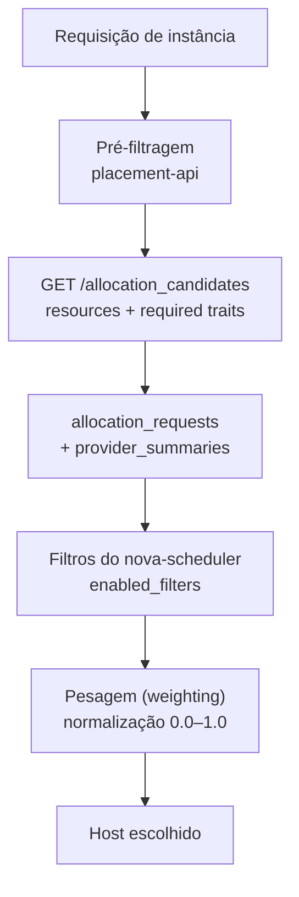

## Resumo executivo

O capítulo disseca o cavalo de batalha da nuvem: o **Nova**. Percorre os subcomponentes, os hipervisores suportados, os quatro mecanismos de **segregação de computação** (região, availability zone, host aggregate, cell) e a mecânica completa de escolha de host — **pré-filtragem no Placement → filtros no scheduler → pesagem (weighting)**. Fecha estendendo o compute para containers com [[Magnum]] e [[Zun]].

A tese operacional: sem uma estratégia de segregação definida, você não conhece os limites da sua infraestrutura nem consegue prever a demanda dos usuários.

## Principais ideias

- **O conductor existe por segurança, não por performance.** Antes dele, o nó de computação atualizava o banco diretamente. Isolar o `nova-compute` do banco reduz o raio de explosão quando um hipervisor é comprometido.
- **Segregação tem quatro granularidades, e elas se compõem.** Região (deployment inteiro e independente) contém availability zones (domínios de falha físicos), que contêm host aggregates (agrupamento por metadado de hardware). Cells são ortogonais: dividem o banco e a fila, não a topologia física.
- **Um nó de computação pertence a exatamente uma AZ, mas a vários host aggregates.** A AZ está amarrada ao desenho físico (rack, PDU, ToR); o aggregate é um rótulo lógico.
- **O Placement resolveu o problema de escala do scheduler.** Antes, o `nova-scheduler` varria toda a fazenda de compute a cada requisição. Agora um `resource_tracker` em cada nó publica inventário, e a pré-filtragem acontece por consulta de API.
- **Spread é o padrão; stacking é escolha.** Por default o scheduler espalha instâncias. Ajustando os multiplicadores de peso, empilha-se até exaurir um host antes de ir ao próximo.

## Conceitos apresentados

### Subcomponentes do Nova

| Componente | Onde roda | Papel |
|---|---|---|
| `nova-api` | Controller | Primeira interface; aceita a requisição HTTP e a encaminha pela fila |
| `nova-scheduler` | Controller | Decide o nó de computação por filtros e pesos |
| `nova-conductor` | Controller | Isola o compute do banco; operações de longa duração |
| `nova-compute` | Compute | Fala com o hipervisor via **Virt Driver → libvirt** |
| `nova-novncproxy` | Controller | Acesso a console |

Consoles suportados no Antelope: noVNC, **SPICE**, serial, RDP (só Hyper-V, exige FreeRDP-WebConnect de terceiros) e MKM (vSphere). O `nova-consoleauth` está **depreciado desde o Train**.

> [!info] Hipervisores fora da lista
> Xen, XCP, UML e o driver Docker não aparecem mais no Antelope/Bobcat. O driver Docker virou projeto próprio: o **Zun**.

O hipervisor se configura em `compute_driver` no `/etc/nova/nova.conf`. Para KVM, valida-se com `lsmod | grep kvm` (esperando `kvm_intel` ou `kvm_amd`) e persiste-se em `/etc/modules`.

### As quatro formas de segregação

| Mecanismo | O que separa | Custo operacional |
|---|---|---|
| **Region** | Deployment OpenStack completo e independente, com API própria no catálogo do Keystone | Alto — risco de split brain, exige consistência de imagens, banco e autorização entre regiões |
| **Availability Zone** | Domínio de falha físico: rack, PDU, ToR switch | Baixo — não exige control plane separado. Abrange também rede e block storage |
| **Host Aggregate** | Agrupamento por metadado de hardware (hipervisor, SSD, GPU, banda, tenant único) | Baixo — puro rótulo lógico, criado pelo operador |
| **Cell** | Banco de dados e fila de mensagens (sharding) | Médio — muda o fluxo de agendamento |

> [!important] AZ × Host Aggregate
> A AZ é **exclusiva e física**: um compute node pertence a uma só, porque está preso ao rack. O host aggregate é **múltiplo e lógico**: o mesmo nó pode estar em vários, e aggregates podem atravessar AZs e até regiões.

#### CellV1 × CellV2

| | CellV1 | CellV2 |
|---|---|---|
| Estrutura | Árvore (root → child → grandchild) | Plana, duas camadas, todas as cells iguais |
| Componente dedicado | `nova-cell` | Removido |
| Agendamento | Duas camadas: escolhe a cell, depois o host dentro dela | Uma camada: o `nova-scheduler` da API cell agenda uniformemente |
| Dados | Replicação pesada entre cells | Bancos separados por cell, sem replicação |
| Release | Juno | Oficial desde **Ocata** |

Na CellV2, a **API cell** roda `nova-api`, `nova-scheduler`, Placement e o **`nova-super-conductor`**, com o banco `nova_api` guardando metadados globais (flavors, quotas, keypairs). A **Cell0** não roda serviço nenhum: só guarda o banco `nova_cell0` com as instâncias que falharam ao agendar.

```
1. nova-api recebe o REST e encaminha ao nova-scheduler
2. nova-scheduler consulta o Placement, aplica filtros, escolhe o host
3. nova-api grava o mapeamento em nova_api.instance_mappings
4. nova-api grava o registro no banco da cell alvo (nova_cell01)
5. nova-api → RPC → nova-super-conductor
6. nova-super-conductor → RPC → nova-conductor da cell → nova-compute
```

### O funil de agendamento



**Filtros comuns:**

| Filtro | O que faz |
|---|---|
| `ComputeFilter` | Devolve apenas hipervisores operacionais (ligado por padrão) |
| `ComputeCapabilitiesFilter` | Hosts capazes de rodar o flavor pedido (extra specs) |
| `ImagePropertiesFilter` | Hosts que atendem as propriedades da imagem: `hw_architecture`, `img_hv_type`, etc. |
| `ServerGroupAntiAffinityFilter` | Espalha instâncias do mesmo grupo em hosts **diferentes** — para HA |
| `ServerGroupAffinityFilter` | Concentra instâncias do mesmo grupo no **mesmo** host — para latência baixa |

**Pesagem** — cada nó recebe um valor normalizado entre 0.0 e 1.0 por recurso:

```
norm_factor = (host_availability_resource − min_value_all) / (max_value_all − min_value_all)
peso_final  = Σ (weight(i) × norm_factor)
```

> [!tip] Novidade do Bobcat
> O `NumInstancesWeigher` pesa pelo número de instâncias ativas: multiplicador **+1** empacota (favorece o host mais cheio), **−1** espalha (favorece o menos ocupado).

### Magnum — COE as a Service

| Termo | Definição |
|---|---|
| **Bay** | Conjunto de nós rodando um COE. Implantado pelo **Heat**, composto de instâncias Nova (VM ou bare metal) |
| **BayModel** | Template dos recursos que compõem um bay; reutilizável entre COEs distintos |
| **Pod** | Grupo de containers no mesmo nó do COE |
| **Service** | Abstração de arranjo de bays e políticas de acesso |
| **Replication controller** | Monitora, replica e re-spawna containers; escala pods |
| **Magnum client** | Delega ao cliente nativo: `docker` para Swarm, `kubectl` para Kubernetes |

Integrações: **Keystone** (papéis Kubernetes derivados de identidade OpenStack), **Neutron** (Flannel como overlay padrão), **Glance** (imagem pré-construída dos nós), **Cinder** (storage efêmero e persistente; driver Rexray para Swarm).

> [!important] Isolamento é a garantia do Magnum
> Cada bay é isolado dos demais e **não pode ser compartilhado entre tenants** — é o que torna o serviço multi-tenant seguro por desenho.

### Zun — containers sem orquestrador

Zun roda containers **diretamente** no OpenStack, sem COE. Duas dependências próprias:

- **Kuryr** — integra com Neutron via `libnetwork` para rede de container.
- **Fuxi** — usa a API Docker para volumes respaldados por Cinder e Manila.

```bash
openstack appcontainer service list
openstack appcontainer create --name container_pp_zun cirros
openstack appcontainer attach container_pp_zun   # equivalente ao docker attach
```

> [!important] Magnum × Zun × nova-docker
> **Magnum** entrega um cluster de orquestração (Kubernetes/Swarm) como recurso. **Zun** entrega o container em si, como recurso de primeira classe do OpenStack. O antigo **nova-docker** tratava o container como se fosse uma VM — foi por isso que morreu.

## Exemplos

### Quatro host aggregates sobre AZs e regiões

| Aggregate | Espalhamento | Metadado / workload |
|---|---|---|
| HA_1 | 1 região, 1 AZ | GPU + banda alta, baixa latência — HPC. HA não é exigência |
| HA_2 | 1 região, 2 AZs | SSD + memória + banda — big data (Hadoop, Cassandra) |
| HA_3 | 2 regiões, 3 AZs | Capacidades padrão — aplicações web críticas, máxima disponibilidade |
| HA_4 | 1 região, 1 AZ | Hipervisor VMware — estende um vCenter existente |

### Anti-afinidade na prática

```bash
openstack server group create --policy anti-affinity pp_webgroup
openstack server create --image "Ubuntu 22.04" \
  --hint group=122ee342-3345-2234-bac4-1515321e1ebb --flavor 5 instance01
openstack server create --image "Ubuntu 22.04" \
  --hint group=122ee342-3345-2234-bac4-1515321e1ebb --flavor 5 instance02
```

`instance01` e `instance02` são garantidamente colocadas em nós de computação distintos.

### Pesagem com cinco nós

Com nós A e D no topo de RAM e CPU, C no fundo dos dois, B e E intermediários:

| Nó | Peso RAM | Peso CPU | Total |
|---|---:|---:|---:|
| A | 100 | 100 | **200** |
| B | 0 | 50 | 50 |
| C | 0 | 0 | 0 |
| D | 100 | 100 | **200** |
| E | 40 | 50 | 90 |

Empate entre A e D → o scheduler sorteia. E o banco é atualizado, recalculando os pesos na próxima requisição.

### Sobrescrita de configuração por nó de computação

Kolla procura arquivos em `/etc/kolla/config/<serviço>/<HOSTNAME>/`, mescla com o global e sobrescreve o que estiver declarado:

```ini
# /etc/kolla/config/nova/cn02.os.packtpub/nova.conf
[DEFAULT]
cpu_allocation_ratio = 8.0
ram_allocation_ratio = 4.0

[libvirt]
virt_type = qemu
cpu_mode = none
```

É assim que uma fazenda heterogênea convive: cada nó com sua razão de overcommit e seu hipervisor.

---
Ref: [[Mastering OpenStack]], [[Mastering OpenStack 03]], [[Mastering OpenStack 05]], [[Nova]], [[Placement]], [[Availability Zone]], [[Host Aggregate]], [[Nova Cells]], [[Magnum]], [[Zun]], [[Affinity e Anti-Affinity]], [[Overcommitment]]
