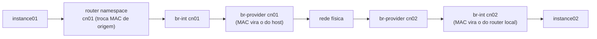

## Resumo executivo

Primeiro capítulo da Parte 2 (operação). Trata disponibilidade como propriedade que se projeta camada por camada: **balanceamento** (HAProxy + Keepalived) → **banco** (Galera) → **fila** (quorum queues) → **rede** (VRRP e DVR) → **workload do usuário** (Masakari).

A regra que organiza tudo: **encontre e elimine todo ponto único de falha**. O que muda de camada para camada é apenas a técnica.

## Principais ideias

- **Disponibilidade é uma fórmula, não uma sensação.** `Availability = MTTF / (MTTF + MTTR)`. E SLA se define por serviço, não para a nuvem inteira.
- **Stateless × stateful decide o padrão de HA.** O control plane do OpenStack é quase todo stateless (APIs, schedulers, agentes, conductors) — por isso escala em active/active trivialmente. **Banco e fila são stateful** e exigem replicação, consenso e recuperação de estado.
- **Galera resolve o conflito que os outros topologias de MySQL não resolvem.** MMM e master/slave perdem transações no failover. O CBR (certification-based replication) do Galera assume rollback de mudanças não commitadas e ordem idêntica de eventos replicados.
- **Quorum queues substituíram mirrored queues.** O RabbitMQ depreciou o espelhamento por falhas de sincronização e problemas de performance. Quorum usa uma variante do **Raft** — líder + seguidores, FIFO replicada.
- **O agente L2 não precisa de HA; o L3 precisa.** L2 roda em todo nó de computação, DHCP e metadata já são HA por padrão. O agente L3 é o que gerencia roteador virtual, conectividade externa e floating IP — logo, é o gargalo.
- **Masakari trouxe HA de instância para dentro do OpenStack.** Antes, cada usuário escrevia os próprios scripts de recuperação de VM.

> [!important] Só receba workload de produção depois da HA
> É o mesmo aviso do Capítulo 2, agora com consequência prática: o autor **destrói o ambiente** (`kolla-ansible destroy`) e redeploya do zero com três controllers antes de qualquer carga real.

## Conceitos apresentados

### Medindo disponibilidade

```
Availability = MTTF / (MTTF + MTTR)
```

- **MTTF** — tempo médio em que o sistema funciona antes de falhar.
- **MTTR** — tempo médio para reparar um componente.

Exemplo de SLA diferenciado por serviço:

| Serviço | Nível | Disponibilidade | Downtime/dia |
|---|---|---:|---|
| Compute | um 9 | 90% | ~2,4 horas |
| Network | dois 9s | 99% | ~14 minutos |
| Compute | três 9s | 99,9% | ~86 segundos |
| Block storage | quatro 9s | 99,99% | ~8,6 segundos |
| Object storage | cinco 9s | 99,999% | ~0,86 segundo |
| Image | seis 9s | 99,9999% | ~0,0086 segundo |

### Os cinco princípios de projeto para HA

1. Eliminar todo SPOF no control plane e no data plane.
2. Adotar desenho geo-replicado sempre que possível.
3. Automatizar monitoramento e detecção de anomalia.
4. Planejar e automatizar recuperação de desastre rápida.
5. Desacoplar e isolar os componentes ao máximo.

Níveis de HA: **L1** (hosts físicos, rede, storage), **L2** e **L3** — o foco do OpenStack.

### HAProxy — camadas e algoritmos

**Camada 4** (transporte) — encaminha por IP e porta. **Camada 7** (aplicação) — encaminha por conteúdo da requisição.

| Algoritmo | Critério |
|---|---|
| `roundrobin` | Cada servidor por vez; ajusta o peso dinamicamente se a instância trava ou responde devagar |
| `leastconn` | Servidor com menor número de conexões |
| `source` | Hash do IP de origem — sempre o mesmo servidor |
| `uri` | Hash da URI — ideal para maximizar cache hit em proxies |

HAProxy faz health check nos backends e retira o nó da pool até ele voltar a passar.

> [!warning] O balanceador não pode ser o novo SPOF
> Ele é a primeira interface do ambiente OpenStack. Redundância nessa camada — via VIP gerenciado por Keepalived — é tratada como configuração crítica de rede, não como detalhe.

### Topologias de HA de banco

| Topologia | Como funciona | Limitação |
|---|---|---|
| **Master/slave** | VIP migra ao slave na falha do master | Atraso no health check e na migração do VIP → inconsistência de dados |
| **MMM** (multi-master replication manager) | Dois masters, só um aceita escrita por vez | Pode perder transações na falha do master |
| **Shared storage** | Dois servidores sobre storage redundante compartilhado; só um ativo | Excelente uptime, mas exige hardware caro |
| **Block-level (DRBD)** | Replica o dispositivo de bloco entre os nós MySQL | Barato, mas não escala para centenas de nós |
| **Galera (multi-master)** | Replicação síncrona por **CBR**; mínimo de **três nós** | O padrão adotado no OpenStack |

> [!tip] Por que CBR
> O Certification-Based Replication assume que o banco é transacional e pode reverter mudanças não commitadas, e que os eventos replicados são aplicados **na mesma ordem** em todas as instâncias. A replicação é paralela de verdade, cada evento com seu ID de verificação.

### HA da fila de mensagens

| Padrão | Comportamento |
|---|---|
| **Clustering** | Todo dado e estado do broker é replicado entre os nós |
| **Mirrored queues** | Filas espelhadas nos outros nós do cluster; falha comuta para o espelho — **depreciado** |
| **Quorum queues** | Variante do protocolo **Raft**: líder + múltiplos seguidores em hosts distintos, FIFO replicada — **padrão atual** |

### HA de rede

| Componente | Estado de HA |
|---|---|
| Agente L2 | Roda em cada compute — não requer HA |
| Agentes DHCP e metadata | Já são HA por padrão em múltiplos nós |
| **Agente L3** | Requer configuração explícita: **VRRP** ou **DVR** |

#### VRRP

- Roteadores são organizados em **grupos**; cada grupo elege um master por prioridade (**0 a 255**, maior vence).
- O master anuncia periodicamente seu estado e prioridade. Parou de anunciar → nova eleição.
- Cada roteador HA cria um namespace com Keepalived próprio e uma **interface `ha`** numa rede invisível ao usuário.
- Neutron reserva automaticamente o pool `169.254.192.0/18`; o master recebe `169.254.0.1`.
- Config: `/var/lib/neutron/ha_confs/<ROUTER_NETNS>/keepalived.conf`; eventos em `neutron-keepalived-state-change.log`.

#### DVR

Agente L3 em **cada nó de computação**. Tráfego leste-oeste (instância ↔ instância) e norte-sul (com floating IP) roteado localmente, sem passar pelo nó de rede. O **mesmo namespace `qrouter`, com as mesmas interfaces `qr` e os mesmos IPs**, existe replicado em todos os computes.

Exige mechanism driver **Open vSwitch**.

### Masakari — HA de instância

Usa **Corosync** (camada de mensagens do cluster, atribuição de VIP) e **Pacemaker** (gerenciador de recursos). Composto de uma API REST e um engine que executa as requisições de recuperação contra o Nova.

| Monitor | Processo | O que faz |
|---|---|---|
| **Instance restart** | `masakari-instancemonitor` | Detecta falha da instância e reinicia no mesmo host |
| **Instance evacuation** | `masakari-hostmonitor` | Evacua instâncias para outro compute saudável quando o hipervisor cai. Opera sobre **failover segments** — grupos de computes que se cobrem mutuamente |
| **Process monitor** | `masakari-processmonitor` | Vigia `libvirtd` e `nova-compute` no hipervisor; na falha de um processo, impede novo agendamento para aquele nó |

## Exemplos

### Topologia HA do control plane

```
VIP                10.0.0.47
HAProxy 01         10.0.0.20   (hap1.os.packtpub)
HAProxy 02         10.0.0.21   (hap2.os.packtpub)
Cloud Controller 01 10.0.0.100 (cc01.os.packtpub)
Cloud Controller 02 10.0.0.101 (cc02.os.packtpub)
Cloud Controller 03 10.0.0.102 (cc03.os.packtpub)
```

**Três** controllers — número escolhido para que o Keepalived determine quórum com facilidade.

```yaml
# globals.yml
enable_haproxy: "yes"
kolla_external_vip_address: "10.0.0.47"
om_enable_rabbitmq_quorum_queues: true
```

```ini
[control]
cc01.os.packtpub
cc02.os.packtpub
cc03.os.packtpub

[haproxy]
hap1.os.packtpub
hap2.os.packtpub
[loadbalancer:children]
haproxy
```

Keepalived gera `/etc/kolla/keepalived/keepalived.conf` em cada controller:

```
vrrp_instance kolla_internal_vip_51 {
    state BACKUP
    nopreempt
    interface br0
    virtual_router_id 51
    priority 40
    advert_int 1
    virtual_ipaddress { 10.0.0.47 dev br0 }
}
```

O `51` vem de `keepalived_virtual_router_id` no `globals.yml`. Quem tiver a prioridade mais alta vira master e assume o VIP. Diagnóstico: `docker logs -f keepalived` e `ip a`.

> [!warning] Quorum queues em ambiente já rodando
> Migrar exige reiniciar manualmente os serviços (`kolla-ansible stop --tags <serviço>` seguido de `deploy --tags <serviço>`) e limpar os exchanges existentes. O autor recomenda automatizar isso pelo pipeline.

### Roteador HA com VRRP

```yaml
enable_neutron_agent_ha: "yes"
```

```ini
[network]
net01.os.packtpub
net02.os.packtpub
```

```bash
openstack router create --ha haRouter
ip netns | grep router     # o mesmo qrouter-<uuid> nos dois nós de rede
```

O padrão de `max_l3_agents_per_router` é **3** (ajustável em `roles/neutron/defaults/main.yml`). Com `l3_ha = True`, todo roteador novo nasce HA.

### Roteamento distribuído com DVR

```yaml
enable_neutron_dvr: "yes"
```

```ini
[neutron-l3-agent:children]
compute
```

Resultado em `/etc/neutron/neutron.conf`: `router_distributed = True`. E em `openvswitch_agent.ini` de cada compute: `l2_population = True`, `enable_distributed_routing = True`.

```bash
openstack router create --distributed router_dvr
```

**Caminho leste-oeste** (instance01 em `cn01` → instance02 em `cn02`):



### HA de instância com Masakari

```yaml
enable_masakari: "yes"
enable_hacluster: "yes"     # necessário para evacuação
```

```ini
[masakari-api:children]
control
[masakari-engine:children]
control
[masakari-hostmonitor:children]
control
[hacluster:children]
control
[hacluster-remote:children]
compute
[masakari-instancemonitor:children]
compute
```

Teste de restart automático:

```bash
openstack server create --image cirros-5.1 --flavor m1.tiny --network priv_net vm-ha
openstack server set --property HA_Enabled=True vm-ha
openstack server show vm-ha

# no compute node, mata o processo da instância
pgrep -f guest=instance-00000003     # → 12652
kill -9 12652
```

Em segundos a instância volta com novo PID; os logs ficam em `/var/log/kolla/masakari`.

---
Ref: [[Mastering OpenStack]], [[Mastering OpenStack 06]], [[Mastering OpenStack 08]], [[High Availability]], [[Service Level Agreement (SLA)]], [[Mean Time to Restore (MTTR)]], [[Galera Cluster]], [[Quorum Queue]], [[VRRP]], [[Distributed Virtual Routing (DVR)]], [[Masakari]], [[Stateful vs Stateless]]
