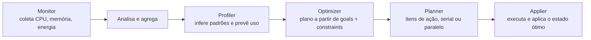

## Resumo executivo

Quatro práticas que respondem a perguntas diferentes sobre performance:

| Prática | Ferramenta | Pergunta que responde |
|---|---|---|
| **Caching** | Memcached | Como reduzir a carga de leitura no banco? |
| **Benchmarking** | Rally | Quais são os meus limites sob carga? |
| **Profiling** | OSProfiler | Onde exatamente esta requisição gasta o tempo? |
| **Otimização** | Watcher | Posso rodar a mesma carga com menos hardware? |

O argumento de abertura é preciso: um dashboard todo verde não impede o tenant de falhar ao criar VM. Métrica e log detectam o que já quebrou; **benchmark e profiling revelam o que está prestes a quebrar**.

## Principais ideias

- **Benchmarking pertence ao pipeline, não ao incidente.** A recomendação é incluir um estágio de benchmark no CI/CD a cada mudança, ou rodar um ciclo de profiling a cada atualização de software ou hardware, comparando com o SLA vigente.
- **Cache não é storage.** Memcached perde tudo ao reiniciar. Isso é aceitável exatamente porque o que ele guarda — tokens do Keystone, dados de sessão do Horizon — é reconstruível.
- **O gargalo do Keystone é arquitetural, não de recurso.** O capítulo demonstra numericamente: o problema não era CPU, era o modelo de processo single-thread. Colocar o Keystone atrás de WSGI com pool de threads resolveu.
- **Benchmark diz *que* está lento; profiling diz *onde*.** São complementares, não alternativos.
- **Otimização manual em larga escala é propensa a erro.** Era assim antes: coletar métricas históricas na mão, analisar em sprints, decidir. O Watcher automatiza o ciclo.

## Conceitos apresentados

### Caching com Memcached

O fluxo que justifica o cache: cada criação de instância dispara requisições Horizon → Nova → Glance → Cinder → Neutron, e **a cada uma delas o Keystone valida o token no banco**. Em volume, isso vira CPU consumida e latência acumulada em lookups de tokens expirados.

```ini
# /etc/keystone/keystone.conf — resultado esperado
[cache]
backend = oslo_cache.memcache_pool
enabled = True
memcache_servers = url:127.0.0.1:11211
```

**Estatísticas úteis** (`memcached-tool 127.0.0.1:11211 stats`):

| Métrica | O que indica |
|---|---|
| `accepting_conns` | Conexões aceitas; sobe 1 a cada serviço novo configurado para usar o cache |
| `bytes` | Bytes em uso pelos itens em tempo real |
| `bytes_read` / `bytes_written` | Tráfego de entrada e saída |
| `cmd_get` / `cmd_set` | Comandos recebidos e processados |
| `get_hits` / `get_misses` | Acertos e erros de cache. **Hit rate = `get_hits` ÷ `cmd_get`** |

> [!tip] O cache é barato de dimensionar
> Um nó Memcached exige muito menos CPU que um nó de banco. Em ambientes grandes, ele ganha cluster dedicado — e passa a ser servido pelo HAProxy em modo TCP (`enable_haproxy_memcached: yes`).

### Rally — anatomia de um cenário

```yaml
ScenarioClass.scenario_method:
  - args:      # parâmetros do método
    runner:    # frequência e ordem da carga
    context:   # ambiente: tenants, usuários, quotas, papéis
    sla:       # critérios de sucesso
```

**Tipos de runner:**

| Runner | Comportamento |
|---|---|
| `constant` | Roda o cenário um número fixo de vezes |
| `constant_for_duration` | Número fixo de vezes até um instante determinado |
| `periodic` | Define um período entre dois cenários consecutivos |
| `serial` | Número fixo de vezes numa única thread |

**Condições de SLA:**

| Condição | Aborta quando |
|---|---|
| `max_avg_duration` | A duração média excede o valor |
| `max_seconds_per_iteration` | Uma iteração isolada excede o valor |
| `failure_rate.max` | Mais que N falhas |
| `performance_degradation.max_degradation` | A diferença entre a maior e a menor duração excede N% |
| `outliers.max` | Mais que N iterações muito longas |

> [!warning] `--abort-on-sla-failure` não é opcional em produção
> Rally gera carga pesada de propósito. Sem a flag, um benchmark contra ambiente real vira incidente.

### OSProfiler

Rastreia a requisição enquanto ela atravessa os serviços e compila os dados num gráfico de linha do tempo. Captura tempo de resposta de **APIs, bancos, drivers e chamadas RPC**. Desde o Antelope, cobre todos os serviços core.

Storage de traces: Redis, Elasticsearch, arquivo simples ou MongoDB.

O relatório HTML expõe, por chamada: natureza do serviço (API, banco…), projeto correspondente e uma coluna **Levels** com o detalhe em JSON.

### Watcher — o ciclo de otimização



**Fluxo de trabalho do operador:**

1. Criar um **goal** de otimização e associá-lo a uma **strategy**.
2. Criar um **audit template** ligado ao goal.
3. Criar um **audit** disparado pelo template.
4. O audit gera um **action plan**.
5. Executar — manual ou automaticamente.

**Estados do audit:** `PENDING` → (decision engine acha ao menos uma opção) → `SUCCEEDED`.
**Estado do action plan:** `RECOMMENDED` (aguarda validação humana) → `PENDING` → `ONGOING` → `SUCCEEDED`.

| Indicador | Significado |
|---|---|
| **Efficacy indicators** | Número de nós no escopo da otimização e contagem de migrações de instância a executar |
| **Global efficacy** | Nós liberados ÷ nós no escopo do audit |

> [!important] O Watcher recomenda; o operador decide
> O estado `RECOMMENDED` é deliberado. O plano é revisado com `openstack optimize action list` **antes** de qualquer migração.

## Exemplos

### Cenário Rally de estresse no Keystone

```yaml
# perf_keystone_pp.yaml (trecho)
    concurrency: 50
    context:
      users:
        tenants: 5
        users_per_tenant: 10
    sla:
      failure_rate:
        max: 1
```

Carga constante autenticando usuários e validando tokens 50 vezes sem pausa, com 5 tenants de 10 usuários cada, tudo em concorrência.

```bash
rally task start --abort-on-sla-failure perf_keystone_pp.yaml
rally task report <task-uuid> --out /var/www/html/bench/keystone_report01.html
```

Gráficos do relatório: **Load Profile** (quantas iterações rodaram em paralelo ao longo do tempo) e **Atomic Action Durations** (`keystone_v2.fetch_token` × `keystone_v2.validate_token` — buscar e validar token têm durações diferentes, e é aí que se localiza o gargalo).

### O caso que amarra tudo: SLA estrito → profiling → correção

**Iteração 1** — SLA frouxo (só `failure_rate`): 50 iterações, 100% de sucesso. Verde enganoso.

**Iteração 2** — SLA realista:

```yaml
sla:
  max_avg_duration: 5
  max_seconds_per_iteration: 5
  failure_rate:
    max: 0
  performance_degradation:
    max_degradation: 50
  outliers:
    max: 1
```

Rally abortou **na sexta iteração**, com pico de **11,27 s** por iteração.

**Diagnóstico** — o Keystone roda em processo baseado em eventlet. A recomendação é frontá-lo com um servidor web (Nginx/WSGI ou Apache/`mod_wsgi`) para ganhar conexões HTTP paralelas e processamento multi-thread.

**Correção** — no `wsgi-keystone.conf.j2`:

```apache
WSGIDaemonProcess keystone-public processes={{ keystone_api_workers }} threads=30 \
  user=keystone group=keystone display-name=keystone-public
```

**Iteração 3** — máximo por iteração caiu para **4,19 s**, dentro do SLA. E o Load Profile mostrou concorrência máxima de apenas 24, apesar do nível configurado ser mais alto — sinal de que sobrava folga.

### Consolidação de workload com Watcher

```bash
openstack optimize goal list                       # localiza "Server Consolidation"
openstack optimize strategy list --goal <goal-uuid>
openstack optimize audittemplate create consolidation_template <goal-uuid> \
  --strategy <strategy-uuid>                       # vm_workload_consolidation
openstack optimize audit create -a consolidation-template
openstack optimize audit show <audit-uuid>         # aguarda SUCCEEDED
openstack optimize actionplan list --audit <audit-uuid>
openstack optimize action list --action-plan <plan-uuid>    # revisão obrigatória
openstack optimize actionplan start <plan-uuid>
```

**Resultado:** três nós de computação, `instance_migrations_count = 2`, global efficacy ≈ **33%**. Ao final, `cn01.os` ficou completamente livre — a mesma carga passou a rodar em dois nós.

> [!info] Escalonamento e otimização são o mesmo problema
> O autor fecha o raciocínio: uma configuração bem pensada de filtros e pesos no scheduler (Capítulo 4) não serve só para alocar — ela dá ao planner do Watcher espaço melhor para encontrar o ótimo.

---
Ref: [[Mastering OpenStack]], [[Mastering OpenStack 08]], [[Mastering OpenStack 10]], [[Benchmarking]], [[Profiling]], [[Estratégias de Cache]], [[Memcached]], [[Rally]], [[OSProfiler]], [[Watcher]], [[Service Level Agreement (SLA)]], [[FinOps]]
