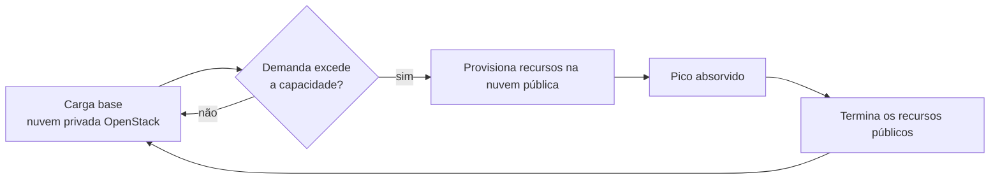

## Resumo executivo

Abre a Parte 3. Sai do "como operar OpenStack" e entra no "onde OpenStack se encaixa". A tese: nem nuvem pública nem privada isoladamente atende a todos os requisitos — e a nuvem híbrida existe para cobrir as lacunas de ambas.

Estrutura: **modelo público** (vantagens e as quatro desvantagens) → **evidência de adoção do híbrido** → **OpenStack como peça da arquitetura híbrida** → **CMP e cloud bursting** → **segurança** (governança, rede, operação).

> [!quote] Definição do Gartner
> "Hybrid cloud computing refere-se ao provisionamento, uso e gestão de serviços de forma coordenada e baseada em políticas, através de uma mistura de serviços de nuvem internos e externos."

## Principais ideias

- **Multi-cloud e híbrido não são sinônimos.** Multi-cloud = mais de um provedor. Híbrido = combinação de público **e** privado. Todo híbrido é multi-cloud; o contrário não vale.
- **Quanto mais gerenciado, menos controle.** Movendo de IaaS → PaaS → SaaS, mais camadas caem sob responsabilidade do provedor — e menos sob a sua.
- **Pay-as-you-go só é barato se for medido.** Sem business case e ROI desde o dia um, o modelo sai mais caro que a infraestrutura tradicional. É essa lacuna que criou a disciplina de **[[FinOps]]**.
- **O lock-in tem duas formas.** A do **workload** (dependências do provedor) — mitigada por container. E a da **gestão de infraestrutura** (CloudFormation, Azure Deployment Manager, Cloud Deployment Manager, Heat) — mitigada por ferramentas agnósticas.
- **OpenStack é bom cidadão de arquitetura híbrida por causa da API.** A exposição rica de API é o que permite drivers para o mundo AWS: Nova para EC2, Neutron para VPC, Cinder para storage.
- **Zero trust é a premissa, não a decoração.** Em ambiente híbrido, toda entidade é ameaça por padrão: acesso de usuário, workload, dado, dispositivo de rede, tráfego.

## Conceitos apresentados

### As quatro desvantagens do modelo público

| Desvantagem | Detalhe |
|---|---|
| **Custo imprevisto** | Uma VM rodando 100% do tempo mantém curva linear de custo — mas sem tagging e rastreio, o time perde a noção de onde o orçamento vai. Otimizar exige mexer na arquitetura, e o medo de quebrar produção trava a otimização |
| **Responsabilidade compartilhada** | O provedor cuida da infraestrutura subjacente e da conformidade regional; o resto é do consumidor. E a divisão varia **de serviço para serviço** |
| **Falta de controle** | Times de aplicação às vezes pedem combinações de hardware que não existem na nuvem pública; times de rede, topologias inviáveis. Mitigações parciais existem (ex.: dedicated instances na AWS) |
| **Vendor lock-in** | Mover workload entre provedores exige planejar, conectar origem e destino, reconstruir o artefato, implantar e testar |

### As cinco vantagens do modelo híbrido

| Vantagem | Como se realiza |
|---|---|
| **Eficiência de custo** | Utilização estável no privado; picos ocasionais terceirizados ao público. PoCs e testes ficam no privado, onde o recurso é finito e o desperdício é visível. Workloads com licenciamento periódico ficam no público, economizando manutenção |
| **Governança** | Dados sob regras de residência ficam onde precisam ficar |
| **Livre de lock-in** | Containerização dá portabilidade entre provedores com tempo e esforço mínimos |
| **Resiliência reforçada** | Aplicação crítica roda nos dois mundos. Se uma AZ privada cai, o endpoint público assume |
| **Escalabilidade** | **Cloud bursting** — responde a picos que excedem a capacidade privada |

### Números de adoção citados

| Fonte | Ano | Dado |
|---|---:|---|
| Forbes, State of Cloud Adoption | 2017 | Adoção de híbrido triplicou: de 19% para 57%; público e privado puro caíram em favor do híbrido |
| RightScale/Flexera, State of the Cloud | 2018 | 51% buscavam estratégia híbrida |
| idem | 2019 | 58% |
| Flexera, State of the Cloud | 2024 | **~73%** dos decisores consideram estratégia híbrida |

### Serviços híbridos dos hyperscalers

| Provedor | Plataforma híbrida | Serviços complementares |
|---|---|---|
| AWS | **Outposts** (recursos AWS no data center do cliente, mesmas APIs e ferramentas) | RDS on Outposts, **ECS Anywhere**, **EKS Anywhere**, Storage Gateway, DataSync |
| Azure | **Azure Stack** | — |
| GCP | **Anthos** | — |

### Cloud Management Platform (CMP)

Camada de administração unificada sobre nuvens pública, privada e on-premises. Não precisa reimplementar as APIs de cada provedor — precisa de um dashboard com capacidade de **proxy** que roteie requisições entre ambientes. Fortalecida por ferramentas de orquestração, catálogo de serviços e blueprints reutilizáveis.

Fornecedores citados: Flexera, CloudBolt, OVHcloud, Nutanix.

### Cloud bursting

O padrão comum: a empresa depende primariamente do privado e só estoura para o público em picos de tráfego. Passado o surto, os recursos públicos são terminados.

### Condições para um híbrido funcionar

1. O workload precisa ser **projetado para rodar** no OpenStack, na nuvem pública, ou em ambos.
2. **Mobilidade de dado** — entender claramente o que pode ser armazenado onde. Casos comuns: dado de vida curta no público, dado de vida longa no privado.
3. **Compatibilidade de API.** Nuvens que expõem APIs do mesmo tipo com a mesma stack são simples de combinar. Motores de banco ou hipervisores diferentes elevam a complexidade.

### Segurança em três frentes

#### Governança

Requisitos para o par OpenStack + público (exemplo do GDPR: privacidade, residência e retenção de dado na UE):

- Definir de forma transparente uma **versão estendida do modelo de responsabilidade compartilhada**.
- Documentar como as nuvens se conectam e como o dado trafega e é armazenado.
- Prover acesso com políticas, **menor privilégio** e criptografia.
- Definir padrões de ciclo de vida e classificação de dado.

Perguntas de verificação sugeridas: existe **um único painel** de monitoramento e log para a aplicação? Existe processo padrão de gestão de incidente para vazamento ou acesso não autorizado?

#### Rede

- Arquitetura de rede **em camadas** — cada camada da aplicação em sua sub-rede, usando espaço privado (RFC 1918) mesmo em ambientes dispersos.
- **Conexões privadas entre nuvens** — pods de um cluster Kubernetes no OpenStack alcançam pods do mesmo cluster na AWS via DirectConnect ou VPN, sem atravessar a internet.
- Firewall e WAF na camada subjacente, invisível ao usuário, **antes** de qualquer workload.

> [!tip] Guia de segurança de endpoint
> A comunidade publica uma versão atualizada do guia de segurança a cada release. Recomendação de configuração de endpoint de API: https://docs.openstack.org/security-guide/api-endpoints/

#### Operação

- **Pipeline de log centralizado** puxando fluxos de rede, logs de aplicação e de firewall de todas as infraestruturas.
- Monitoramento e métricas reportando centralmente por endpoint de nuvem.
- **IAM com single sign-on** para resolver a complexidade de acesso entre múltiplas infraestruturas.

> [!warning] O dado é o risco maior do híbrido
> Dado circulando entre infraestruturas exige controles adicionais. Movimentação imprópria gera vazamento — e vazamento não se desfaz.

---
Ref: [[Mastering OpenStack]], [[Mastering OpenStack 09]], [[Mastering OpenStack 11]], [[Hybrid Cloud]], [[Multi-Cloud]], [[Cloud Bursting]], [[Shared Responsibility Model]], [[Vendor Lock-in]], [[Cloud Management Platform (CMP)]], [[Zero Trust]], [[FinOps]]
