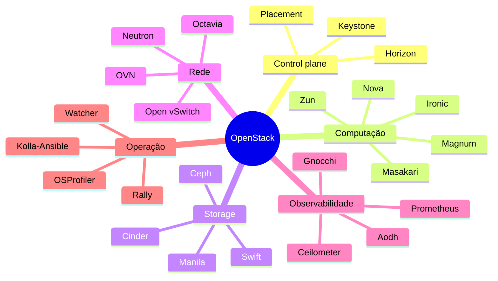

> [!abstract]
> Terceira edição do livro de referência sobre projetar, implantar e operar uma nuvem privada **production-ready** com OpenStack, cobrindo o release **Antelope** e posteriores. Não é um manual de instalação — é um livro de arquitetura e operação, escrito na premissa de que a jornada de implantação importa mais que o ambiente implantado.

## Resumo

Omar Khedher, arquiteto de nuvem com mais de 12 anos de experiência, organiza a obra em três partes que seguem a maturidade de um ambiente OpenStack:

**Parte 1 — Arquitetar o ecossistema.** Do desenho conceitual ao físico, com planejamento de capacidade numérico, implantação por [[Infrastructure as Code]] em containers ([[Kolla-Ansible]]) sob a disciplina [[DevSecOps]], e o detalhamento dos serviços core: control plane, compute, storage e networking.

**Parte 2 — Operar o ambiente.** Alta disponibilidade em cada camada, observabilidade (métricas, telemetria e logs centralizados) e a disciplina de benchmarking, profiling e otimização de recursos.

**Parte 3 — Estender a nuvem.** Padrões de nuvem híbrida e um caso de uso completo: um workload Kubernetes federado entre OpenStack privado e AWS público.

O fio condutor de todos os capítulos é a **automação como pré-requisito**, não como conveniência. Cada mudança de configuração no livro passa por um pipeline CI/CD; cada arquivo de inventário é tratado como fonte da verdade.

> [!quote] Sobre a escolha do OpenStack
> "OpenStack deve ser considerado como um investimento de longo prazo. Economia operacional e de custo só se sente em estágios tardios." — Capítulo 1

## Índice

### Parte 1 — Architecting the OpenStack Ecosystem

- [[Mastering OpenStack 01|01. Revisiting OpenStack – Design Considerations]] — o catálogo de serviços, as sete motivações de negócio, o fluxo de criação de instância e o exercício de capacidade
- [[Mastering OpenStack 02|02. Kicking Off the OpenStack Setup – The Right Way (DevSecOps)]] — DevOps → DevSecOps → IaC → containers → pipeline com portão de segurança
- [[Mastering OpenStack 03|03. OpenStack Control Plane – Shared Services]] — o perímetro do control plane, Keystone, Placement, e os serviços compartilhados stateful
- [[Mastering OpenStack 04|04. OpenStack Compute – Compute Capacity and Flavors]] — Nova, segregação (região, AZ, host aggregate, cell), o funil de agendamento, Magnum e Zun
- [[Mastering OpenStack 05|05. OpenStack Storage – Block, Object, and File Shares]] — Cinder, Swift e Manila; múltiplos backends e seus schedulers
- [[Mastering OpenStack 06|06. OpenStack Networking – Connectivity and Managed Service Options]] — ML2, OVS × OVN, roteamento, NAT, BGP dinâmico e Octavia

### Parte 2 — Operating the OpenStack Cloud Environment

- [[Mastering OpenStack 07|07. Running a Highly Available Cloud – Meeting the SLA]] — HAProxy/Keepalived, Galera, quorum queues, VRRP, DVR e Masakari
- [[Mastering OpenStack 08|08. Monitoring and Logging – Remediating Proactively]] — Prometheus e Grafana, o trio de telemetria, OpenSearch
- [[Mastering OpenStack 09|09. Benchmarking the Infrastructure – Evaluating Resource Capacity and Optimization]] — Memcached, Rally, OSProfiler e Watcher

### Parte 3 — Extending the OpenStack Cloud

- [[Mastering OpenStack 10|10. OpenStack Hybrid Cloud – Design Patterns]] — público × privado × híbrido, CMP, cloud bursting e segurança em três frentes
- [[Mastering OpenStack 11|11. A Hybrid Cloud Hyperscale Use Case – Scaling a Kubernetes Workload]] — Juju e KubeFed unindo OpenStack e AWS

## A rede de conceitos

### Serviços do ecossistema

### Conceitos neutros extraídos

Independentes de OpenStack, aplicáveis a qualquer infraestrutura de nuvem:

- **Fundamentos**: [[Infrastructure as a Service (IaaS)]] · [[Control Plane]] · [[Hypervisor]] · [[Overcommitment]] · [[Capacity Planning]]
- **Segregação e escala**: [[Availability Zone]] · [[Host Aggregate]] · [[Affinity e Anti-Affinity]] · [[Stateful vs Stateless]]
- **Disponibilidade**: [[High Availability]] · [[Active-Active vs Active-Passive]] · [[VRRP]] · [[Quorum Queue]] · [[Galera Cluster]] · [[Service Level Agreement (SLA)]]
- **Rede**: [[Software-Defined Networking (SDN)]] · [[VXLAN]] · [[NAT]] · [[Floating IP]] · [[Border Gateway Protocol (BGP)]] · [[Distributed Virtual Routing (DVR)]]
- **Storage**: [[Software-Defined Storage (SDS)]] · [[Block Storage]] · [[Object Storage]] · [[File Storage]]
- **Operação**: [[DevSecOps]] · [[Pets vs Cattle]] · [[Benchmarking]] · [[Profiling]] · [[Observability]] · [[Centralized Logging]] · [[Estratégias de Cache]]
- **Estratégia de nuvem**: [[Hybrid Cloud]] · [[Multi-Cloud]] · [[Cloud Bursting]] · [[Shared Responsibility Model]] · [[Vendor Lock-in]] · [[Cloud Management Platform (CMP)]] · [[FinOps]]

## Pontes com o resto do vault

| Conceito do livro | Se conecta com | Por quê |
|---|---|---|
| [[Control Plane]], [[High Availability]] | [[System Design MOC]] | Mesmos padrões distribuídos, vistos do lado da infraestrutura |
| [[Block Storage]], [[Object Storage]], [[Ceph]] | Cluster Cloud e Resiliência | Complementa Block/File/Object com a implementação open source |
| [[Hybrid Cloud]], [[FinOps]] | [[AWS Serverless Architecture MOC]] | O mesmo trade-off de custo e controle, do outro lado da fronteira |
| [[Capacity Planning]], [[Service Level Agreement (SLA)]] | [[ITIL 5]] | O próprio autor ancora a gestão de capacidade nas práticas ITIL |
| [[Kubernetes (K8s)]], [[Kubernetes Federation]] | [[System Design MOC]] | Contêineres e orquestração já mapeados no cluster de System Design |

## Perguntas em aberto

> [!question]
> - Como a arquitetura de **cells v2** se compara às estratégias de sharding de banco discutidas em sistemas distribuídos?
> - O modelo de **resource provider + traits** do Placement tem equivalente conceitual nos schedulers de Kubernetes (taints, tolerations, node affinity)?
> - **Ironic** (bare metal as a service) mereceria nota própria — o livro só o menciona de passagem, mas ele é a fronteira entre nuvem e hardware.
> - O livro não cobre **Heat** em profundidade, embora o cite como via de orquestração. Vale comparar HOT com Terraform e Pulumi.

---
Ref: [[OpenStack MOC]], [[OpenStack]], [[System Design MOC]]
