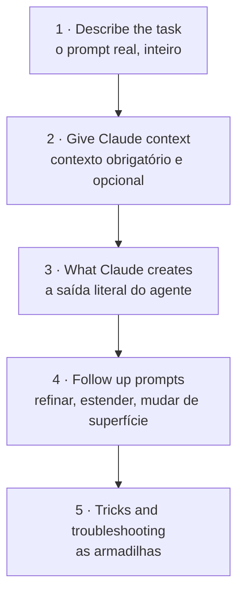

> [!abstract]
> Índice da leitura da biblioteca oficial de casos de uso do Claude, filtrada por **Product = Claude Cowork** (13 casos, lidos em 2026-08-04). É a fonte primária que faltava para fechar a lacuna *"Cowork em profundidade"* do [[Claude Platform MOC]].

## Por que esta fonte

O curso [[Claude 101]] apresenta o [[Claude Cowork]] em visão geral: o que é e quando escolher. Esta biblioteca mostra o **outro lado** — como o trabalho é de fato formulado. Cada caso traz o prompt real, o contexto exigido, a saída literal do agente, os follow-ups e uma seção de armadilhas.

O valor não está em nenhum caso isolado — está no que **se repete entre os treze**. Os padrões recorrentes viraram notas permanentes; os casos ficam aqui como evidência.

## Os 13 casos lidos

| #   | Caso                                                    | Categoria    | Modelo     |
| --- | ------------------------------------------------------- | ------------ | ---------- |
| 1   | Organize files across your desktop                      | Personal     | Opus 4.5   |
| 2   | Prep scattered documents for a compliance audit         | Legal        | Sonnet 4.5 |
| 3   | Audit a folder of visual assets against your guidelines | Cowork       | Opus 4.7   |
| 4   | Reconcile transactions across your accounts             | Finance      | Sonnet 4.5 |
| 5   | Build a daily briefing across your tools                | Professional | Sonnet 4.5 |
| 6   | Surface themes from all your feedback channels          | Research     | Sonnet 4.5 |
| 7   | Build analysis from browser charts and folder data      | Professional | Sonnet 4.5 |
| 8   | Size a market using your research                       | Professional | Sonnet 4.5 |
| 9   | Source insights from your tools to build a deck         | Professional | Opus 4.6   |
| 10  | Draft a credit memo from spreads and statements         | Finance      | Sonnet 4.6 |
| 11  | Validate reserves and draft filing narrative            | Finance      | Sonnet 4.6 |
| 12  | Adapt a standard textbook page to every reading level   | Cowork       | Opus 4.7   |
| 13  | Process batches of vendors with Cowork                  | Professional | Sonnet 4.5 |

## Notas de leitura

- [[Claude Cowork Use Cases 01|01 — Trabalho sobre arquivos locais]] (casos 1–4)
- [[Claude Cowork Use Cases 02|02 — Síntese multi-fonte e pesquisa]] (casos 5–9)
- [[Claude Cowork Use Cases 03|03 — Cadeia de superfícies e produção em lote]] (casos 10–13)

## Anatomia comum de um caso

Toda página segue a mesma estrutura, e a estrutura em si é um ensinamento sobre como formular trabalho delegado:

---
Ref: [[Claude Cowork]], [[Claude Platform MOC]], [[Claude 101]], [[Agentic Workflow]]
