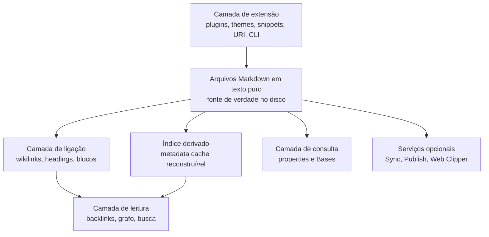

> [!abstract]
> Índice da leitura integral da **documentação oficial do Obsidian** (`obsidian.md/help`) — 173 páginas, lidas em 2026-08-07. É a fonte primária sobre a ferramenta em que este vault é construído: até aqui o método (Zettelkasten, notas atômicas, PARA) estava documentado no README, mas o **substrato técnico que o sustenta** não estava no grafo.

## Por que esta fonte

O vault existe dentro do Obsidian há centenas de notas, e a ferramenta era conhecimento tácito — sabido pelo uso, não escrito. Esta leitura fecha essa lacuna pela raiz: em vez de anotar truques de uso, extrai os **conceitos que explicam por que a ferramenta se comporta como se comporta**.

Duas coisas justificam o esforço. A primeira é que o Obsidian faz escolhas arquiteturais fortes e explícitas — vault como pasta, texto puro como fonte de verdade, cache derivado e descartável, ausência de sandbox para plugins — e a doc as declara em voz alta, com as consequências. Isso torna a leitura útil como estudo de arquitetura, não só como manual.

A segunda é que boa parte do vocabulário do vault (`[[Knowledge Graph]]`, notas atômicas, o grafo como diagnóstico) tem implementação concreta e limitada aqui. Saber exatamente o que `[[Block Reference]]` endereça, o que `[[Unlinked Mention]]` descobre e o que o filtro **Orphans** revela muda como o vault é mantido.

> [!success] Leitura própria
> A doc é notavelmente honesta nos limites: admite que não consegue restringir plugins a permissões específicas, lista o que **não** é criptografado no Sync, e diz que o próprio File recovery "is not a complete backup solution". Documentação que declara suas fraquezas é mais confiável que documentação que só declara features.

## As 9 seções lidas

| Seção da doc | Páginas | Nota de leitura |
|---|---:|---|
| Home · About Obsidian · Getting started · Files and folders · Licenses and payment | 30 | [[Obsidian Help 01]] |
| Editing and formatting | 13 | [[Obsidian Help 02]] |
| Linking notes and files · Plugins de navegação | 16 | [[Obsidian Help 03]] |
| Plugins (core) · Bases | 40 | [[Obsidian Help 04]] |
| User interface · Plugins de ergonomia | 15 | [[Obsidian Help 05]] |
| Extending Obsidian · Contributing | 9 | [[Obsidian Help 06]] |
| Obsidian Sync · Obsidian Publish · Web Clipper · Teams | 50 | [[Obsidian Help 07]] |
| Import notes · Format converter | 18 | [[Obsidian Help 08]] |

## Notas de leitura

- [[Obsidian Help 01|01 — Fundamentos, Vault e Arquivos]] — o vault como pasta, as três camadas de armazenamento, sync ≠ backup
- [[Obsidian Help 02|02 — Escrita, Markdown e Formatação]] — OFM, properties tipadas, callouts semânticos, os três modos de visualização
- [[Obsidian Help 03|03 — Ligação, Grafo e Navegação]] — endereçamento em três granularidades, backlinks, o grafo como diagnóstico, a gramática de busca
- [[Obsidian Help 04|04 — Plugins Core e Bases]] — núcleo mínimo mais building blocks, Bases como camada de consulta, Canvas como pensamento espacial
- [[Obsidian Help 05|05 — Interface, Workspace e Ergonomia]] — linked views, as três superfícies de comando, settings como infraestrutura de captura
- [[Obsidian Help 06|06 — Extensibilidade e Automação]] — as quatro superfícies de extensão, o modelo de segurança sem sandbox, os três degraus de automação
- [[Obsidian Help 07|07 — Serviços Gerenciados]] — Sync, Publish, Web Clipper e Teams construídos *sobre* o local-first
- [[Obsidian Help 08|08 — Migração, Importação e Portabilidade]] — a saída como feature, e a taxonomia das perdas

## O argumento que atravessa a doc

Nenhuma dessas camadas é fonte de verdade além da primeira. Índice, grafo, base, site publicado e vault remoto são todos **derivados descartáveis** de arquivos que sobrevivem ao aplicativo — é a mesma separação entre estado canônico e estado materializado de [[CQRS]], aplicada a um editor de texto.

## Conceitos extraídos

37 conceitos e 13 práticas, mapeados no [[Obsidian MOC]]. Os que mais mudam como este vault é mantido:

- [[Local-first]] · [[Vault]] · [[Configuration Folder]] · [[Metadata Cache]]
- [[Properties (Frontmatter)]] · [[Callout]] · [[Obsidian Flavored Markdown (OFM)]]
- [[Internal Link (Wikilink)]] · [[Block Reference]] · [[Backlink]] · [[Unlinked Mention]] · [[Graph View]]
- [[Base (Obsidian Bases)]] · [[Search Syntax (Obsidian)]] · [[Unique Note (Zettelkasten Prefix)]]
- [[Data Portability]] · [[Obsidian Sync]] · [[End-to-End Encryption]]

## Perguntas que a leitura abriu

> [!question]
> - A camada de plugins da comunidade não foi lida — a doc só descreve o modelo de segurança e o diretório, não os plugins em si. Dataview, Templater e Style Settings ficam fora do grafo.
> - A documentação de desenvolvedor (`docs.obsidian.md`) é outra fonte: Obsidian API, construir plugin, construir tema, CSS variables. Nada disso está aqui.
> - `Bases` é recente e a doc já marca layouts por versão mínima (1.9, 1.10). Vale reler o eixo quando o vault adotar bases de fato.
> - O formato **JSON Canvas** é nomeado mas não especificado na doc de ajuda — o schema vive em `jsoncanvas.org`.

---
Ref: [[Obsidian MOC]], [[Local-first]], [[Vault]], [[Data Portability]], [[Knowledge Management]]
