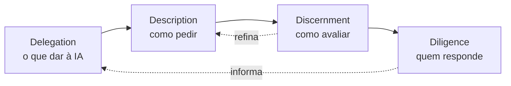

> [!abstract]
> **AI Fluency** é a capacidade de colaborar eficazmente com sistemas de IA — não saber quais botões apertar, mas ter o **julgamento** de usar IA bem em situações diferentes.

## Conceito

A distinção que o termo carrega é entre **operar** e **colaborar**. Operar é saber onde fica o menu; colaborar é saber o que delegar, como descrever, quando desconfiar e quem responde pelo resultado.

O **4D Framework**, desenvolvido pelos professores Rick Dakan (Ringling College of Art and Design) e Joseph Feller (University College Cork), decompõe essa capacidade em quatro competências que só funcionam juntas.

## As quatro competências

### Delegation

Decidir **o que** cabe ao humano, o que cabe à IA e como distribuir a tarefa entre os dois. Exige entender os próprios objetivos e as capacidades reais da ferramenta. É a competência mais estratégica e a mais negligenciada — a maioria dos usos ruins de IA é um erro de delegação, não de prompt.

### Description

Comunicar-se eficazmente com o sistema: definir claramente a saída desejada, guiar o processo, especificar comportamento. É a competência em que vive [[Prompt em Três Camadas]].

### Discernment

Avaliar criticamente saídas, processos e comportamentos: qualidade, acurácia, adequação, e onde há o que melhorar. É a competência que sustenta [[Eval|evals]] e a verificação de citações em [[Agentic Research]].

### Diligence

Usar IA de forma responsável e ética: escolher sistemas conscientemente, manter transparência sobre o uso, e **assumir responsabilidade** pelo trabalho assistido por IA. Aqui a delegação da tarefa nunca vira delegação da responsabilidade.

## Características

- **Sequencial e cíclica** — as quatro se encadeiam, e o resultado da avaliação realimenta a descrição e a próxima delegação
- **Transferível** — é competência sobre colaboração, não sobre um produto específico
- **Independente de domínio** — vale para quem escreve, analisa, programa ou decide
- **Governável** — Diligence é onde a fluência individual toca a [[ITIL AI Capability Model|governança organizacional de IA]]

> [!important] Fluência não é sobre prompts espertos
> Um prompt excelente para uma tarefa que não deveria ter sido delegada continua sendo um erro. Delegation vem antes de Description por desenho.

## Veja também

- [[Prompt em Três Camadas]]
- [[Eval]]
- [[Human-in-the-Loop]]
- [[Constitutional AI]]
- [[Agentic Workflow]]
