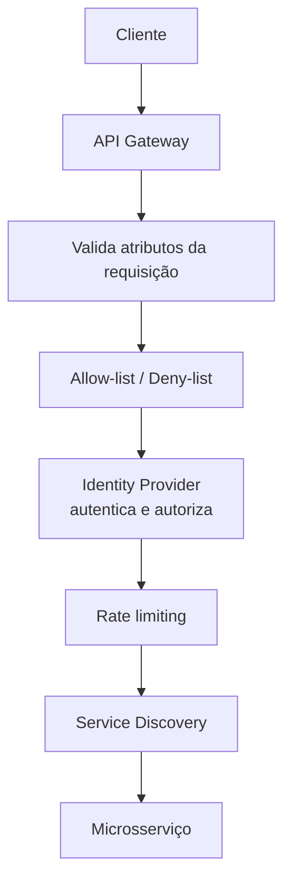

> [!abstract]
> API Gateway é o ponto único de entrada de uma arquitetura distribuída: recebe as requisições externas, aplica as políticas transversais e as encaminha ao serviço correto.

## Conceito

Quando um sistema é decomposto em dezenas de serviços, autenticação, *rate limiting*, validação e roteamento não podem ser reimplementados em cada um. O gateway concentra essas responsabilidades numa camada só, e é isso que permite que os serviços internos permaneçam pequenos.

## Fluxo

## Responsabilidades

- Parsing e validação dos atributos da requisição
- Verificação de listas de permissão e bloqueio
- Autenticação e autorização junto ao *identity provider*
- Limitação de taxa por cliente, rota ou plano
- Roteamento com apoio do [[Service Discovery]]
- Transformação de protocolo e agregação de respostas
- Registro de logs, métricas e traces do tráfego de borda

## Comparação

| | **API Gateway** | **Load Balancer** |
|---|---|---|
| Camada | Aplicação (L7), consciente da API | Rede/transporte ou L7 genérico |
| Decisão | Rota, identidade, política | Qual instância recebe |
| Conhece o domínio? | Sim — rotas, versões, contratos | Não |

> [!warning]
> O gateway concentra responsabilidade e, por isso, concentra risco: sem redundância ele é ponto único de falha de todo o sistema, e sem disciplina vira um monólito de regras de negócio disfarçado de infraestrutura.

## Veja também

- [[Microservices]]
- [[Service Discovery]]
- [[Load Balancer]]
- [[Service Mesh]]
- [[Identity Federation]]
