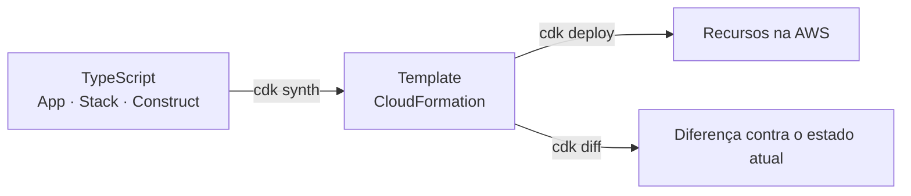

> [!abstract]
> CDK é o framework de [[Infrastructure as Code]] da AWS em que a infraestrutura é escrita em linguagem de programação de propósito geral e **sintetizada** em um template CloudFormation, que é o que de fato é implantado.

## Conceito

A diferença em relação a YAML declarativo não é estética. Com uma linguagem real vêm abstração, tipagem e teste: é possível criar um construct `LambdaComPowertools` que já embute runtime, timeout, tracing e variáveis de ambiente padronizadas, e usá-lo trinta vezes sem repetir trinta blocos idênticos. A padronização deixa de ser convenção documentada e passa a ser **impossível de burlar**.

## Níveis de construct

| Nível | O que é | Quando usar |
|---|---|---|
| **L1** (`Cfn*`) | Espelho 1:1 do recurso CloudFormation | Recurso muito novo, sem abstração pronta |
| **L2** | Abstração com padrões seguros e métodos de conveniência (`table.grantReadData(fn)`) | Padrão para quase tudo |
| **L3** (patterns) | Composição de vários recursos com um propósito | Arquiteturas repetidas de prateleira |

Os métodos `grant*` do L2 são o maior ganho prático de segurança: geram a política IAM de menor privilégio com o ARN exato, eliminando o `Resource: "*"` escrito à mão.

## Organização em stacks

Uma stack é a unidade de implantação e de rollback. A fronteira útil segue o **ciclo de vida**, não o organograma:

- Recursos de longa vida e alto risco de recriação (banco, user pool, bucket) em stacks próprias
- Um stack por domínio de negócio, contendo suas funções, tabela e rotas
- Stacks de borda (gateway, hospedagem, pipeline) separadas

Referências cruzadas entre stacks criam dependência de ordem de deploy e travam a exclusão do recurso exportado — um motivo comum de deploy bloqueado. Passar valores por [[Externalização de Configuração e Segredos|Parameter Store]] em vez de export/import desacopla.

> [!warning] Alteração manual no console quebra o contrato
> O template sintetizado é a verdade. Uma mudança feita à mão no console é sobrescrita no próximo deploy, ou pior — provoca *drift*, em que o estado real e o declarado divergem sem que ninguém saiba. Em staging e produção não há exceção: tudo pelo CDK.

## Veja também

- [[Infrastructure as Code]]
- [[Immutable Infrastructure]]
- [[Pipeline de CI-CD]]
- [[AWS Lambda]]
- [[Externalização de Configuração e Segredos]]
