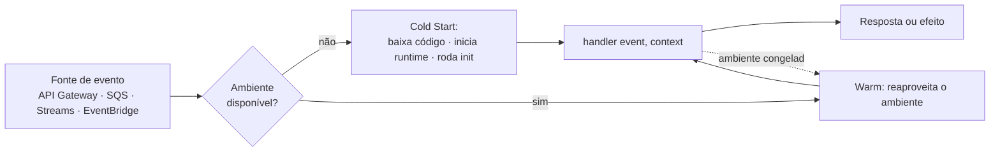

> [!abstract]
> AWS Lambda é o serviço de FaaS da AWS: executa uma função em resposta a um evento, provisiona a capacidade automaticamente e cobra por invocação e por tempo de execução — sem servidor para administrar.

## Conceito

Lambda é a materialização mais direta do modelo [[Serverless]] no plano de computação. O desenvolvedor entrega uma função — um artefato de código com um *handler* — e declara **o que a dispara**. Tudo o mais (provisionamento, escala horizontal, patching do runtime, distribuição entre zonas de disponibilidade) é responsabilidade do provedor.

A unidade de escala não é a instância: é a **invocação**. Mil requisições simultâneas produzem mil ambientes de execução em paralelo, e uma requisição por hora produz um. Não há capacidade ociosa a pagar entre elas.

## Modelo de execução

O ambiente de execução é **congelado** após a resposta e reaproveitado na invocação seguinte, se houver uma dentro da janela de reciclagem. É o que torna o [[Cold Start]] a exceção e não a regra — e o que permite amortizar conexões, clientes SDK e segredos carregados fora do *handler*.

## Modelos de invocação

| Modelo | Quem usa | Comportamento em falha |
|---|---|---|
| **Síncrono** (request-response) | API Gateway, invocação direta | O erro volta ao chamador; retry é do cliente |
| **Assíncrono** (event) | EventBridge, S3, SNS | Lambda re-tenta 2×; depois envia à *destination* ou DLQ |
| **Poller** (event source mapping) | SQS, [[Amazon DynamoDB\|DynamoDB Streams]], Kinesis | O serviço lê em lotes; falha do lote é reprocessada até a DLQ |

## Características

- **Timeout máximo de 15 minutos** — o padrão de 3 s nunca deve ser aceito por omissão; toda função declara o seu explicitamente
- **Memória de 128 MB a 10 GB**, e a CPU é alocada proporcionalmente à memória: aumentar memória frequentemente *reduz* o custo total ao encurtar a duração
- **Cobrança em GB-segundo**, arredondada ao milissegundo
- **Estado efêmero**: `/tmp` sobrevive entre invocações do mesmo ambiente, mas nunca entre ambientes — nenhum estado de negócio pode viver ali
- **Concorrência** limitada por região; *reserved concurrency* isola um domínio crítico e *provisioned concurrency* elimina o cold start ao custo de capacidade paga
- **Arquitetura ARM (Graviton)** entrega mais desempenho por dólar que x86 ao mesmo preço por GB-segundo

> [!warning] Encadeamento síncrono é anti-padrão
> Lambda A invocando Lambda B que invoca Lambda C multiplica o custo (paga-se pelo tempo de espera de todas) e acopla os tempos de vida. Para orquestrar, use [[Amazon EventBridge]], [[Amazon SQS]] ou uma máquina de estados.

## Comparação

| | **AWS Lambda** | **[[Container]] em orquestrador** |
|---|---|---|
| Unidade de escala | Invocação | Réplica |
| Custo ocioso | Zero | Contínuo |
| Tempo máximo | 15 min | Ilimitado |
| Controle do runtime | Restrito ao suportado | Total |
| Latência de primeiro byte | Sujeita a [[Cold Start]] | Estável após o warm-up |

## Veja também

- [[Serverless]]
- [[Cold Start]]
- [[Amazon API Gateway]]
- [[Amazon DynamoDB]]
- [[Lambda Authorizer]]
- [[AWS Serverless Architecture MOC]]
