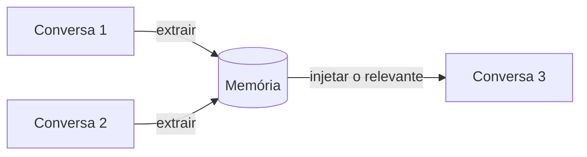

> [!abstract]
> **Agent Memory** é o mecanismo que preserva contexto **entre** conversas — papel, preferências, decisões passadas, forma de trabalhar — para que o usuário não precise se reapresentar a cada nova sessão.

## Conceito

A [[Context Window]] é volátil por natureza: acabou a conversa, acabou o que o modelo sabia sobre você. A memória resolve o atrito que isso gera — reexplicar seu cargo, seu setor, suas convenções, toda vez.

Funciona em três tempos: **extrair** o que numa conversa tem valor durável, **armazenar** fora da janela, e **injetar seletivamente** no início das conversas seguintes. Só o terceiro passo consome contexto, e só com o que é relevante.

## Camadas de personalização

Memória raramente age sozinha. Coexistem, do mais geral ao mais específico:

| Camada | O que define | Escopo |
|---|---|---|
| **Memória** | O que o assistente aprendeu sobre você | Todas as conversas |
| **Preferências** | O que você declarou explicitamente que quer sempre | Todas as conversas |
| **Estilo** | *Como* o assistente escreve — conciso, formal, explicativo, ou um perfil próprio | Todas as conversas |
| **Instruções de projeto** | Regras daquele fluxo de trabalho | O [[Project Workspace\|projeto]] |
| **Prompt** | A intenção deste turno | Um turno |

As camadas se somam, não se substituem: instrução de projeto opera **junto** com preferências e estilo.

## Características

- **Automática, mas auditável** — extrai sozinha, e o conteúdo é revisável, editável e apagável nas configurações
- **Sincronizada** — segue o usuário entre dispositivos
- **Seletiva** — injeta o relevante, não o acervo inteiro
- **Não é conhecimento de projeto** — memória guarda fatos sobre *você*; a base de um projeto guarda material sobre *o trabalho*

> [!warning] Memória é um ativo de privacidade
> Ela acumula perfil pessoal por desenho. Revisar periodicamente o que foi retido é higiene, não paranoia — e é o que separa personalização de acúmulo silencioso.

## Veja também

- [[Context Window]]
- [[Project Workspace]]
- [[Context Graph]]
- [[Agent Runtime]]
