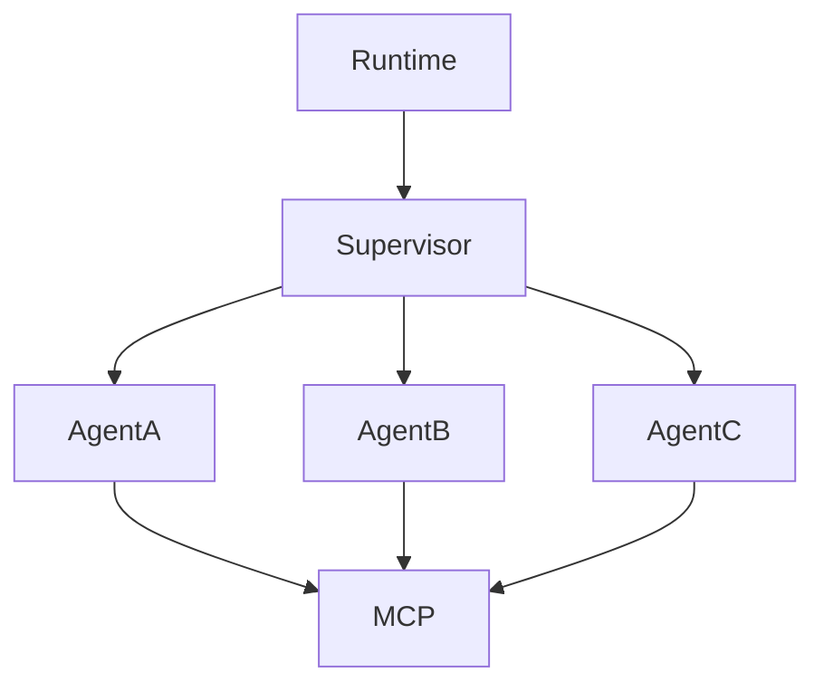

> [!abstract]
> O **Agent Runtime** é a camada responsável por executar, coordenar e gerenciar agentes durante toda a execução de uma tarefa.

## Conceito

O Agent Runtime funciona como o sistema operacional de uma arquitetura de agentes.

Enquanto o [[Harness]] prepara a execução de um agente ou modelo específico, o Agent Runtime administra toda a solução.

Ele coordena:

- agentes
- memória
- contexto
- planejamento
- ferramentas
- comunicação
- monitoramento

---

## Responsabilidades

- Inicializar agentes
- Planejar tarefas
- Construir o [[Context Graph]]
- Executar ferramentas via [[Model Context Protocol (MCP)]]
- Compartilhar memória
- Coordenar agentes
- Tratar falhas
- Consolidar resultados

---

## Arquitetura

---

## Características

- Coordenação central
- Escalabilidade
- Gerenciamento de memória
- Planejamento
- Observabilidade
- Governança

---

## Relação com Harness

| Harness | Agent Runtime |
|----------|---------------|
| Executa componentes | Coordena arquitetura |
| Escopo local | Escopo global |
| Configuração | Orquestração |
| Ambiente | Plataforma |

---

> [!important]
> Em arquiteturas modernas, o Agent Runtime representa a evolução natural dos antigos Harnesses utilizados para execução isolada de modelos.

---

## Veja também

- [[Harness]]
- [[Agent Supervisor]]
- [[Context Graph]]
- [[Model Context Protocol (MCP)]]