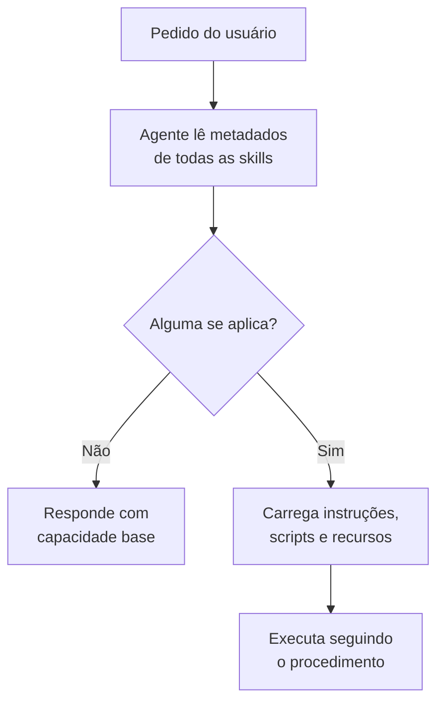

> [!abstract]
> Uma **Skill** é uma pasta de instruções, scripts e recursos que um agente de IA carrega **dinamicamente** quando a tarefa em curso a exige — um pacote de expertise procedural, ativado por relevância e não por comando.

## Conceito

A skill responde a uma tensão estrutural: você quer que o agente saiba executar dezenas de procedimentos especializados, mas não cabe (nem convém) carregar todos na [[Context Window]] de toda conversa.

A solução é **carregamento sob demanda**. Cada skill declara o que faz e quando se aplica; o agente lê apenas esses metadados e, ao reconhecer uma tarefa que se encaixa, carrega o conteúdo completo. O custo de contexto de uma skill não usada tende a zero.

O que distingue skill de instrução solta é que ela codifica um **procedimento repetível**: a ordem das operações, as regras que não podem ser violadas, o formato de saída esperado. Uma metodologia de análise de variação trimestral, um processo de revisão de tom de marca, um checklist de compliance — coisas em que a *consistência* entre execuções é o valor.

## Categorias

- **Skills do fornecedor** — mantidas e testadas por quem faz o modelo. Cobrem tarefas comuns, tipicamente criação de documentos (Excel, Word, PowerPoint, PDF). São invocadas automaticamente.
- **Custom Skills** — criadas por você ou pela organização, para fluxos específicos de domínio. Ver [[Criação de Skill por Conversa]].

## Características

- **Ativação implícita** — o agente decide quando usar; você descreve a tarefa, não a skill
- **Composta** — instruções + scripts executáveis + recursos (templates, exemplos, guias de estilo)
- **Progressivamente carregada** — metadados sempre, conteúdo só quando relevante
- **Versionável** — é um diretório de arquivos, logo vive em Git
- **Executa código** — o que a torna poderosa e o que a torna um vetor de risco

> [!warning] Skill é código executável
> Só instale skills de fonte confiável, e revise o conteúdo de qualquer skill vinda de fora antes do uso. A mesma cautela vale para [[Connector|conectores]] customizados.

## Comparação

| | Skill | [[Project Workspace\|Projeto]] | Instrução no prompt |
|---|---|---|---|
| Guarda | **Processo** (o *como*) | **Conhecimento** (o *quê*) | Intenção do turno |
| Escopo | Onde quer que a tarefa apareça | Dentro do projeto | Uma conversa |
| Ativação | Automática, por relevância | Sempre, no projeto | Manual, sempre |
| Melhor para | Fluxo repetível e multi-etapa | Material de referência recorrente | Pedido pontual |

> [!important] Projetos guardam conhecimento, skills executam tarefas
> Os dois se complementam: uma skill de "preparação de call com cliente" pode consumir os perfis de cliente que vivem na base de um projeto. O projeto fornece a informação; a skill fornece o método.

## Veja também

- [[Project Workspace]]
- [[Artifact]]
- [[Plugin (AI Agent)]]
- [[Model Context Protocol (MCP)]]
- [[Agentic Workflow]]
