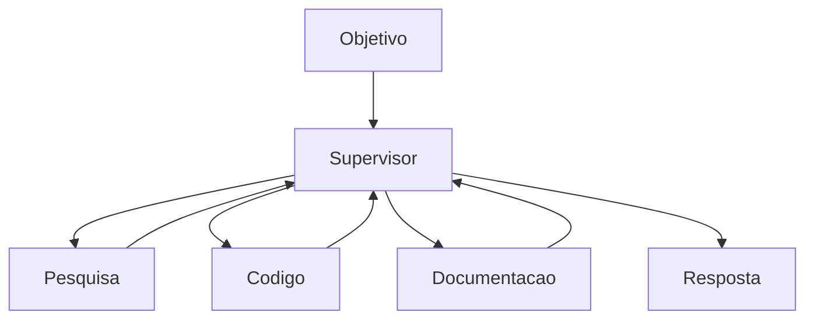
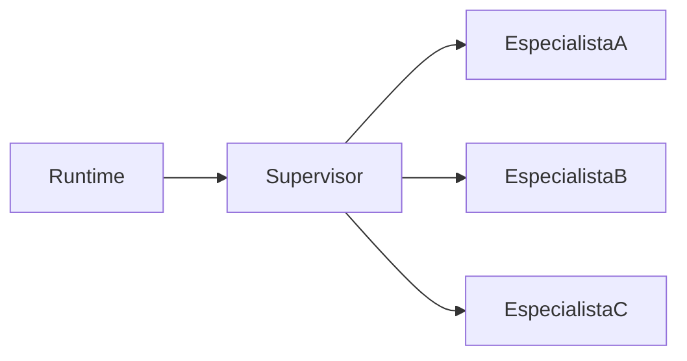

> [!abstract]
> O **Agent Supervisor** é responsável por coordenar agentes especializados, distribuir tarefas e consolidar os resultados produzidos durante uma execução.

## Conceito

Em arquiteturas multiagentes, normalmente existe um agente responsável pelo planejamento e coordenação geral.

Esse agente recebe um objetivo e decide:

- quais tarefas devem ser executadas
- quais agentes participarão
- quais ferramentas utilizar
- quando finalizar a execução

O Supervisor normalmente não executa todas as tarefas diretamente.

Sua principal responsabilidade é coordenar o trabalho dos demais agentes.

---

## Responsabilidades

- Planejamento
- Decomposição do problema
- Distribuição das tarefas
- Coordenação dos agentes
- Consolidação dos resultados
- Tomada da decisão final

---

## Fluxo

---

## Benefícios

- Separação de responsabilidades
- Especialização dos agentes
- Paralelismo
- Escalabilidade
- Reutilização

---

## Relação com Agent Runtime

O Supervisor não substitui o [[Agent Runtime]].

Enquanto o Runtime fornece a infraestrutura de execução, o Supervisor é um agente especializado em coordenação.

---

> [!note]
> Uma arquitetura pode possuir múltiplos agentes supervisores organizados hierarquicamente.

---

## Veja também

- [[Agent Runtime]]
- [[Harness]]
- [[Hierarquia de Agentes]]
- [[Agentes Especialistas]]
- [[Agentes Paralelos]]