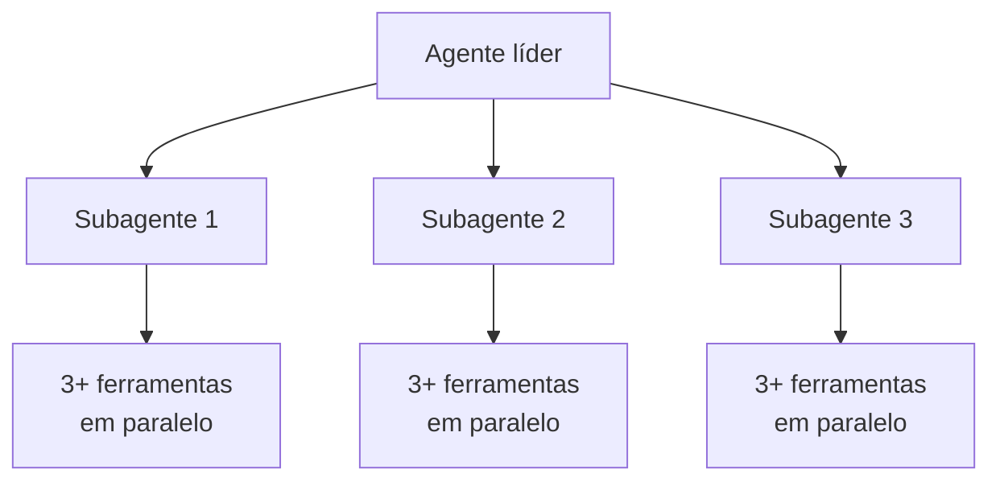

> [!abstract]
> Paralelizar agentes e chamadas de ferramenta é o que transforma pesquisa de horas em minutos — a otimização de maior impacto isolado em sistemas multiagentes.

## Conceito

Tarefas complexas envolvem explorar muitas fontes. Agentes que executam buscas **sequenciais** são dolorosamente lentos, e a serialização é desperdício puro quando as investigações são independentes entre si.

A Anthropic introduziu paralelização em dois níveis:

1. O líder cria **3–5 subagentes em paralelo**, em vez de serialmente
2. Cada subagente usa **3 ou mais ferramentas em paralelo**

> [!important] O resultado
> Essas duas mudanças reduziram o tempo de pesquisa em **até 90%** para consultas complexas, permitindo cobrir mais informação em minutos em vez de horas.

## O limite atual: execução síncrona

> [!warning]
> Os agentes líderes executam subagentes de forma **síncrona**, esperando cada conjunto terminar antes de prosseguir. Isso simplifica a coordenação, mas cria gargalos: o líder não consegue redirecionar subagentes em andamento, os subagentes não se coordenam entre si, e o sistema inteiro pode ficar bloqueado esperando um único subagente terminar.
>
> Execução assíncrona permitiria mais paralelismo, com agentes trabalhando concorrentemente e criando novos subagentes conforme necessário — ao custo de coordenação de resultados, consistência de estado e propagação de erro entre subagentes.

Esse trade-off é o mesmo de qualquer sistema concorrente: mais paralelismo, mais dificuldade de garantir ordem e consistência. Ver [[Race Condition]] e [[Distributed Systems]].

## Onde a paralelização brilha

Avaliações internas mostram que sistemas multiagentes se destacam especialmente em consultas *breadth-first*, que envolvem perseguir **múltiplas direções independentes ao mesmo tempo** — o caso em que um agente único faz buscas lentas e sequenciais e frequentemente não chega à resposta.

## Fonte

- Anthropic, [How we built our multi-agent research system](https://www.anthropic.com/engineering/multi-agent-research-system), 2025

## Veja também

- [[Multi-Agent Systems]]
- [[Hierarquia de Agentes]]
- [[Agentes Especialistas]]
- [[Agent Runtime]]
- [[Race Condition]]
- [[AI Generative Architecture]]
