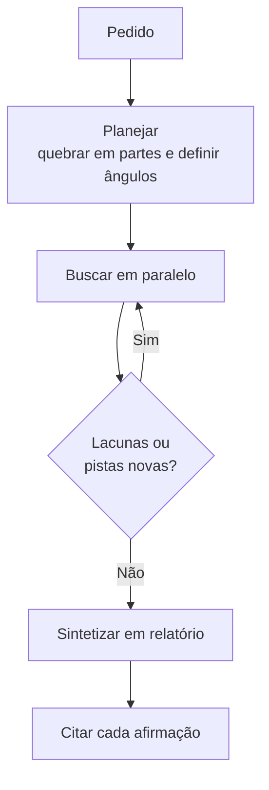

> [!abstract]
> **Agentic Research** é o modo em que um assistente conduz uma investigação **multi-etapa autodirigida**: planeja a abordagem, executa muitas buscas que se encadeiam, decide sozinho o que investigar em seguida e sintetiza tudo num relatório com citações.

## Conceito

Uma busca web é uma transação: uma consulta, uma lista de resultados. A pesquisa agêntica é um **processo**, e a diferença está em quem decide a próxima consulta. Aqui, quem decide é o agente — a partir do que a consulta anterior encontrou.

É a diferença entre consultar um índice e delegar a um assistente de pesquisa. O custo dessa autonomia é tempo: minutos, não segundos, porque pode envolver centenas de fontes.

## Fluxo

O passo de planejamento usa [[Extended Thinking]]: o agente raciocina sobre a decomposição do problema **antes** de gastar a primeira busca.

## Características

- **Autodirigido** — o agente escolhe as próximas consultas; você não roteiriza os passos
- **Paralelo e amplo** — muitas buscas simultâneas, sobre muitas fontes
- **Iterativo** — cada rodada é informada pela anterior, perseguindo pistas e fechando lacunas
- **Rastreável** — cada afirmação do relatório liga de volta à fonte, o que torna a verificação barata
- **Híbrido** — cruza a web pública com as fontes internas ligadas por [[Connector|conectores]]

## Quando usar — e quando não

| Situação | Ferramenta |
|---|---|
| Sintetizar muitas fontes, comparar opções, produzir relatório verificável | **Agentic Research** |
| Um fato pontual, uma ou duas fontes, velocidade importa | Busca web simples |
| O problema é de raciocínio e não de informação externa (matemática, depuração, lógica) | [[Extended Thinking]] |
| A resposta está dentro da organização | [[Enterprise Search]] |

## Como escrever um bom prompt de Research

Como a execução custa minutos, o prompt merece investimento:

1. **Seja específico no objetivo.** Não "fale do mercado de VE", e sim "analise o mercado de baterias para veículos elétricos — atores principais, tendências tecnológicas e riscos de cadeia de suprimentos que afetem decisão de investimento".
2. **Declare a estrutura.** O relatório se organiza em torno das seções que você nomear.
3. **Inclua restrições.** Orçamento, prazo, geografia, escopo — reduzem o espaço de busca ao relevante.
4. **Peça ajuda com o próprio prompt.** Refinar o enunciado com o assistente antes de disparar a pesquisa costuma pagar mais que qualquer ajuste posterior.

> [!warning] Autonomia não dispensa discernimento
> O relatório vem citado justamente porque a verificação continua sendo sua. Esta é a competência *Discernment* de [[AI Fluency]] em ato — o valor da citação só se realiza se alguém a abrir.

## Veja também

- [[Extended Thinking]]
- [[Enterprise Search]]
- [[Connector]]
- [[Agentic AI]]
- [[Multi-Agent Systems]]
- [[Agentic Workflow]]
