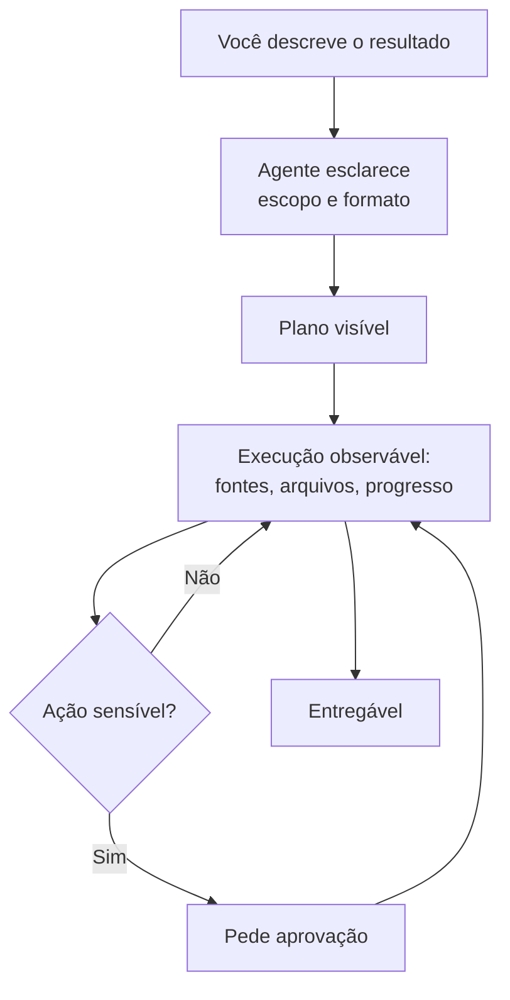

> [!abstract]
> Um **Agentic Workflow** é o modo de trabalho em que se entrega ao agente um **resultado**, não uma pergunta: ele planeja, reúne o contexto, executa as etapas e devolve o entregável pronto.

## Conceito

A diferença em relação à conversa turno a turno não é de tamanho da tarefa — é de **quem monta a sequência**.

Numa conversa, você decompõe: pergunta uma coisa, lê, pergunta a próxima. O agente responde; a orquestração é sua. Num fluxo agêntico, você descreve o estado final desejado e o agente decide os passos, executa e volta com o resultado. A delegação passa da pergunta para o **processo**.

## Os quatro sinais de que uma tarefa é hand-off

1. **Tem várias etapas que você faria em sequência.** Puxar os números, comparar, redigir, formatar. Delegado, isso é uma instrução, não quatro recados.
2. **Termina num entregável real.** Um documento, uma planilha, um deck, um PDF — salvo onde precisa estar, não colado no chat para você remontar.
3. **Atravessa suas ferramentas.** As notas numa fonte, a thread noutra, os números numa terceira. O agente reúne; você não pré-coleta.
4. **Deve acontecer em agenda, ou enquanto você faz outra coisa.** Ver [[Scheduled Task]].

## Delegar não é sair de cena

O desenho preserva controle em quatro pontos: o agente **pergunta** antes de começar para fixar escopo e formato; **mostra o plano**; deixa a execução **observável** (as fontes consultadas, os arquivos se formando, o progresso pelo plano) e interrompível; e **para para aprovação** nas ações irreversíveis — enviar e-mail, compartilhar arquivo, publicar.

> [!important] A delegação é da execução, não da responsabilidade
> É a competência *Diligence* de [[AI Fluency]]: quem assina o entregável continua respondendo por ele. Ver [[Human-in-the-Loop]].

## Capacidades típicas

| Capacidade | O que habilita |
|---|---|
| Acesso a pasta local | Ler o material onde ele está e **salvar de volta** no mesmo lugar |
| [[Connector\|Conectores]] | Reunir contexto de várias ferramentas sem pré-coleta |
| [[Scheduled Task\|Tarefas agendadas]] | Repetição sem disparo manual |
| Subagentes | Dividir um trabalho grande entre workers paralelos, cada um com seu contexto — ver [[Agentes Paralelos]] |
| [[Computer Use]] / navegador | Alcançar o que não tem conector |
| [[Plugin (AI Agent)\|Plugins]] | Pacotes de skills e conectores prontos para um tipo de trabalho |

## Comparação

| | Conversa turno a turno | Agentic Workflow |
|---|---|---|
| Você fornece | A próxima pergunta | O resultado desejado |
| Quem sequencia | Você | O agente |
| Saída | Resposta na conversa | Arquivo ou ação concluída |
| Seu papel | Julgar cada turno | Aprovar plano e revisar entrega |
| Melhor quando | A resposta muda a próxima pergunta | O destino é claro e o caminho é trabalhoso |

## Veja também

- [[Claude Cowork]]
- [[Escolha da Forma de Trabalho com IA]]
- [[Agentic AI]]
- [[Multi-Agent Systems]]
- [[Agentic Research]]
- [[Human-in-the-Loop]]
