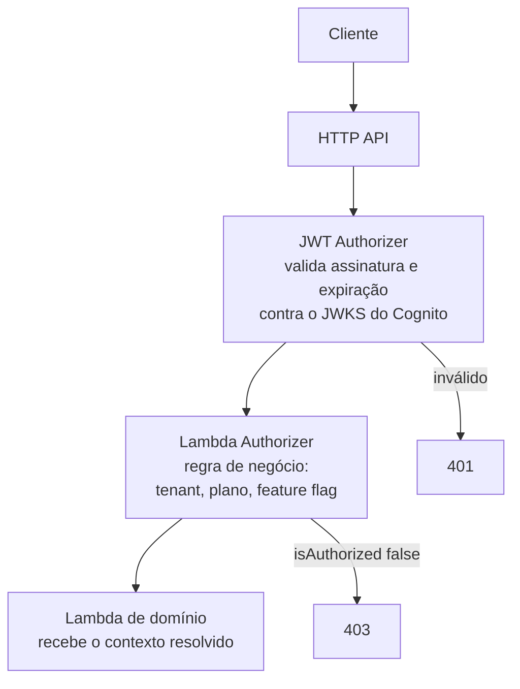

> [!abstract]
> Amazon API Gateway é a implementação gerenciada de [[API Gateway]] na AWS: expõe rotas HTTP e canais WebSocket, aplica autenticação e CORS na borda e integra cada rota a uma função [[AWS Lambda]] ou a um serviço AWS.

## Conceito

O gateway é o **único ponto de entrada** da camada serverless. Nenhuma Lambda de domínio é exposta diretamente à internet: a borda concentra terminação TLS, validação do token, CORS, *throttling* e roteamento, e entrega ao handler um evento já autenticado.

Isso muda o que o código de domínio precisa saber. O handler não valida assinatura de JWT nem responde `OPTIONS` — recebe o contexto do autorizador já resolvido e trata apenas a regra de negócio.

## Os três sabores

| Tipo | Quando usar | Custo relativo |
|---|---|---|
| **HTTP API** | Padrão para REST novo — JWT authorizer nativo, CORS declarativo, latência menor | ~3,5× mais barato que REST API |
| **REST API** | Só quando exige recursos que HTTP API não tem: chaves de API com planos de uso, WAF acoplado, cache de resposta, transformação de payload | Mais caro |
| **WebSocket API** | Canal bidirecional persistente — ver [[WebSocket]] | Cobrado por mensagem e por minuto de conexão |

> [!tip] HTTP API é o padrão
> Para projetos novos que só precisam de rotas autenticadas por Cognito, HTTP API entrega o mesmo resultado por uma fração do preço. Migrar de REST para HTTP depois exige reescrever integrações — decida no início.

## Camadas de autorização

O **JWT Authorizer** é executado pela infraestrutura do gateway, sem custo de invocação. O [[Lambda Authorizer]] é código próprio, invocado quando a decisão depende de algo que o token sozinho não resolve. Os dois se combinam.

## Características

- **Estágio `$default`** no HTTP API dispensa prefixo de caminho — o versionamento fica no path da rota (`/v1/...`), não no estágio
- **CORS declarativo**: origens, métodos, cabeçalhos permitidos e expostos são configuração da API, não código do handler
- **Timeout de integração de ~30 s** — qualquer operação mais longa deve virar processamento assíncrono
- **WebSocket API** mantém rotas reservadas `$connect`, `$disconnect` e `$default`, e expõe a *Management API* (`postToConnection`) para o servidor empurrar mensagens
- **Throttling** por conta, por estágio e por rota, com burst e taxa sustentada

> [!warning] O cabeçalho `Authorization` não chega sozinho
> Cabeçalhos personalizados (como `X-Tenant-Id` ou `X-Idempotency-Key`) precisam estar declarados em `allowHeaders` no CORS, senão o preflight falha antes de a requisição existir.

## Veja também

- [[API Gateway]]
- [[AWS Lambda]]
- [[Lambda Authorizer]]
- [[Amazon Cognito]]
- [[WebSocket]]
- [[Segurança de API]]
