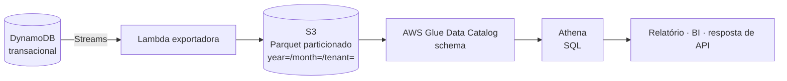

> [!abstract]
> Athena é o motor de consulta SQL serverless da AWS: executa SQL padrão diretamente sobre arquivos no [[Amazon S3]], sem cluster para provisionar, cobrando por terabyte de dados varridos.

## Conceito

Athena existe para responder à pergunta que o [[Amazon DynamoDB]] não responde bem: **agregação**. `GROUP BY`, `SUM`, janelas temporais e consultas exploratórias por atributos que não são chave são caras ou impossíveis em um banco chave-valor — e devastadoras se executadas com `Scan` na tabela transacional.

A separação é deliberada: a tabela operacional serve a requisição do usuário em milissegundos; a cópia analítica em S3 serve o relatório em segundos, sem competir por capacidade com o caminho crítico.

## O custo é o modelo mental

Athena cobra por **dado varrido**, não por consulta nem por tempo. Isso inverte a intuição de quem vem de banco relacional: o que otimiza não é o índice, é **o que a consulta consegue não ler**.

| Técnica | Efeito |
|---|---|
| Particionar por data e tenant | Redução de até ~99 % — a consulta só toca as pastas relevantes |
| Formato colunar (Parquet, ORC) | ~4× — lê só as colunas do `SELECT` |
| Compressão (Snappy, GZIP) | ~3× |
| `SELECT *` em vez de colunas explícitas | Anula o ganho colunar |

Sem otimização, uma consulta que varre 1 TB custa alguns dólares. Com particionamento e Parquet, a mesma pergunta pode varrer dezenas de gigabytes.

> [!warning] Não há camada gratuita
> A cobrança começa na primeira consulta. Athena é barato quando o dado está bem organizado e caro quando não está — e a diferença entre os dois cenários é de uma a duas ordens de grandeza.

## Características

- Compatível com SQL ANSI (motor Trino/Presto); sem carga prévia — o dado permanece em S3
- Schema no **Glue Data Catalog**, descoberto por crawler ou declarado por DDL
- Consultas falhas não são cobradas; resultados são gravados em um bucket de saída
- Integra com QuickSight para dashboards e com a API para consulta programática assíncrona (dispara, consulta o status, busca o resultado)

## Veja também

- [[Amazon S3]]
- [[Amazon DynamoDB]]
- [[Data Lake]]
- [[ETL]]
- [[CQRS]]
- [[FinOps]]
